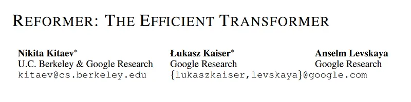
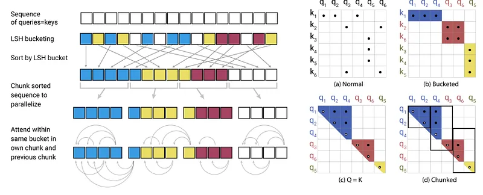
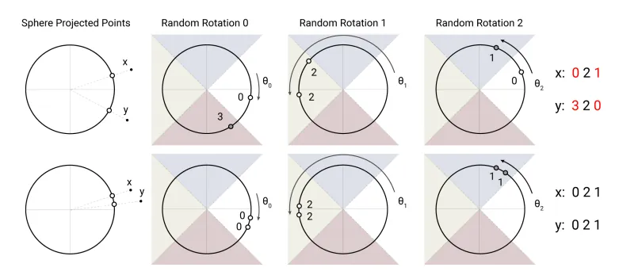

# Papers Explained 165 - Reformer

Reformer by Google Research is designed with new methods to reduce memory usage and computation time. As a result, this model can handle much longer sentences compared to traditional autoregressive transformers.

This page ingests the source article into the wiki and connects it to [[Papers Explained Corpus]], [[Large Language Models]], [[Long Context]], [[Model Compression and Efficiency]].

## Source Metadata

- Source file: `raw/2024-07-19_Papers-Explained-165--Reformer-4445ad305191.md`
- Source title: Papers Explained 165: Reformer
- Published: 2024-07-19
- Canonical: [https://medium.com/@ritvik19/papers-explained-165-reformer-4445ad305191](https://medium.com/@ritvik19/papers-explained-165-reformer-4445ad305191)

## Key Ideas

- The Reformer architecture builds upon the foundations of the original Transformer model introduced in the “Attention is All You Need” paper. However, the Reformer introduces several key innovations to make it more efficient and scalable.
- Chunking: To further support processing long sequences, the Reformer employs a chunking mechanism. The input sequence is divided into fixed-size chunks, which are processed independently in parallel.
- Causal Masking: The Reformer uses a causal masking technique to ensure that each token can only attend to previous tokens in the sequence.
- Shared-QK Attention: Unlike the original Transformer, where separate learnable matrices are used for query (Q) and key (K) in each attention head, the Reformer employs a shared-QK attention mechanism.
- The main idea behind LSH is to divide the input sequence into fixed-size buckets and perform attention only within the same bucket. This reduces the quadratic complexity of the standard transformer’s attention mechanism.

## Notes

Reformer by Google Research is designed with new methods to reduce memory usage and computation time. As a result, this model can handle much longer sentences compared to traditional autoregressive transformers.

## Model Architecture:

The Reformer architecture builds upon the foundations of the original Transformer model introduced in the “Attention is All You Need” paper. However, the Reformer introduces several key innovations to make it more efficient and scalable.

- Locality-Sensitive Hashing (LSH): The Reformer replaces the standard self-attention mechanism in Transformers with a locality-sensitive hashing (LSH) mechanism. Traditional Transformers employ a softmax function that computes attention scores for all pairs of tokens in a sequence, resulting in quadratic complexity with respect to the sequence length (O(N²)). LSH, on the other hand, allows the Reformer to perform approximate nearest neighbor search, reducing the complexity to O(N log N). This enables the model to efficiently handle long sequences without sacrificing performance.

- Reversible Layers: Reversible layers are introduced in the Reformer architecture to enable reversible computation. In a standard Transformer, intermediate activations need to be stored for backpropagation, leading to increased memory requirements for longer sequences. Reversible layers allow the model to recompute the activations during backpropagation, reducing the memory consumption and enabling the processing of ultra-long sequences.

- Chunking: To further support processing long sequences, the Reformer employs a chunking mechanism. The input sequence is divided into fixed-size chunks, which are processed independently in parallel. Chunking allows the Reformer to efficiently scale to much longer sequences than traditional Transformers.

- Causal Masking: The Reformer uses a causal masking technique to ensure that each token can only attend to previous tokens in the sequence. This masking is essential for autoregressive tasks like language modeling, where future tokens should not be accessible during decoding.

- Shared-QK Attention: Unlike the original Transformer, where separate learnable matrices are used for query (Q) and key (K) in each attention head, the Reformer employs a shared-QK attention mechanism. This approach further reduces memory requirements and computational complexity.

### Locality-Sensitive Hashing (LSH)

*Figure: Simplified depiction of LSH Attention showing the hash-bucketing, sorting, and chunking steps and the resulting causal attentions. (a-d) Attention matrices for these varieties of attention*

The main idea behind LSH is to divide the input sequence into fixed-size buckets and perform attention only within the same bucket. This reduces the quadratic complexity of the standard transformer’s attention mechanism.

Let’s define the number of buckets as B. To hash sequence positions to buckets, we use a family of hash functions. A hash function h_i for each position i takes the position index and maps it to a bucket index:

h_i: {1, 2, …, L} → {1, 2, …, B}

The hash functions should be designed such that nearby positions in the sequence are more likely to be hashed to the same bucket. The authors propose using a locality-sensitive hash function, specifically the “sorted-LSH” family, to achieve this behavior.

### Chunking and Attention Masking

After hashing the sequence positions into buckets, each bucket contains a fixed number of tokens (e.g., tokens per bucket). This allows for efficient parallelization since attention only needs to be computed within each bucket.

To attend only to tokens within the same bucket, an attention mask is applied. The attention mask matrix M ∈ {0, -∞}^(L x L) is created such that M_ij = 0 if tokens i and j belong to the same bucket, and M_ij = -∞ otherwise. This ensures that tokens in different buckets do not attend to each other.

### Reversible Computation

The Reformer employs reversible layers to enable the efficient computation of gradients during both the forward and backward passes. Reversible layers allow us to reconstruct intermediate activations during the backward pass from the forward pass.

Let’s denote the input to a reversible layer as x, and the output as y. The reversible layer’s forward pass can be written as:

y = [f(x), x]

where f is a function representing the operations inside the reversible layer.

During the backward pass, we can compute the gradient of the loss with respect to x as follows:

∂L/∂x = ∂L/∂y * ∂y/∂x = ∂L/∂y * (∂f(x)/∂x + I)

where I is the identity matrix.

### Axial Positional Encodings

*Figure: An angular locality sensitive hash uses random rotations of spherically projected points to establish buckets by an argmax over signed axes projections. In this highly simplified 2D depiction, two points x and y are unlikely to share the same hash buckets (above) for the three different angular hashes unless their spherical projections are close to one another (below).*

Standard transformers use learned positional encodings to provide sequential information to the model. However, in the Reformer, axial positional encodings are used to efficiently scale positional information with sequence length.

Let’s assume we have two sets of positional embeddings P_row and P_col, each of size L, with dimensionality d. The embeddings for each position i can be represented as P_row[i] and P_col[i].

To add positional information to the embeddings, we use the following formula:

E_pos[i] = E[i] + P_row[i mod L] + P_col[i // L]

where E_pos[i] is the final embedding for position i.

By factorizing the positional encodings into row-wise and column-wise components, the Reformer efficiently scales with sequence length without incurring a significant increase in memory requirements.

## Training Data and Methodology

The Reformer can be trained on large-scale corpora using unsupervised or supervised learning tasks. Commonly, it employs unsupervised pretraining, followed by supervised fine-tuning on specific downstream tasks. The pretraining data can consist of diverse textual sources, such as books, articles, and web text, to capture a broad understanding of language.

## Paper

Reformer: The Efficient Transformer [2001.04451](https://arxiv.org/abs/2001.04451)

## Figures

Figures from the Medium HTML export (`raw/2024-07-19_Papers-Explained-165--Reformer-4445ad305191.md`); local copies under `wiki/assets/papers-explained-165-reformer/` when download succeeded.

| Figure | Caption |
|--------|---------|
|  | Paper title block: *Reformer: The Efficient Transformer*. |
|  | **LSH attention** pipeline (shared Q=K): hash buckets, sort, chunking, and causal within-bucket patterns; (a–d) attention sparsity vs. full attention. |
|  | **Angular LSH** intuition: random rotations bin spherical projections so nearby vectors collide in the same bucket sequence. |
## Related

- [[Papers Explained Corpus]]
- [[Large Language Models]]
- [[Long Context]]
- [[Model Compression and Efficiency]]
- [[Papers Explained 164 - Orca 3 (Agent Instruct)]]
- [[Papers Explained 166 - Command Models]]

#summary #topic
