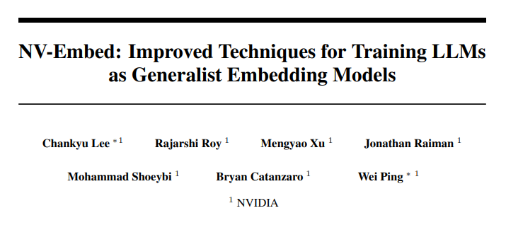
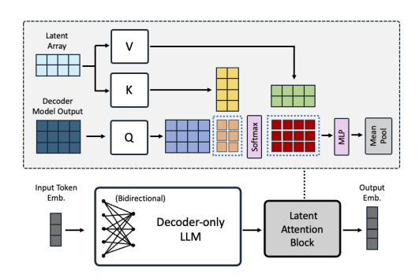
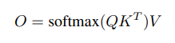
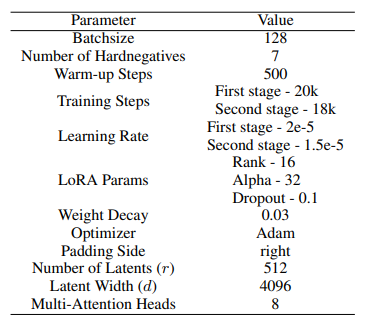
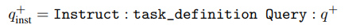
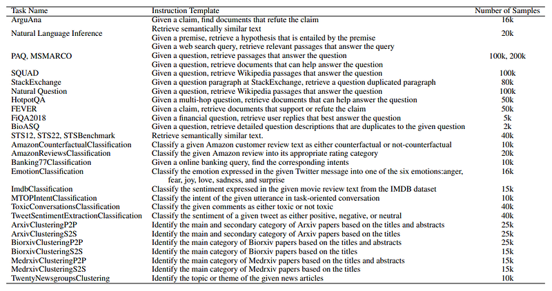
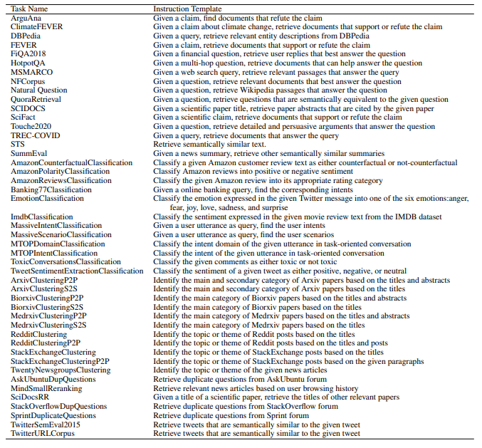
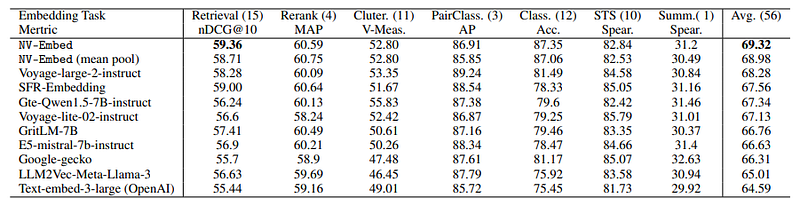
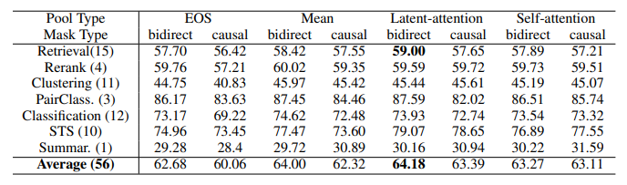
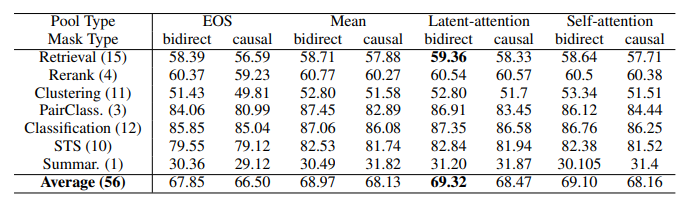

# Papers Explained 168 - NV-Embed

NV-Embed proposes a latent attention layer to obtain pooled embeddings and removes causal attention mask during contrastive training to significantly enhance the performance of LLM as a versatile embedding model, while maintaining its simplicity and reproducibility.

This page ingests the source article into the wiki and connects it to [[Papers Explained Corpus]], [[Embedding and Retrieval]], [[Large Language Models]].

## Source Metadata

- Source file: `raw/2024-07-24_Papers-Explained-168--NV-Embed-48bd25d83258.html`
- Source title: Papers Explained 168: NV-Embed
- Published: 2024-07-24
- Canonical: [https://medium.com/@ritvik19/papers-explained-168-nv-embed-48bd25d83258](https://medium.com/@ritvik19/papers-explained-168-nv-embed-48bd25d83258)

## Key Ideas

- NV-Embed proposes a latent attention layer to obtain pooled embeddings and removes causal attention mask during contrastive training to significantly enhance the performance of LLM as a versatile embedding model, while maintaining its simplicity and...
- The model is available at [HuggingFace](https://huggingface.co/nvidia/NV-Embed-v1).
- In principle, the causal mask in decoder blocks prevents information leakage by allowing the decoder to attend only to previous positions during auto-regressive text generation.
- There are two popular methods to obtain the embedding for a sequence of tokens:
- Mean pooling, typically used by bidirectional embedding model, simply takes the average of token embeddings and may dilute the important information from key phrases

## Notes

NV-Embed proposes a latent attention layer to obtain pooled embeddings and removes causal attention mask during contrastive training to significantly enhance the performance of LLM as a versatile embedding model, while maintaining its simplicity and reproducibility.

The model is available at [HuggingFace](https://huggingface.co/nvidia/NV-Embed-v1).

## Method

### Bidirectional Attention

In principle, the causal mask in decoder blocks prevents information leakage by allowing the decoder to attend only to previous positions during auto-regressive text generation. However, it limits the model’s representation power hence the causal attention mask of decoder-only LLM is removed during the contrastive learning.

### Latent Attention Layer

There are two popular methods to obtain the embedding for a sequence of tokens:

- Mean pooling, typically used by bidirectional embedding model, simply takes the average of token embeddings and may dilute the important information from key phrases

- The last <EOS> token embedding, more popular for decoder-only LLM based embedding models, may suffer from recency bias, relying heavily on the output embedding of the last token.

*Figure: The illustration of proposed architecture design comprising latent attention layer.*

Hence to achieve a more expressive pooling of the sequences, Latent Attention Layer is proposed,which takes in the following inputs:

1. The query `Q`, which is the last layer hidden state from the decoder.

2. The latent array `K` = `V`, which is a trainable “dictionary” used to obtain better representations.

The output of the latent attention layer is calculated as:

which is then followed by a regular MLP consisting of two linear transformations with a GELU activation in between. And finally a mean pooling is applied after the MLP layers.

### Two-stage Instruction-Tuning

To train a generalist embedding model that can adapt to different tasks and instructions, a two-stage instruction-tuning is used:

In the first stage, the model is trained using contrastive learning with instructions on a variety of retrieval datasets, utilizing in-batch negatives and curated hard-negative examples. This stage focuses on fine-tuning the model for retrieval tasks, which are considered more challenging.

In the second stage, the model is trained using contrastive instruction-tuning on a combination of retrieval and non-retrieval datasets, without applying the in-batch negatives trick. This stage blends the remaining embedding tasks into the instruction-tuning process, allowing the model to adapt to different tasks and instructions.

## Experiment Details

Mistral 7B is used as the base decoder-only LLM. The attention mask is replaced from causal to bidirectional, and a latent attention layer is integrated with 512 latents, a hidden dimension size of 4096, and 8 multi-head attentions. The model is trained end-to-end with a contrastive loss using LoRA with a rank of 16, an alpha value of 32, and a dropout of 0.1.

*Figure: Parameters used in the experiments.*

Given a relevant query-document pair, the instructed query follows the instruction template as follows:

Note that the instruction tokens in the output embeddings are masked out during both training and evaluation, although they still impact the output due to self-attention. Instruction prefixes are not added to documents.

*Figure: Instructions and number of samples used for each training dataset.*

*Figure: Instructions used for evaluation on the MTEB benchmark. “STS*” indicates we use the same instructions for all the STS tasks.*

Retrieval datasets:

MS MARCO, HotpotQA, Natural Question, PAQ, Stackexchange, Natural language inference, SQuAD, ArguAna, BioASQ, FiQA, FEVER.

Typically, these datasets do not contain its own hard negatives, necessitating the mining of such examples. To address this, another encoder-based embedding model is further fine tuned to select the hard negatives on those datasets.

Non-retrieval datasets from three sub-tasks in MTEB benchmark: classification, clustering and semantic similarity (STS) are also used.

The classification datasets used are: AmazonReviews-Classification, AmazonCounterfactualClassification, Banking77-Classification, EmotionClassification, IMDB-Classification, MTOPIntentClassification, ToxicConversations-Classification, TweetSentimentExtraction-Classification.

The text field is used as the q+, and the label_text field is used as the d+ label, with a random sample selected from other label_text values for d−.

The raw cluster label datasets raw_arxiv, raw_biorxiv, and raw_medrxiv are used from the MTEB Huggingface datasets. Common content is filtered out from the MTEB evaluation set of {Arxiv/Biorxiv/Medrxiv}-Clustering-{S2S/P2P} tasks. The title field is used for q+ in the S2S datasets, and the abstract field is used for q+ in the P2S datasets. The category field or a random sample from the categories field is used for d+, and a random sample from other categories is used for d−.

The raw label dataset for the TwentyNewsgroups-Clustering task is used, and any content that matches with the MTEB evaluation set of the TwentyNewsgroups-Clustering task is removed.

The training splits from three semantic similarity datasets, STS12, STS22, and STS-Benchmark, which are part of the MTEB Huggingface datasets, are utilized. Two examples are created for any pair of texts with associated relevance scores (ta, tb, score): (q+ = ta, d+ = tb) and (q+ = tb, d+ = ta) if the score is greater than or equal to 4. Hard negatives (d−) are mined from the pool of all texts using BM25, selecting the highest matching texts with a rank of 2 or higher that do not have relevance scores greater than 2.5 with q+.

## Evaluation

### MTEB Results

*Figure: Top MTEB leaderboard models as of 2024–05–22.*

- NV-Embed model achieves a new record high score of 69.32 on the MTEB benchmark with 56 tasks and also attains the highest score of 59.36 on 15 retrieval tasks originally from the BEIR benchmark.

### Ablation Studies

*Figure: Averaged MTEB scores on seven tasks after first stage training.*

*Figure: Averaged MTEB scores on seven tasks after second stage training.*

Causal Attention vs. Bidirectional Attention

- The bidirectional mask consistently outperforms the causal mask based on the average MTEB scores across 56 tasks for all pooling types.

Pooling Methods

- Compared four pooling types: <EOS>-last, mean, latent-attention, and self-attention.

- Mean pooling consistently outperforms <EOS>-last token embedding based on average MTEB scores.

- Self-attention does not provide additional accuracy improvements for decoder-only LLMs.

## Paper

NV-Embed: Improved Techniques for Training LLMs as Generalist Embedding Models [2405.17428](https://arxiv.org/abs/2405.17428)

Recommended Reading [Representation Learning](https://ritvik19.medium.com/list/representation-learning-bd438198713c)

## Figures

Figures from the Medium HTML export (`raw/2024-07-24_Papers-Explained-168--NV-Embed-48bd25d83258.html`); local copies under `wiki/assets/papers-explained-168-nv-embed/` when download succeeded.

| Figure | Caption |
|--------|---------|
|  | Paper title: **NV-Embed** — LLM as generalist embedding model (NVIDIA). |
|  | **Latent attention** block: decoder states query a trainable latent array (K/V), then MLP + **mean pool**. |
|  | Latent attention output: **softmax\((QK^\top)V\)** pooling step. |
|  | Training hyperparameters: batch size, hard negatives, **two-stage** steps/LR, **LoRA**, **512 latents** / **4096** dim / **8** heads. |
|  | Instruction format: `Instruct: {task}` + `Query: {q+}` for contrastive pairs. |
|  | **Training** tasks: instruction templates and sample counts (retrieval, NLI, classification, clustering, STS). |
|  | **MTEB evaluation** instruction templates per task family. |
|  | **MTEB (56-task)** leaderboard snapshot: **NV-Embed** at **69.32** avg, **59.36** on 15 retrieval tasks. |
|  | Ablation after **stage 1**: **EOS / mean / latent / self** pooling × **causal vs bidirectional** mask across MTEB groups. |
|  | Ablation after **stage 2**: **Latent-attention + bidirectional** reaches **69.32** overall (full two-stage pipeline). |
## Related

- [[Papers Explained Corpus]]
- [[Embedding and Retrieval]]
- [[Large Language Models]]
- [[Papers Explained 167 - Monte Carlo Tree Self-refine]]
- [[Papers Explained 169 - mBART]]

#summary #topic
