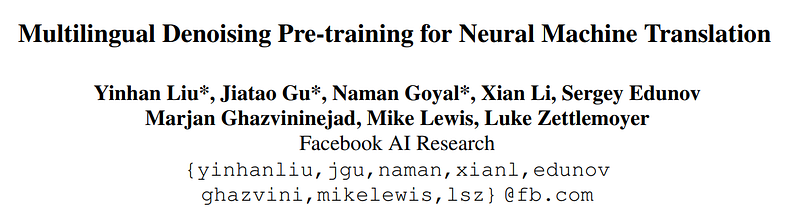
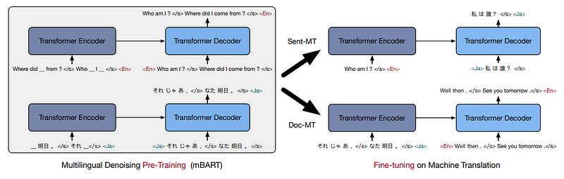
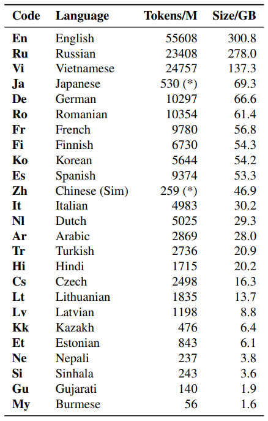
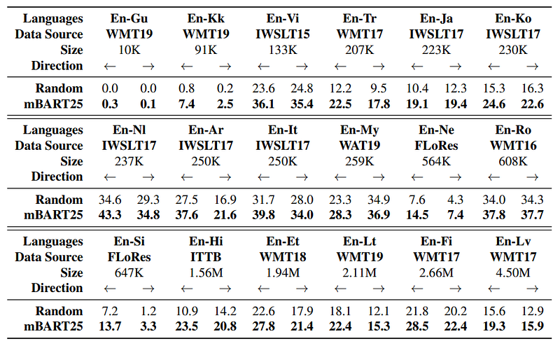
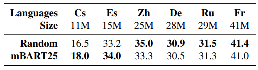
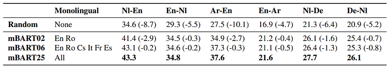
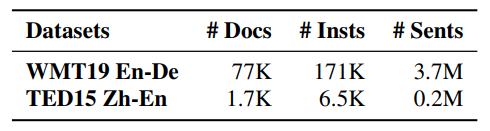
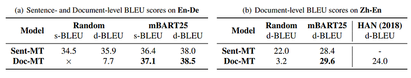
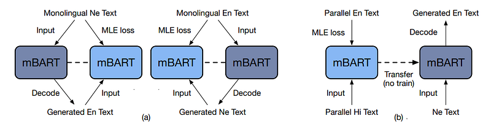

# Papers Explained 169 - mBART

mBART is a sequence-to-sequence denoising auto-encoder pre-trained on large-scale monolingual corpora in many languages using the BART objective.

This page ingests the source article into the wiki and connects it to [[Papers Explained Corpus]], [[Multilingual Models]], [[Large Language Models]].

## Source Metadata

- Source file: `raw/2024-07-26_Papers-Explained-169--mBART-98432ef6fec.html`
- Source title: Papers Explained 169: mBART
- Published: 2024-07-26
- Canonical: [https://medium.com/@ritvik19/papers-explained-169-mbart-98432ef6fec](https://medium.com/@ritvik19/papers-explained-169-mbart-98432ef6fec)

## Key Ideas

- A standard sequence-to-sequence Transformer architecture is used, with 12 layers of encoder and 12 layers of decoder. The model dimension is set at 1024, and it has 16 heads, corresponding to approximately 680 million parameters.
- A subset of 25 languages, extracted from the Common Crawl (CC), known as CC25, is pre-trained.
- A sentencepiece model is used for tokenization, with a vocabulary of 250,000 subword tokens.
- Two types of noise are used. Spans of text are first removed and replaced with a mask token. The words in each instance are then masked, with 35% randomly sampled according to a Poisson distribution (λ = 3.5).
- The decoder input is the original text with one position offset. A language id symbol is used as the initial token to predict the sentence.

## Notes

mBART is a sequence-to-sequence denoising auto-encoder pre-trained on large-scale monolingual corpora in many languages using the BART objective.

## Architecture

*Figure: Framework for our Multilingual Denoising Pre-training (left) and fine-tuning on downstream MT tasks (right), where we use (1) sentence permutation (2) word-span masking as the injected noise. A special language id token is added at both the encoder and decoder. One multilingual pre-trained model is used for all tasks.*

A standard sequence-to-sequence Transformer architecture is used, with 12 layers of encoder and 12 layers of decoder. The model dimension is set at 1024, and it has 16 heads, corresponding to approximately 680 million parameters. An additional layer-normalization layer is included on top of both the encoder and decoder, which is stabilized at FP16 precision through training.

## Multilingual Denoising Pre-training

A subset of 25 languages, extracted from the Common Crawl (CC), known as CC25, is pre-trained.

*Figure: Languages and Statistics of the CC25 Corpus.*

A sentencepiece model is used for tokenization, with a vocabulary of 250,000 subword tokens.

### Noise function

Two types of noise are used. Spans of text are first removed and replaced with a mask token. The words in each instance are then masked, with 35% randomly sampled according to a Poisson distribution (λ = 3.5). The order of sentences within each instance is also permuted.

The decoder input is the original text with one position offset. A language id symbol is used as the initial token to predict the sentence.

### Pre-trained Models

- mBART25 a model pretrained on all 25 languages.

- mBART06 a model pretrained on a subset of six European languages: Ro, It, Cs, Fr, Es and En.

- mBART02 pre-trained bilingual models, using English and one other language for four language pairs: En-De, En-Ro, En-It.

- BART-En/Ro pre-trained monolingual BART models on the same En and Ro corpus only.

## Sentence-level Machine Translation

### Datasets

24 pairs of publicly available parallel corpora that cover all the languages in CC25 are gathered.

- Most pairs are from previous WMT (Gu, Kk, Tr, Ro, Et, Lt, Fi, Lv, Cs, Es, Zh, De, Ru, Fr ↔ En) and IWSLT (Vi, Ja, Ko, Nl, Ar, It ↔ En) competitions.

- FLoRes pairs (En-Ne and EnSi) are also used

- En-Hi from IITB

- En-My from WAT19

The datasets is divided into into three categories —low resource (less than 1M sentence pairs), medium resource (between 1M and 10M), and high resource (more than 10M).

### Fine-tuning & Decoding

The multilingual pre-trained language models are fine-tuned on a single pair of parallel bitext data, with the source language text being fed into the encoder and the target language text being decoded.

*Figure: Low/Medium Resource Machine Translation*

Pre-training consistently improves over a randomly initialized baseline, with particularly large gains on low resource language pairs.

*Figure: High Resource Machine Translation*

*Figure: Generalization to Unseen Languages*

## Document-level Machine Translation

mBART is evaluated on document-level machine translation tasks, where the goal is to translate segments of text that contain more than one sentence. Document fragments of up to 512 tokens are used during pre-training, enabling models to learn dependencies between sentences, this pre-training significantly improves document-level translation.

### Datasets

Performance is evaluated on two common document-level MT datasets: WMT19 En-De and TED15 Zh-En.

*Figure: Statistics for the Document-level Corpus of WMT19 En-De and TED15 Zh-En. # of instances is the # of training examples in document model.*

*Figure: Document-Level Machine Translation on En-De and Zh-En. (×) The randomly initialized Doc-MT model cannot produce translations aligned to the original sentences, so only document evaluation is possible.*

## Unsupervised Machine Translation

*Figure: Illustrated frameworks for unsupervised machine translation via (a) back-translation (b) language transfer where Ne-En is used as an example.*

## Paper

Multilingual Denoising Pre-training for Neural Machine Translation [2001.08210](https://arxiv.org/abs/2001.08210)

## Figures

Figures from the Medium HTML export (`raw/2024-07-26_Papers-Explained-169--mBART-98432ef6fec.html`); local copies under `wiki/assets/papers-explained-169-mbart/` when download succeeded.

| Figure | Caption |
|--------|---------|
|  | Paper title: **Multilingual Denoising Pre-training for Neural Machine Translation** (Facebook AI Research). |
|  | **mBART** pre-train (multilingual denoising) vs fine-tune for sentence-level (**Sent-MT**) and document-level (**Doc-MT**) MT. |
|  | **CC25** corpus: per-language tokens and size (GB) for 25-language pre-training. |
|  | Low/medium-resource **supervised MT**: random init vs **mBART25** across many En–X pairs (BLEU). |
|  | High-resource **WMT-style** pairs: random vs mBART25 when millions of parallel sentences are available. |
|  | **Unseen** language generalization: **mBART02** / **06** / **25** vs random on Nl, Ar, De transfer settings. |
|  | Document-level data stats: **WMT19 En–De** vs **TED15 Zh–En** (docs / instances / sentences). |
|  | Document MT: **s-BLEU** vs **d-BLEU** for Sent-MT vs Doc-MT, random vs **mBART25** (En–De and Zh–En). |
|  | Unsupervised MT: **(a)** back-translation loop on monolingual Ne/En; **(b)** **Hi–En** transfer to **Ne–En** without Ne–En training. |
## Related

- [[Papers Explained Corpus]]
- [[Multilingual Models]]
- [[Large Language Models]]
- [[Papers Explained 168 - NV-Embed]]
- [[Papers Explained 170 - Prometheus]]

#summary #topic
