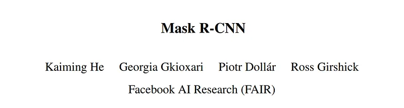
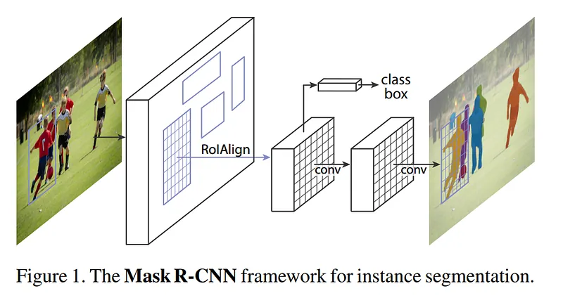

# Papers Explained 17 - Mask RCNN

Faster R-CNN consists of two stages. The first stage, called a Region Proposal Network (RPN), proposes candidate object bounding boxes. The second stage, which is in essence Fast R-CNN, extracts features using RoIPool from each candidate box and performs classification and bounding-box regression.

This page ingests the source article into the wiki and connects it to [[Papers Explained Corpus]], [[Computer Vision]].

## Source Metadata

- Source file: `raw/2023-02-07_Papers-Explained-17--Mask-RCNN-82c64bea5261.md`
- Source title: Papers Explained 17: Mask RCNN
- Published: 2023-02-07
- Canonical: [https://medium.com/@ritvik19/papers-explained-17-mask-rcnn-82c64bea5261](https://medium.com/@ritvik19/papers-explained-17-mask-rcnn-82c64bea5261)

## Key Ideas

- Faster R-CNN consists of two stages. The first stage, called a Region Proposal Network (RPN), proposes candidate object bounding boxes.
- Mask R-CNN adopts the same two-stage procedure, with an identical first stage (which is RPN). In the second stage, in parallel to predicting the class and box offset, Mask R-CNN also outputs a binary mask for each RoI.
- Formally, during training, we define a multi-task loss on each sampled RoI as L = Lcls + Lbox + Lmask.
- The mask branch has a Km² — dimensional output for each RoI, which encodes K binary masks of resolution m × m, one for each of the K classes. To this we apply a per-pixel sigmoid, and define Lmask as the average binary cross-entropy loss.
- Mask R-CNN [1703.06870](https://arxiv.org/abs/1703.06870)

## Notes

Faster R-CNN consists of two stages. The first stage, called a Region Proposal Network (RPN), proposes candidate object bounding boxes. The second stage, which is in essence Fast R-CNN, extracts features using RoIPool from each candidate box and performs classification and bounding-box regression.

Mask R-CNN adopts the same two-stage procedure, with an identical first stage (which is RPN). In the second stage, in parallel to predicting the class and box offset, Mask R-CNN also outputs a binary mask for each RoI.

Formally, during training, we define a multi-task loss on each sampled RoI as L = Lcls + Lbox + Lmask.

The mask branch has a Km² — dimensional output for each RoI, which encodes K binary masks of resolution m × m, one for each of the K classes. To this we apply a per-pixel sigmoid, and define Lmask as the average binary cross-entropy loss. For an RoI associated with ground-truth class k, Lmask is only defined on the k-th mask (other mask outputs do not contribute to the loss).

## Paper

Mask R-CNN [1703.06870](https://arxiv.org/abs/1703.06870)

## Figures

Figures from the Medium HTML export (`raw/2023-02-07_Papers-Explained-17--Mask-RCNN-82c64bea5261.md`); local copies under `wiki/assets/papers-explained-17-mask-rcnn/` when download succeeded.

| Figure | Caption |
|--------|---------|
|  | Title card: Mask RCNN. |
|  | Faster R-CNN consists of two stages. |
## Related

- [[Papers Explained Corpus]]
- [[Computer Vision]]
- [[Papers Explained 16 - Faster RCNN]]
- [[Papers Explained 18 - TableNet]]
- [[Object Detection for Dummies Part 3]] — RoIAlign, mask branch loss (Weng tutorial).

#summary #topic
