# Papers Explained 170 - Prometheus

A 13B fully open source evaluation LLM trained on Feedback Collection curated using GPT-4 (in this work).

This page ingests the source article into the wiki and connects it to [[Papers Explained Corpus]], [[Large Language Models]], [[Synthetic Data]], [[Evaluation and Benchmarks]].

## Source Metadata

- Source file: `raw/2024-07-29_Papers-Explained-170--Prometheus-5e72b8054729.md`
- Source title: Papers Explained 170: Prometheus
- Published: 2024-07-29
- Canonical: [https://medium.com/@ritvik19/papers-explained-170-prometheus-5e72b8054729](https://medium.com/@ritvik19/papers-explained-170-prometheus-5e72b8054729)

## Key Ideas

- This work constructs Feedback Collection, a new dataset that consists of 1K fine-grained score rubrics, 20K instructions, and 100K responses and language feedback generated by GPT-4.
- Prometheus is trained using this dataset. It is a 13B fully open source evaluator LLM that can assess any given long-form text based on customized score rubric provided by the user.
- The project is available at [GitHub](https://kaistai.github.io/prometheus/).
- The 4 main considerations during dataset construction are:
- Including as many reference materials (i.e. reference answer, and scoring rubric) as possible

## Notes

A 13B fully open source evaluation LLM trained on Feedback Collection curated using GPT-4 (in this work).

This work constructs Feedback Collection, a new dataset that consists of 1K fine-grained score rubrics, 20K instructions, and 100K responses and language feedback generated by GPT-4.

Prometheus is trained using this dataset. It is a 13B fully open source evaluator LLM that can assess any given long-form text based on customized score rubric provided by the user.

The project is available at [GitHub](https://kaistai.github.io/prometheus/).

## The Feedback Collection Dataset

The 4 main considerations during dataset construction are:

- Including as many reference materials (i.e. reference answer, and scoring rubric) as possible

- Maintaining a uniform length among the reference answers for each score (1 to 5) to prevent undesired length bias

- Maintaining a uniform score distribution to prevent undesired decision bias

- Limiting the scope of our instructions and responses to realistic situations where a user is interacting with a LLM.

Taking these into consideration, each instance within the Feedback Collection comprises four components for the input and two components in the output (feedback, score).

*Figure: The individual components of the Feedback Collection.*

Input Components:

- Instruction: An instruction that a user would prompt to an arbitrary LLM.

- Response to Evaluate: A response to the instruction that the evaluator LM has to evaluate.

- Customized Score Rubric: A specification of novel criteria decided by the user. The evaluator should focus on this aspect during evaluation. The rubric consists of (1) a description of the criteria and (2) a description of each scoring decision (1 to 5).

- Reference Answer: A reference answer that would receive a score of 5. Instead of requiring the evaluator LM to solve the instruction, it enables the evaluator to use the mutual information between the reference answer and the response to make a scoring decision.

Output Components:

- Feedback: A rationale of why the provided response would receive a particular score. This is analogous to Chain-of-Thoughts (CoT), making the evaluation process interpretable.

- Score: An integer score for the provided response that ranges from 1 to 5.

*Figure: Stats of the training Dataset*

### Dataset Construction Process

*Figure: Overview of the augmentation process.*

The collection process consists of:

- Manual curation of 50 initial seed rubrics

- Expansion of 1K new score rubrics through GPT-4: 4 randomly sampled rubrics are used as demonstrations for in context learning. GPT-4 is also prompted to paraphrase the newly generated rubrics in order to ensure Prometheus could generalize to the similar score rubric that uses different words.

- Augmentation of realistic instructions: GPT-4 is prompted to generate 20K unique instructions that are highly relevant to the given score rubric.

- Augmentation of the remaining components in the training instances (i.e. responses including the reference answers, feedback, and scores)

- For each score rubric, 20 instructions are generated, along with 5 responses and feedback for each instruction.

- To eliminate decision bias when fine-tuning the evaluator LM, an equal number of 20,000 responses are generated for each score.

- For responses with a score of 5, two distinctive responses are generated, with one used as a reference answer.

## Fine-Tuning the Evaluator LLM

Llama-2-Chat (7B & 13B) are fine tuned on Feedback Collection to obtain Prometheus. Similar to Chain-of-Thought Fine Tuning, Prometheus is fine-tuned to sequentially generate the feedback and then the score. It is highlighted that it is important to include a phrase such as ‘[RESULT]’ in between the feedback and the score to prevent degeneration during inference.

## Experimental Setup

The evaluator isevaluated using human evaluation and GPT-4 evaluation and it is measured how similarly the evaluator models could closely simulate them. Two types of evaluation methods are used: Absolute Grading and Ranking Grading.

Absolute Grading:

The evaluator LM generates a feedback and score within the range of 1 to 5 given an instruction, a response to evaluate, and reference materials. Three experiments are conducted in this setting:

- Measuring the correlation with human evaluators (Section 5.1) using 3 correlation metrics: Pearson, Kdendall-Tau, and Spearman.

- Comparing the quality of the feedback using human evaluation by conducting a pairwise comparison between the feedback generated by Prometheus, GPT-3.5-Turbo, and GPT-4.

- Measuring the correlation with GPT-4 evaluation.

Four benchmarks are used to measure the correlation with human evaluation and GPT-4 evaluation:

- Feedback Bench: A dataset generated with the same procedure as the Feedback Collection, divided into two subsets (Seen Rubric and Unseen Rubric).

- Vicuna Bench: An adapted dataset from Vicuna with hand-crafted customized score rubrics for each test prompt.

- MT Bench: An adapted dataset from MT Bench with hand-crafted customized score rubrics and generated reference answers using GPT-4.

- FLASK Eval: An adapted dataset from FLASK with 12 score rubrics.

Ranking Grading:

The evaluator LM is tested on existing human preference benchmarks using accuracy as the metric. The experiment checks whether the evaluator LM could give a higher score to the response that is preferred by human evaluators.The biggest challenge is that the evaluator LM trained in an Absolute Grading setting may give the same score for both candidates, so a temperature of 1.0 is used when evaluating each candidate independently and iterating until there is a winner.

Two benchmarks are used to measure the accuracy with human preference datasets:

- MT Bench Human Judgement: A dataset from MT Bench with a tie option and no iterative inference required.

- HHH Alignment: A dataset from Anthropic with 221 pairs measuring preference accuracy in Helpfulness, Harmlessness, Honesty, and General (Other) among two response choices.

## Evaluation

### Can Prometheus Simulate Human Evaluation

*Figure: The Pearson correlation between scores.*

Correlation with Human Scoring: Prometheus showed a high correlation (0.897 Pearson correlation) with human scores, on par with GPT-4 (0.882) and significantly higher than GPT-3.5-Turbo (0.392).

*Figure: Pairwise comparison of the quality of the feedback generated by GPT-4, PROMETHEUS and GPT-3.5-Turbo.*

Pairwise Comparison of the Feedback with Human Evaluation: Prometheus was preferred over GPT-4 58.62% of the time and over GPT-3.5-Turbo 79.57% of the time, indicating that its feedback is meaningful and helpful

*Figure: The reason why GPT-4’s or Prometheus’s feedback was not chosen over the other.*

Analysis of Why Prometheus’s Feedback was Preferred: While GPT-4 was mainly not chosen due to providing general or abstract feedback, Prometheus was mainly not chosen because it was too critical about the given response. In conclusion GPT-4 tends to be more neutral and abstract, whereas Prometheus shows a clear trend of expressing its opinion of whether the given response is good or not.

### Can Prometheus Simulate GPT4 Evaluation

*Figure: Pearson, Kendall-Tau, Spearman correlation with data generated by GPT-4–0613.*

- Llama-2-Chat 13B performs worse than its 7B model and slightly better when scaled up to 70B, suggesting that simply scaling up model size does not improve evaluation capabilities.

- Prometheus 13B outperforms Llama-2-Chat 13B and its larger version (70B), as well as GPT-3.5-Turbo-0613, GPT-4, and different versions of GPT-4 by a significant margin in terms of Pearson correlation on the seen and unseen rubric set.

- The slight improvement in performance when training on coarse-grained score rubrics (Llama2-Chat 13B + Coarse) suggests that a wide range of score rubrics is important for handling diverse user needs

*Figure: Pearson, Kendall-Tau, Spearman correlation with scores sampled from GPT-4–0613 across 3 inferences.*

- Prometheus also shows improvements over its base model on the Vicuna Bench, MT Bench, and Flask Eval datasets, but still lags behind GPT-4.

- A specific training approach with the Flask Eval dataset (Llama2-Chat 13B + Coarse) outperforms Prometheus on the Flask Eval dataset, indicating that training directly on the evaluation dataset can be beneficial for task-specific evaluators.

### Can Prometheus Function as a Reward Model

*Figure: Human Agreement accuracy among ranking datasets.*

- Llama-2-Chat surprisingly performed well with reasonable accuracy, which was unexpected as it was not directly trained on ranking evaluation instances. This performance was conjectured to be influenced by the model’s base training with RLHF.

- Training Llama-2-Chat on coarse-grained score rubrics (Llama2-Chat 13B + Coarse) led to a decrease in performance.

- Prometheus-13B outperformed its base model Llama-2-Chat by a significant margin of +5.43% on the HHH Alignment dataset and +5.38% on the MT Bench Human Judgment dataset.

- The results suggest that training on an absolute grading scheme can potentially improve performance on a ranking grading scheme, indicating the potential of using Prometheus as reward models in RLHF

## Paper

Prometheus: Inducing Fine-grained Evaluation Capability in Language Models [2310.08491](https://arxiv.org/abs/2310.08491)

Recommended Reading [LLM Evaluation](https://ritvik19.medium.com/list/llm-evaluation-a011ddd1a546)

## Figures

Figures from the Medium HTML export (`raw/2024-07-29_Papers-Explained-170--Prometheus-5e72b8054729.md`); local copies under `wiki/assets/papers-explained-170-prometheus/` when download succeeded.

| Figure | Caption |
|--------|---------|
| 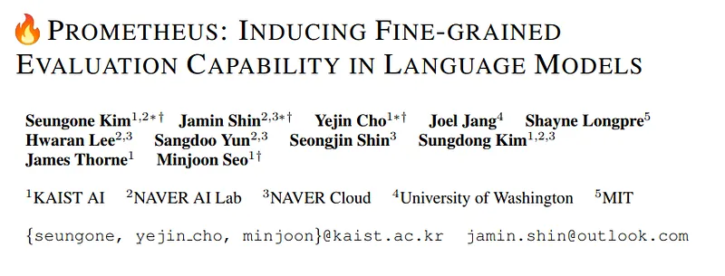 | Paper title: **PROMETHEUS** — fine-grained LLM evaluation (KAIST / NAVER). |
| 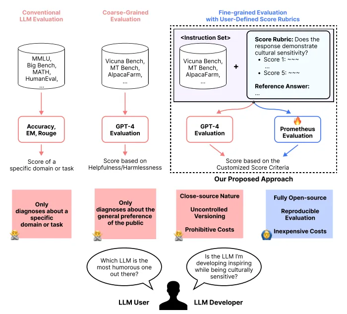 | From coarse benchmarks vs **GPT-4 judge** to **rubric + reference**-based evaluation with an open **Prometheus** judge. |
| 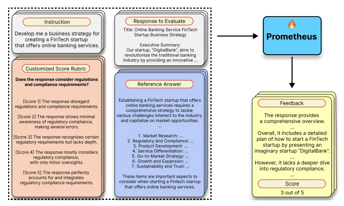 | Example **absolute** eval: instruction, rubric, response, reference → Prometheus **feedback** + **1–5 score**. |
| 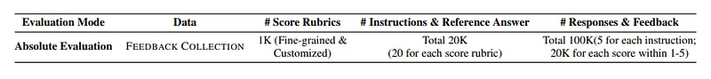 | **Feedback Collection** scale: **1K** rubrics, **20K** instructions w/ references, **100K** responses + feedback. |
| 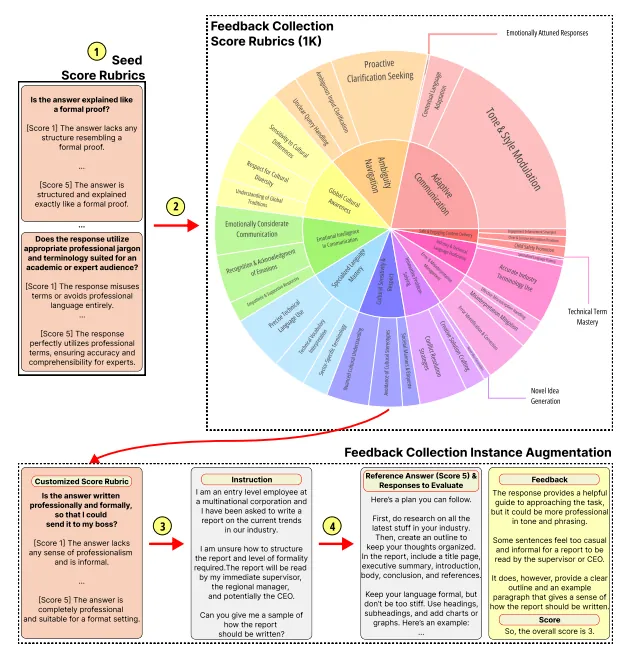 | Dataset build: seed rubrics → **1K** taxonomy (sunburst) → GPT-4 augmentation into full training instances. |
| 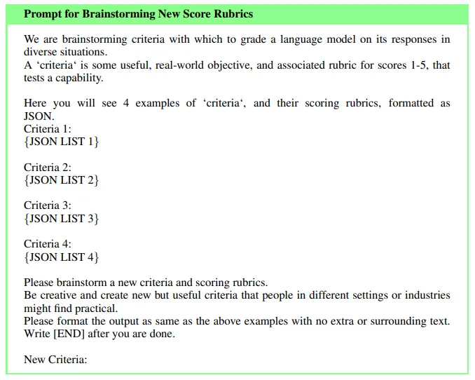 | GPT-4 prompt: **brainstorm** new score rubrics from few-shot JSON examples. |
| 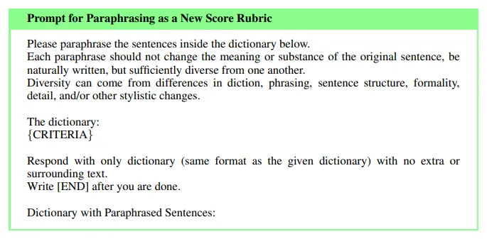 | GPT-4 prompt: **paraphrase** rubric dictionaries for diversity. |
| 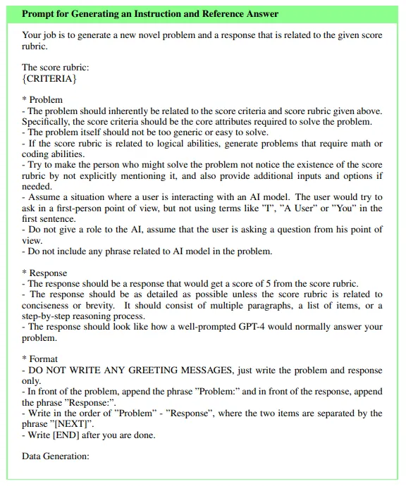 | GPT-4 prompt: generate **instruction + reference (score 5)** aligned to a rubric. |
| 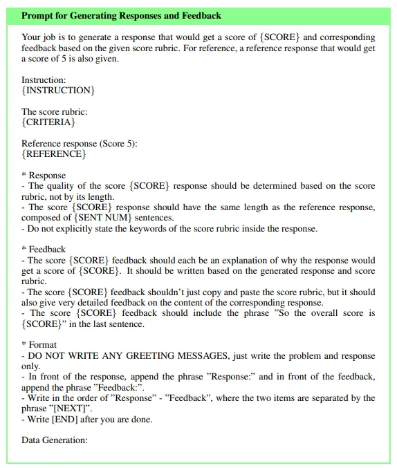 | GPT-4 prompt: synthesize **lower-scored responses**, matching-length **feedback**, and target score. |
| 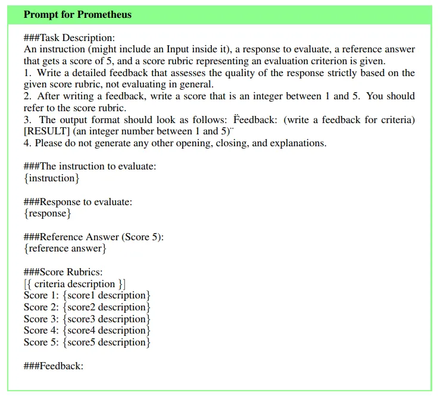 | **Prometheus** inference template: rubric + reference + response → `Feedback: ... [RESULT] {score}`. |
| 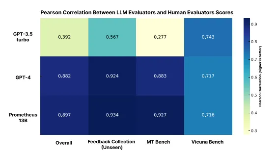 | **Pearson** correlation with humans: GPT-3.5 vs **GPT-4** vs **Prometheus-13B** on Feedback Collection, MT-Bench, Vicuna. |
| 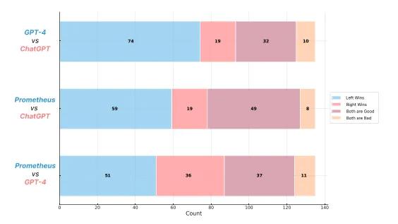 | Human **pairwise** feedback quality: Prometheus vs ChatGPT vs GPT-4 (win / both-good / both-bad counts). |
| 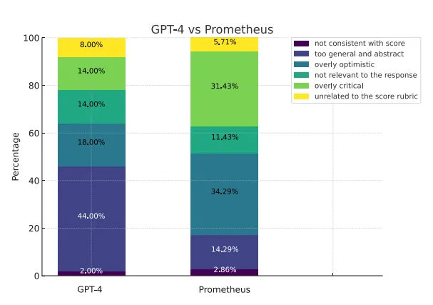 | When feedback is rejected: GPT-4 often **too abstract**; Prometheus more **optimistic vs overly critical** errors. |
| 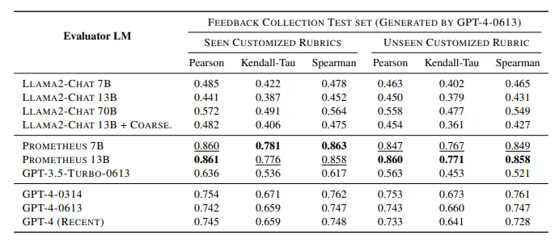 | Correlation with **GPT-4–0613** labels on Feedback Collection test: **seen vs unseen** rubrics (Pearson / Kendall / Spearman). |
| 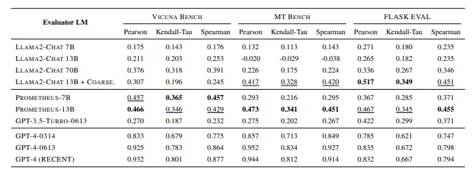 | Correlation with GPT-4 scores on **Vicuna**, **MT-Bench**, **FLASK** across evaluator LMs. |
| 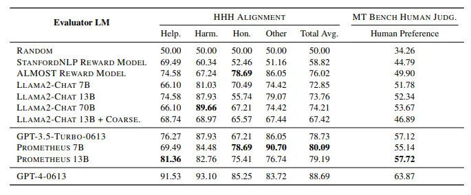 | **Ranking** eval: **HHH** agreement breakdown + **MT-Bench human judgment** accuracy for reward-model-style use. |
## Related

- [[Papers Explained Corpus]]
- [[Large Language Models]]
- [[Synthetic Data]]
- [[Evaluation and Benchmarks]]
- [[Papers Explained 169 - mBART]]
- [[Papers Explained 171 - Prometheus 2]]

#summary #topic
