# Papers Explained 171 - Prometheus 2

This Work curates Preference Collection, a fine-grained pairwise ranking feedback dataset that builds on the Feedback Collection.

This page ingests the source article into the wiki and connects it to [[Papers Explained Corpus]], [[Evaluation and Benchmarks]], [[Reinforcement Learning Topic]], [[Synthetic Data]], [[Large Language Models]].

## Source Metadata

- Source file: `raw/2024-07-31_Papers-Explained-171--Prometheus-2-324e9c162e18.md`
- Source title: Papers Explained 171: Prometheus 2
- Published: 2024-07-31
- Canonical: [https://medium.com/@ritvik19/papers-explained-171-prometheus-2-324e9c162e18](https://medium.com/@ritvik19/papers-explained-171-prometheus-2-324e9c162e18)

## Key Ideas

- Mistral-7B and Mixtral8x7B separately trained on Feedback Collection and Preference Collection are merged to obtain Prometheus 2 (7B & 8x7B).
- Prometheus 2 models score high correlations with both human evaluators and proprietary LM-based judges on both direct assessment and pairwise ranking.
- The project is available at [GitHub](https://github.com/prometheus-eval/prometheus-eval).
- Recommended Reading [Papers Explained 170: Prometheus](https://ritvik19.medium.com/papers-explained-170-prometheus-5e72b8054729)
- A new recipe is used for training a unified evaluator LM based on merging the weights of models trained for direct assessment and pairwise ranking.

## Notes

This Work curates Preference Collection, a fine-grained pairwise ranking feedback dataset that builds on the Feedback Collection.

Mistral-7B and Mixtral8x7B separately trained on Feedback Collection and Preference Collection are merged to obtain Prometheus 2 (7B & 8x7B).

Prometheus 2 models score high correlations with both human evaluators and proprietary LM-based judges on both direct assessment and pairwise ranking.

The project is available at [GitHub](https://github.com/prometheus-eval/prometheus-eval).

Recommended Reading [Papers Explained 170: Prometheus](https://ritvik19.medium.com/papers-explained-170-prometheus-5e72b8054729)

## Methodology

A new recipe is used for training a unified evaluator LM based on merging the weights of models trained for direct assessment and pairwise ranking.

*Figure: Comparison of direct assessment and pairwise ranking.*

### Direct Assessment

Direct assessment is mapping an instruction i and response r into a scalar value score s, such as f_direct : (i, r) → s.

Based on the prior works, a reference answer a and an evaluation criteria i.e. a score rubric including a description for the criteria itself and a set of descriptions e is added as the inputs and the model is additionally prompted to write verbal feedback v_r.

This is expressed as:

### Pairwise Ranking

Pairwise ranking is mapping an instruction i and a pair of responses (r_m, r_n) into either i or j, such as f_pair : (i, r_m, r_n) → s where s ∈ {m,n}. Similar to direct assessment, prior works have identified that integrating a reference answer a and verbal feedback v_rm,rn and evaluation criteria e into the evaluation pipeline is crucial.

This is expressed as:

### The Preference Collection

*Figure: Statistics of the training datasets.*

Popular pairwise ranking datasets such as HH-RLHF or Ultra Feedback do not include the evaluation criteria and the verbal feedback. Hence the Preference Collection is constructed by modifying Feedback Collection

- Since the Feedback Collection includes five responses for each instruction, each corresponding to a scoring decision between 1 and 5, two out of the five responses are paired, resulting in a total of ten combinations per instruction.

- To generate new verbal feedback v_rm,rn for each pair of responses, GPT-4–1106 is prompted to identify the commonalities and differences of the two responses.

### Employing Evaluator Language Models

Prompting

Prompting involves querying an LM to make judgments in a specified evaluation format without training on any feedback dataset.

Single-Format Training

Single-Format training involves training a base model θ on either a direct assessment feedback dataset D_d or a pairwise ranking feedback dataset D_p.

Joint Training

Joint training involves training a base model θ on both a direct assessment feedback dataset D_d and a pairwise ranking feedback dataset D_p. This enables the resulting evaluator LM to function across both evaluation formats.

Weight Merging

Weight Merging involves training two models, θ_d and θ_p, separately on a direct assessment feedback dataset D_d and a pairwise ranking feedback dataset D_p. Then, we obtain the final evaluator LM θ_final with linear merging :

In this work α = 0.5. In addition to linear merging, various other merging techniques are also tested including: Task Arithmetic merging, TIES merging, DARE merging.

## Experimental Setup

*Figure: Statistics of the evaluation benchmarks*

The experiment involves four direct assessment benchmarks and four pairwise ranking benchmarks.

Direct Assessment Benchmarks:

- Vicuna Bench: A single-turn chat benchmark with 80 test prompts, 80 hand-crafted score rubrics, and 320 responses from four language models (WizardLM-13B, Vicuna-13B, Llama-2-Chat-13B, and GPT-3.5-Turbo-0613).

- MT Bench: A multi-turn chat benchmark with 80 test prompts, 80 hand-crafted score rubrics, and 320 responses from the same four language models.

- FLASK: A fine-grained evaluation benchmark with 200 test prompts, 12 score rubrics, and 2000 responses from four language models (Alpaca-7B, Vicuna-13B, Bard, and GPT-3.5-Turbo-0613). This benchmark includes scores from both proprietary language models and human evaluators.

- Feedback Bench: A test set with 1K score rubrics, 200 instructions, and 1K responses that do not overlap with the train data.

Pairwise Ranking Benchmarks:

- HHH Alignment: A benchmark with 221 prompts, 4 score rubrics, and 221 response pairs (graded as ‘win’ or ‘lose’) judged by human evaluators.

- MT Bench Human Judgment: A benchmark with the same 80 prompts as MT-Bench, and 3,360 response pairs (graded as ‘win’, ‘tie’, or ‘lose’) judged by human evaluators.

- Auto-J Eval: A benchmark with 58 prompts and 1,392 response pairs (graded as ‘win’, ‘tie’, or ‘lose’) judged by human evaluators.

- Preference Bench: An in-domain test set for the Prometheus models, with 200 prompts, 2,000 response pairs (graded as ‘win’ or ‘lose’), and 200 evaluation criteria.

Evaluation Metrics:

- In direct assessment, the performance metrics used are Pearson, Spearman, and Kendall-Tau to measure scoring correlations against reference evaluators.

- In pairwise ranking, the metric used is accuracy to measure agreement between evaluator language models and humans.

- For MT Bench Human Judgment and Auto-J Eval, the experiment evaluates in two ways: excluding all ‘tie’ options (denoted as ‘w/o tie’) or using direct assessment where responses scored as ‘ties’ are grouped and pairwise rankings are applied to the remaining responses with differing scores (denoted as ‘w/ tie’).

## Evaluation

### Direct Assessment Results

*Figure: Direct Assessment Results: Pearson correlations*

- All evaluated models, including Prometheus-2 models, GPT-4–1106, Claude-3-Opus, and human evaluators, exhibit strong correlations with each other, with all Pearson correlations exceeding 0.5.

- Base LMs, single-format trained LMs, and jointly trained LMs show lower correlations with GPT-4–1106, Claude-3-Opus, and human evaluators, most of which are below 0.5.

- Prometheus-2 models outperform previous versions of Prometheus (Prometheus and Auto-J) by at least 0.2 units across benchmarks in their correlation with proprietary LMs.

- The Prometheus-2–8X7B model achieves a correlation of 0.555 with humans on the FLASK benchmark, which is significantly higher than the previous best of 0.449 achieved by Prometheus-13B.

### Pairwise Ranking Results

*Figure: Pairwise Ranking Results: Accuracy on human preference datasets.*

- Prometheus-2 models consistently achieve the highest scores across all four benchmarks, indicating their strong performance in simulating human judgments.

- Despite HHH Alignment being a domain-specific test set for Pair RM and Auto-J Eval being for AutoJ, Prometheus-2–8X7B outperforms both on these specific benchmarks, suggesting that it can effectively generalize beyond its training data.

- The performance of Prometheus-2 models significantly improves compared to existing evaluator LMs, reducing the performance gap with proprietary LMs by at least half on out-of-domain test sets.

### Consistency Across Evaluation Formats

*Figure: Consistency across Evaluation Formats: Pairwise ranking accuracy when assessing in direct assessment formats*

- Prometheus 2 models demonstrated lower performance differences across evaluation formats, suggesting their robustness in handling different types of evaluations.

- The results indicate that the Prometheus 2 models maintained consistent scoring behavior regardless of the format used for the evaluation.

## Paper

Prometheus 2: An Open Source Language Model Specialized in Evaluating Other Language Models [2405.01535](https://arxiv.org/abs/2405.01535)

Recommended Reading [LLM Evaluation](https://ritvik19.medium.com/list/llm-evaluation-a011ddd1a546)

## Figures

Figures from the Medium HTML export (`raw/2024-07-31_Papers-Explained-171--Prometheus-2-324e9c162e18.md`); local copies under `wiki/assets/papers-explained-171-prometheus-2/` when download succeeded.

| Figure | Caption |
|--------|---------|
| 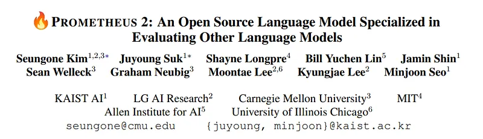 | Paper title: **PROMETHEUS 2** — open LM specialized in evaluating other LMs (authors / affiliations). |
| 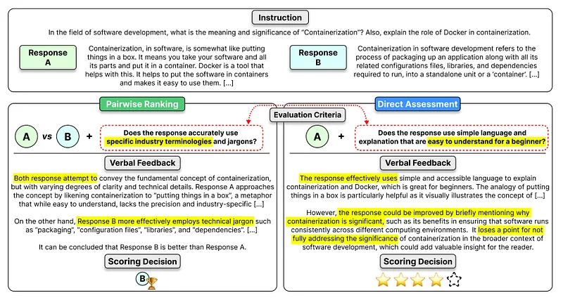 | **Pairwise ranking** vs **direct assessment** on the same instruction/responses (criteria, verbal feedback, winner or 1–5 score). |
| 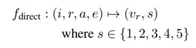 | **Direct assessment** formalization: \(f_{\text{direct}} : (i,r,a,e) \mapsto (v_r,s)\) with \(s \in \{1,\ldots,5\}\). |
| 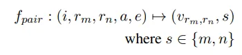 | **Pairwise ranking** formalization: \(f_{\text{pair}} : (i,r_m,r_n,a,e) \mapsto (v_{r_m,r_n},s)\) with \(s \in \{m,n\}\). |
| 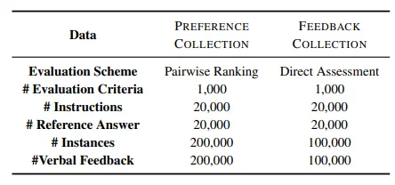 | **Preference Collection** vs **Feedback Collection**: scheme, counts of criteria, instructions, references, instances, verbal feedback. |
| 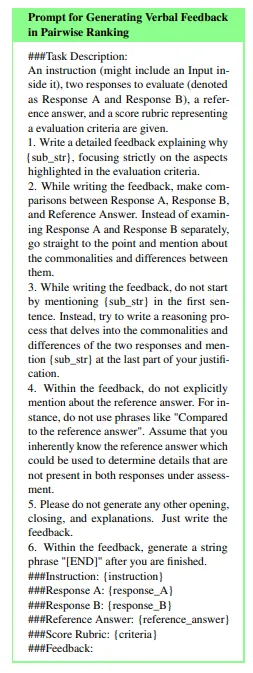 | GPT-4 **prompt template** for generating pairwise verbal feedback (compare A/B vs reference, end with `[END]`). |
| 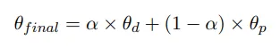 | **Linear weight merge**: \(\theta_{\text{final}} = \alpha \theta_d + (1-\alpha)\theta_p\) (direct-trained vs pairwise-trained checkpoints; \(\alpha=0.5\)). |
| 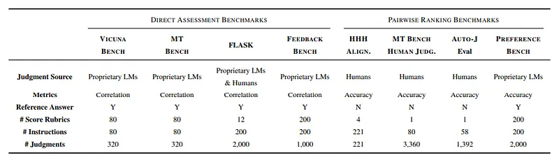 | **Evaluation benchmarks** table: direct-assessment vs pairwise sets (judges, metrics, rubrics, instruction/judgment counts). |
| 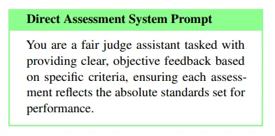 | **Direct assessment** evaluator **system prompt** (“fair judge assistant” / rubric-grounded feedback). |
| 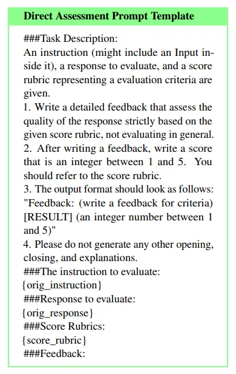 | **Direct assessment** user prompt template: `Feedback: … [RESULT] (score)`. |
| 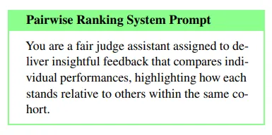 | **Pairwise ranking** evaluator **system prompt** (comparative, cohort-relative feedback). |
| 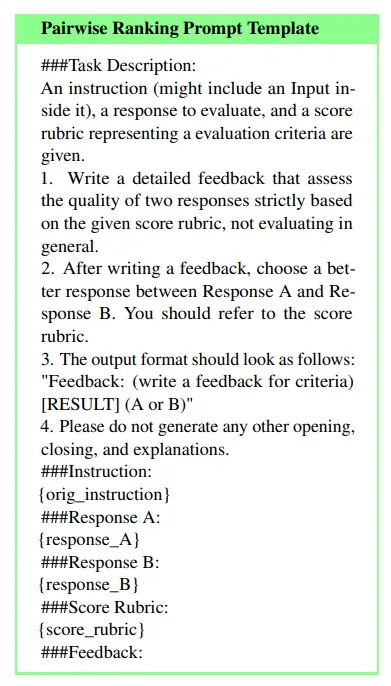 | **Pairwise ranking** user prompt template: `Feedback: … [RESULT] (A or B)`. |
| 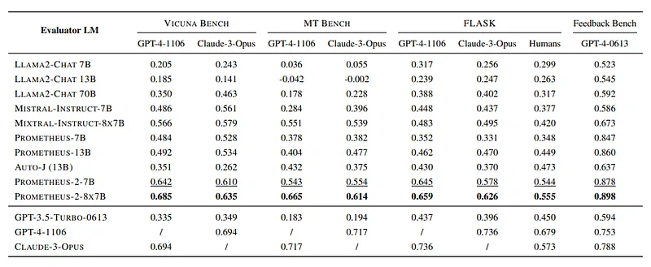 | **Direct assessment** results: **Pearson** correlation vs GPT-4 / Claude / humans (Vicuna, MT, FLASK, Feedback Bench). |
| 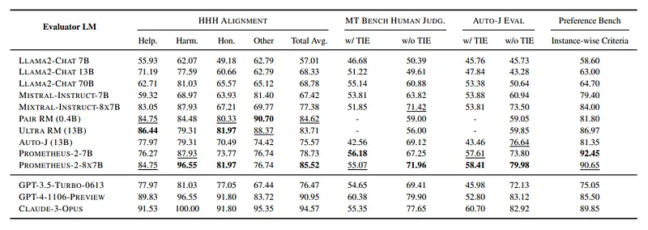 | **Pairwise ranking** results: **accuracy** on HHH, MT-Bench human, Auto-J, Preference Bench. |
| 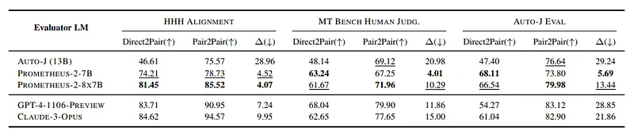 | **Cross-format consistency**: Direct2Pair vs Pair2Pair vs gap \(\Delta\) on HHH, MT-Bench, Auto-J (Prometheus-2 vs GPT-4 / Claude). |
## Related

- [[Papers Explained Corpus]]
- [[Evaluation and Benchmarks]]
- [[Reinforcement Learning Topic]]
- [[Synthetic Data]]
- [[Large Language Models]]
- [[Papers Explained 170 - Prometheus]]
- [[Papers Explained 172 - E5-V]]

#summary #topic
