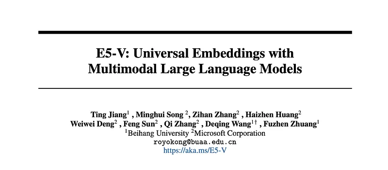
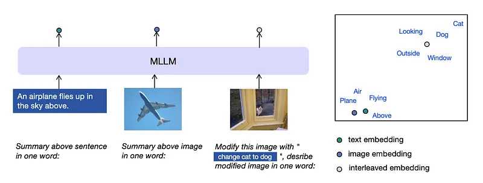
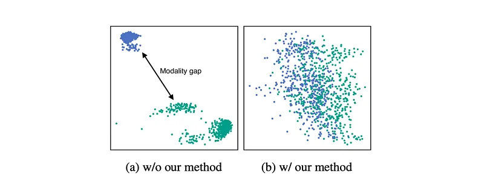
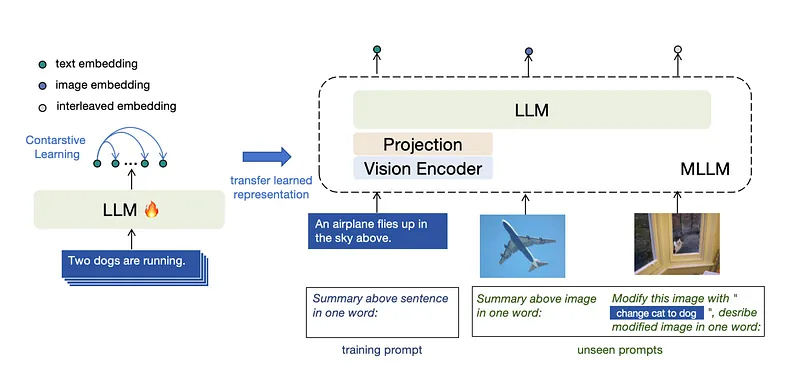
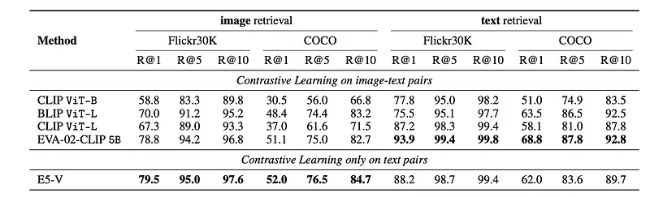
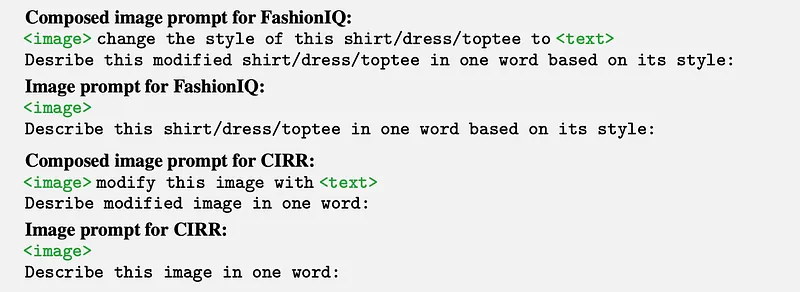
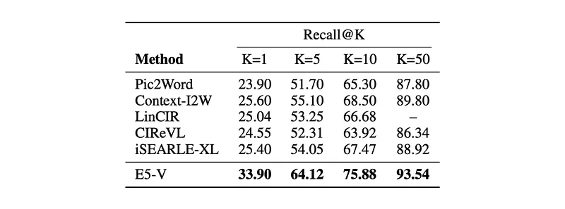
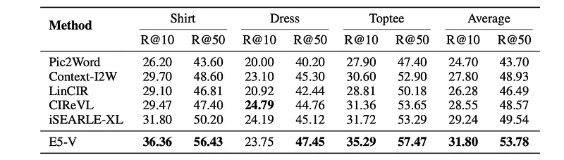
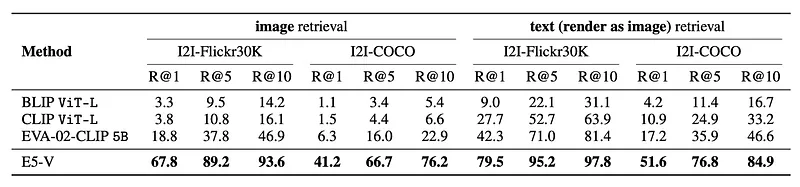
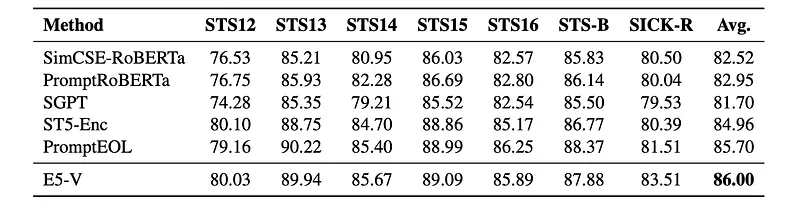

# Papers Explained 172 - E5-V

E5-V leverages Multimodal Large Language Models Via prompts to effectively bridge the modality gap between different types of inputs, demonstrating strong performance in multimodal embeddings even without fine-tuning.

This page ingests the source article into the wiki and connects it to [[Papers Explained Corpus]], [[Large Language Models]], [[Embedding and Retrieval]], [[Vision Language Models]], [[Supervised Fine-Tuning]].

## Source Metadata

- Source file: `raw/2024-07-31_Papers-Explained-172--E5-V-9947d3925802.md`
- Source title: Papers Explained 172: E5-V
- Published: 2024-07-31
- Canonical: [https://medium.com/@ritvik19/papers-explained-172-e5-v-9947d3925802](https://medium.com/@ritvik19/papers-explained-172-e5-v-9947d3925802)

## Key Ideas

- The project is available at [Github](https://github.com/kongds/E5-V).
- Recommended Reading [Papers Explained 90: E5](https://ritvik19.medium.com/papers-explained-90-e5-75ea1519efad)
- To unify multimodal embeddings, a prompt-based representation method with MLLMs is used. The key idea is to explicitly instruct MLLMs to represent the multimodal inputs into words. Prompts like
- <text> \n Summary of the above sentence in one word:
- <image> \n Summary above image in one word:

## Notes

E5-V leverages Multimodal Large Language Models Via prompts to effectively bridge the modality gap between different types of inputs, demonstrating strong performance in multimodal embeddings even without fine-tuning. It proposes a single modality training approach, where the model is trained exclusively on text pairs, demonstrating significant improvements over traditional multimodal training on image-text pairs, while reducing training costs.

The project is available at [Github](https://github.com/kongds/E5-V).

Recommended Reading [Papers Explained 90: E5](https://ritvik19.medium.com/papers-explained-90-e5-75ea1519efad)

## Unifying Multimodal Embeddings

*Figure: 2D visualization of multimodal embeddings and token embeddings in MLLM. Words correspond to the tokens in MLLM, and dots represent the multimodal embeddings*

To unify multimodal embeddings, a prompt-based representation method with MLLMs is used. The key idea is to explicitly instruct MLLMs to represent the multimodal inputs into words. Prompts like

> <text> \n Summary of the above sentence in one word:

and

> <image> \n Summary above image in one word:

to represent the text and image respectively.

These prompts directly remove the modality gap between text and image embeddings.

*Figure: Distribution of image embeddings and text embeddings from MLLM without and with our representation method.*

For the design of the prompts, it has two parts: the first part is about extracting the meaning of the multimodal inputs, and the second part is about compressing the meaning into the next token embeddings and unifying the multimodal embeddings by using ‘in one word‘

By removing the modality gap, it also allows MLLMs to represent interleaved inputs for tasks like composed image retrieval.

## Single Modality Training

*Figure: Single modality training in E5-V.*

Since there is no longer a modality gap in the embeddings, the single modality representation capabilities can be transferred to multimodal embeddings by training on text pairs only. In this way, the model is trained without any visual or interleaved inputs and no longer relies on multimodal training data, which can be difficult to collect. E5-V trains MLLMs with contrastive learning on text pairs.

The following prompt is used to embed the sentence pairs into (h, h+ , h−).

> <text> \n Summary above sentence in one word:

The training objective is following:

*Figure: where τ is the temperature hyperparameter and N is the batch size and in contrastive learning.*

For the backbone of E5-V, LLaVA-NeXT-8B is used, which builds on LLaMA-3 8B, with a frozen CLIP ViT-L as the visual encoder. For the training data, NLI sentence pairs are used, with around 273k sentence pairs.

## Evaluation

### Text-Image Retrieval

*Figure: Zero-shot text-image retrieval performance on Flickr30K and COCO.*

- E5-V achieves competitive performance on both Flickr30K and COCO datasets, outperforming strong baselines like CLIP ViT-L and EVA-02-CLIP.

- E5-V demonstrates superior zero-shot image retrieval performance compared to EVA-02-CLIP, despite being trained only on text pairs.

### Composed Image Retrieval

*Figure: Zero-shot composed image retrieval performance on CIRR.*

- On CIRR, E5-V outperforms the state-of-the-art iSEARLE-XL by 8.50% on Recall@1 and 10.07% on Recall@5.

*Figure: Zero-shot composed image retrieval performance on FashionIQ.*

- On FashionIQ, E5-V outperforms iSEARLE-XL by 2.56% on Recall@10 and 4.24% on Recall@50.

### Image-Image Retrieval

*Figure: Zero-shot image-image retrieval performance on I2I-Flickr30K and I2I-COCO.*

- Baselines (CLIP, BLIP, EVA-02-CLIP) show significantly lower performance on image-image retrieval compared to text-image retrieval, highlighting the difficulty of understanding text from images.

- E5-V outperforms the baselines on both I2I-Flickr30K and I2I-COCO datasets, demonstrating its strong ability to understand text through visual input and represent it accurately.

### Sentence Embeddings

*Figure: Sentence embeddings performance on STS tasks.*

- E5-V outperforms other sentence embedding methods on the STS tasks, including SimCSE-RoBERTa, PromptRoBERTa, SGPT, ST5-Enc, and PromptEOL.

- This strong performance demonstrates E5-V’s ability to effectively represent textual inputs based on their semantic meaning.

## Paper

E5-V: Universal Embeddings with Multimodal Large Language Models [2407.12580](https://arxiv.org/abs/2407.12580)

Recommended Reading [Retrieval and Representation Learning](https://ritvik19.medium.com/list/retrieval-and-representation-learning-bcd23de0bd8e)

## Figures

Figures from the Medium HTML export (`raw/2024-07-31_Papers-Explained-172--E5-V-9947d3925802.md`); local copies under `wiki/assets/papers-explained-172-e5-v/` when download succeeded.

| Figure | Caption |
|--------|---------|
|  | Paper title: **E5-V: Universal Embeddings with Multimodal Large Language Models** (authors / Microsoft link). |
|  | **MLLM** maps text, image, and interleaved prompts to dots in a shared **2D semantic** layout (“Plane” vs “Window/Dog” regions). |
|  | **Modality gap**: image vs text clusters **without** the method vs **overlapping** embeddings **with** the one-word-summary prompts. |
|  | **Text-only contrastive** pretrain on the LLM, then **transfer** to MLLM with vision encoder + projection; zero-shot multimodal prompts. |
|  | **Contrastive loss** \(\mathcal{L}\): cosine similarities of anchors \(h_i\) to positives \(h^+\) and batch negatives \(h^\pm\), temperature \(\tau\). |
|  | **Zero-shot text–image retrieval** on **Flickr30K** and **COCO** (image vs text retrieval); E5-V trained **only** on text pairs. |
|  | **Composed-image retrieval** prompt patterns for **FashionIQ** and **CIRR** (`<image>` + modify text → “describe in one word”). |
|  | **CIRR** **Recall@K** (K=1,5,10,50): E5-V vs Pic2Word, Context-I2W, iSEARLE-XL, etc. |
|  | **FashionIQ** per-category **R@10 / R@50** (shirt, dress, toptee) and average. |
|  | **Image–image** retrieval on **I2I-Flickr30K** / **I2I-COCO**: plain images vs **text rendered as image**. |
|  | **Sentence embeddings** on **STS** tasks (STS12–16, STS-B, SICK-R): E5-V vs SimCSE, SGPT, ST5-Enc, PromptEOL. |
## Related

- [[Papers Explained Corpus]]
- [[Large Language Models]]
- [[Embedding and Retrieval]]
- [[Vision Language Models]]
- [[Supervised Fine-Tuning]]
- [[Papers Explained 171 - Prometheus 2]]
- [[Papers Explained 173 - ELECTRA]]

#summary #topic
