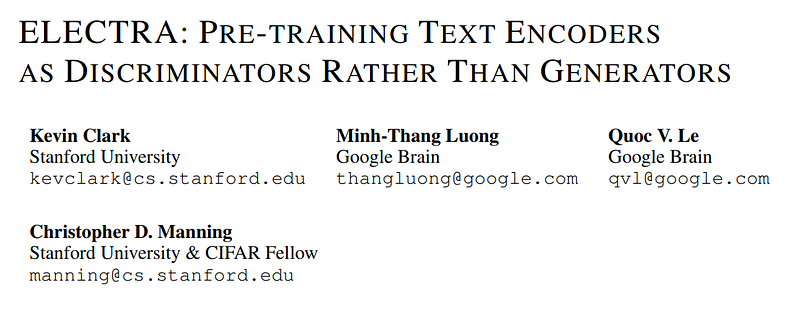
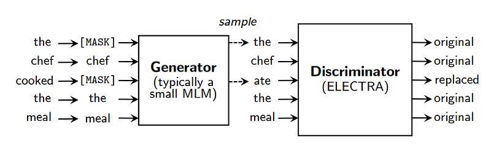
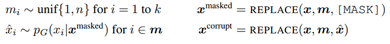
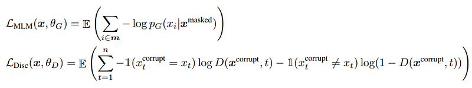
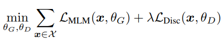

# Papers Explained 173 - ELECTRA

Efficiently Learning an Encoder that Classifies Token Replacements Accurately (ELECTRA), a unique transformer model jointly developed by Stanford University and Google, employs a smaller masked language model for learning.

This page ingests the source article into the wiki and connects it to [[Papers Explained Corpus]], [[Large Language Models]], [[Evaluation and Benchmarks]], [[Embedding and Retrieval]].

## Source Metadata

- Source file: `raw/2024-08-02_Papers-Explained-173--ELECTRA-501c175ae9d8.html`
- Source title: Papers Explained 173: ELECTRA
- Published: 2024-08-02
- Canonical: [https://medium.com/@ritvik19/papers-explained-173-electra-501c175ae9d8](https://medium.com/@ritvik19/papers-explained-173-electra-501c175ae9d8)

## Key Ideas

- The replaced token detection pre-training task rains two neural networks, a generator G and a discriminator D.
- The generator is trained to perform masked language modeling (MLM).
- The discriminator is trained to distinguish tokens in the data from tokens that have been replaced by generator samples.
- Formally, model inputs are constructed according to:
- Although similar to the training objective of a GAN, there are several key differences. First, if the generator happens to generate the correct token, that token is considered “real” instead of “fake”;

## Notes

Efficiently Learning an Encoder that Classifies Token Replacements Accurately (ELECTRA), a unique transformer model jointly developed by Stanford University and Google, employs a smaller masked language model for learning. This compact model intentionally corrupts input text by randomly masking certain portions, and the primary objective of ELECTRA is to discern between the original tokens and their replacements.

## Method

*Figure: An overview of replaced token detection.*

The replaced token detection pre-training task rains two neural networks, a generator G and a discriminator D.

The generator is trained to perform masked language modeling (MLM).

The discriminator is trained to distinguish tokens in the data from tokens that have been replaced by generator samples. More specifically, we create a corrupted example x_corrupt by replacing the masked-out tokens with generator samples and train the discriminator to predict which tokens in x_corrupt match the original input x.

Formally, model inputs are constructed according to:

and the loss functions are:

Although similar to the training objective of a GAN, there are several key differences. First, if the generator happens to generate the correct token, that token is considered “real” instead of “fake”; this formulation is found to moderately improve results on downstream tasks.

More importantly, the generator is trained with maximum likelihood rather than being trained adversarially to fool the discriminator.

Lastly, No noise vector is supplied as input to the generator, which is typical with a GAN.

The combined loss is minimized:

## Paper

ELECTRA: Pre-training Text Encoders as Discriminators Rather Than Generators [2003.10555](https://arxiv.org/abs/2003.10555)

## Figures

Figures from the Medium HTML export (`raw/2024-08-02_Papers-Explained-173--ELECTRA-501c175ae9d8.html`); local copies under `wiki/assets/papers-explained-173-electra/` when download succeeded.

| Figure | Caption |
|--------|---------|
|  | Paper title block: **ELECTRA: Pre-training Text Encoders as Discriminators Rather Than Generators**. |
|  | **Replaced token detection**: small **generator** MLM fills masks; **discriminator** labels each token original vs replaced (“the chef **ate** the meal”). |
|  | **Corruption construction**: sample mask positions, `[MASK]` input, generator samples \(\hat{x}_i\), build \(x^{\text{corrupt}}\). |
|  | **Losses**: generator **MLM** \(\mathcal{L}_{\text{MLM}}\) and discriminator **binary** \(\mathcal{L}_{\text{Disc}}\) over all positions. |
|  | **Joint objective**: minimize \(\sum_x \mathcal{L}_{\text{MLM}}(x,\theta_G) + \lambda \mathcal{L}_{\text{Disc}}(x,\theta_D)\). |
## Related

- [[Papers Explained Corpus]]
- [[Large Language Models]]
- [[Evaluation and Benchmarks]]
- [[Embedding and Retrieval]]
- [[Papers Explained 172 - E5-V]]
- [[Papers Explained 174 - FineWeb]]

#summary #topic
