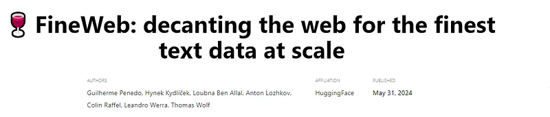
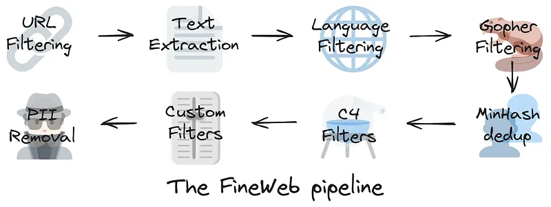
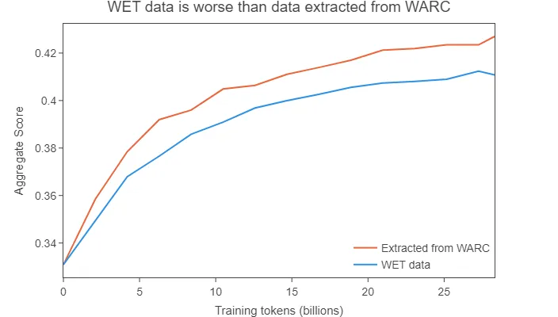
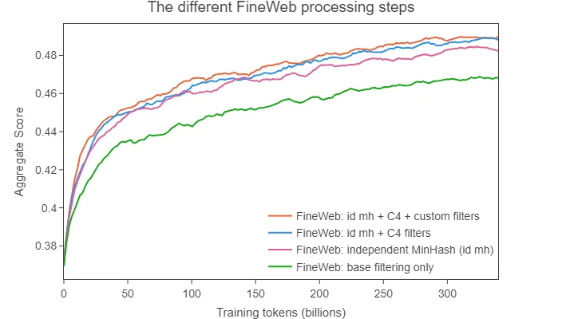
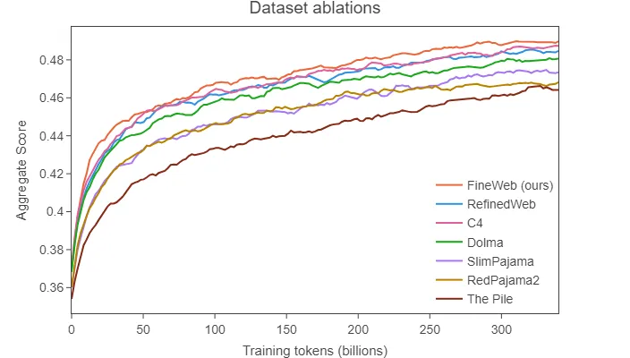
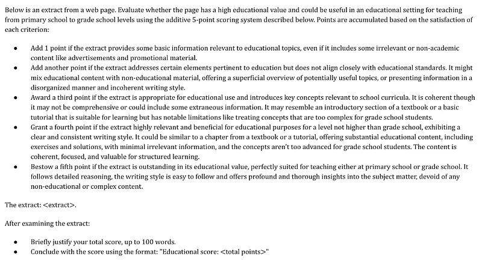
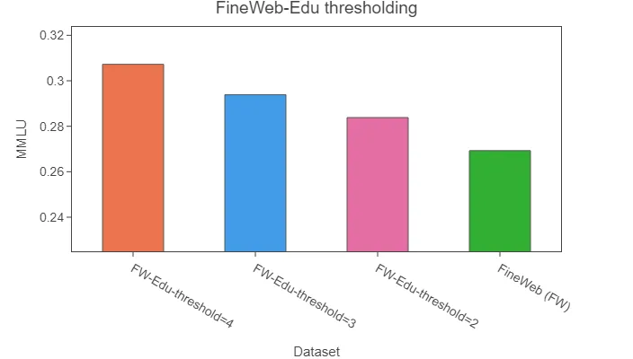
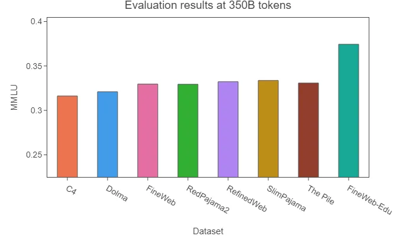
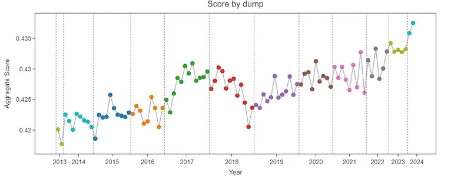
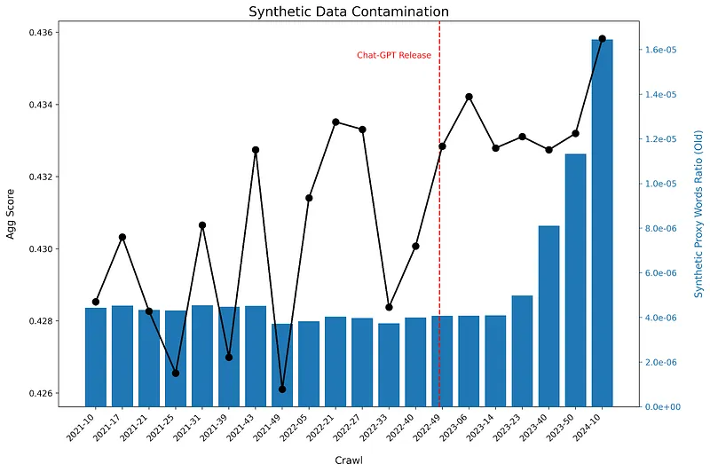

# Papers Explained 174 - FineWeb

FineWeb is a large-scale dataset for pretraining LLMs, consisting of 15T tokens and 44TB of disk space. It was created by combining 96 CommonCrawl snapshots and is designed to produce better-performing LLMs than other open pretraining datasets.

This page ingests the source article into the wiki and connects it to [[Papers Explained Corpus]], [[Synthetic Data]], [[Agentic AI]].

## Source Metadata

- Source file: `raw/2024-08-05_Papers-Explained-174--FineWeb-280bbc08068b.md`
- Source title: Papers Explained 174: FineWeb
- Published: 2024-08-05
- Canonical: [https://medium.com/@ritvik19/papers-explained-174-fineweb-280bbc08068b](https://medium.com/@ritvik19/papers-explained-174-fineweb-280bbc08068b)

## Key Ideas

- FineWeb-Edu is a subset of FineWeb that has been annotated for educational value using scalable automated high-quality annotations. It outperforms other openly accessible web-datasets on educational benchmarks such as MMLU, ARC, and OpenBookQA.
- There are two options to curate pre training data:
- Crawl the web yourself, like companies [OpenAI](https://platform.openai.com/docs/gptbot)and [Anthropic](https://darkvisitors.com/agents/claudebot) do
- Use a public repository of crawled web pages, such as CommonCrawl.
- FineWeb uses CommonCrawl as a starting point. CommonCrawl has been crawling the web since 2007 and releases a new crawl every 1–2 months.

## Notes

FineWeb is a large-scale dataset for pretraining LLMs, consisting of 15T tokens and 44TB of disk space. It was created by combining 96 CommonCrawl snapshots and is designed to produce better-performing LLMs than other open pretraining datasets.

FineWeb-Edu is a subset of FineWeb that has been annotated for educational value using scalable automated high-quality annotations. It outperforms other openly accessible web-datasets on educational benchmarks such as MMLU, ARC, and OpenBookQA. FineWeb-Edu is available in two sizes: 1.3T tokens and 5.4T tokens.

## Web data

### Finding the raw data

There are two options to curate pre training data:

- Crawl the web yourself, like companies [OpenAI](https://platform.openai.com/docs/gptbot)and [Anthropic](https://darkvisitors.com/agents/claudebot) do

- Use a public repository of crawled web pages, such as CommonCrawl.

FineWeb uses CommonCrawl as a starting point. CommonCrawl has been crawling the web since 2007 and releases a new crawl every 1–2 months. In total, 96 crawls have been released since 2013, and 3 crawls from 2008–2012 are available in a different (older) format.

### Processing at scale

Given the sheer size of the data, the main challenge is developing a modular, scalable codebase that can quickly iterate on processing decisions, try out new ideas, and provide clear insights into the large amount of data involved. To overcome this challenge, an open-source data processing library called DataTrove is created.

DataTrove is available at [GitHub](https://github.com/huggingface/datatrove).

### What is good data?

When creating a dataset, it’s essential to consider what constitutes “high-quality” data, as this term is not well-defined and can’t be easily observed through human observation alone. Typically, models are trained datasets that are considered “clean” and are used to evaluate perplexity, but this doesn’t always correlate with improved performance on downstream tasks.

Another common approach, used in this work as well, is training small models on a representative subset of the dataset and evaluating them on a set of evaluation tasks.

### Ablations and evaluation setup

Two models are trained on different versions of a dataset: one with an extra processing step and one without. The models are identical except for the training data, and were trained using Nanotron for a single epoch on a random sample of tokens from each version of the data. The models have 1.82B parameters, and follow the Llama architecture, with a sequence length of 2048. The training data consisted of approximately 28 billion tokens, and the models were evaluated using Lighteval.

The following benchmarks are selected to evaluate the models:

- CommonSense QA

- HellaSwag

- OpenBook QA

- PIQA

- SIQA

- WinoGrande

- ARC

- MMLU

To ensure that the evaluation stayed within a limited timeframe, the longer benchmarks are capped at 1000 samples.

## The FineWeb recipe

CommonCrawl data is available in two formats:

- WARC (Web ARChive format): contains raw data, including full page HTML and request metadata

- WET (WARC Encapsulated Text): provides a text-only version of websites.

Many datasets start with WET files, but the default text extraction used by CommonCrawl is suboptimal for LLM pretraining. The trafilatura library is used to extract text content from WARC files, which provides good quality extraction.

### Base filtering

The filtering setup from RefinedWeb is utilized:

- Applied URL filtering using a [blocklist](https://dsi.ut-capitole.fr/blacklists/)to remove adult content

- Applied a [fastText language classifier](https://fasttext.cc/docs/en/language-identification.html) to keep only English text with a score ≥ 0.65

- Applied quality and repetition filters from MassiveText (using the default thresholds)

After applying this filtering to each of the text extracted dumps roughly 36 trillion tokens of data is obtained.

### Deduplication

The web contains many duplicated pages, which can be caused by aggregators, mirrors, templated pages, or repeated content across different domains and webpages. Sometimes, these duplicates can even be introduced by web crawlers when different links point to the same page. Removing these duplicates, also known as deduplication, has been linked to improvements in model performance and a reduction in memorization of pretraining data, which can lead to better generalization. Additionally, deduplication can be seen as increasing training efficiency, allowing a model to reach the same performance level with fewer training iterations or with more diverse data.

MinHash (fuzzy hash-based deduplication technique) is used to identify duplicate documents. 5-grams are collected from each document and minhashes are computed using 112 hash functions, split into 14 buckets of 8 hashes each. This setup targets documents that are at least 75% similar. Documents with the same 8 min hashes in any bucket are considered duplicates.

The intra-document deduplication is already handled by their repetition filter, which removes documents with many repeated lines and paragraphs.

### Additional Filtering

Experiments are conducted with applying each of the filters used in C4 to a baseline of the independently deduped FineWeb 2019–18 dump. It is found that:

- Applying all filters (excluding terminal punctuation) matches C4’s Hellaswag performance.

- The curly bracket filter and word lengths filter only give a small boost, removing 2.8% and 4.3% of tokens, respectively.

- The terminal punctuation filter gives the biggest individual boost, but removes around 30% of all tokens.

- The lorem_ipsum, javascript, and policy rules each remove less than 0.5% of training tokens, so they were not trained on individually.

- Applying all filters except the terminal punctuation filter performs better than the terminal punctuation filter alone, while removing less in total (~7%).

Hence it is decided to apply all C4 filters mentioned above except the terminal punctuation filter.

Certain new heuristic filters are developed following a systematic process to improve the quality of their dataset by selecting thresholds for these filters:

- A large list of high-level statistics is collected from their datasets, including document-level metrics and inter-document repetition metrics

- Metrics are chosen with a significant Wasserstein distance between the high-quality and lower-quality datasets.

- Histograms of the two distributions are inspected, and a threshold is empirically chosen to make the lower-quality dataset more similar to the higher-quality one.

- The resulting filter is validated by being used on a reference dataset and undergoing small ablations.

The process yielded 17 candidate metric-threshold pairs, which were then assessed by conducting ablation runs on the 2019–18 crawl. Three filters demonstrated the most significant improvements on the aggregate score:

- Remove documents where the fraction of lines ending with punctuation ≤ 0.12 (10.14% of tokens removed).

- Remove documents where the fraction of characters in duplicated lines ≥ 0.1 (12.47% of tokens removed).

- Remove documents where the fraction of lines shorter than 30 characters ≥ 0.67 (3.73% of tokens removed).

When applying these three filters together, ~22% of tokens were removed. These filters allow to further improve performance and surpass the C4 dataset performance while providing a larger dataset.

### Comparison with other Web Datasets

FineWeb is compared with the following datasets:

- RefinedWeb (500B)

- C4 (172B)

- Dolma v1.6 (3T) (the CommonCrawl part)

- The Pile (340B)

- SlimPajama (627B)

- RedPajama2 (20T) (deduplicated)

FineWeb is thus — to the best of our knowledge — the open dataset leading to the current highest model performances while allowing to train on several trillion tokens.

## FineWeb-Edu

FineWeb-Edu is a new development of FineWeb that is being introduced and openly released. It is based on a new approach to filtering LLM training datasets, which involves using synthetic data to develop classifiers for identifying educational content. This technique has been used in the training of Llama 3 and Phi3, but its potential impact on web data filtering has not been fully explored. The classifiers and filtered datasets are not publicly available. To improve the quality of FineWeb, an educational quality classifier is developed using annotations generated by Llama-3–70B-Instruct, resulting in FineWeb-Edu.

### Annotating for educational quality at scale

Llama-3–70B-Instruct model is used to annotate 500,000 samples from the FineWeb dataset, scoring each sample’s educational quality on a scale from 0 to 5.

To avoid the LLM favoring highly technical pages, grade-school and middle-school level knowledge is focused and a threshold of 3 (on a scale of 0 to 5) is used during the filtering process, retaining some high-level educational pages.

Different open-weight models including Mixtral-8x7B-Instruct, Mixtral-8x22B-Instruct and Llama-3–70B-Instruct, as well as a jury gathering the scores from these three models were experimented with for annotating the data. It was found that using Llama-3 alone yielded the most reliable results.

### Training a classifier

A Snowflake-arctic-embed embedding model with a classification head and a single regression output is trained on 450,000 Llama 3 annotations for 20 epochs with a learning rate of 3e-4, freezing the embedding and encoder layers.

### Filtering and results

The impact of using different thresholds for the filtering is investigated

- Using a threshold of 3 gave the best overall results.

- Although using a threshold higher than 3 improves performance on knowledge and reasoning intensive benchmarks, it significantly degrades performance on HellaSwag and PIQA.

To evaluate the effectiveness of this filtering at a larger scale, an ablation is conducted:

- FineWeb-Edu surpasses FineWeb and all other open web datasets, with remarkable improvements on educational benchmarks such as MMLU, ARC, and OpenBookQA.

- It achieves the same performance with significantly less data, requiring 10x fewer tokens compared to C4 and Dolma to match MMLU results.

A threshold of 2 also demonstrated strong performance while retaining more data, hence an additional dataset filtered with this threshold, containing 5.4T tokens is also released.

The two datasets along with the classifier used for the filtering are available at [HuggingFace](https://huggingface.co/collections/HuggingFaceFW/fineweb-edu-6659c3f3d399d0e1d648adfd).

## Bonus: CommonCrawl over time

While ablating filtering steps, it is noticed that certain crawls outperformed others by a significant margin. To investigate this 192 1.8B language models are trained on 27B tokens randomly sampled from 27 different crawls of Common Crawl (CC) data. Each crawl is trained twice with different random samples.

Some crawls performed significantly worse than others.

It is wondered if the strong performance of recent crawls could be attributed to the increasing presence of synthetic data, (generated by LLMs like ChatGPT). Since there is no foolproof method to detect synthetic data, a proxy metric is used: measuring the frequency of certain words commonly used by ChatGPT in each crawl.

> “delve”, “as a large language model”, “it’s important to note”, “rich tapestry”, “intertwined”, “certainly!”, “dive into”

The results show that the frequency of these words remained constant until 2023–14 (ChatGPT was released at the end of 2022), but then increased steeply in recent crawls. While this does not conclusively prove that ChatGPT completions and other synthetic data are improving the quality of recent crawls, it does not seem to harm performance either.

It is expected to see increasing quantities of synthetic data in new CC crawls, but it is unclear whether this will hold for larger training.

## Paper

[FineWeb: decanting the web for the finest text data at scale](https://huggingface.co/spaces/HuggingFaceFW/blogpost-fineweb-v1)

Recommended Reading [Datasets](https://ritvik19.medium.com/list/datasets-b465a5d8a2d6)

## Figures

Figures from the Medium HTML export (`raw/2024-08-05_Papers-Explained-174--FineWeb-280bbc08068b.md`); local copies under `wiki/assets/papers-explained-174-fineweb/` when download succeeded.

| Figure | Caption |
|--------|---------|
|  | Hugging Face blog header: **FineWeb** — decanting the web for large-scale text data (authors, May 2024). |
|  | **FineWeb pipeline** cartoon: URL filter → text extract → language → Gopher filters → MinHash dedup → C4 → custom filters → PII removal. |
|  | **WARC-extracted** text beats **WET** CommonCrawl text on aggregate score vs training tokens (1.8B LM ablation). |
|  | **Processing ablations**: base → independent MinHash → +C4 → +custom filters (aggregate score vs tokens). |
|  | **Dataset comparison**: FineWeb vs RefinedWeb, C4, Dolma, SlimPajama, RedPajama2, The Pile (aggregate vs 350B-scale training). |
|  | **Llama-3 prompt** for 0–5 **educational quality** scoring of a web extract (FineWeb-Edu labeling). |
|  | **FineWeb-Edu threshold** sweep vs **MMLU** (threshold 2–4 vs full FineWeb). |
|  | **MMLU at ~350B tokens**: FineWeb-Edu vs other open web corpora (C4, Dolma, RefinedWeb, …). |
|  | **Aggregate score by Common Crawl dump** (2013–2024): crawl-to-crawl quality drift. |
|  | **Synthetic proxy phrases** rate in crawls vs aggregate score; vertical line at **ChatGPT** release (mid-2023 spike in proxy words). |
## Related

- [[Papers Explained Corpus]]
- [[Synthetic Data]]
- [[Agentic AI]]
- [[Papers Explained 173 - ELECTRA]]
- [[Papers Explained 175 - Cosmopedia]]

#summary #topic
