# Papers Explained 176 - Smol LM

SmolLM is a series of state-of-the-art small language models available in three sizes: 135M, 360M, and 1.7B parameters. These models are built on a meticulously curated high-quality training corpus, which we are releasing as SmolLM-Corpus. Smollm Corpus includes:

This page ingests the source article into the wiki and connects it to [[Papers Explained Corpus]], [[Synthetic Data]], [[Model Compression and Efficiency]], [[Large Language Models]], [[Mixture of Experts]].

## Source Metadata

- Source file: `raw/2024-08-06_Papers-Explained-176--Smol-LM-a166d5f1facc.html`
- Source title: Papers Explained 176: Smol LM
- Published: 2024-08-06
- Canonical: [https://medium.com/@ritvik19/papers-explained-176-smol-lm-a166d5f1facc](https://medium.com/@ritvik19/papers-explained-176-smol-lm-a166d5f1facc)

## Key Ideas

- SmolLM is a series of state-of-the-art small language models available in three sizes: 135M, 360M, and 1.7B parameters. These models are built on a meticulously curated high-quality training corpus, which we are releasing as SmolLM-Corpus.
- FineWeb-Edu (deduplicated): educational web samples from FineWeb (220B tokens)
- Cosmopedia v2: A collection of synthetic textbooks and stories generated by Mixtral (28B tokens)
- Python-Edu: educational Python samples from The Stack (4B tokens)
- The models and dataset are available at [HuggingFace](https://huggingface.co/collections/HuggingFaceTB/smollm-6695016cad7167254ce15966/).

## Notes

SmolLM is a series of state-of-the-art small language models available in three sizes: 135M, 360M, and 1.7B parameters. These models are built on a meticulously curated high-quality training corpus, which we are releasing as SmolLM-Corpus. Smollm Corpus includes:

- FineWeb-Edu (deduplicated): educational web samples from FineWeb (220B tokens)

- Cosmopedia v2: A collection of synthetic textbooks and stories generated by Mixtral (28B tokens)

- Python-Edu: educational Python samples from The Stack (4B tokens)

The models and dataset are available at [HuggingFace](https://huggingface.co/collections/HuggingFaceTB/smollm-6695016cad7167254ce15966/).

Recommended Reading [Cosmopedia] [FineWeb]

## Data Curation

### FineWeb-Edu

*Figure: Comparison of FineWeb-Edu to other open web datasets.*

FineWeb-Edu is a dataset released along with FineWeb. It consists of 1.3T tokens of educational web pages filtered from the FineWeb dataset. An educational quality classifier is developed using annotations generated by Llama3–70B-Instruct, which is then used to retain only the most educational web pages from FineWeb.

In Smollm-Corpus 220B deduplicated tokens from FineWeb are used.

### Cosmopedia v2

Cosmopedia v2 is an enhanced version of Cosmopedia, a synthetic dataset for pre-training, which consists of over 30 million textbooks, blog posts, and stories generated by Mixtral-8x7B-Instruct-v0.1.

To improve the prompts, two strategies were tried:

- Using more capable models with the same prompts, but no significant improvements were found.

- Optimizing the prompts themselves

The final dataset consisted of 39 million synthetic documents consisting of 28B tokens of textbooks, stories, articles, and code, with a diverse range of audiences and over 34,000 topics.

### Python-Edu

*Figure: Comparison of Python-Edu to unfiltered Python code.*

The idea of FineWeb-Edu was applied to Code. The Stack dataset’s 500,000 Python samples were annotated using Llama3, and they were used to train an educational classifier. This classifier was trained on the StarCoder models training corpus’ Python subset. A refined dataset of 4 billion tokens was obtained by retaining only the samples with a score of 4 or higher from the available 40 billion Python tokens.

## Training

*Figure: Training mixture of SmolLM models.*

SmolLM models are trained on the data mixture below:

- 135M and 360M models, each trained on 600B tokens from Smollm-Corpus

- 1.7B model, trained on 1T tokens from Smollm-Corpus

*Figure: Architecture details of SmolLM models.*

For the architecture of the 135M and 360M parameter models,a design similar to MobileLLM is adopted, incorporating Grouped-Query Attention (GQA) and prioritizing depth over width.

The 1.7B parameter model uses a more traditional architecture.

For all three models, embedding tying is used and have a context length of 2048 tokens. A tokenizer trained on the Smollm Corpus with a vocab size of 49152 is used.

The models were instruction tuned using publicly available permissive instruction datasets.

- All three models were trained for one epoch on the permissive subset of the WebInstructSub dataset, combined with StarCoder2-Self-OSS-Instruct.

- Direct Preference Optimization (DPO) was performed for one epoch.

- HelpSteer was used for the 135M and 1.7B models

- argilla/dpo-mix-7k was used for the 360M model.

## Evaluation

*Figure: Comparison of SmolLM models to other SLMs. We evaluate all models on the same setup, except for MobieLLM, which isn’t publicly available.*

*Figure: Evaluation of SmolLM models on HumanEval.*

- SmolLM-135M outperforms the current best model with less than 200M parameters, MobileLM-125M, despite being trained on only 600B tokens compared to MobileLM’s 1T tokens.

- SmolLM 360M outperforms all models with less than 500M parameters, despite having fewer parameters and being trained on less than a trillion tokens (600B) as opposed to MobileLM-350M and Qwen2–500M.

- SmolLM-1.7B outperforms all other models with less than 2B parameters, including Phi1.5 from Microsoft, MobileLM-1.5B, and Qwen2–1.5B.

- SmolLM-1.7B shows strong Python coding performance with 24 pass@1. Note that the evaluation score for Qwen2–1.5B is different from the 31.1 pass@1 reported by the Qwen team.

*Figure: Evaluation of SmolLM models on different reasoning and common knowledge benchmarks.*

- SmolLM models outperform other models in their size categories across a diverse set of benchmarks, testing common sense reasoning and world knowledge.

*Figure: Evaluation of SmolLM-Instruct models on IFEval.*

- Qwen2–1.5B-Instruct model scores the highest with 29.94, SmolLM-Instruct models provide a good balance between model size and performance, using only publicly available permissive datasets.

## SmolLM v0.2

v0.2 models are better at staying on topic and responding appropriately to standard prompts, such as greetings and questions about their role as AI assistants. SmolLM-360M-Instruct (v0.2) has a 63.3% win rate over SmolLM-360M-Instruct (v0.1) on AlpacaEval.

V0.1 models were fine-tuned on the permissive subset of the WebInstructSub dataset, combined with StarCoder2-Self-OSS-Instruct. Then, DPO was performed for one epoch on HelpSteer for the 135M and 1.7B models, and argilla/dpo-mix-7k for the 360M model.

V0.2 models are trained on everyday-conversations-llama3.1–2k, Magpie-Pro-300K-Filtered, StarCoder2-Self-OSS-Instruct, and a small subset of OpenHermes-2.5.

## SmolLM v2

SmolLM2 is a family of compact language models and the updated versions of SmolLM offered in three sizes: 135M, 360M, and 1.7B parameters.

The models are available at [HuggingFace](https://huggingface.co/collections/HuggingFaceTB/smollm2-6723884218bcda64b34d7db9).

The model is initially pre-trained on this massive dataset (11 trillion tokens for the 1.7B parameter model, 4 trillion for the 360M model, and 2 trillion for the 135M model) using a next-word prediction objective. The pre-training corpus for SmolLM, including Cosmopedia v0.2, FineWeb-Edu, Stack-Edu, FineMath and DCLM.

Following pre-training, the model undergoes SFT using a combination of public and curated datasets called Smol Talk. DPO is applied using UltraFeedback dataset

*Figure: Base Pre-Trained Model.*

*Figure: Instruction Model.*

## Smol Talk

The Smol Talk mix consists of:

- Smol-Magpie-Ultra: the core component of the mix, consisting of 400K samples generated using the Magpie pipeline with /Llama-3.1–405B-Instruct. This dataset is heavily curated and filtered compared to the original Magpie-Pro pipeline. SmolLM models trained on this dataset alone outperform those trained on popular public datasets like OpenHermes and Magpie Pro across key benchmarks including IFEval and MT-Bench.

- Smol-contraints: a 36K-sample dataset that trains models to follow specific constraints, such as generating responses with a fixed number of sentences or words, or incorporating specified words in the output. The dataset has been decontaminated against IFEval to prevent overlap.

- Smol-rewrite: an 50k-sample collection focused on text rewriting tasks, such as adjusting tone to be more friendly or professional. Note that Smol-Magpie-Ultra also includes some rewriting, editing, and summarization examples.

- Smol-summarize: an 100k-sample dataset specialized in email and news summarization.

- OpenHermes2.5: 100k samples from OpenHermes2.5 were added since it helps preserve and boost benchmarks such as MMLU and WinoGrande, and BBH.

- MetaMathQA: 50k random samples were added to improve the model on mathematics and reasoning.

- NuminaMath-CoT: this dataset helps on mathematics, especially hard problems found in benchmarks such as MATH.

- Self-Oss-Starcoder2-Instruct: this dataset is used to improve coding capabilities.

- SystemChats2.0: 30k samples from the SystemChat-2.0 dataset were added to make the model support a variety of system prompt formats.

- LongAlign: English samples (with less than 16k tokens) from the LongAlign-10k dataset were added to train with a 8192 sequence to prevent the model from losing long context abilities beyond 2048 tokens when finetuned on only short samples.
Everyday-conversations: this dataset includes multi-turn everyday conversations such as greeting and was used in SmolLM v1 post-training.

- APIGen-Function-Calling: 80k samples from apigen-function-calling which is a mix of Synth-APIGen-v0.1 and xlam-function-calling-60k datasets were used.

- Explore-Instruct-Rewriting: 30k samples from this rewriting dataset were added.

The dataset is available at [HuggingFace](https://huggingface.co/datasets/HuggingFaceTB/smoltalk).

## SmolVLM

SmolVLM is a family of 2B parameter vision-language models designed for efficiency and ease of deployment. It builds upon the architecture and training techniques of Idefics3, but with key modifications.

The models are available at [HuggingFace](https://huggingface.co/collections/HuggingFaceTB/smolvlm-6740bd584b2dcbf51ecb1f39).

- Llama 3.1 8B is replaced with SmolLM2 1.7B as the language backbone.

- The patched visual information is more aggressively compressed by reducing the information 9x using the pixel shuffle strategy, compared to 4x with Idefics3.

- Patches of 384x384 are used, instead of 364x364, because 384 is divisible by 3, which is necessary for the pixel shuffle strategy to work.

- The vision backbone is changed to use shape-optimized SigLIP with patches of 384x384 pixels and inner patches of 14x14.

*Figure: Datasets used to train SmolVLM*

SmolLM2’s pre-training context window is insufficient for VLMs. Images are encoded into many tokens, and multiple images were desired to be supported. To address this, the context is extended to 16k tokens by increasing the RoPE base value from 10k to 273k. The model is fine-tuned on a mixture of long- and short-context datasets. For long-context datasets, the “books” subset of Dolma (primarily Project Gutenberg) and code documents with 8k+ tokens from The Stack are used, each contributing 20% to the final mixture. For short-context datasets, the original SmolLM2 pre-training mix is streamlined to include 20% FineWeb-Edu, 20% DCLM, and 20% from a math dataset (to be released soon). The math dataset is upsampled to mitigate a performance drop observed on GSM8k during the context extension process.

*Figure: Evaluation.*

### Jan 2025:

SmolVLM-256M and SmolVLM-500M, two new smaller VLMs are released. Despite their size, these models achieve impressive performance on various tasks, including captioning, document Q&A, and basic visual reasoning. The 500M model offers a performance boost over the 256M version and increased robustness to prompting. Both outperform the Idefics 80B model from 17 months prior.

These models are available at [HuggingFace](https://huggingface.co/collections/HuggingFaceTB/smolvlm-256m-and-500m-6791fafc5bb0ab8acc960fb0).

Vision Encoder: Uses a smaller SigLIP base patch-16/512 (93M parameters) instead of the larger SigLIP 400M SO, offering comparable performance with a smaller footprint and enabling higher image resolution processing.

Larger Image Resolution: Inspired by Apple MM1 and Google Pali Gemma2, the vision encoder processes images at a larger resolution, improving visual understanding.

Data mixture: Similarly to a previous release, The Cauldron and Docmatixare used , with the addition of MathWriting to the mix. The proportions of the datasets is adjusted to place a stronger emphasis on document understanding (41%) and image captioning (14%), while still maintaining a balanced focus on other essential areas such as visual reasoning, chart comprehension, and general instruction following.

Tokenization Optimizations: Pixel shuffle is increased, with new models encoding images at a rate of 4096 pixels per token, compared to 1820 pixels per token in the 2B model.

To optimize tokenization further, special tokens are added to represent sub-image separators in a more efficient way. This means that now instead of a string like <row_1_col_1> being mapped to 7 tokens, it is mapped to a single token. As any strings up to <row_6_col_6>. This led to a sizeable improvement in the model’s stability during training and quality of the results.

## SmolLM3

SmolLM3 is a 3B model trained on 11T tokens. It is the state-of-the-art at the 3B scale and competitive with 4B models. The model is an instruct model with dual mode reasoning, supporting think/no_think modes. SmolLM3 offers multilingual support for six languages: English, French, Spanish, German, Italian, and Portuguese. It has a long context up to 128k with NoPE and using YaRN.

The models are available at [HuggingFace](https://huggingface.co/collections/HuggingFaceTB/smollm3-686d33c1fdffe8e635317e23/).

### Architecture and training details

SmolLM3 follows a transformer decoder architecture with tied embedding similar to SmolLM2, building on Llama architecture with some key modifications optimized for efficiency and long context performance.

- Grouped Query Attention (GQA) replaces multi-head attention with grouped-query attention using 4 groups.

- NoPE is implemented from “RoPE to NoRoPE and Back Again: A New Hybrid Attention Strategy”, selectively removing rotary position embeddings from every 4th layer. This approach improves long context performance without affecting short context capabilities.

- Intra-Document Masking is used during training, employing attention masking to ensure tokens from different documents in the same training sequence don’t attend to each other. Similar to Llama 3, this helps with faster and more stable long context training while maintaining short context performance.

- Training Stability is enhanced by removing weight decay from embedding layers, following OLMo 2, to improve training stability.

### Data mixture and training stages

Following SmolLM2’s multi-stage approach, SmolLM3 is trained on 11.2T tokens using a three-stage training strategy that mixes web, math, and code data with evolving proportions.

Stage 1: Stable phase (0T → 8T tokens) This foundation stage establishes strong general capabilities with our core dataset mixture:

- Web: 85% (12% multilingual) — FineWeb-Edu, DCLM, FineWeb2 and FineWeb2-HQ

- Code: 12% — The Stack v2 (16 programming languages), StarCoder2 pull requests, Jupyter and Kaggle notebooks, GitHub issues, and StackExchange

- Math: 3% — FineMath3+ and InfiWebMath3+

Stage 2: Stable phase (8T → 10T tokens) We introduce higher quality math and code datasets while maintaining good web coverage:

- Web: 75% (12% Multilingual)

- Code: 15% — Adding Stack-Edu

- Math: 10% — Introducing FineMath4+, InfiWebMath4+, and MegaMath (including Qwen Q&A, Pro synthetic rewrites, and text-code interleaved blocks)

Stage 3: Decay Phase (10T → 11.1T tokens) The final stage further upsamples math and code data

- Web: 63% (12% Multilingual)

- Code: 24% — upsampling of high-quality code data

- Math: 13% — upsampling math data and introducing instruction and reasoning datasets such as OpenMathReasoning

### Long Context extension

After the main pretraining, SmolLM3 was trained on an additional 100B tokens to extend its context length. The context window was sequentially extended in two stages for 50B tokens each: first transitioning from 4k to 32k context with RoPE theta increased to 1.5M, then from 32k to 64k context with RoPE theta increased to 5M. Both stages upsampled math, code, and reasoning data. Following Qwen2.5, YARN was used to extrapolate beyond the training context length. During inference, the model can handle up to 128k context (2x extension beyond the 64k training length).

### Reasoning Mid-training

The mid-training dataset contained 35B tokens sourced from Open Thought’s OpenThoughts3–1.2M and a subset from NVIDIA’s Llama-Nemotron-Post-Training-Dataset-v1.1 with reasoning traces from R1. The ChatML chat template and wrapped packing were used to avoid providing too much structure to the model. The model was trained for 4 (~140B tokens) epochs and the checkpoint was used for subsequent SFT stages.

### Supervised Finetuning

Supervised Finetuning is used to incorporate capabilities across both reasoning and non-reasoning modes for math, code, general reasoning, instruction following, multilinguality, and tool calling. The primary challenge encountered when building the reasoning mode dataset was the scarcity of datasets containing reasoning traces for certain domains. To address this gap, synthetic data was generated by prompting Qwen3–32B in reasoning mode with prompts from existing non-reasoning datasets. This allowed for improvement in performance in domains where the model initially struggled in reasoning mode, such as multi-turn conversations, multilinguality, and everyday conversations.

The resulting SFT dataset contains 1.8B tokens: 1B in non-reasoning mode and 0.8B in reasoning mode, comprising 12 non-reasoning datasets and 10 datasets with reasoning traces. Training occurred for 4 epochs (~8B tokens) using BFD (best-fit decreasing) packing with the loss masked on user turns and the results from tool calls.

### Off-policy model alignment with Anchored Preference Optimization (APO)

After the SFT step, a round of model alignment was performed using a combination of the Tulu3 preference dataset for non-reasoning mode and new synthetic preference pairs for reasoning mode, generated from Qwen3–32B and Qwen3–0.6B. To ensure full coverage of all domains in the non-thinking dataset, complementing thinking mode preference pairs were generated. Generations from Qwen3–32B were selected as “chosen” and responses from Qwen3–0.6B as “rejected” for alignment with Anchored Preference Optimization.

Anchored Preference Optimization (APO) is a variant of Direct Preference Optimization (DPO) that provides a more stable optimization objective. In DPO, the reward function r_θ(x,y) measures the log-ratio of the probability of sequence during training compared to model at the start of training, the reference model:

Here β controls how much the model being optimized can change relative to the reference model. The DPO loss optimizes triplets of prompts x, chosen y_w and rejected y_l responses:

The APO objective has been shown to be more stable, and we also observed higher downstream performance in our internal ablations.

Downstream evaluations showed improvements across mathematics, science, instruction following, coding, chat, and multilingual tasks. However, performance degradation was observed on long context benchmarks like RULER. This degradation was traced back to the reasoning mid-training stage, where the focus on reasoning capabilities impacted long context performance. Additionally, the APO training data was limited to 24k tokens since the vast majority of the reasoning dataset fell below this length. To mitigate this performance drop, model merging was explored.

### Model Merging

The merging recipe consists of two steps:

- Take each APO checkpoint and create a model “soup”.

- Combine the model soup with a mid-training checkpoint that has strong long-content performance. A linear merge with weights of 0.9 and 0.1 for the APO model soup and mid-training checkpoint, respectively, achieved the best performance.

The base model’s RULER score was recovered on contexts up to 128k tokens.

### Evaluation

## Paper

[SmolLM — blazingly fast and remarkably powerful](https://huggingface.co/blog/smollm)

[SmolVLM — small yet mighty Vision Language Model](https://huggingface.co/blog/smolvlm)

[SmolVLM Grows Smaller — Introducing the 250M & 500M Models!](https://huggingface.co/blog/smolervlm/)

[SmolLM3: smol, multilingual, long-context reasoner](https://huggingface.co/blog/smollm3)

Recommended Reading [Small LLMs](https://ritvik19.medium.com/list/small-llms-41124d5c7c80)

## Figures

Figures from the Medium HTML export (`raw/2024-08-06_Papers-Explained-176--Smol-LM-a166d5f1facc.html`); local copies under `wiki/assets/papers-explained-176-smol-lm/` when download succeeded.

| Figure | Caption |
|--------|---------|
| 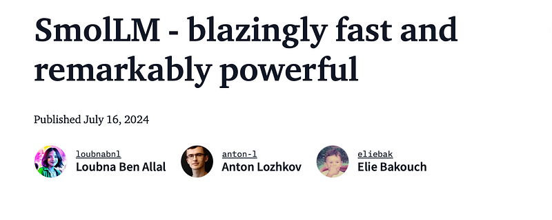 | Blog header: **SmolLM** — blazingly fast and remarkably powerful (July 2024). |
| 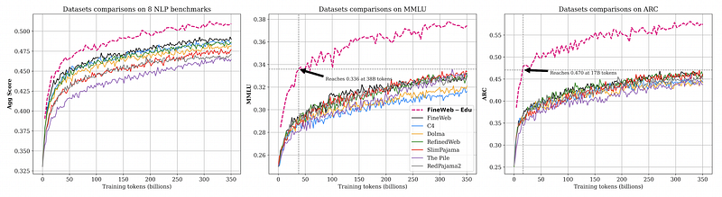 | **FineWeb-Edu** vs other web corpora: aggregate **8-task** score, **MMLU** data efficiency, **ARC** data efficiency (three curves each). |
| 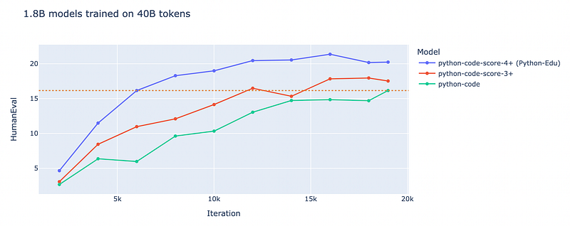 | **Python-Edu** filtering: 1.8B models on **HumanEval** vs training iteration for score ≥4+ vs 3+ vs unfiltered. |
| 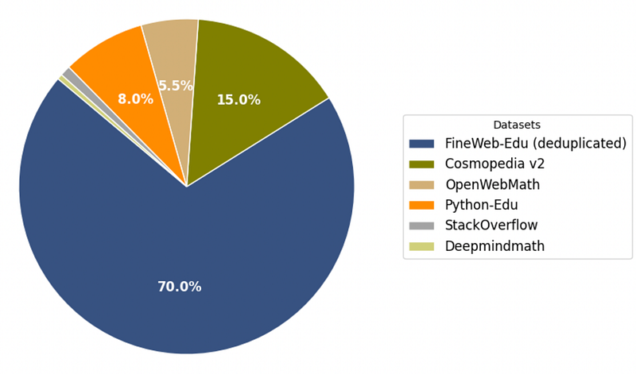 | **SmolLM-Corpus** mixture pie: FineWeb-Edu (70%), Cosmopedia v2, Python-Edu, OpenWebMath, StackOverflow, Deepmindmath. |
| 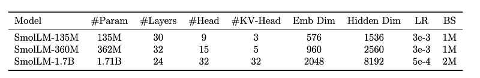 | **Architecture / training** table: SmolLM-135M / 360M / 1.7B (layers, GQA heads, dims, LR, batch). |
| 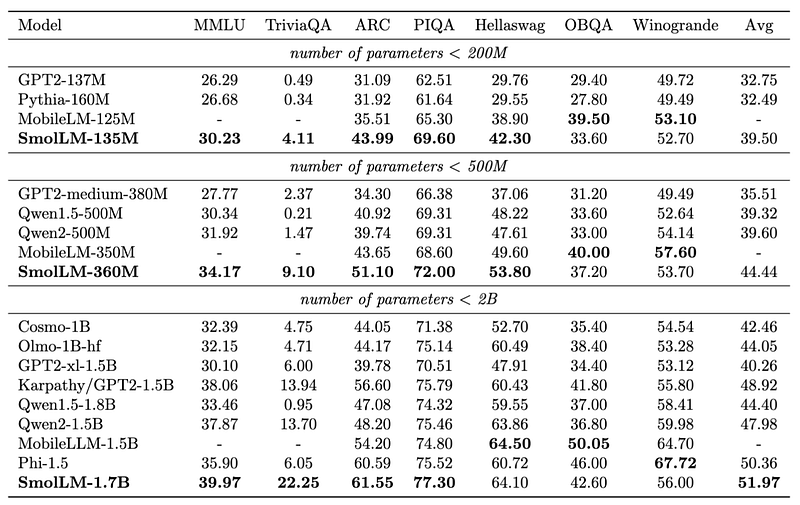 | **Pretrained** SmolLM vs SLM baselines: MMLU, TriviaQA, ARC, PIQA, HellaSwag, OBQA, Winogrande — by **&lt;200M / &lt;500M / &lt;2B** tiers. |
| 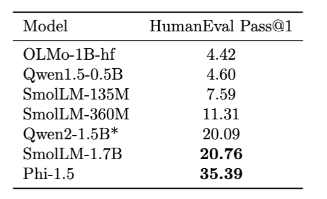 | **HumanEval Pass@1** ladder: SmolLM sizes vs Qwen / Phi-1.5 / OLMo. |
|  | Same **SLM benchmark grid** as adjacent figure: per-task scores emphasizing SmolLM within each parameter bracket. |
| 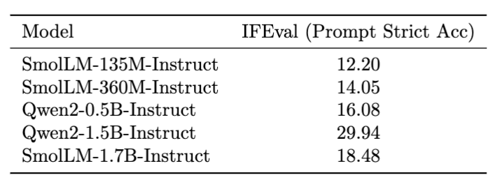 | **IFEval** (prompt strict accuracy): SmolLM-Instruct sizes vs Qwen2-Instruct. |
| 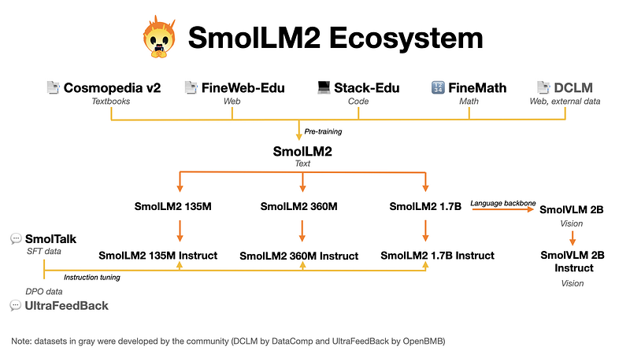 | **SmolLM2 ecosystem**: pretrain mix (Cosmopedia, FineWeb-Edu, Stack-Edu, FineMath, DCLM) → base sizes → **SmolTalk** + UltraFeedback → **SmolVLM** branch. |
| 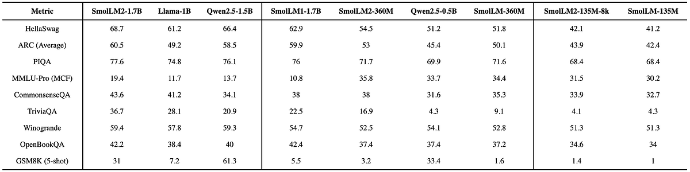 | **SmolLM2 base** vs Llama-1B / Qwen2.5 / prior SmolLM on HellaSwag, ARC, PIQA, MMLU-Pro, CSQA, TriviaQA, Winogrande, OpenBookQA, GSM8K. |
| 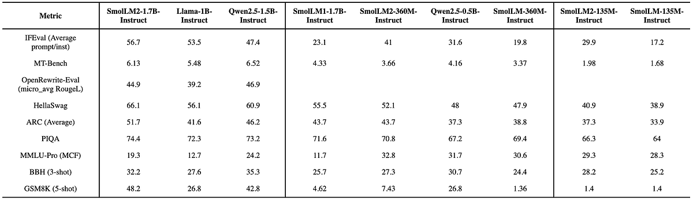 | **SmolLM2-Instruct** vs v1 and Qwen/Llama on IFEval, MT-Bench, OpenRewrite, HellaSwag, ARC, PIQA, MMLU-Pro, BBH, GSM8K. |
| 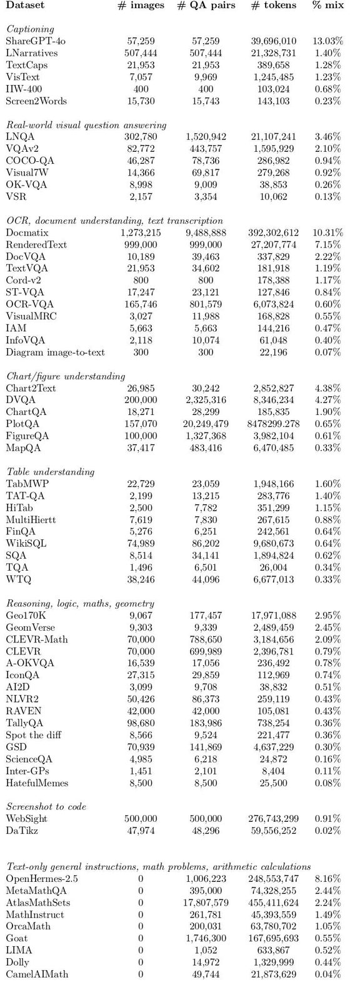 | **SmolVLM training data** table: captioning, VQA, OCR/doc, charts, tables, reasoning, screenshot-to-code, text-only mix (%). |
| 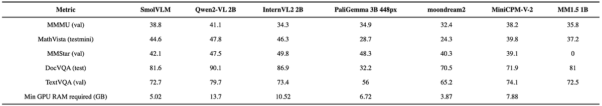 | **SmolVLM** vs Qwen2-VL / InternVL2 / PaliGemma / moondream / MiniCPM / MM1.5: MMMU, MathVista, MMStar, DocVQA, TextVQA + **min GPU RAM**. |
| 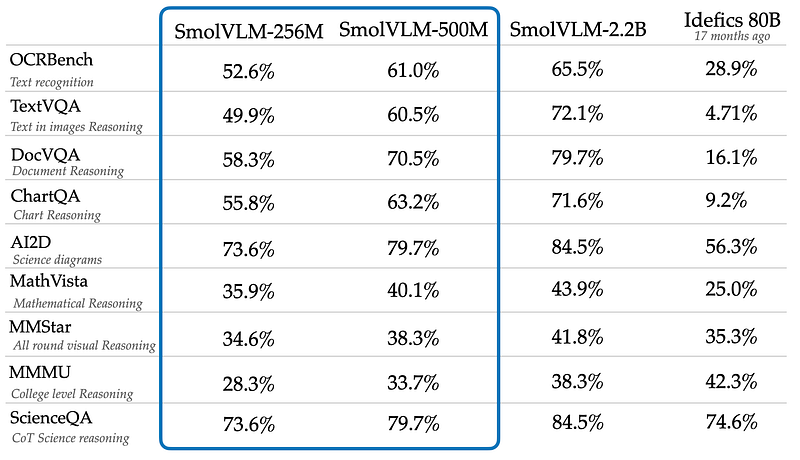 | **SmolVLM-256M/500M/2.2B** vs legacy **Idefics 80B** on OCRBench, TextVQA, DocVQA, ChartQA, AI2D, MathVista, MMStar, MMMU, ScienceQA. |
| 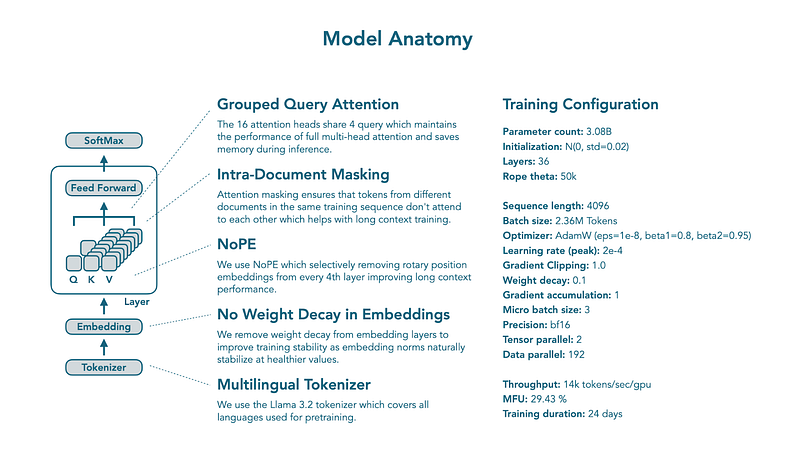 | **SmolLM3 anatomy**: GQA, intra-document mask, **NoPE**, no weight decay on embeddings, Llama 3.2 tokenizer + **3B-scale** train hyperparams. |
| 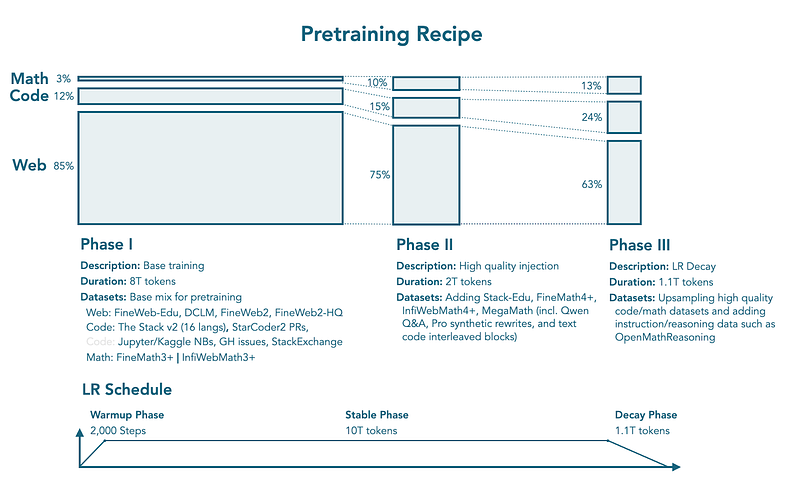 | **11T pretraining recipe**: three phases (web/code/math bars) with dataset names + **LR** warmup / stable / decay sketch. |
| 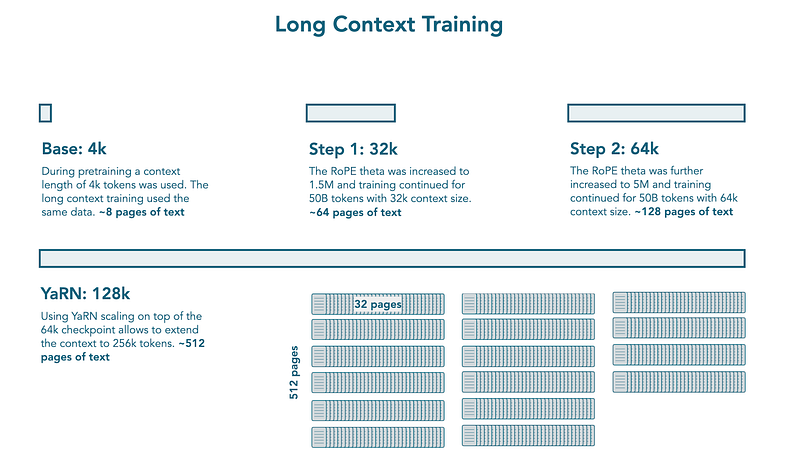 | **Long context** extension: 4k base → 32k / 64k RoPE scaling (+50B tokens each) → **YaRN** for long inference context. |
| 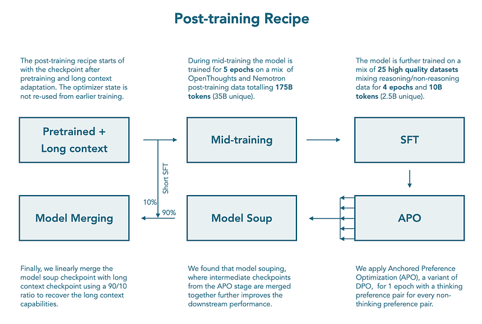 | **Post-training flow**: pretrained+long context → mid-training (OpenThoughts/Nemotron) → SFT → **APO** → model soup → **90/10 merge** with base for long context recovery. |
| 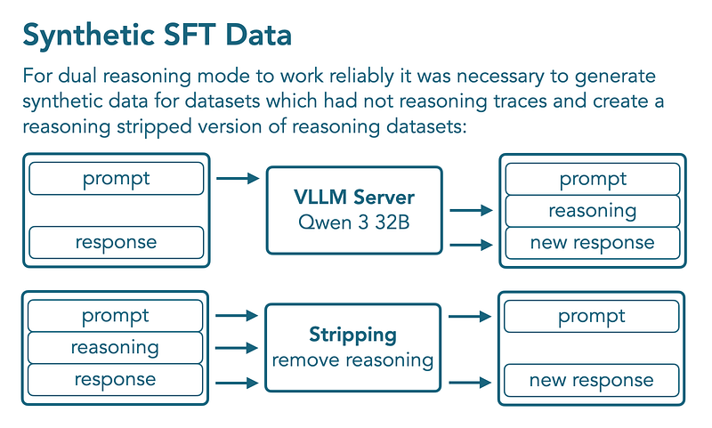 | **Synthetic SFT** for dual mode: Qwen3-32B adds **reasoning traces**; parallel **strip** reasoning for non-thinking variant. |
| 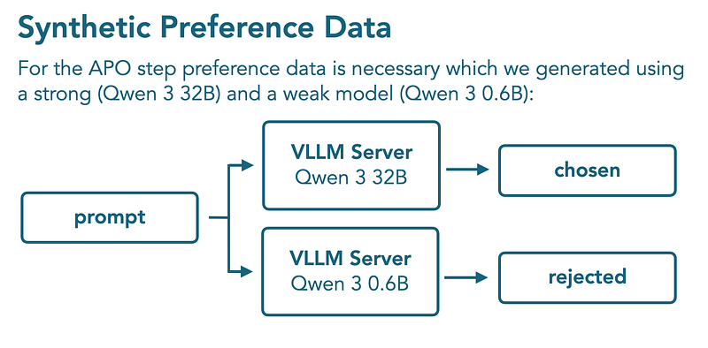 | **Synthetic preferences** for APO: same prompt through Qwen3 **32B** (chosen) vs **0.6B** (rejected). |
|  | **DPO implicit reward**: \(r_\theta(x,y)=\beta \log \frac{\pi_\theta(y|x)}{\pi_{\text{ref}}(y|x)}\). |
| 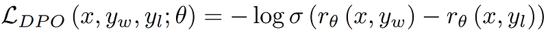 | **DPO loss** \(\mathcal{L}_{\text{DPO}} = -\log \sigma(r_\theta(x,y_w)-r_\theta(x,y_l))\). |
| 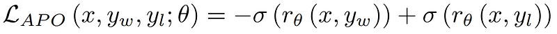 | **APO** (Anchored Preference Optimization) loss \(\mathcal{L}_{\text{APO}}\) in terms of sigmoid rewards on chosen vs rejected. |
| 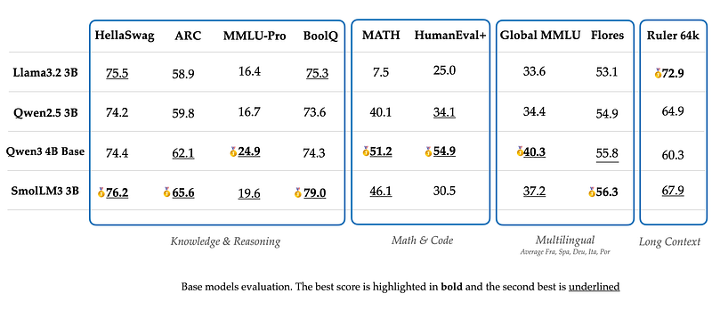 | **Base model** comparison: **SmolLM2 1.7B** vs Llama3.2 3B, Qwen2.5 3B, Granite 3 8B — knowledge/reasoning, math/code, multilingual, **RULER 64k**. |
| 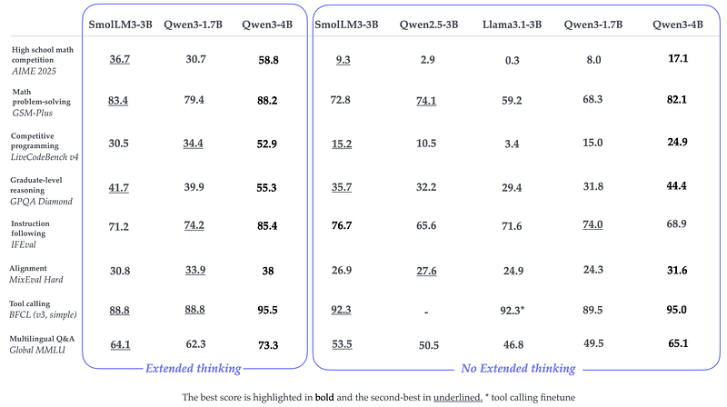 | **SmolLM3-3B** vs Qwen3 / Qwen2.5 / Llama3.1 on AIME, GSM-Plus, LiveCodeBench, GPQA, IFEval, MixEval, BFCL, Global MMLU (**thinking** vs **no thinking**). |
## HF Blog Cross-References

These five Hugging Face blog posts are the primary sources this page already synthesizes above (SmolLM/v2, SmolVLM/Jan-2025 update, SmolVLM2, and SmolLM3 sections). No separate summary pages were created for them:

- [SmolLM — blazingly fast and remarkably powerful](https://huggingface.co/blog/smollm) — the original SmolLM v1 release (135M/360M/1.7B) and the SmolLM-Corpus.
- [SmolVLM - small yet mighty Vision Language Model](https://huggingface.co/blog/smolvlm) — the initial 2B SmolVLM release, covered under "## SmolVLM" above.
- [SmolVLM Grows Smaller — Introducing the 250M & 500M Models!](https://huggingface.co/blog/smolervlm/) — the January 2025 250M/500M shrink, covered under "### Jan 2025" above.
- [SmolVLM2: Bringing Video Understanding to Every Device](https://huggingface.co/blog/smolvlm2) (2025-02-20) — the video-understanding follow-up, covered under "## Smol VLM2" above; adds MLX (Python and Swift) support details not repeated here.
- [SmolLM3: smol, multilingual, long-context reasoner](https://huggingface.co/blog/smollm3) (2025-07-08) — the 3B dual-mode reasoning release, covered under "## SmolLM3" above.

## Related

- [[Papers Explained Corpus]]
- [[Synthetic Data]]
- [[Model Compression and Efficiency]]
- [[Large Language Models]]
- [[Mixture of Experts]]
- [[Papers Explained 175 - Cosmopedia]]
- [[Papers Explained 177 - WebSight]]

#summary #topic
