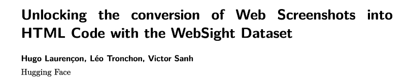
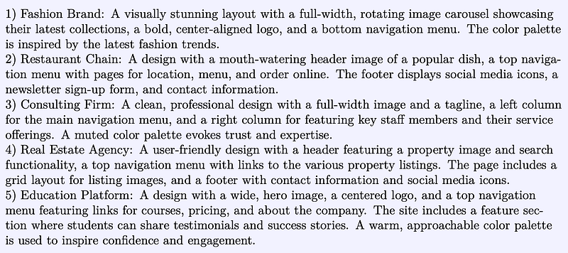
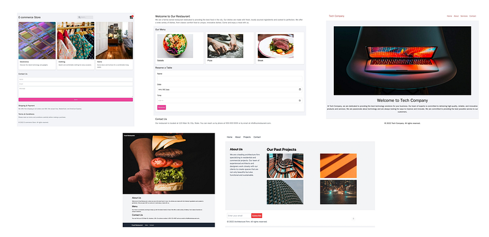

# Papers Explained 177 - WebSight

Despite VLMs have made significant progress in various tasks, converting website screenshots into functional HTML code has been minimally explored due to the lack of a suitable dataset.

This page ingests the source article into the wiki and connects it to [[Papers Explained Corpus]], [[Large Language Models]], [[Code Models]], [[Synthetic Data]], [[Document AI]].

## Source Metadata

- Source file: `raw/2024-08-06_Papers-Explained-177--WebSight-2905d0e14233.html`
- Source title: Papers Explained 177: WebSight
- Published: 2024-08-06
- Canonical: [https://medium.com/@ritvik19/papers-explained-177-websight-2905d0e14233](https://medium.com/@ritvik19/papers-explained-177-websight-2905d0e14233)

## Key Ideas

- To create such a dataset, two approaches are considered: leveraging existing web pages and their HTML codes or synthesizing HTML codes using Large Language Models (LLMs).
- The dataset is available at [HuggingFace](https://huggingface.co/datasets/HuggingFaceM4/WebSight).
- The synthetic HTML code generation process involves two key steps for maximizing diversity and quality. First, a smaller language model is used to generate a variety of website themes and designs.
- Generating diverse website concepts: Mistral-7B-Instruct is used to generate several million unique website concepts and designs with the prompt
- Generate diverse website layout ideas for different companies, each with a unique design element. Examples include: a car company site with a left column, a webpage footer with a centered logo. Explore variations in colors, positions, and company fields.

## Notes

Despite VLMs have made significant progress in various tasks, converting website screenshots into functional HTML code has been minimally explored due to the lack of a suitable dataset. The primary obstacle is not the difficulty of the task itself but rather the absence of a large, high-quality dataset of pairs of HTML codes and their associated screenshots.

To create such a dataset, two approaches are considered: leveraging existing web pages and their HTML codes or synthesizing HTML codes using Large Language Models (LLMs). Due to the complexity and noise present in existing web pages, an LLM specialized in coding is used to generate high-quality HTML code that can be fine-tuned to follow specific instructions.

The dataset is available at [HuggingFace](https://huggingface.co/datasets/HuggingFaceM4/WebSight).

The synthetic HTML code generation process involves two key steps for maximizing diversity and quality. First, a smaller language model is used to generate a variety of website themes and designs. These creative outputs serve as the foundation for the next stage, where they are fed into the prompts of a larger language model, mostly trained on code data. This LLM then generates the final HTML code, ensuring that the dataset encompasses a wide range of styles while generating high-quality codes.

Generating diverse website concepts: Mistral-7B-Instruct is used to generate several million unique website concepts and designs with the prompt

> Generate diverse website layout ideas for different companies, each with a unique design element. Examples include: a car company site with a left column, a webpage footer with a centered logo. Explore variations in colors, positions, and company fields. Don’t give any explanations or recognition that you have understood the request, just give the list of 10 ideas, with a line break between each.

*Figure: Some examples of generated concepts.*

Opting for Tailwind CSS over traditional CSS: Generating visually diverse and appealing designs requires more than just pure HTML. However, to simplify the learning process of VLMs, employing standalone code is preferable to managing separate files. In this context, Tailwind CSS emerges as an ideal solution. This utility-first framework allows creating unique designs by providing a wide array of utility classes, enables direct styling within the HTML document, and eliminates the need for external style files. Tailwind CSS offers an extensive array of predefined classes that mirror various CSS properties. By integrating these utility classes into HTML elements, one can efficiently style web pages, resulting in concise code that is easier for VLMs to learn from.

Using a code specialized LLM to generate the HTML codes: To generate the final HTML codes, Deepseek-Coder-33b-instruct is used. It is a state-of-the-art language model mostly trained on code data and fine-tuned to follow instruction. The following prompt is used

> Code a complete website with a good design in HTML and Tailwind CSS about this: {concept} Write the code inside a tag . Write real and long sentences about the business. NEVER USE sentences starting with Lorem ipsum, NEVER. You don’t have to include images, but if you do, use only this source “https://source.unsplash.com/random/WxH/?keyword", by replacing ‘W‘ and ‘H‘ in the URL by the desired width and height, and ‘?keyword‘ by a keyword describing the picture, for example “https://source.unsplash.com/random/300x200/?gym" for an image about gym of size 300x200, or “https://source.unsplash.com/random/100x200/?cake" for an image of a cake of size 100x200.

An initial challenge was the text-only nature of our outputs, contrasting with the real websites containing many images. The task of integrating images into an HTML code seems hard, especially when trying to look for images related to the context of the web page. An effective solution is using photo stocks like https://source.unsplash.com/, which offers the capability to dynamically generate images based on keywords, thus providing images of any size and relevant to any specified topics. After a filtering step which involves discarding web pages with insufficient text, generic content or images not aligning with the website’s topic, the process ends up with 2M web pages.

Screenshot capture process: Playwright is used to visualize and capture the output of the generated HTML codes. It is ensured that screenshots encompass the entire web page, regardless of its length. As a result, the dataset features screenshots in a wide range of resolutions. This diversity in image size and format is useful for enhancing the robustness of our model.

*Figure: Examples of synthetic web pages present in WebSight.*

## Paper

Unlocking the conversion of Web Screenshots into HTML Code with the WebSight Dataset [2403.09029](https://arxiv.org/abs/2403.09029)

Recommended Reading [Datasets](https://ritvik19.medium.com/list/datasets-b465a5d8a2d6)

## Figures

Figures from the Medium HTML export (`raw/2024-08-06_Papers-Explained-177--WebSight-2905d0e14233.html`); local copies under `wiki/assets/papers-explained-177-websight/` when download succeeded.

| Figure | Caption |
|--------|---------|
|  | Paper title: **WebSight** — converting web screenshots into HTML (Hugging Face authors). |
|  | **Mistral-generated** numbered **website layout concepts** (fashion, restaurant, consulting, real estate, education, …). |
|  | **Synthetic pages** in the dataset: e-commerce, restaurants, tech landing, food hero, architecture firm (screenshot collage). |
## Related

- [[Papers Explained Corpus]]
- [[Large Language Models]]
- [[Code Models]]
- [[Synthetic Data]]
- [[Document AI]]
- [[Papers Explained 176 - Smol LM]]
- [[Papers Explained 178 - Docmatix]]

#summary #topic
