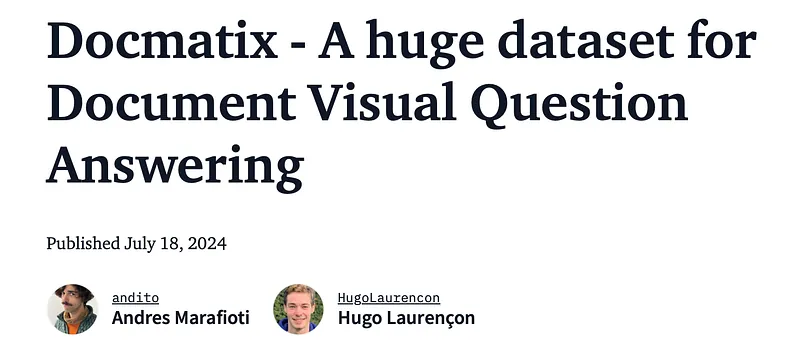
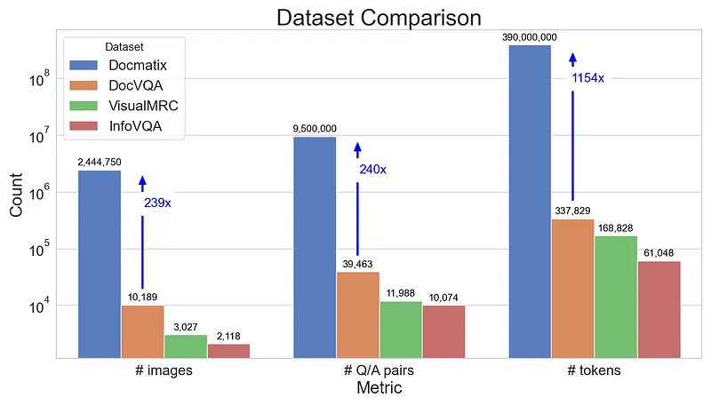
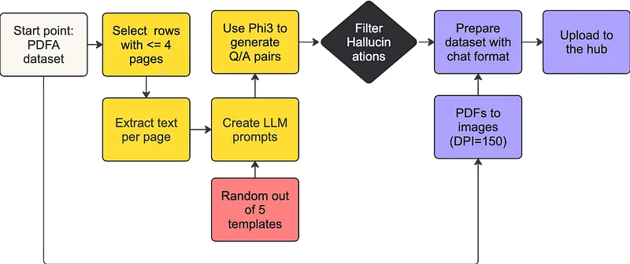
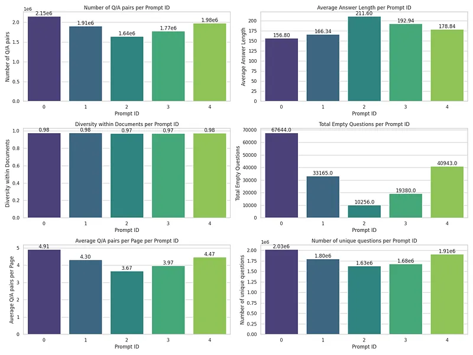
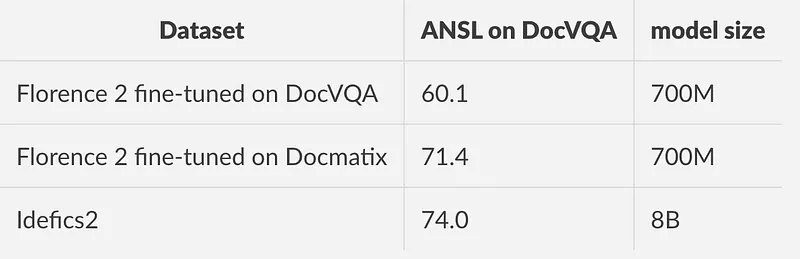

# Papers Explained 178 - Docmatix

Docmatix is a large-scale dataset for Document Visual Question Answering (DocVQA) that is hundreds of times larger than previously available datasets. The dataset contains 2.4 million images and 9.5 million question-answer pairs derived from 1.3 million PDF documents, which is a 240X increase in scale compared to previous datasets.

This page ingests the source article into the wiki and connects it to [[Papers Explained Corpus]], [[Document AI]], [[Synthetic Data]], [[Large Language Models]], [[Evaluation and Benchmarks]].

## Source Metadata

- Source file: `raw/2024-08-07_Papers-Explained-178--Docmatix-9f2731ff1654.md`
- Source title: Papers Explained 178: Docmatix
- Published: 2024-08-07
- Canonical: [https://medium.com/@ritvik19/papers-explained-178-docmatix-9f2731ff1654](https://medium.com/@ritvik19/papers-explained-178-docmatix-9f2731ff1654)

## Key Ideas

- Docmatix is a large-scale dataset for Document Visual Question Answering (DocVQA) that is hundreds of times larger than previously available datasets.
- The dataset is available at [HuggingFace](https://huggingface.co/datasets/HuggingFaceM4/Docmatix).
- The dataset was generated by taking transcriptions from the PDFA OCR, an extensive OCR dataset containing 2.1M PDFs. The Phi-3-small model is used to generate Q/A pairs based on the transcripts.
- Ablation studies were performed to optimize the prompts, aiming to generate around four pairs of Q/A per page, with answers that are human-like and questions that prioritize diversity and minimal repetition.
- To evaluate Docmatix’s performance, ablation studies were conducted using the Florence-2 model.

## Notes

Docmatix is a large-scale dataset for Document Visual Question Answering (DocVQA) that is hundreds of times larger than previously available datasets. The dataset contains 2.4 million images and 9.5 million question-answer pairs derived from 1.3 million PDF documents, which is a 240X increase in scale compared to previous datasets.

The dataset is available at [HuggingFace](https://huggingface.co/datasets/HuggingFaceM4/Docmatix).

*Figure: Comparing Docmatix to other DocVQA datasets.*

The dataset was generated by taking transcriptions from the PDFA OCR, an extensive OCR dataset containing 2.1M PDFs. The Phi-3-small model is used to generate Q/A pairs based on the transcripts. The generations were filtered to remove 15% of the Q/A pairs identified as hallucinations, ensuring the dataset’s quality. The dataset contains a row for each PDF document, which was converted to an image at a resolution of 150 dpi.

*Figure: Processing pipeline to generate Docmatix.*

Ablation studies were performed to optimize the prompts, aiming to generate around four pairs of Q/A per page, with answers that are human-like and questions that prioritize diversity and minimal repetition. When the Phi-3 model was guided to ask questions based on the specific information in the document, the questions showed very few repetitions. The following plot presents some key statistics from the analysis:

*Figure: Analysis of Docmatix per prompt.*

To evaluate Docmatix’s performance, ablation studies were conducted using the Florence-2 model. Two versions of the model were trained: one on the DocVQA dataset and another on a small portion of Docmatix (20% of images and 4% of Q/A pairs) followed by training on DocVQA to ensure correct format for evaluation.

The results show a relative improvement of almost 20% when training on this small portion of Docmatix.

Additionally, the 0.7B Florence-2 model performed only 5% worse than the 8B Idefics2 model trained on a mixture of datasets and is significantly larger.

## Paper

[Docmatix — A huge dataset for Document Visual Question Answering](https://huggingface.co/blog/docmatix)

Recommended Reading [Datasets](https://ritvik19.medium.com/list/datasets-b465a5d8a2d6) [Document Information Processing](https://ritvik19.medium.com/list/document-information-processing-3cd900a34972)

## Figures

Figures from the Medium HTML export (`raw/2024-08-07_Papers-Explained-178--Docmatix-9f2731ff1654.md`); local copies under `wiki/assets/papers-explained-178-docmatix/` when download succeeded.

| Figure | Caption |
|--------|---------|
|  | Blog header: **Docmatix** — large-scale **DocVQA** dataset (July 2024). |
|  | **Scale vs DocVQA / VisualMRC / InfoVQA**: images, Q/A pairs, tokens (log-scale; 240× style multiples). |
|  | **Pipeline**: PDFA → short PDFs → page text → templated **Phi-3** Q/A → hallucination filter → 150 dpi page images + chat rows → Hub. |
|  | **Prompt ablation** dashboards: volume, answer length, diversity, empty questions, Q/A per page, unique questions (five prompt IDs). |
|  | **DocVQA ANSL**: Florence-2 **700M** on DocVQA vs **Docmatix** pretrain vs **Idefics2 8B**. |
## HF Blog Cross-References

- [Docmatix — A huge dataset for Document Visual Question Answering](https://huggingface.co/blog/docmatix) — this is the primary source already cited above (see the "Paper" section); no separate content to add.

## Related

- [[Papers Explained Corpus]]
- [[Document AI]]
- [[Synthetic Data]]
- [[Large Language Models]]
- [[Evaluation and Benchmarks]]
- [[Papers Explained 177 - WebSight]]
- [[Papers Explained 179 - Obelics, Idefics]]

#summary #topic
