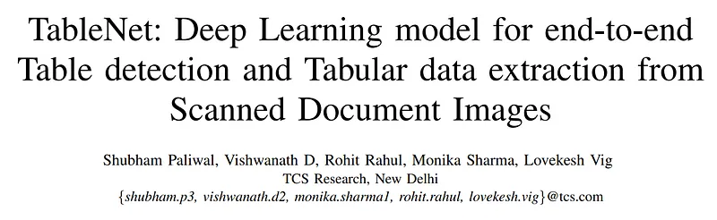
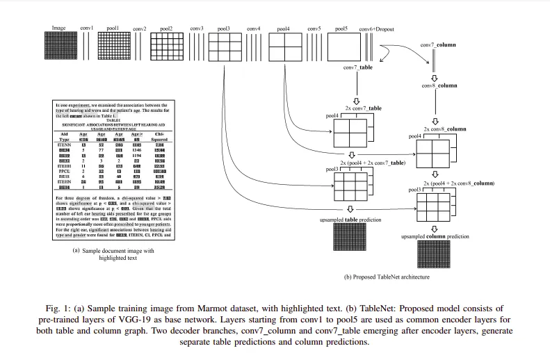

# Papers Explained 18 - TableNet

If convolutional filters utilized to detect tables, can be reinforced by column detecting filters, this should significantly improve the performance of the model. TableNet model, exploits this intuition and is based on the encoderdecoder model for semantic segmentation.

This page ingests the source article into the wiki and connects it to [[Papers Explained Corpus]], [[Document AI]].

## Source Metadata

- Source file: `raw/2023-02-07_Papers-Explained-18--TableNet-3d4c62269bb3.md`
- Source title: Papers Explained 18: TableNet
- Published: 2023-02-07
- Canonical: [https://medium.com/@ritvik19/papers-explained-18-tablenet-3d4c62269bb3](https://medium.com/@ritvik19/papers-explained-18-tablenet-3d4c62269bb3)

## Key Ideas

- If convolutional filters utilized to detect tables, can be reinforced by column detecting filters, this should significantly improve the performance of the model.
- The encoder of the model is common across both tasks, but the decoder emerges as two different branches for tables and columns. Concretely, we enforced the encoding layers to use the ground truth of both tables and columns of document for training.
- The input image for the model, is first transformed into an RGB image and then, resized to 1024 * 1024 resolution.
- Since a single model produces both the output masks for the table and column regions, these two independent outputs have binary target pixel values, depending on whether the pixel region belongs to the table/column region or background respectively.
- TableNet model uses the same intuition for the encoder/decoder network as the FCN architecture. It uses a pre-trained VGG-19 layer as the base network. The fully connected layers (layers after pool5) of VGG-19 are replaced with two (1x1) convolution layers.

## Notes

If convolutional filters utilized to detect tables, can be reinforced by column detecting filters, this should significantly improve the performance of the model. TableNet model, exploits this intuition and is based on the encoderdecoder model for semantic segmentation.

The encoder of the model is common across both tasks, but the decoder emerges as two different branches for tables and columns. Concretely, we enforced the encoding layers to use the ground truth of both tables and columns of document for training. However, the decoding layers are separated for table and column branches.

## Architecture

The input image for the model, is first transformed into an RGB image and then, resized to 1024 * 1024 resolution.

Since a single model produces both the output masks for the table and column regions, these two independent outputs have binary target pixel values, depending on whether the pixel region belongs to the table/column region or background respectively.

TableNet model uses the same intuition for the encoder/decoder network as the FCN architecture. It uses a pre-trained VGG-19 layer as the base network. The fully connected layers (layers after pool5) of VGG-19 are replaced with two (1x1) convolution layers.

Each of these convolution layers (conv6) uses the ReLU activation followed by a dropout layer having probability of 0.8. Following this layer, two different branches of the decoder network are appended.

The output of the (conv6 + dropout) layer is distributed to both decoder branches. In each branch, additional layers are appended to filter out the respective active regions.

In the table branch of the decoder network, an additional (1x1) convolution layer, conv7 table is used, before using a series of fractionally strided convolution layers for upscaling the image. The output of the conv7 table layer is also up-scaled using fractionally strided convolutions, and is appended with the pool4 pooling layer of the same dimension.

Similarly, the combined feature map is again up-scaled and the pool3 pooling is appended to it. Finally, the final feature map is upscaled to meet the original image dimension.

In the other branch for detecting columns, there is an additional convolution layer (conv7 column) with a ReLU activation function and a dropout layer with the same dropout probability. The feature maps are up-sampled using fractionally strided convolutions after a (1x1) convolution (conv8 column) layer.

The up-sampled feature maps are combined with the pool4 pooling layer and the combined feature map is up-sampled and combined with the pool3 pooling layer of the same dimension. After this layer, the feature map is up-scaled to the original image.

In both branches, multiple (1x1) convolution layers are used before the transposed layers. The intuition behind using (1x1) convolution is to reduce the dimensions of feature maps (channels) which is used in class prediction of pixels, since the output layers (output of encoder network) must have channels equal to the number of classes (channel with max probability is assigned to corresponding pixels) which is later up-sampled.

Therefore, the outputs of the two branches of computational graphs yield the mask for the table and column regions.

## Table Row Extraction

After processing the documents using TableNet, masks for table and column regions are generated. These masks are used to filter out the table and its column regions from the image.

Since, all word positions of the document can be known (using Tesseract OCR), only the word patches lying inside table and column regions are filtered out. Now, using these filtered words, a row can be defined as the collection of words from multiple columns, which are at the similar horizontal level.

However, a row is not necessarily confined to a single line, and depending upon the content of a column or line demarcations, a row can span multiple lines. Therefore, to cover the different possibilities, tha authors have formulated three rules for row segmentation:

- In most tables for which line demarcations are present, the lines segment the rows in each column. To detect the possible line demarcation (for rows), every space between two vertically placed words in a column is tested for the presence of lines via a Radon transform. The presence of horizontal line demarcation clearly segments out the row.

- In case a row spans multiple lines, the rows of the table which have maximum non-blank entries is marked as the starting point for a new row. For example in a multicolumn table, some of the columns can have entries spanning just one line (like quantity, etc), while others can have multi-line entries (like description, etc). Thus, each new row begins when all the entities in each column are filled.

- In tables, where all the columns are completely filled and there are no line demarcations, each line (level) can be seen as a unique row.

## Training

For training TableNet model, the Marmot table recognition dataset is used. This is the largest publicly available dataset for table detection.

## Paper

TableNet: Deep Learning model for end-to-end Table detection and Tabular data extraction from Scanned Document Images: [2001.01469](https://arxiv.org/abs/2001.01469)

## Implementation

[TableNet](https://www.kaggle.com/code/ritvik1909/tablenet)

## Figures

Figures from the Medium HTML export (`raw/2023-02-07_Papers-Explained-18--TableNet-3d4c62269bb3.md`); local copies under `wiki/assets/papers-explained-18-tablenet/` when download succeeded.

| Figure | Caption |
|--------|---------|
|  | Title card: TableNet. |
|  | The encoder of the model is common across both tasks, but the decoder emerges as two different branches for tables and columns. |
## Related

- [[Papers Explained Corpus]]
- [[Document AI]]
- [[Papers Explained 17 - Mask RCNN]]
- [[Papers Explained 19 - Dit]]

#summary #topic
