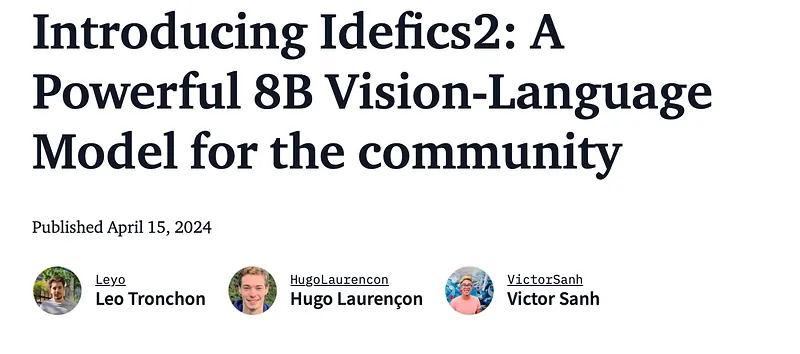
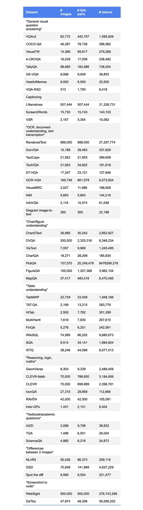
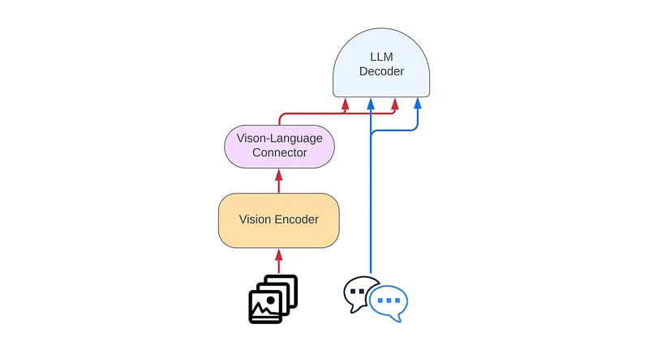
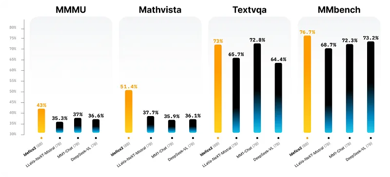

# Papers Explained 180 - Idefics 2

Idefics2 is a family of general multimodal model that takes in arbitrary sequences of text and images and generates text responses.

This page ingests the source article into the wiki and connects it to [[Papers Explained Corpus]], [[Vision Language Models]], [[Synthetic Data]].

## Source Metadata

- Source file: `raw/2024-08-08_Papers-Explained-180--Idefics-2-0adf35cef4ee.md`
- Source title: Papers Explained 180: Idefics 2
- Published: 2024-08-08
- Canonical: [https://medium.com/@ritvik19/papers-explained-180-idefics-2-0adf35cef4ee](https://medium.com/@ritvik19/papers-explained-180-idefics-2-0adf35cef4ee)

## Key Ideas

- Recommended Reading [Papers Explained 179: Obelics, Idefics]
- The are three models in the Idefics model family:
- idefics2–8b: the base model fine-tuned on a mixture of supervised and instruction datasets (text-only and multimodal datasets)
- idefics2–8b-chatty: idefics2–8b further fine-tuned on long conversations
- The models can be used for inference on multimodal tasks, such as image captioning and visual question answering, with the input being a text query along with one or multiple images. However, they do not support image generation.

## Notes

Idefics2 is a family of general multimodal model that takes in arbitrary sequences of text and images and generates text responses. It can perform various tasks such as answering questions about images, describing visual content, creating stories grounded in multiple images, extracting information from documents, and performing basic arithmetic operations.

Recommended Reading [Papers Explained 179: Obelics, Idefics]

The are three models in the Idefics model family:

- idefics2–8b-base: the base model

- idefics2–8b: the base model fine-tuned on a mixture of supervised and instruction datasets (text-only and multimodal datasets)

- idefics2–8b-chatty: idefics2–8b further fine-tuned on long conversations

The models can be used for inference on multimodal tasks, such as image captioning and visual question answering, with the input being a text query along with one or multiple images. However, they do not support image generation.

The models and dataset are available at [HuggingFace](https://huggingface.co/collections/HuggingFaceM4/idefics2-661d1971b7c50831dd3ce0fe).

For optimal results, it is recommended to fine-tune Idefics2–8b on specific use-cases and data.

The instruction-fine-tuned model (idefics2–8b) is better at following user instructions and should be preferred for out-of-the-box use or as a starting point for fine-tuning.

idefics2–8b usually generates very short answers, while idefics2–8b-chatty is better suited for long generations.

Idefics2 is trained in two stages for maximum efficiency:

- Images are processed at SigLIP’s native resolution (384x384 squares).

- Images are processed at their native resolution (up to 980x980) and aspect ratio, with high-resolution images necessary for OCR data.

## Training Data

Idefics2 is trained on a mixture of openly available datasets for the pretraining:

- Interleaved web documents (Wikipedia, OBELICS)

- Image-caption pairs (Public Multimodal Dataset, LAION-COCO)

- OCR data (PDFA (en), IDL and Rendered-text)

- Image-to-code data (WebSight)

Following common practices in the foundation model community, we further train the base model on task-oriented data. For this a multimodal instruction fine-tuning dataset is curated: The Cauldron, an open compilation of 50 manually-curated datasets formatted for multi-turn conversations.

Idefics2 is instruction fine tuned on the concatenation of The Cauldron and 9 text-only instruction fine-tuning datasets:

- OpenHermes-2.5

- lima

- databricks-dolly-15k

- MetaMathQA

- MathInstruct

- orca-math-word-problems-200k

- math

- atlas-math-sets

- goat

Lora is used to train the parameters initialized from pre-trained backbones and full fine-tuning for newly initialized parameters (modality connector), as this strategy is found to be more stable as well as more computationally efficient.

## Improvements over Idefics 1

- NaViT strategy is used to manipulate images in their native resolutions (up to 980 x 980) and native aspect ratios, avoiding the need to resize images to fixed-size squares which has been historically done in the computer vision community.

- Idefics2 has improved OCR abilities by utilizing the training data that requires transcribing text in an image or document. The model can also answer questions on charts, figures.

- Idefics2 departs from the gated cross-attentions architecture of Idefics1 and simplifies the integration of visual features into the language backbone.

- Images are fed to a vision encoder followed by learned Perceiver pooling and MLP modality projection. The pooled sequence is then concatenated with text embeddings.

## Benchmark Results

## Paper

[Introducing Idefics2: A Powerful 8B Vision-Language Model for the community](https://huggingface.co/blog/idefics2)

Recommended Reading [Multi Modal Transformers](https://ritvik19.medium.com/list/multi-modal-transformers-67453f215ecf)

## Figures

Figures from the Medium HTML export (`raw/2024-08-08_Papers-Explained-180--Idefics-2-0adf35cef4ee.md`); local copies under `wiki/assets/papers-explained-180-idefics-2/` when download succeeded.

| Figure | Caption |
|--------|---------|
|  | Blog header: **Introducing Idefics2** — 8B vision–language model for the community (April 2024). |
|  | **Instruction-tuning data** inventory (**The Cauldron**): datasets by task (VQA, captioning, OCR/doc, charts, tables, reasoning, WebSight, …) with image/QA/token counts. |
|  | **Architecture**: images → **vision encoder** → **connector** (Perceiver/MLP) → concatenated with text in **LLM decoder**. |
|  | **Benchmark bars**: **Idefics2 (8B)** vs LLaVA-NeXT-Mistral 7B, MM1-Chat 7B, DeepSeek-VL 7B on **MMMU**, **MathVista**, **TextVQA**, **MMBench**. |
## HF Blog Cross-References

- [Introducing Idefics2: A Powerful 8B Vision-Language Model for the community](https://huggingface.co/blog/idefics2) — this is the primary source already cited above (see the "Paper" section); no separate content to add.

## Related

- [[Papers Explained Corpus]]
- [[Vision Language Models]]
- [[Synthetic Data]]
- [[Papers Explained 179 - Obelics, Idefics]]
- [[Papers Explained 181 - Claude]]

#summary #topic
