# Papers Explained 181 - Claude

The Claude 3 model family, announced by Anthropic, introduces three advanced models: Claude 3 Haiku, Claude 3 Sonnet, and Claude 3 Opus. Each successive model offers increasingly powerful performance, allowing users to select the optimal balance of intelligence, speed, and cost for their specific application.

This page ingests the source article into the wiki and connects it to [[Papers Explained Corpus]], [[Large Language Models]], [[Reasoning Models]], [[Code Models]].

## Source Metadata

- Source file: `raw/2024-08-08_Papers-Explained-181--Claude-89dd45e35d92.html`
- Source title: Papers Explained 181: Claude
- Published: 2024-08-08
- Canonical: [https://medium.com/@ritvik19/papers-explained-181-claude-89dd45e35d92](https://medium.com/@ritvik19/papers-explained-181-claude-89dd45e35d92)

## Key Ideas

- The Claude 3 model family, announced by Anthropic, introduces three advanced models: Claude 3 Haiku, Claude 3 Sonnet, and Claude 3 Opus.
- Opus: The most intelligent, excelling in tasks requiring expert knowledge and reasoning, basic mathematics, and complex comprehension.
- Sonnet: Offers a balance between intelligence and speed, suitable for rapid response tasks.
- Haiku: The fastest and most cost-effective, capable of quickly processing dense information.
- 1. All Claude 3 models show increased capabilities in analysis and forecasting, nuanced content creation, code generation, and conversing in non-English languages like Spanish, Japanese, and French.

## Notes

The Claude 3 model family, announced by Anthropic, introduces three advanced models: Claude 3 Haiku, Claude 3 Sonnet, and Claude 3 Opus. Each successive model offers increasingly powerful performance, allowing users to select the optimal balance of intelligence, speed, and cost for their specific application.

- Opus: The most intelligent, excelling in tasks requiring expert knowledge and reasoning, basic mathematics, and complex comprehension.

- Sonnet: Offers a balance between intelligence and speed, suitable for rapid response tasks.

- Haiku: The fastest and most cost-effective, capable of quickly processing dense information.

1. All Claude 3 models show increased capabilities in analysis and forecasting, nuanced content creation, code generation, and conversing in non-English languages like Spanish, Japanese, and French.

2. The Claude 3 models have sophisticated vision capabilities on par with other leading models.

3. Claude 3 models show fewer unnecessary refusals, understanding context better and avoiding refusals of harmless prompts.

4. Opus demonstrates a twofold improvement in accuracy over Claude 2.1 on challenging questions and reduced incorrect answers. Future updates will enable citations for verifying answers.

5. The models initially support a 200K context window, with the capability to process over 1 million tokens for select customers. They exhibit near-perfect recall, with Opus surpassing 99% accuracy on the ‘Needle In A Haystack’ benchmark.

## Claude 3.5 Sonnet

Claude 3.5 Sonnet, the first release in the Claude 3.5 model family, raises the industry standard for intelligence by outperforming competitor models and the previous Claude 3 Opus across various evaluations. It offers the speed and cost efficiency of the mid-tier Claude 3 Sonnet, making it an exceptional choice for complex tasks such as context-sensitive customer support and multi-step workflows.

- Sets new benchmarks in graduate-level reasoning (GPQA), undergraduate-level knowledge (MMLU), and coding proficiency (HumanEval).

- Excels in understanding nuance, humor, and complex instructions, and produces high-quality content with a natural, relatable tone.

- Solved 64% of problems in an internal agentic coding evaluation, compared to 38% by Claude 3 Opus.

- Can independently write, edit, and execute code with advanced reasoning and troubleshooting capabilities.

- Handles code translations efficiently, useful for updating legacy applications and migrating codebases.

- Surpasses Claude 3 Opus in standard vision benchmarks, particularly in tasks requiring visual reasoning, such as interpreting charts and graphs.

- Accurately transcribes text from imperfect images, beneficial for retail, logistics, and financial services.

[22 Oct 2024]

This version includes improved coding, reasoning, and tool use capabilities.

### Computer Use

Claude 3.5 can use computers i.e. it can when run through the appropriate software setup, follow a user’s commands to move a cursor around their computer’s screen, click on relevant locations, and input information via a virtual keyboard, emulating the way people interact with their own computer.
The development of computer use models builds upon tool use and multimodality. This involved training Claude to interpret images of computer screens and reason about how to use software tools to perform tasks. A crucial aspect of the training involved teaching to accurately count pixels for issuing precise mouse commands, as the model needs to determine how many pixels to move horizontally or vertically to click on the correct location.

## Claude 3.5 Haiku

Claude 3.5 Haiku is the next generation of Claude 3 Haiku. For the same cost and similar speed as Claude 3 Haiku, Claude 3.5 Haiku improves across every skill set and surpasses Claude 3 Opus, the largest model in the previous generation, on many intelligence benchmarks.

## Claude 3.7 Sonnet

Claude 3.7 Sonnet is the first hybrid reasoning model. It combines quick responses with extended, step-by-step thinking visible to the user, offering flexibility and control over the thinking process.

- Controllable Thinking Budget: Users can specify a maximum token limit for the model’s thinking process (up to the output limit of 128K tokens), allowing for a trade-off between speed/cost and answer quality.

- Focus on Real-World Tasks: Optimized for practical applications rather than solely focusing on competition benchmarks. This is reflected in its strong performance in coding and front-end web development.

- Improved Coding Capabilities: Demonstrates significant improvements in handling complex codebases, advanced tool use, planning code changes, full-stack updates, and generating production-ready code.

- Claude Code Integration: Introduces Claude Code, a command-line tool for agentic coding, allowing developers to delegate engineering tasks directly from their terminal. This tool is currently in limited research preview.

- GitHub Integration: Allows developers to connect their repositories directly to Claude, enhancing its understanding of their projects and improving its ability to assist with coding tasks.

- Claude 3.7 Sonnet achieves state-of-the-art performance on SWE-bench Verified, which evaluates AI models’ ability to solve real-world software issues.

- Claude 3.7 Sonnet achieves state-of-the-art performance on TAU-bench, a framework that tests AI agents on complex real-world tasks with user and tool interactions.

- Claude 3.7 Sonnet excels across instruction-following, general reasoning, multimodal capabilities, and agentic coding, with extended thinking providing a notable boost in math and science.

- The performance of Claude 3.7 Sonnet versus its predecessor model on the OSWorld evaluation, testing multimodal computer use skills.

- Claude 3.7 Sonnet’s performance on questions from the 2024 American Invitational Mathematics Examination 2024, according to how many thinking tokens it’s allowed per problem.

- Experimental results from using parallel test-time compute scaling to improve Claude 3.7 Sonnet’s performance on the GPQA evaluation.

## Claude 4

Claude Opus 4 and Sonnet 4 are hybrid models offering two modes: near-instant responses and extended thinking for deeper reasoning, setting new standards for coding, advanced reasoning, and AI agents.

### Claude Opus 4

Claude Opus 4 is the world’s best coding model, excelling in sustained performance on complex, long-running tasks and agent workflows. It leads on SWE-bench (72.5%) and Terminal-bench (43.2%), delivering sustained performance on tasks requiring focused effort and thousands of steps. It dramatically outperforms all Sonnet models and significantly expands what AI agents can accomplish.

- Coding Excellence: State-of-the-art for coding and complex codebase understanding.

- Long-Running Tasks: Capable of working continuously for several hours.

- Memory Capabilities: Skilled at creating and maintaining ‘memory files’ to store key information, improving long-term task awareness, coherence, and performance.

- Extended Thinking with Tool Use: Alternates between reasoning and tool use to improve responses.

- Parallel Tool Execution: Can use tools in parallel, follow instructions more precisely, and demonstrate improved memory capabilities.

### Claude Sonnet 4

Claude Sonnet 4 is a significant upgrade to Claude Sonnet 3.7, delivering superior coding and reasoning while responding more precisely to instructions. It balances performance and efficiency for internal and external use cases, with enhanced steerability for greater control over implementations.

- Coding Excellence: State-of-the-art 72.7% on SWE-bench.

- Enhanced Steerability: Greater control over implementations.

- Extended Thinking with Tool Use: Alternates between reasoning and tool use to improve responses.

- Parallel Tool Execution: Can use tools in parallel, follow instructions more precisely, and demonstrate improved memory capabilities.

## Claude Opus 4.1

Claude Opus 4.1 is an upgrade to Claude Opus 4 on agentic tasks, real-world coding, and reasoning.

- Opus 4.1 advances the state-of-the-art coding performance to 74.5% on SWE-bench Verified.

- It also improves Claude’s in-depth research and data analysis skills, especially around detail tracking and agentic search.

- GitHub notes that Claude Opus 4.1 improves across most capabilities relative to Opus 4, with particularly notable performance gains in multi-file code refactoring.

- Rakuten Group finds that Opus 4.1 excels at pinpointing exact corrections within large codebases without making unnecessary adjustments or introducing bugs, with their team preferring this precision for everyday debugging tasks.

- Windsurf reports Opus 4.1 delivers a one standard deviation improvement over Opus 4 on their junior developer benchmark, showing roughly the same performance leap as the jump from Sonnet 3.7 to Sonnet 4.

## Claude 4.5 Sonnet

Claude Sonnet 4.5 is presented as Anthropic’s latest and most powerful frontier model, demonstrating significant advancements across various domains, particularly in coding, computer use, reasoning, and math. It is described as the best coding model, the strongest model for building complex agents, and the best model at using computers.

- It is state-of-the-art on the SWE-bench Verified evaluation, which measures real-world software coding abilities, achieving 77.2% (averaged over 10 trials with a 200K thinking budget) and up to 82.0% with high compute methods.

- It can maintain focus for over 30 hours on complex, multi-step tasks.

- It represents a significant leap forward on computer use, leading on OSWorld (a benchmark for real-world computer tasks) at 61.4%, up from Sonnet 4’s 42.2% just four months prior.

- It can work directly in a browser, navigating sites, filling spreadsheets, and completing tasks.

- The model shows improved capabilities on a broad range of evaluations, including reasoning and math.

- Experts in finance, law, medicine, and STEM found Sonnet 4.5 shows dramatically better domain-specific knowledge and reasoning compared to older models, including Opus 4.1.

- Claude Sonnet 4.5 is Anthropic’s most aligned frontier model, with large improvements in reducing misaligned behaviors such as deception, sycophancy, power-seeking, encouragement of delusions, and compliance with harmful system prompts.

## Claude Haiku 4.5

Claude Haiku 4.5 is Anthropic’s latest small model, offering near-frontier coding performance at one-third the cost and more than twice the speed of Claude Sonnet 4.

Performance Relative to Sonnet 4:

- Provides similar levels of coding performance to Claude Sonnet 4 (which was a state-of-the-art model five months ago).

- Achieves this at one-third the cost and more than twice the speed of Sonnet 4.

- Surpasses Claude Sonnet 4 at certain tasks, such as using computers.

Performance Relative to Sonnet 4.5:

- Offers near-frontier performance, providing a new option for users who prioritize cost-efficiency while still needing high intelligence.

- In Augment’s agentic coding evaluation, it achieves 90% of Sonnet 4.5’s performance.

- Runs up to 4–5 times faster than Sonnet 4.5 at a fraction of the cost.

## Claude Opus 4.5

Claude Opus 4.5 demonstrates significant improvements for coding, agents, computer use and in everyday tasks such as in-depth research and working with slides and spreadsheets.

General Performance:

- Handles ambiguity and reasons about tradeoffs effectively.

- Excels at identifying and fixing complex, multi-system bugs.

- Demonstrates a significant leap in capabilities compared to its predecessor, Sonnet 4.5.

Coding and Software Engineering:

- State-of-the-art performance on real-world software engineering tests (SWE-bench Verified).

- Delivers high-quality code and excels at powering heavy-duty agentic workflows with GitHub Copilot.

- Surpasses internal coding benchmarks while cutting token usage in half.

- Well-suited for tasks like code migration and code refactoring.

- Achieves higher pass rates on held-out coding tests while using up to 65% fewer tokens.

- Catches more issues in code reviews without sacrificing precision.

Reasoning and Planning:

- Delivers frontier reasoning within chat mode, enabling users to plan and iterate on projects effectively.

- Reasoning depth transforms planning, leading to better code generation.

- Excels at long-horizon, autonomous tasks requiring sustained reasoning and multi-step execution.

- Achieves state-of-the-art results for complex enterprise tasks, outperforming previous models on multi-step reasoning tasks.

Efficiency:

- Uses fewer tokens to solve the same problems compared to previous models.

- Handles long-horizon coding tasks more efficiently.

- Interprets user intent effectively, producing shareable content on the first try.

- The “effort parameter” allows users to dynamically adjust the model’s intensity, optimizing for efficiency or capability.

Agentic Capabilities:

- Represents a breakthrough in self-improving AI agents.

- Agents can autonomously refine their own capabilities, achieving peak performance in fewer iterations.

- Very effective at managing a team of subagents, enabling the construction of complex, well-coordinated multi-agent systems.

Long-Context Handling:

- Excels at long-context storytelling, generating 10–15 page chapters with strong organization and consistency.

Specific Task Performance:

- Sets a new standard for Excel automation and financial modeling, with improved accuracy and efficiency.

- Excels at interpreting what users actually want, producing shareable content on the first try.

- The only model that nails some of the hardest 3D visualizations.

Safety and Alignment:

- The most robustly aligned model released by Anthropic to date.

- Demonstrates substantial progress in robustness against prompt injection attacks.

- Harder to trick with prompt injection than any other frontier model in the industry.

## Claude Opus 4.6

Claude Opus 4.6 is Anthropic’s newest “Opus-class” frontier model, improving significantly on Claude Opus 4.5 in:

Coding and software engineering

- Better planning and decomposition of complex tasks.

- More reliable operation in large codebases.

- Stronger code review and debugging, including catching its own mistakes.

Agentic behavior

- Plans more carefully and sustains long-running, multi-step tasks.

- Works autonomously with less “hand-holding,” especially in agentic workflows.

Context window

- First Opus model with a 1M token context window (beta).

- Much better at retrieving relevant information from large document sets and long conversations.

General work tasks

- Stronger at financial analysis, research, and working with documents, spreadsheets, and presentations.

- Within Cowork, it can multitask autonomously and apply these skills on users’ behalf.

Opus 4.6 is described as state-of-the-art on several evaluations:

Agentic coding

- Achieves the highest score on Terminal-Bench 2.0, an agentic coding evaluation.

Multidisciplinary reasoning

- Leads all other frontier models on Humanity’s Last Exam, a complex multidisciplinary reasoning test.

- Economically valuable work (GDPval-AA)

- On GDPval-AA (finance, legal, and other knowledge work tasks):

- Outperforms OpenAI’s GPT-5.2 by ~144 Elo points.

- Outperforms Claude Opus 4.5 by 190 Elo points.

- 144 Elo points corresponds to Opus 4.6 scoring higher than GPT-5.2 about 70% of the time (50% would be parity).

Search and browsing

- Best performance on BrowseComp, which measures ability to locate hard-to-find information online.

- Long-context retrieval

- On MRCR v2 (8-needle 1M variant), a needle-in-a-haystack benchmark:

- Opus 4.6: 76%

- Sonnet 4.5: 18.5%

This indicates a qualitative shift in how much context the model can use without “context rot.” Overall, Opus 4.6 is:

- Better at finding information across long contexts.

- Better at reasoning after absorbing that information.

- Stronger at expert-level reasoning in general.

## Claude Opus 4.7

Claude Opus 4.7 is an upgrade over Opus 4.6 that delivers significantly better performance in advanced software engineering, long-running agentic workflows, finance and legal analysis, and multimodal tasks. It offers much stronger instruction following, higher‑resolution vision (up to ~3.75 MP), improved memory for multi-session work, and better safety on measures like honesty and prompt‑injection resistance.

Opus 4.7 is a notable improvement on Opus 4.6 for advanced software engineering, especially on the hardest tasks:

- Handles complex, long-running tasks with more rigor and consistency.

- Pays precise attention to instructions and is more literal in following them.

- Self-verification: devises ways to check its own outputs before reporting back.

- Users report being able to hand off their hardest coding work with less supervision.

- On multiple coding benchmarks (e.g., CursorBench, Rakuten-SWE-Bench, internal 93-task benchmarks), it shows double-digit percentage improvements in resolution, task success, and bug-finding.

Opus 4.7 has substantially better vision:

- Accepts images up to 2,576 pixels on the long edge (~3.75 megapixels), more than 3× prior Claude models.

Higher resolution enables:

- Computer-use agents reading dense screenshots

- Data extraction from complex diagrams

- Pixel-perfect reference work

Opus 4.7 is better at using file system-based memory:

- Remembers important notes across long, multi-session work.

- Uses stored information to move on to new tasks with less up-front context.

- Optimized for sustained reasoning over long runs, enabling long-horizon autonomy and multi-hour coherent work.

## Paper

[Introducing the next generation of Claude](https://www.anthropic.com/news/claude-3-family)

[Claude 3.5 Sonnet](https://www.anthropic.com/news/claude-3-5-sonnet)

[Claude 3.5 Haiku](https://www.anthropic.com/news/3-5-models-and-computer-use)

[Claude 3.7 Sonnet and Claude Code](https://www.anthropic.com/news/claude-3-7-sonnet)

[Introducing Claude 4](https://www.anthropic.com/news/claude-4)

[Claude Opus 4.1](https://www.anthropic.com/news/claude-opus-4-1)

[Introducing Claude Sonnet 4.5](https://www.anthropic.com/news/claude-sonnet-4-5)

[Introducing Claude Haiku 4.5](https://www.anthropic.com/news/claude-haiku-4-5)

[Introducing Claude Opus 4.5](https://www.anthropic.com/news/claude-opus-4-5)

[Introducing Claude Opus 4.6](https://www.anthropic.com/news/claude-opus-4-6)

[Introducing Claude Opus 4.7](https://www.anthropic.com/news/claude-opus-4-7)

## Figures

Figures from the Medium HTML export (`raw/2024-08-08_Papers-Explained-181--Claude-89dd45e35d92.html`); local copies under `wiki/assets/papers-explained-181-claude/` when download succeeded.

| Figure | Caption |
|--------|---------|
|  | Series opener graphic for **Papers Explained 181: Claude**. |
| 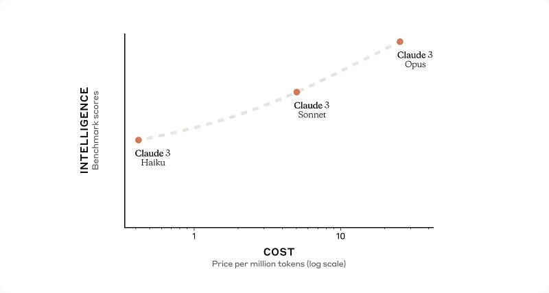 | **Claude 3** family on the **intelligence vs cost** frontier — Haiku, Sonnet, Opus along one pricing curve. |
| 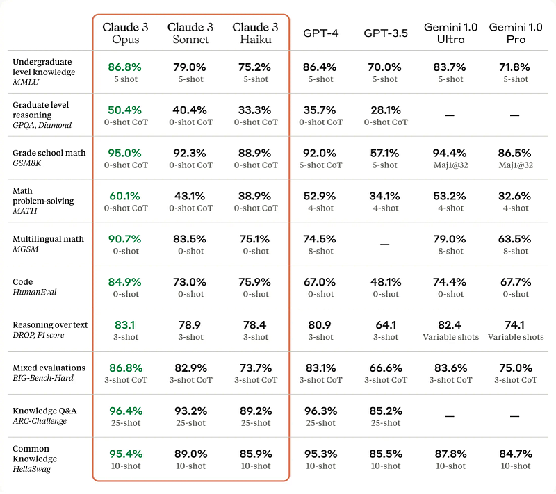 | **Claude 3** vs GPT-4 / GPT-3.5 / Gemini 1.0 — MMLU, GPQA, GSM8K, MATH, MGSM, HumanEval, DROP, BBH, ARC, HellaSwag. |
| 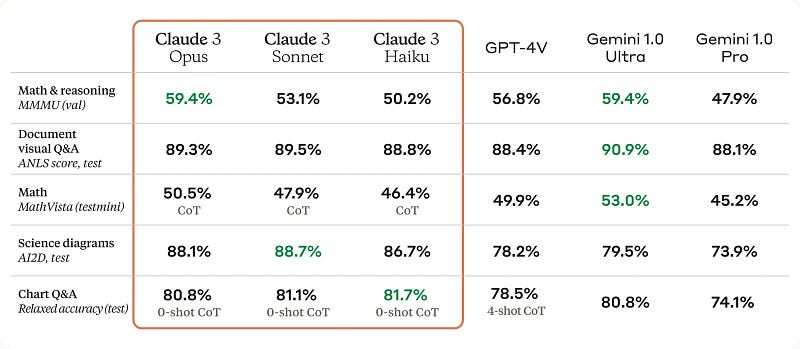 | **Vision benchmarks**: Claude 3 Opus/Sonnet/Haiku vs GPT-4V / Gemini — MMMU, DocVQA, MathVista, AI2D, chart QA. |
| 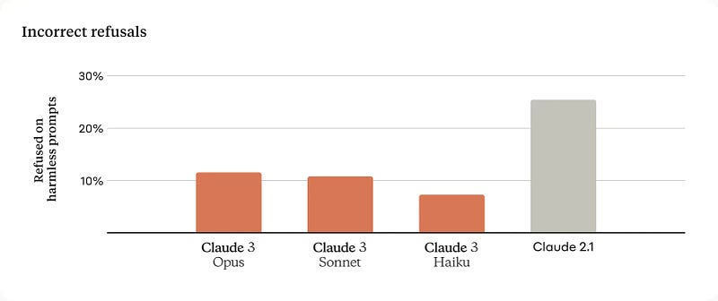 | **Incorrect refusals** on harmless prompts — Claude 3 models vs **Claude 2.1**. |
| 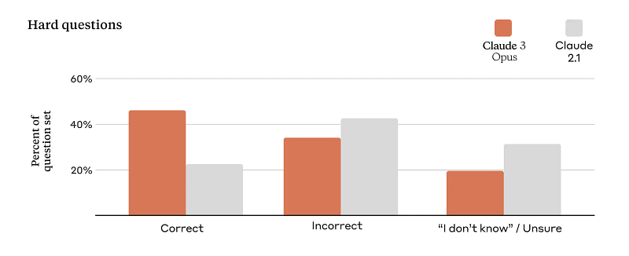 | **Hard questions**: correct vs incorrect vs unsure — **Claude 3 Opus** vs **Claude 2.1**. |
| 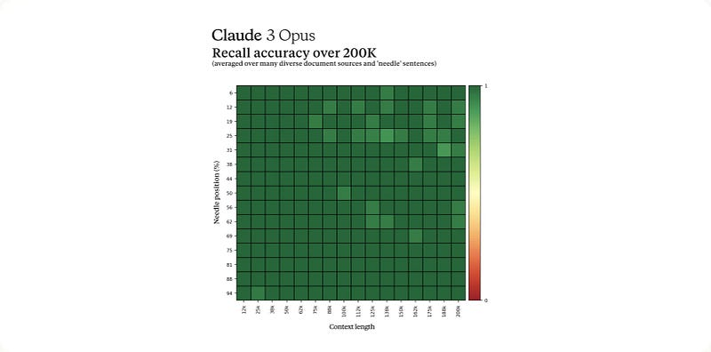 | **Needle-in-a-haystack** recall heatmap — **Claude 3 Opus** through **200K** tokens (position vs context length). |
| 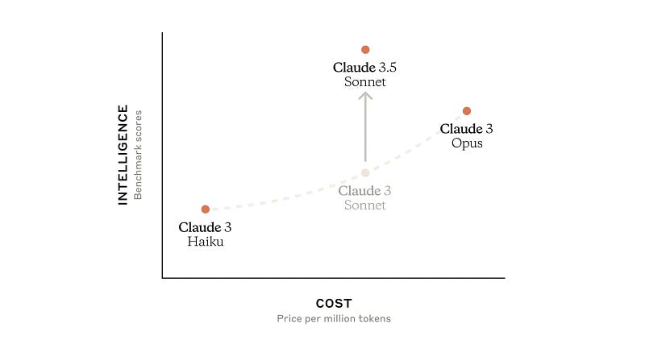 | **Claude 3.5 Sonnet** lifts **intelligence** above **Claude 3 Opus** while staying at **Sonnet-tier cost** (vertical jump from faded Sonnet dot). |
| 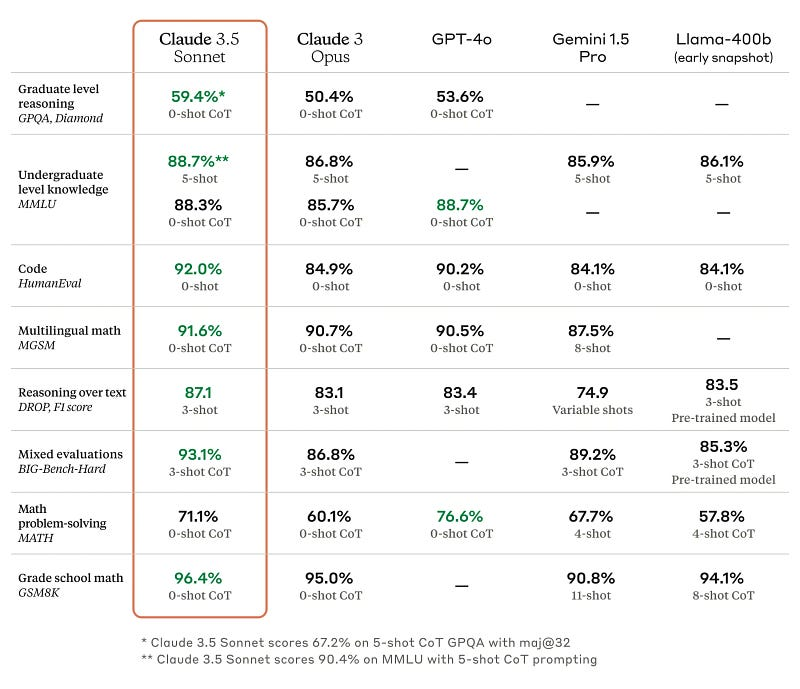 | **Claude 3.5 Sonnet** vs **Claude 3 Opus**, GPT-4o, Gemini 1.5 Pro, Llama-400B snapshot — GPQA, MMLU, HumanEval, math, DROP, BBH. |
| 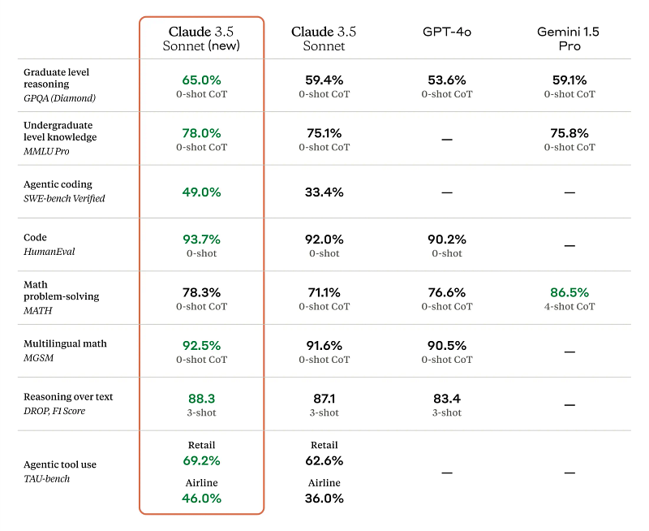 | **Updated Claude 3.5 Sonnet (Oct 2024)** vs prior 3.5 Sonnet, GPT-4o, Gemini — GPQA Diamond, MMLU-Pro, **SWE-bench Verified**, HumanEval, MATH, MGSM, DROP, **TAU-bench** retail/airline. |
| 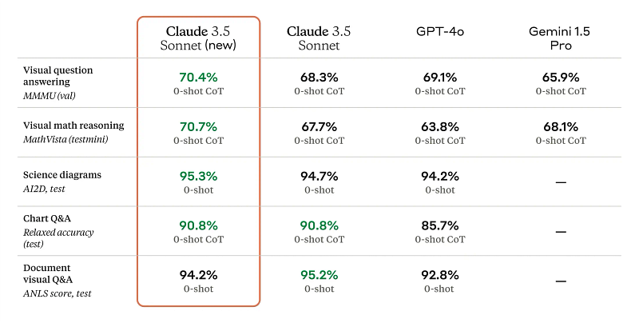 | **Vision benchmarks**: **Claude 3.5 Sonnet (new)** vs older 3.5 Sonnet, GPT-4o, Gemini — MMMU, MathVista, AI2D, charts, DocVQA. |
| 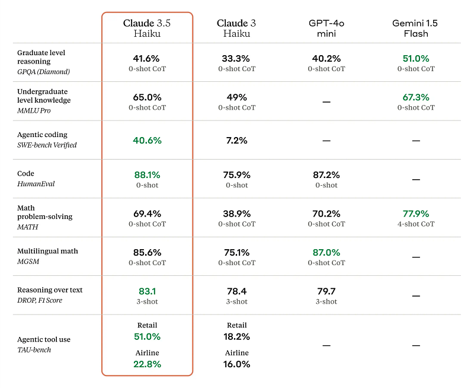 | **Claude 3.5 Haiku** vs Claude 3 Haiku, GPT-4o mini, Gemini 1.5 Flash — reasoning, code (**SWE-bench Verified**), math, DROP, **TAU-bench**. |
| 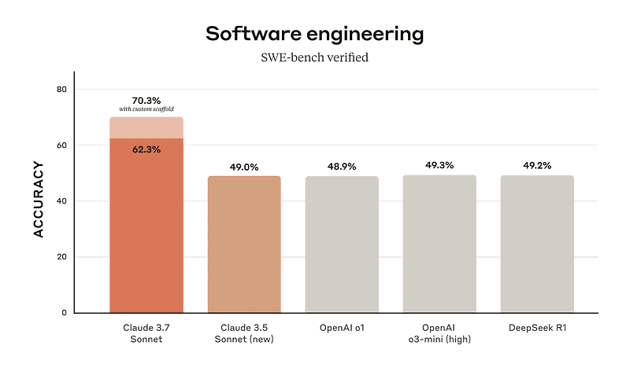 | **SWE-bench Verified**: **Claude 3.7 Sonnet** (62.3% base, 70.3% with scaffold) vs **new** 3.5 Sonnet, o1, o3-mini (high), DeepSeek R1. |
| 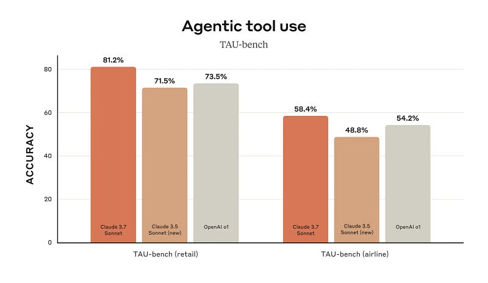 | **TAU-bench** retail and airline — **3.7 Sonnet** vs **new** 3.5 Sonnet vs **OpenAI o1**. |
| 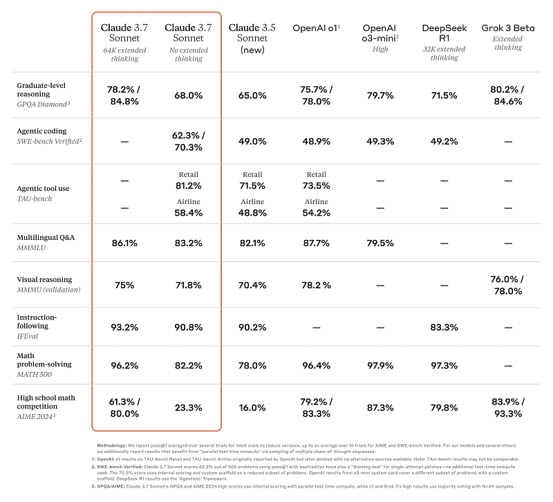 | Broad scoresheet: **Claude 3.7 Sonnet** with vs without **extended thinking** vs **new** 3.5 Sonnet, o1, o3-mini (high), DeepSeek R1, Grok 3 — GPQA, SWE, TAU, MMMLU, MMMU, IFEval, MATH 500, **AIME 2024**. |
| 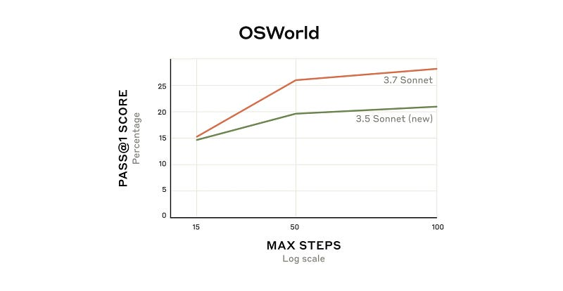 | **OSWorld** pass@1 vs **max steps** (log scale) — **3.7 Sonnet** vs **new** 3.5 Sonnet. |
| 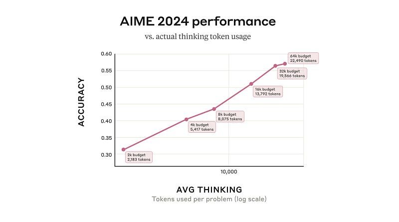 | **AIME 2024** accuracy vs **average thinking tokens** per problem (budgets 2k–64k). |
| 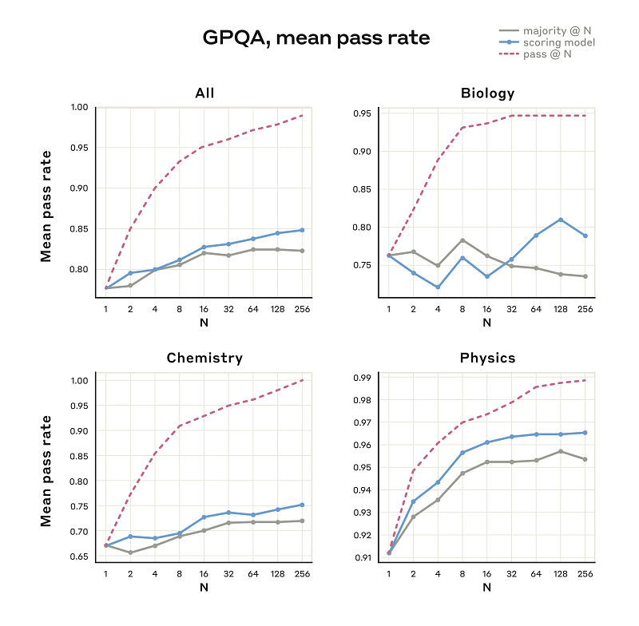 | **GPQA** mean pass rate vs parallel samples \(N\) — majority vote vs **scoring model** vs **pass@N** upper bound (All / Biology / Chemistry / Physics). |
| 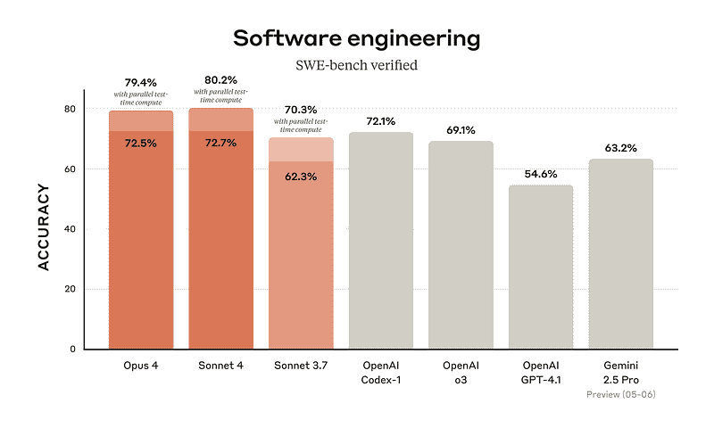 | **SWE-bench Verified** with **parallel test-time compute** — Opus 4 / Sonnet 4 / Sonnet 3.7 vs OpenAI Codex-1, o3, GPT-4.1, Gemini 2.5 Pro Preview. |
| 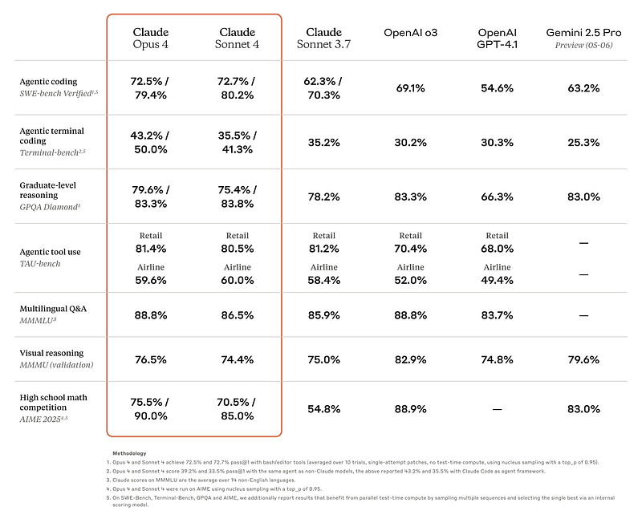 | **Claude 4** announcement table — **Opus 4** / **Sonnet 4** vs Sonnet 3.7, OpenAI o3, GPT-4.1, Gemini 2.5 Pro — SWE-bench, Terminal-bench, GPQA, TAU-bench, MMMLU, MMMU, **AIME 2025** (dual scores = extra test-time compute where noted). |
| 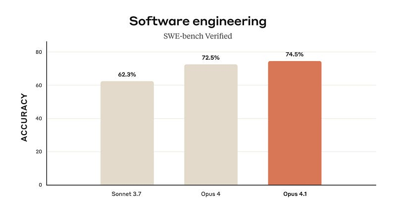 | **SWE-bench Verified** bar ladder — Sonnet 3.7 (62.3%), **Opus 4** (72.5%), **Opus 4.1** (74.5%). |
| 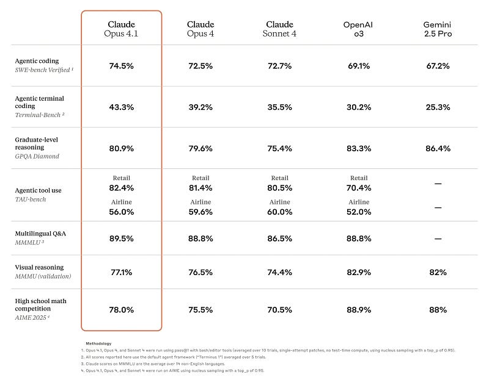 | **Opus 4.1** vs Opus 4, Sonnet 4, OpenAI o3, Gemini 2.5 Pro — coding, terminal coding, GPQA, TAU-bench, MMMLU, MMMU, **AIME 2025**. |
| 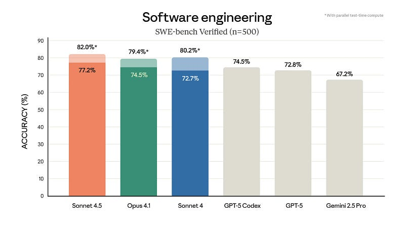 | **SWE-bench Verified (n=500)** — **Sonnet 4.5** / **Sonnet 4** / **Opus 4.1** with optional parallel compute vs GPT-5 Codex, GPT-5, Gemini 2.5 Pro. |
| 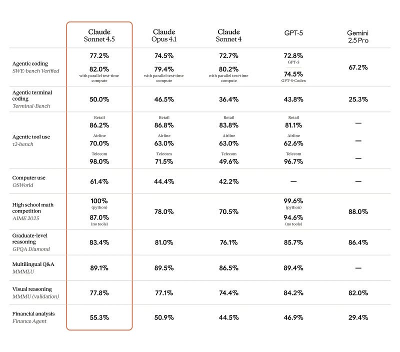 | **Sonnet 4.5** spotlight table vs Opus 4.1, Sonnet 4, GPT-5, Gemini 2.5 Pro — SWE, Terminal-bench, τ2-bench retail/airline/telecom, **OSWorld**, AIME 2025, GPQA, MMMLU, MMMU, **Finance Agent**. |
| 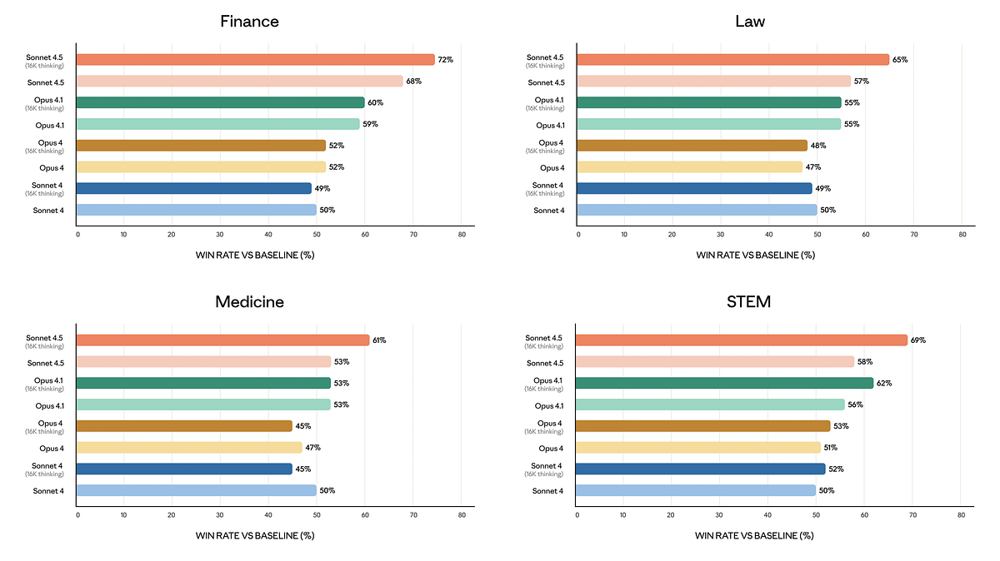 | Expert-study **win rate vs baseline** — Finance / Law / Medicine / STEM for Sonnet 4.5 (±16K thinking) vs prior Opus/Sonnet 4 variants. |
| 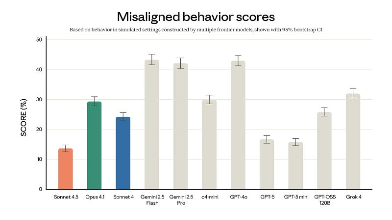 | **Misaligned behavior** scores (simulated settings, 95% bootstrap CI) — Sonnet 4.5 vs Opus/Sonnet 4 vs Gemini / GPT / Grok baselines (**lower is better**). |
| 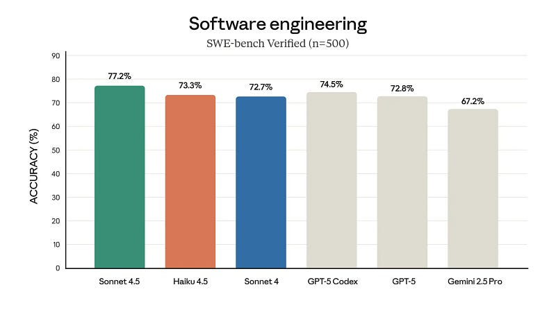 | **SWE-bench Verified** — **Sonnet 4.5**, **Haiku 4.5**, Sonnet 4, GPT-5 Codex, GPT-5, Gemini 2.5 Pro (**Haiku 4.5** near Sonnet 4-tier coding). |
| 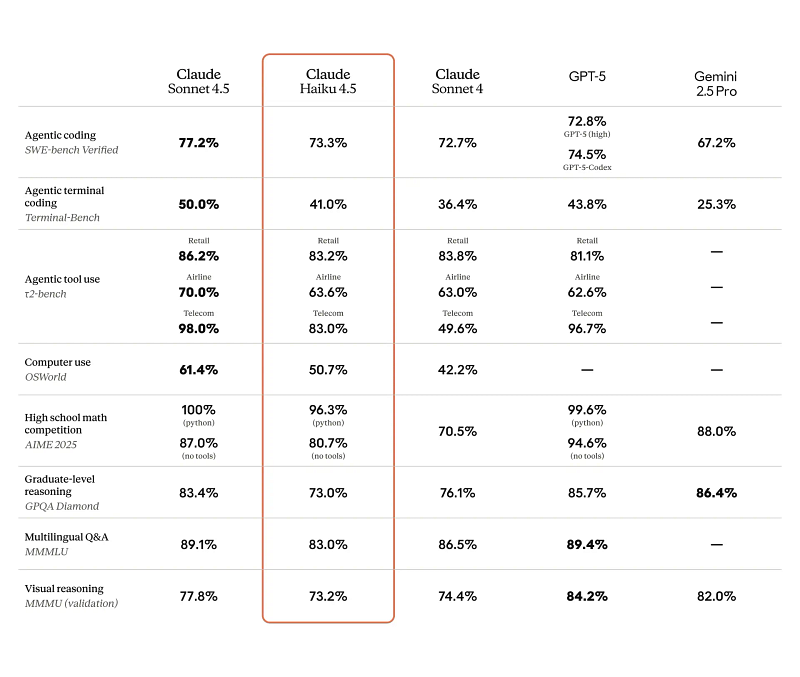 | **Haiku 4.5** benchmark card vs Sonnet 4.5 / Sonnet 4 / GPT-5 / Gemini — SWE-bench, Terminal-bench, τ2-bench, **OSWorld**, AIME 2025, GPQA, MMMLU, MMMU. |
| 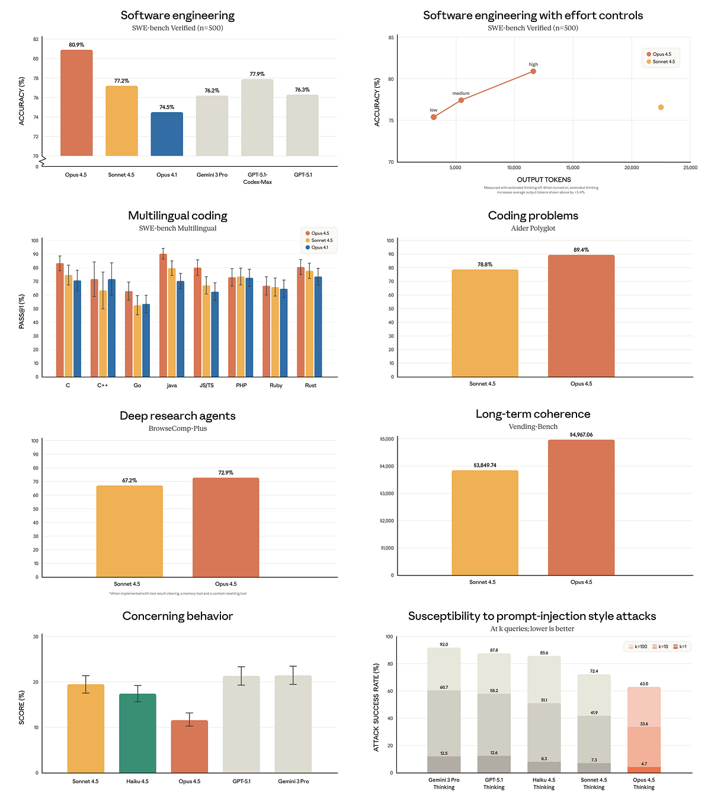 | **Opus 4.5** eight-panel scorecard — SWE-bench (+effort curve), multilingual SWE-bench, **Aider Polyglot**, **BrowseComp-Plus**, **Vending-Bench**, misalignment score, **prompt-injection** success vs thinking variants. |
| 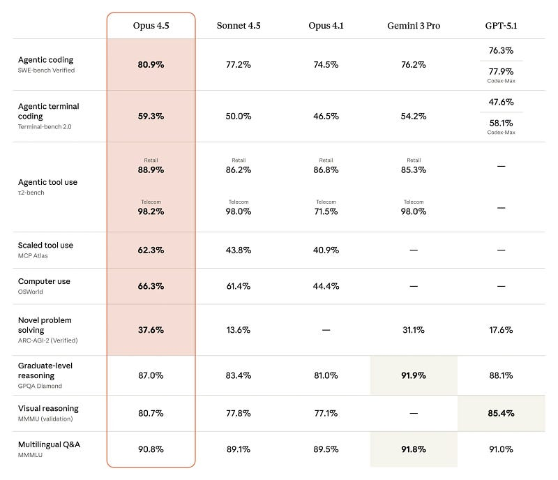 | **Opus 4.5** vs Sonnet 4.5, Opus 4.1, Gemini 3 Pro, GPT-5.1 — SWE-bench, Terminal-bench 2.0, τ2-bench, **MCP Atlas**, **OSWorld**, **ARC-AGI-2**, GPQA, MMMU, MMMLU. |
| 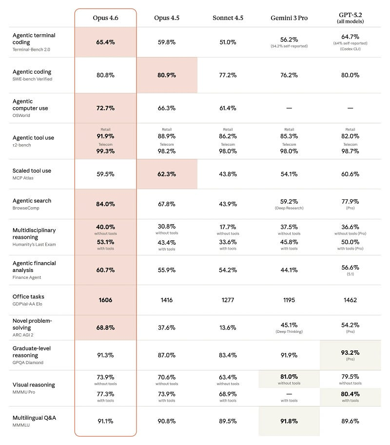 | **Opus 4.6** vs Opus 4.5, Sonnet 4.5, Gemini 3 Pro, GPT-5.2 — agentic coding, computer use (**OSWorld**), τ2-bench, **BrowseComp**, **Humanity’s Last Exam**, **Finance Agent**, **GDPval-AA** Elo, **ARC AGI 2**, GPQA Diamond, MMMU Pro, MMMLU. |
| 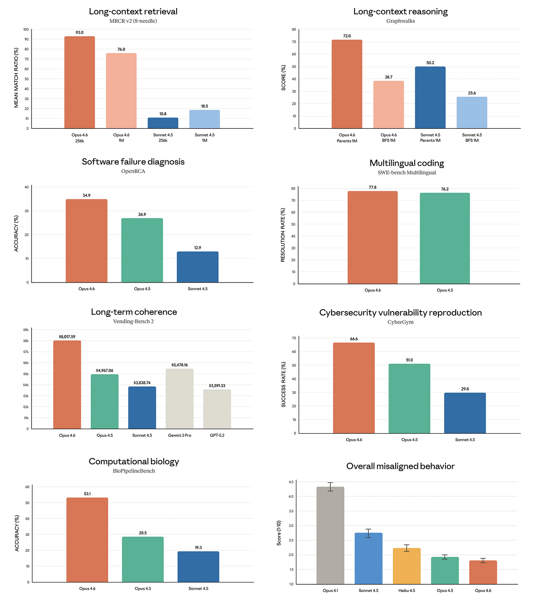 | **Opus 4.6** specialty strip — **MRCR** long retrieval (256k vs 1M), **Graphwalks**, OpenRCA, SWE multilingual, **Vending-Bench 2**, **CyberGym**, **BioPipelineBench**, misalignment score. |
| 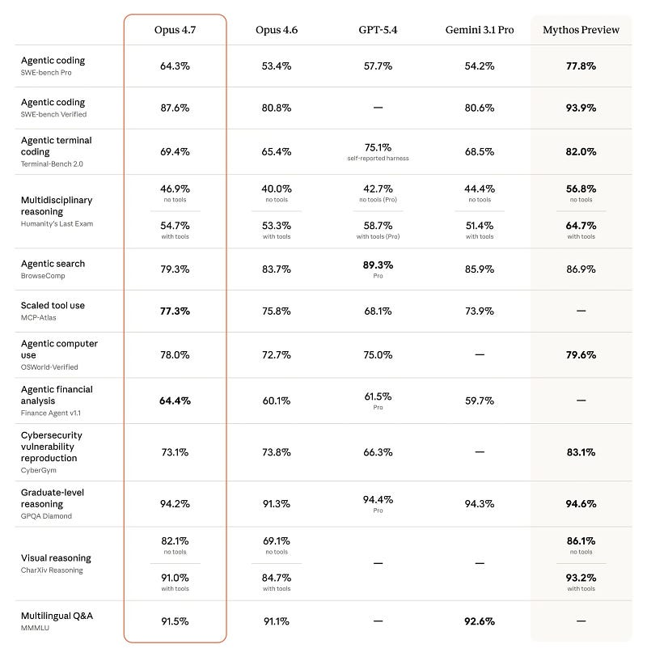 | **Opus 4.7** vs Opus 4.6, GPT-5.4, Gemini 3.1 Pro (and Mythos Preview where shown) — SWE-bench Pro/Verified, Terminal-Bench 2.0, HLE, BrowseComp, MCP-Atlas, OSWorld-Verified, Finance Agent, CyberGym, GPQA Diamond, CharXiv/MMMU axes, MMMLU. |
| 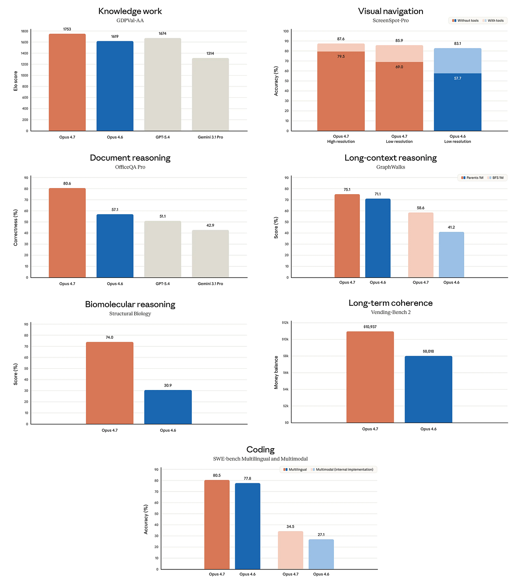 | **Opus 4.7** seven-chart lift vs Opus 4.6 — **GDPVal-AA** Elo, **ScreenSpot-Pro** (+tools), **OfficeQA Pro**, **Graphwalks** 1M, structural biology, **Vending-Bench 2**, multilingual vs multimodal SWE-bench. |
## Related

- [[Papers Explained Corpus]]
- [[Large Language Models]]
- [[Reasoning Models]]
- [[Code Models]]
- [[Papers Explained 180 - Idefics 2]]
- [[Papers Explained 182 - DeBERTa V3]]

#summary #topic
