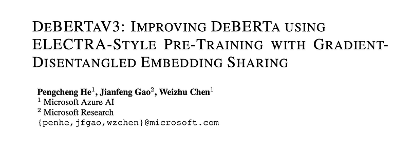
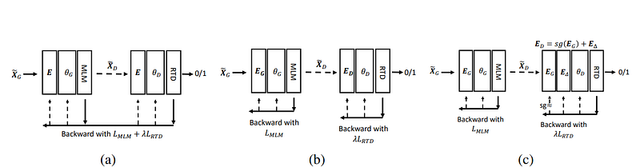
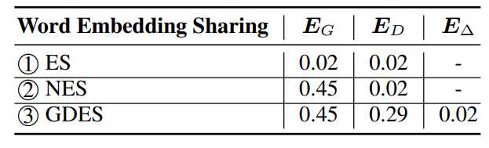
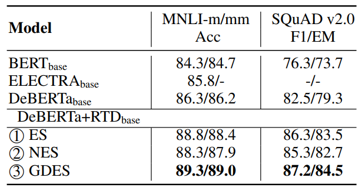
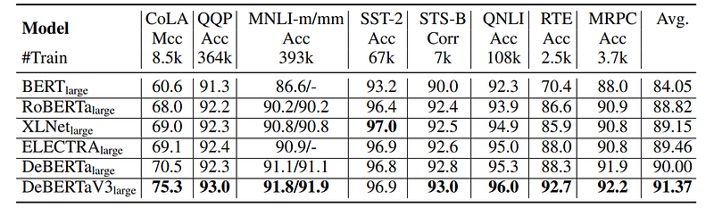
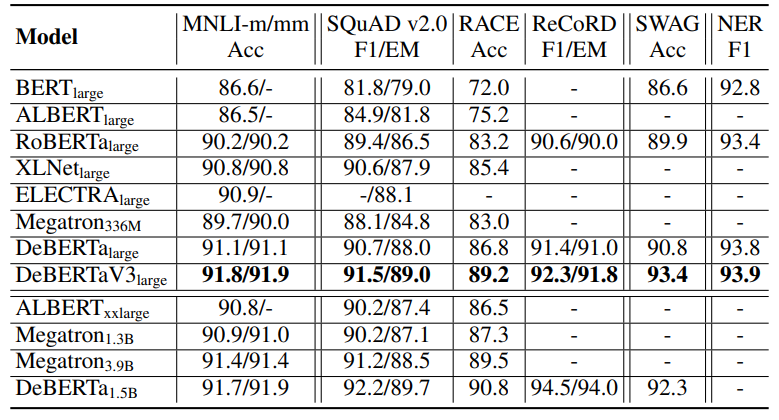
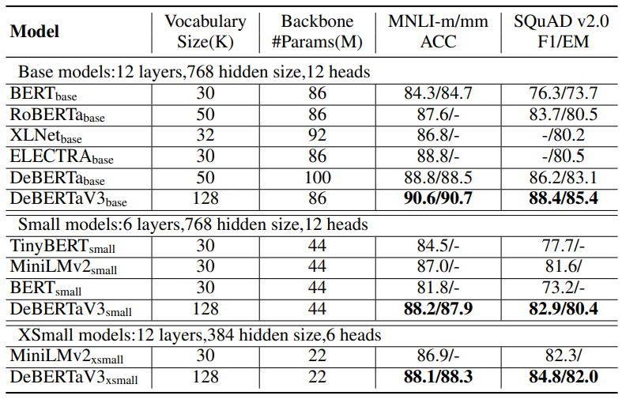
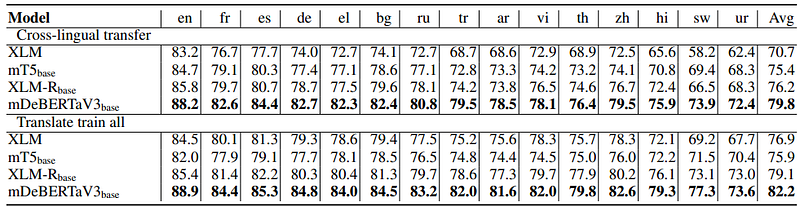

# Papers Explained 182 - DeBERTa V3

DeBERTa enhances BERT with Disentangled Attention (DA) and an improved mask decoder. Unlike BERT, which uses a single vector for content and position, DA employs separate vectors for content and position, calculating attention with disentangled matrices.

This page ingests the source article into the wiki and connects it to [[Papers Explained Corpus]], [[Large Language Models]], [[Embedding and Retrieval]], [[Model Compression and Efficiency]], [[Supervised Fine-Tuning]].

## Source Metadata

- Source file: `raw/2024-08-09_Papers-Explained-182--DeBERTa-V3-65347208ce03.html`
- Source title: Papers Explained 182: DeBERTa V3
- Published: 2024-08-09
- Canonical: [https://medium.com/@ritvik19/papers-explained-182-deberta-v3-65347208ce03](https://medium.com/@ritvik19/papers-explained-182-deberta-v3-65347208ce03)

## Key Ideas

- Since RTD in ELECTRA and the disentangled attention mechanism in DeBERTa have proven to be sample-efficient for pre-training. DeBERTaV3 replace the MLM objective used in DeBERTa with the RTD objective to combine the strengths of the latter.
- Wikipedia and the bookcorpus are used as training data. The generator is the same width as the discriminator but is half the depth.
- The Gradient-Disentangled Embedding Sharing (GDES) method shares token embeddings between a generator and a discriminator, allowing them to learn from the same vocabulary.
- NES and GDES produce two distinctive token embedding matrices, where Generator embeddings have higher average similarity scores than discriminator embeddings.
- Since the difference is smaller in GDES than that in NES, GDES preserves more semantic information in discriminator embeddings through partial weight sharing compared to NES.

## Notes

DeBERTaV3 improves the original DeBERTa model by replacing masked language modeling (MLM) with replaced token detection (RTD), a more sample-efficient pre-training task. Analysis shows that vanilla embedding sharing in ELECTRA hurts training efficiency and model performance, because the training losses of the discriminator and the generator pull token embeddings in different directions, creating the “tugof-war” dynamics, thus a new gradient-disentangled embedding sharing method is used to improve both training efficiency and the quality of the pre-trained model.

## DeBERTa

DeBERTa enhances BERT with Disentangled Attention (DA) and an improved mask decoder. Unlike BERT, which uses a single vector for content and position, DA employs separate vectors for content and position, calculating attention with disentangled matrices. DeBERTa is pre-trained through masked language modeling, including an enhanced mask decoder that adds absolute position details at the decoding layer for more accurate predictions.

## ELECTRA

ELECTRA is a model with two transformer encoders trained in a GAN-like setup. The generator creates ambiguous tokens to replace masked ones in the input sequence, and the discriminator distinguishes original tokens from generator-replaced ones. The discriminator’s training objective is to detect replaced tokens (RTD). The generator’s loss is based on the masked language model (MLM) objective. During training, ELECTRA optimizes both the generator’s MLM loss and the discriminator’s RTD loss. The overall loss, denoted as L, balances these objectives with a weight (λ) of 50 for the discriminator loss.

## DeBERTaV3

Since RTD in ELECTRA and the disentangled attention mechanism in DeBERTa have proven to be sample-efficient for pre-training. DeBERTaV3 replace the MLM objective used in DeBERTa with the RTD objective to combine the strengths of the latter.

Wikipedia and the bookcorpus are used as training data. The generator is the same width as the discriminator but is half the depth.

*Figure: Illustration of different embedding sharing methods (a) ES (b) NES (c) GDES*

To pre-train ELECTRA, a generator and a discriminator share token embeddings, known as Embedding Sharing (ES). This approach reduces parameters but creates a multitask issue where objectives interfere, slowing training. Gradients for token embeddings (gE) are calculated from both generator’s Masked Language Modeling (MLM) and discriminator’s Replaced Token Detection (RTD) losses. The balancing of these gradients forms a tug-of-war scenario, which can be slow or inefficient due to conflicting optimal directions for embeddings between MLM and RTD. A variant called No Embedding Sharing (NES) updates generator and discriminator alternately, avoiding gradient conflicts. NES converges faster, generates more coherent embeddings, but doesn’t significantly improve downstream NLU tasks compared to ES. A new embedding sharing method combining ES and NES strengths is proposed.

The Gradient-Disentangled Embedding Sharing (GDES) method shares token embeddings between a generator and a discriminator, allowing them to learn from the same vocabulary.

To implement GDES, the discriminator embeddings are re-parameterized as ED = sg(EG) + E∆, where the flow of gradients through the generator embeddings EG is prevented and only the residual embeddings E∆ are updated by the stop-gradient operator sg. E∆ is initialized as a zero matrix, and the model is trained following the NES procedure. In each iteration, the inputs for the discriminator are first generated using the generator, and both EG and ED are updated with the MLM loss. Then, the discriminator is run on the generated inputs, and ED is updated with the RTD loss, but only through E∆. After training, E∆ is added to EG, and the resulting matrix is saved as ED for the discriminator.

## Evaluation

### Embedding Sharing

*Figure: Average cosine similarity of word embeddings of the generator and the discriminator with different embedding sharing methods.*

- NES and GDES produce two distinctive token embedding matrices, where Generator embeddings have higher average similarity scores than discriminator embeddings.

- Since the difference is smaller in GDES than that in NES, GDES preserves more semantic information in discriminator embeddings through partial weight sharing compared to NES.

*Figure: Fine-tuning results on MNLI and SQuAD v2.0 tasks of base models trained with different embedding sharing methods.*

- Model pre-trained with GDES achieves the best performance on downstream tasks (MNLI and SQuAD v2.0) after fine-tuning, indicating GDES is an effective weight-sharing method for language model pre-training with MLM and RTD.

### Performance on Large Models

*Figure: Comparison results on the GLUE development set.*

- DeBERTaV3 consistently outperforms or matches previous state-of-the-art (SOTA) models like in most tasks, particularly exceling in low-resource tasks (e.g., RTE, CoLA) with substantial performance improvements (4.4% and 4.8% respectively), showcasing data efficiency and better generalization.

- Although improvements on SST-2, STS-B, and MRPC tasks are relatively small (less than 0.3%), they are still valuable as these tasks are close to saturation in performance.

- DeBERTaV3’s superiority over XLNet in seven out of eight tasks highlights its competitive edge and indicates its potential advantages in various natural language understanding tasks.

*Figure: Results on MNLI in/out-domain, SQuAD v2.0, RACE, ReCoRD, SWAG, CoNLL 2003 NER development set.*

- DeBERTaV3large demonstrates superior performance compared to other state-of-the-art pre-trained language models with similar model sizes on multiple tasks.

- DeBERTaV3large exhibits significant improvements in reasoning and common-sense knowledge, particularly evident in tasks like RACE and SWAG.

- Despite having fewer parameters compared to larger models like ALBERTxxlarge and Megatron1.3B, DeBERTaV3large outperforms them by a considerable margin on several tasks.

### Performance on Base and Smaller Models

*Figure: Results on MNLI in/out-domain (m/mm) and SQuAD v2.0 development set.*

- DeBERTaV3 models consistently outperform previous SOTA, highlighting the their efficiency.

### Multilingual Model

*Figure: Results on XNLI test set under the cross-lingual transfer and the translate-train-all settings.*

- The extension of DeBERTaV3 to multi-lingual models, trained on the CC100 multi-lingual dataset, outperforms previous SOTA model XLM-Rbase in zero-shot cross-lingual transfer and translate-train-all settings.

- mDeBERTaV3base achieves a significant improvement of +3.6% in cross-lingual transfer performance and +3.1% in translate-train-all performance compared to XLM-Rbase, demonstrating the effectiveness of disentanglement in multi-lingual pre-training.

- The consistent improvements across a variety of languages and downstream tasks highlight the efficiency and value of DeBERTaV3 models in enhancing pre-trained language models.

## Paper

DeBERTaV3: Improving DeBERTa using ELECTRA-Style Pre-Training with Gradient-Disentangled Embedding Sharing [2111.09543](https://arxiv.org/abs/2111.09543)

Recommended Reading [Encoder-Only Language Transformers](https://ritvik19.medium.com/list/encoderonly-language-transformers-0f2ff06e0309)

## Figures

Figures from the Medium HTML export (`raw/2024-08-09_Papers-Explained-182--DeBERTa-V3-65347208ce03.html`); local copies under `wiki/assets/papers-explained-182-deberta-v3/` when download succeeded.

| Figure | Caption |
|--------|---------|
|  | Paper title block: **DeBERTaV3** — ELECTRA-style pre-training with **gradient-disentangled embedding sharing** (GDES). |
|  | **Embedding sharing** setups: (a) joint **ES**, (b) **NES**, (c) proposed **GDES** with stop-gradient and residual \(\Delta\) embeddings. |
|  | **Generator vs discriminator embeddings**: reported \(E_G\), \(E_D\), and \(\Delta\) terms under **ES**, **NES**, and **GDES** (compact summary table). |
|  | **Fine-tuning** on **MNLI** (m/mm) and **SQuAD v2.0**: **DeBERTa+RTD** variants — **GDES** beats vanilla **ES** / **NES**. |
|  | **GLUE** dev scores: **DeBERTaV3_large** vs BERT / RoBERTa / XLNet / ELECTRA / DeBERTa (**large** tier). |
|  | **Large-model NLU suite**: MNLI, SQuAD v2, **RACE**, **ReCoRD**, **SWAG**, **NER** — **DeBERTaV3_large** vs contemporaries and bigger Megatron stacks. |
|  | **Base / small / xsmall** tiers on **MNLI** and **SQuAD v2.0** — **DeBERTaV3** wins each scale bucket (param & vocab noted). |
|  | **mDeBERTaV3_base** vs XLM / mT5 / **XLM-R** on **XNLI** — cross-lingual transfer vs translate-train-all (per-language grid). |
## Related

- [[Papers Explained Corpus]]
- [[Large Language Models]]
- [[Embedding and Retrieval]]
- [[Model Compression and Efficiency]]
- [[Supervised Fine-Tuning]]
- [[Papers Explained 181 - Claude]]
- [[Papers Explained 183 - Magpie]]

#summary #topic
