# Papers Explained 183 - Magpie

Magpie is a self-synthesis method for generating large-scale alignment data. It is based on the observation that aligned LLMs like Llama-3-Instruct because of their auto-regressive nature can generate a user query when input only the left-side templates up to the position reserved for user messages.

This page ingests the source article into the wiki and connects it to [[Papers Explained Corpus]], [[Synthetic Data]], [[Large Language Models]], [[Safety and Alignment]].

## Source Metadata

- Source file: `raw/2024-08-12_Papers-Explained-183--Magpie-0603cbdc69c3.html`
- Source title: Papers Explained 183: Magpie
- Published: 2024-08-12
- Canonical: [https://medium.com/@ritvik19/papers-explained-183-magpie-0603cbdc69c3](https://medium.com/@ritvik19/papers-explained-183-magpie-0603cbdc69c3)

## Key Ideas

- Magpie is a self-synthesis method for generating large-scale alignment data. It is based on the observation that aligned LLMs like Llama-3-Instruct because of their auto-regressive nature can generate a user query when input only the left-side templates up to...
- The project is available at [Github](https://magpie-align.github.io/).
- The models and datasets are available at [HuggingFace](https://hf.co/magpie-align).
- Instruction Generation: Magpie crafts a query in a predefined template format, which defines the role of the instruction provider (e.g., user) but does not provide any instruction.
- Response Generation: Magpie sends these instructions to the LLM to generate the corresponding responses.

## Notes

Magpie is a self-synthesis method for generating large-scale alignment data. It is based on the observation that aligned LLMs like Llama-3-Instruct because of their auto-regressive nature can generate a user query when input only the left-side templates up to the position reserved for user messages. Magpie is then used to generate 4M instructions along with their corresponding responses.

The project is available at [Github](https://magpie-align.github.io/).

The models and datasets are available at [HuggingFace](https://hf.co/magpie-align).

## Magpie : A Scalable Method to Synthesize Instruction Data

*Figure: The process of self-synthesizing instruction data from aligned LLMs.*

Magpie consists of two steps:

- Instruction Generation: Magpie crafts a query in a predefined template format, which defines the role of the instruction provider (e.g., user) but does not provide any instruction. The LLM then generates an instruction autonomously, and Magpie stops generating the instruction once the LLM produces an end-of-sequence token. This process is repeated to generate a set of instructions.

- Response Generation: Magpie sends these instructions to the LLM to generate the corresponding responses. Combining the roles of instruction provider and follower, the instructions from Step 1, and the responses generated in Step 2 yields the instruction dataset.

Magpie is applied to the Llama-3–8B-Instruct and Llama-3–70B-Instruct models to construct two instruction datasets: Magpie-Air and Magpie-Pro, respectively.

*Figure: The configurations of generating instructions of MAGPIE-Air and MAGPIE-Pro datasets.*

Extensions of Magpie

- Multi Turn Magpie: This extension involves generating multiple turns of instruction and response by appending the pre-query template to the end of the full prompt from the previous round of communication. A system prompt is used to control the behavior of the LLM and reinforce its awareness of the multi-round conversation context.

- Control Instruction Tasks of Magpie: This extension involves guiding LLMs through a system prompt to specify that it is a chatbot tailored for a particular domain and outlining the types of user queries it might encounter.

- Building Preference Optimization Dataset with Magpie: This extension involves integrating responses generated by the instruct model with those from the base model to create a preference dataset. Specifically, utilizing the reward difference (r∗ − r_base) from the FsfairX-LLaMA3-RM-v0.1 reward model.

300K instances are selected from Magpie-Pro and Magpie-Air-Filtered, yielding datasets Magpie-Pro-300K and Magpie-Air-300K-Filtered, respectively

*Figure: Different filter configurations.*

The Output Length filter is applied last. Specifically, this filter selects the k instances of the longest responses. In the experiments, τ1 is empirically set to −12, and τ2 to 0.

## Dataset Analysis

### Statistical Analysis

*Figure: Statistics of instruction datasets generated by Magpie compared to other instruction datasets.*

- Tokens are counted using the tiktoken library

Length Analysis

*Figure: Lengths of instructions and responses in Magpie-Air/Pro.*

- Magpie Pro responses seem to be longer than Magpie Air.

### Coverage Analysis

Used the all-mpnet-base-v2 embedding model to calculate input embeddings and employed t-SNE to project these embeddings into a two-dimensional space

Analyzed the coverage of Magpie-Pro in the embedding space using three synthetic datasets as baselines (Alpaca, Evol Instruct, and UltraChat)

The t-SNE plot of Magpie-Pro encompasses the area covered by the other plots, demonstrating the comprehensive coverage of Magpie-Pro.

### Attribute Analysis

*Figure: Llama3–8B-Instruct model is prompted to generate the mentioned attributes.*

Task Categories of Instructions

- The task category distributions of these two datasets are largely similar, however, Magpie-Pro exhibits a higher percentage of creative writing tasks.

- This distribution over the task categories aligns with the practical requests from human users.

Quality and Difficulty of Instructions

- Both datasets are of high quality, with the majority of instances rated ‘average’ or higher.

- The overall quality of Magpie-Pro surpasses that of Magpie-Air.

- The distributions across difficulty levels are similar for Magpie-Air and Magpie-Pro.

- Some instructions in MAGPIE-Pro are more challenging than those in Magpie-Air.

Instruction Similarity and Quality of Responses

All instructions are represented in the embedding space using the all-mpnet-base-v2 embedding model

The minimum distance from each instruction to its nearest neighbors in the embedding space is calculated using Facebook AI Similarity Search (FAISS)

The reward difference for each instance in the dataset is calculated using the FsfairX-LLaMA3-RM-v0.1 reward model.

### Safety Analysis

*Figure: Percentage of different unsafe categories of Magpie-Air and Magpie-Pro tagged by Llama-Guard-2.*

- Llama-Guard-2 is used to analyze the safety of Magpie-Air and Magpie-Pro.

- Both datasets are predominantly safe, with less than 1% of the data potentially containing harmful instructions or responses.

## Performance Analysis

The quality of datasets generated by Magpie is evaluated by utilizing them to fine-tune model families including Llama-3 and Qwen1.5. The models are finetuned with a maximum sequence length of 8192 for 2 epochs.

Baselines for Instruction Tuning: ShareGPT, WildChat, Evol Instruct, UltraChat, OpenHermes, and Tulu V2 Mix.

Baselines for Instruction and Preference Tuning: UltraChat dataset (for instruction tuning) and Ultrafeedback dataset (for preference optimization)

Evaluation Benchmarks: AlpacaEval 2 and Arena-Hard.

Metrics: win rate (WR) and length-controlled win rate (LC), a debiased version of WR.

*Figure: Performance of models instruction-tuned on the Llama-8B base.*

- Models fine-tuned with Magpie datasets significantly outperform those fine-tuned with baseline datasets.

- In addition, the fine-tuned models achieve comparable performance to the official aligned model, despite only undergoing SFT with a much smaller dataset.

- The models fine-tuned with Magpie consistently outperform those fine-tuned with Magpie-Air.

- As the size of the dataset increases, the performance of fine-tuned model improves, indicating that data quantity plays a critical role in enhancing instruction-following capabilities.

- Furthermore, the model fine-tuned with Magpie-Pro-300K-Filtered outperform those fine-tuned with the same amount of raw data. This demonstrates the effectiveness of our filtering technique, and underscores the importance of data quality.

*Figure: Performance of models instruction-tuned on the Qwen base models.*

- Magpie fine-tuned models achieve better performance than the official aligned models, which have undergone instruction and preference tuning.

## Paper

Magpie: Alignment Data Synthesis from Scratch by Prompting Aligned LLMs with Nothing [2406.08464](https://arxiv.org/abs/2406.08464)

## Figures

Figures from the Medium HTML export (`raw/2024-08-12_Papers-Explained-183--Magpie-0603cbdc69c3.html`); local copies under `wiki/assets/papers-explained-183-magpie/` when download succeeded.

| Figure | Caption |
|--------|---------|
| 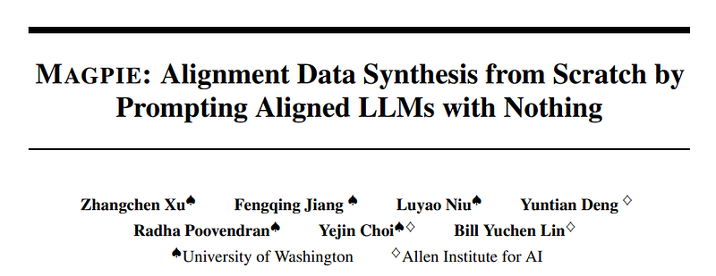 | Paper title: **MAGPIE** — alignment data synthesis by prompting aligned LLMs **with no user content** (only chat templates). |
| 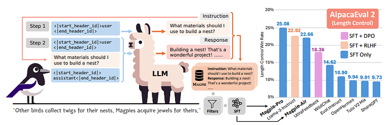 | **Pipeline**: template-only prefill → synthetic **instruction** → paired **response** → filter → SFT → **Magpie-Air / Magpie-Pro**; plus **AlpacaEval 2 (LC)** bar vs baselines. |
| 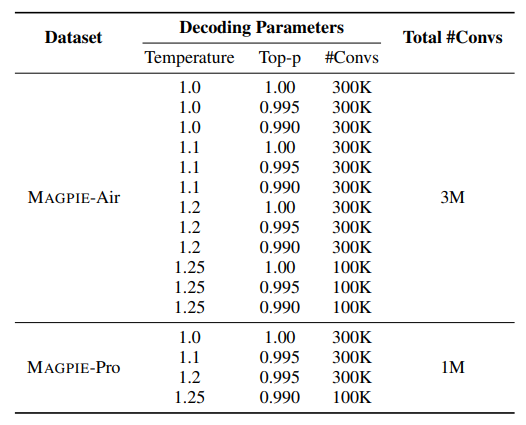 | **MAGPIE-Air** vs **MAGPIE-Pro**: decoding grids (**temperature**, **top-p**) and **conversation counts** (3M vs 1M totals). |
| 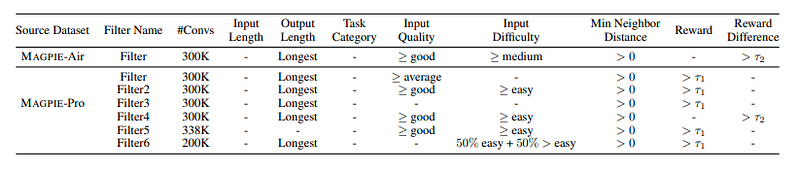 | **Filtering configurations** for Air vs Pro subsets (quality, difficulty, neighbor distance, reward \(\tau_1\) / gap \(\tau_2\), longest-response preference). |
| 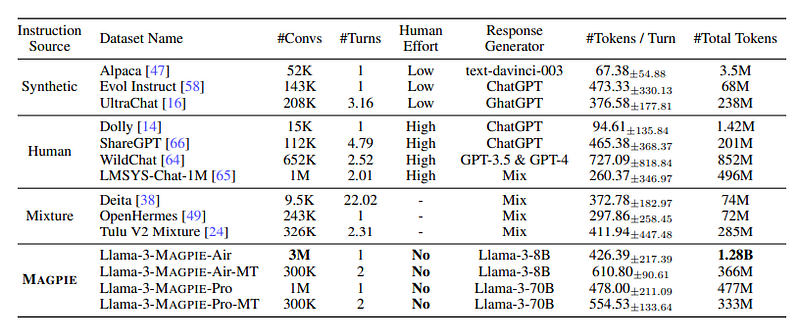 | **Dataset comparison table**: synthetic / human / mixture sources vs **MAGPIE** — scale (**#convs**, tokens), turns, human effort, response generator. |
| 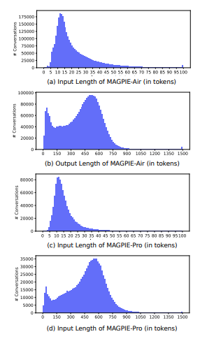 | **Token-length histograms** for MAGPIE-Air vs MAGPIE-Pro — short **inputs**, long **outputs** (2×2 panel). |
| 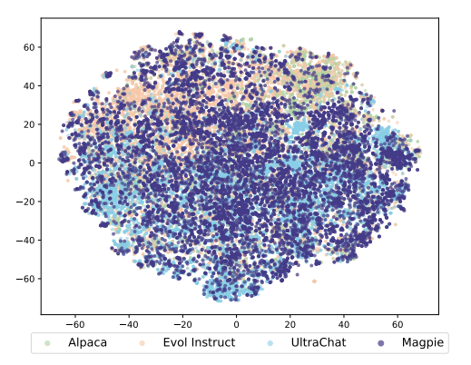 | **t-SNE** overlap: **Magpie-Pro** vs Alpaca, Evol Instruct, UltraChat (embedding-space coverage). |
| 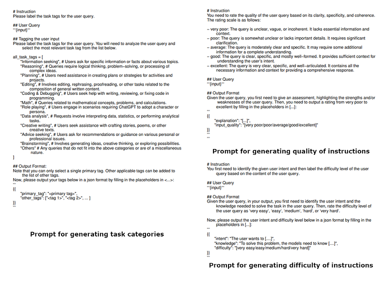 | **Llama-3–8B-Instruct** prompts for automatic **task tags**, **input quality**, and **difficulty** labeling (JSON output schemas). |
| 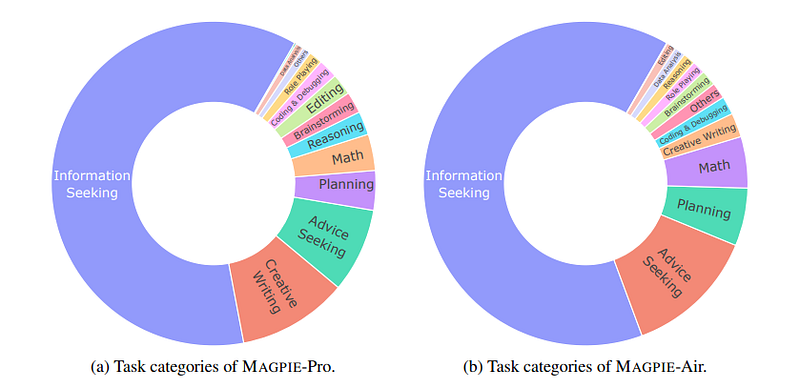 | **Task-category donuts**: MAGPIE-Pro vs MAGPIE-Air (information seeking, creative writing, coding, math, …). |
| 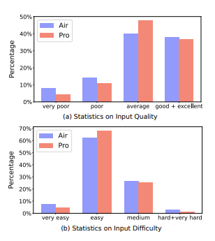 | **Quality** and **difficulty** distributions — Air vs Pro from automated ratings (bar charts). |
| 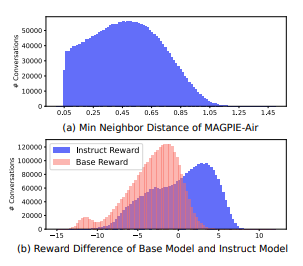 | **Diversity** (**min neighbor distance**) and **reward histograms** — base vs instruct model scores on MAGPIE-Air. |
| 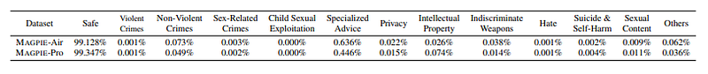 | **Llama-Guard-2** safety breakdown — MAGPIE-Air vs MAGPIE-Pro (**Safe** dominates; rare category tails). |
| 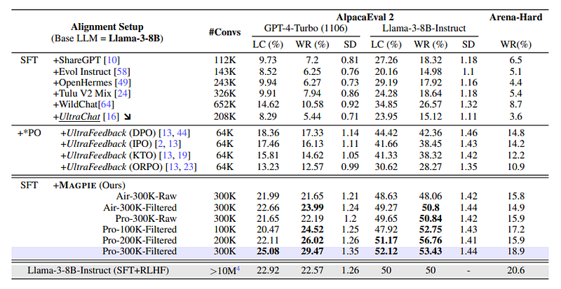 | **Llama-3–8B** instruction tuning: Magpie vs ShareGPT / UltraChat / PO variants — **AlpacaEval 2** (LC/WR) and **Arena-Hard** vs official **Llama-3-Instruct**. |
| 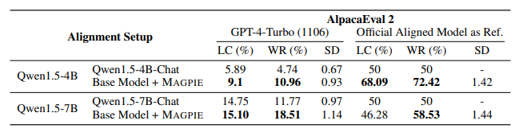 | **Qwen1.5 (4B / 7B)**: official Chat vs **base + MAGPIE** on **AlpacaEval 2** (GPT-4-Turbo ref vs official aligned ref). |
## Related

- [[Papers Explained Corpus]]
- [[Synthetic Data]]
- [[Large Language Models]]
- [[Safety and Alignment]]
- [[Papers Explained 182 - DeBERTa V3]]
- [[Papers Explained 184 - Instruction Pretraining]]

#summary #topic
