# Papers Explained 184 - Instruction Pretraining

Instead of directly pre-training on raw corpora, Instruction Pre-Training augments each text from the raw corpora with a set of instruction-response pairs generated by an instruction synthesizer, then pre-trains LMs on the augmented corpora.

This page ingests the source article into the wiki and connects it to [[Papers Explained Corpus]], [[Synthetic Data]], [[Large Language Models]], [[Supervised Fine-Tuning]].

## Source Metadata

- Source file: `raw/2024-08-13_Papers-Explained-184--Instruction-Pretraining-ee0466f0fd33.md`
- Source title: Papers Explained 184: Instruction Pretraining
- Published: 2024-08-13
- Canonical: [https://medium.com/@ritvik19/papers-explained-184-instruction-pretraining-ee0466f0fd33](https://medium.com/@ritvik19/papers-explained-184-instruction-pretraining-ee0466f0fd33)

## Key Ideas

- 200M instruction-response pairs covering 40+ task categories are synthesized in this work to verify the effectiveness of Instruction Pre-Training.
- The models are available at [HuggingFace](https://huggingface.co/instruction-pretrain).
- The instruction synthesizer is developed through multitask fine-tuning on a language model. The tuning data are curated to be highly diverse, enabling the instruction synthesizer to generalize to unseen data.
- For each context in the datasets, all the corresponding downstream tasks are gathered, the context is regarded as the raw text and the downstream tasks as the instruction-response pairs.
- A one-shot example consists of a raw text (TN) and a set of instruction response pairs (I_N R_N); data denoted without ′ are for tuning the instruction synthesizer, and data with ′ are for synthesizer inference and LM pre-training.

## Notes

Instead of directly pre-training on raw corpora, Instruction Pre-Training augments each text from the raw corpora with a set of instruction-response pairs generated by an instruction synthesizer, then pre-trains LMs on the augmented corpora.

*Figure: Comparison between Instruction PreTraining and Vanilla Pre-Training.*

200M instruction-response pairs covering 40+ task categories are synthesized in this work to verify the effectiveness of Instruction Pre-Training.

The models are available at [HuggingFace](https://huggingface.co/instruction-pretrain).

## Instruction Synthesizer

*Figure: Tuning and Inference Framework of Instruction Synthesizer*

The instruction synthesizer is developed through multitask fine-tuning on a language model. The tuning data are curated to be highly diverse, enabling the instruction synthesizer to generalize to unseen data. Furthermore, specific designs are incorporated to synthesize both one-shot and few-shot examples for subsequent pre-training.

*Figure: Datasets for Fine-Tuning the Instruction Synthesizer*

For each context in the datasets, all the corresponding downstream tasks are gathered, the context is regarded as the raw text and the downstream tasks as the instruction-response pairs. For each dataset, a maximum of 10K examples with the highest number of instruction-response pairs are sampled, to enhance task diversity while avoiding dataset predominance.

*Figure: Instruction Synthesizer*

A one-shot example consists of a raw text (TN) and a set of instruction response pairs (I_N R_N); data denoted without ′ are for tuning the instruction synthesizer, and data with ′ are for synthesizer inference and LM pre-training.

*Figure: Templates for Different Formats of Instruction-Response Pairs*

During instruction synthesizer tuning, each sequence fed into the synthesizer concatenates multiple one-shot examples sampled from the same dataset. During inference, multi round inference is conducted to synthesize instruction response pairs with patterns similar to those of previous rounds.

## LM Pre-Training

Except for the pre-training data, Instruction PreTraining keeps all other pre-training settings the same as Vanilla Pre-Training: training with the next-token prediction objective and computing loss on all tokens.

### General Pre-Training From Scratch

Considering the large amount of data required for general pre-training from scratch, only a part of the raw corpora is converted into instruction-augmented corpora, leaving the rest unchanged.

### Domain-Adaptive Continual Pre-Training

For domain-adaptive continual pre-training, the data requirement is much smaller. Therefore, all raw corpora are converted into instruction-augmented corpora. The corpora is then mixed with the general instructions to benefit from improved prompting ability.

## Experiment Settings

### Instruction Synthesizer

The synthesizer is fine-tuned from Mistral-7Bv0.1. During inference, about 5 instruction-response pairs are created per raw text, where each pair contains about 52 tokens.

### General Pre-Training From Scratch

Refined dataset is randomly sampled for raw pre-training corpora, consisting of 200M pieces of text containing about 100B tokens.

To create instruction-augmented corpora, two rounds of instruction synthesis is done, converting 1/5 of the raw corpora (40M raw texts) into instruction-augmented texts.

Since the fine-tuning data amount (0.2B tokens) is too small compared to that of the raw corpora, its sample ratio is increased so that it repeats 4 times throughout pre-training.

The architecture and tokenizer of Mistral is adopted to implement models of two different parameters: 500M and 1.3B.

### Domain-Adaptive Continual Pre-Training

Raw corpora from two domains is used: PubMed Abstracts for biomedicine and financial news for finance. Then the instruction-augmented corpora is mixed with general instructions.

Llama3–8B is continually pretrained on each domain.

*Figure: Hyper-Parameters of Pre-Training From Scratch and Continual Pre-Training.*

## Evaluation

### General Pre-Training From Scratch

*Figure: General Performance of the Pre-Trained Base Models.*

- Mix PT showed improved performance on several benchmarks compared to Vanilla PT, indicating that incorporating fine-tuning data into the pre-training process is beneficial.

- Instruct PT achieved even better performance than Mix PT, suggesting that instruction-augmented corpora further enhance model performance.

*Figure: Comparison between Instruct Pre-Trained Models and Other Open-Source Models*

- Instruction pre-trained models matched or exceeded the performance of other open-source models (Pythia-1B and BLOOM-3B) using fewer tokens during training, demonstrating data efficiency.

*Figure: MMLU Performance during Instruction Tuning*

- The model pre-trained via Instruction Pre Training quickly outperforms the model pre-trained via Vanilla Pre-Training, and we observe a stable increasing trend of our model throughout the instruction tuning process.

### Domain-Adaptive Continual Pre-Training

*Figure: Domain-Specific Task Performance*

- Instruction Pre-Training consistently outperforms Vanilla Pre-Training on almost all domain-specific tasks.

- Continual pre-training with Instruction Pre-Training significantly enhances the domain specific performance of Llama3–8B, achieving parity with or even surpassing Llama3–70B.

- On the finance NER benchmark, even Llama3- 70B underperforms Llama3–8B, suggesting that this benchmark may not be reliable.

## Paper

Instruction Pre-Training: Language Models are Supervised Multitask Learners [2406.14491](https://arxiv.org/abs/2406.14491)

## Figures

Figures from the Medium HTML export (`raw/2024-08-13_Papers-Explained-184--Instruction-Pretraining-ee0466f0fd33.md`); local copies under `wiki/assets/papers-explained-184-instruction-pretraining/` when download succeeded.

| Figure | Caption |
|--------|---------|
| 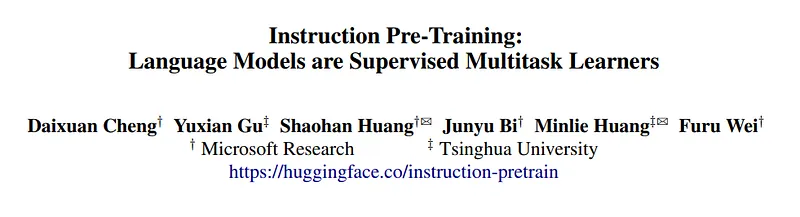 | Paper title: **Instruction Pre-Training** — language models as supervised multitask learners; link to **Hugging Face** checkpoints (`instruction-pretrain`). |
| 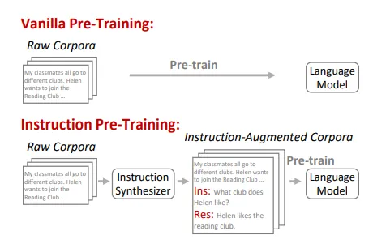 | **Vanilla pre-training** (raw corpora → LM) vs **instruction pre-training** — raw text passes through an **instruction synthesizer** into **instruction-augmented** sequences before **Pre-train**. |
| 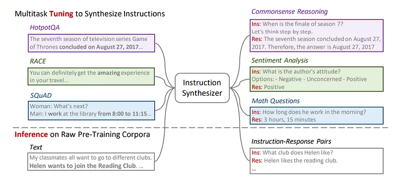 | **Multitask tuning** of the synthesizer on labeled QA/etc. datasets vs **inference** on **raw pre-training text** → synthetic **instruction–response** pairs (HotpotQA / RACE / SQuAD-style sketches). |
| 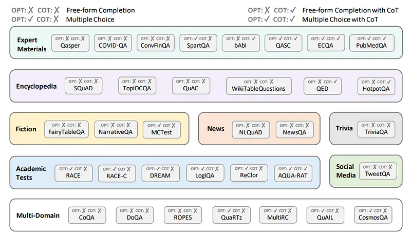 | **Synthesizer fine-tuning data**: QA datasets grouped by domain (encyclopedia, fiction, news, exams, …) with **multiple-choice** and **chain-of-thought** availability flags. |
| 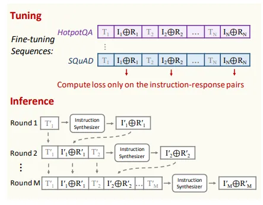 | **Tuning**: concatenate contexts \(T_n\) with \(I_n \oplus R_n\); **loss only on instruction–response spans**. **Inference**: multi-round synthesis conditioned on prior pairs \(I'_k \oplus R'_k\) and new text \(T'_k\). |
| 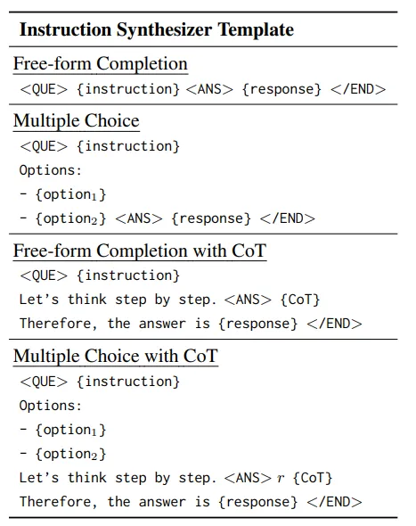 | **`<QUE>` / `<ANS>` / `</END>`** templates — free-form, multiple-choice, and CoT variants (standardizes synthesized pair formats). |
| 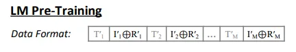 | **LM pre-training chunk**: interleaved raw spans \(T'_m\) and augmented spans \(I'_m \oplus R'_m\) (multi-turn synthesized supervision mixed into PT sequences). |
| 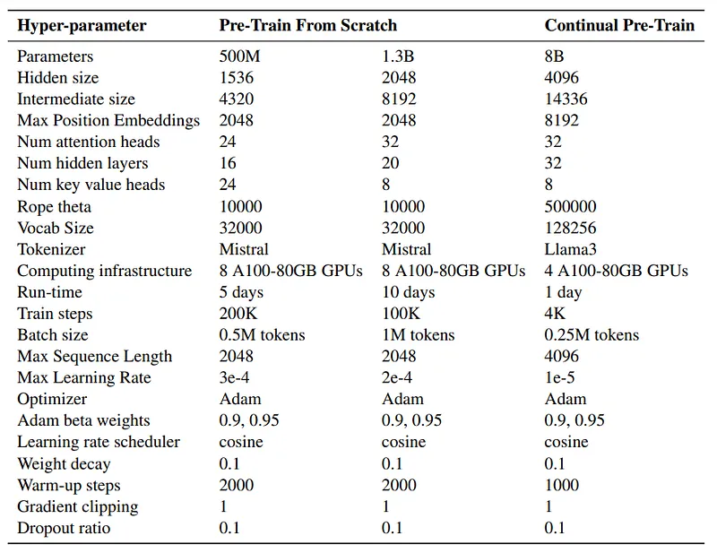 | **Hyper-parameters**: **from scratch** (500M / 1.3B Mistral-style) vs **continual** **Llama-3–8B** — architecture, tokenizer, batch, LR, steps, hardware. |
| 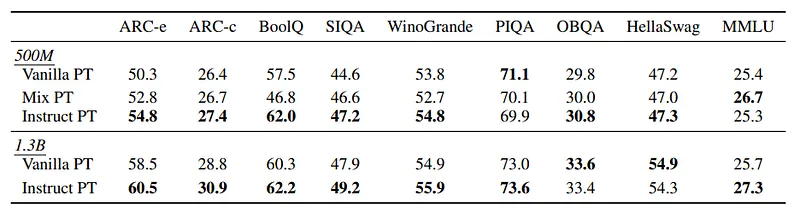 | **Zero-shot** commonsense / QA benchmarks — **Vanilla PT**, **Mix PT**, **Instruct PT** at **500M** and **1.3B** (ARC, BoolQ, SIQA, WinoGrande, PIQA, OBQA, HellaSwag, **MMLU**). |
| 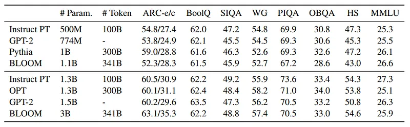 | **Data-efficiency**: **Instruct PT** at **100B tokens** vs **GPT-2**, **Pythia**, **BLOOM**, **OPT** at similar or larger params/token budgets — zero-shot grid. |
| 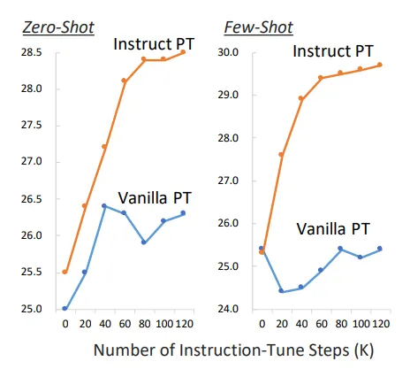 | **MMLU during downstream instruction tuning** — **Instruct PT** vs **Vanilla PT** (**zero-shot** vs **few-shot**) vs instruction-tune steps (0–120K). |
| 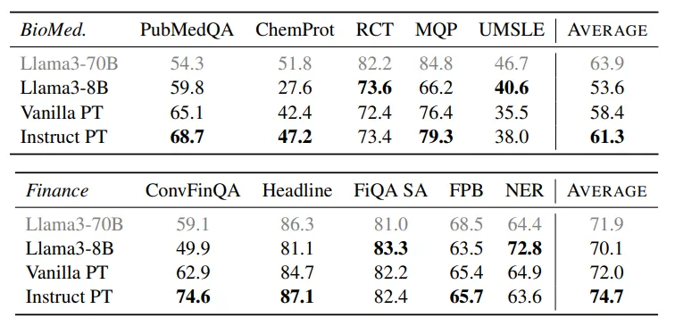 | **Domain-adaptive continual PT**: **BioMed** (PubMedQA, ChemProt, …) and **Finance** (ConvFinQA, FiQA, …) — **Llama3–8B** vanilla vs **Instruct PT** vs base **Llama3–8B** / reference **Llama3–70B**. |
## Related

- [[Papers Explained Corpus]]
- [[Synthetic Data]]
- [[Large Language Models]]
- [[Supervised Fine-Tuning]]
- [[Papers Explained 183 - Magpie]]
- [[Papers Explained 185 - GPT-4o]]

#summary #topic
