# Papers Explained 185 - GPT-4o

GPT-4o is an autoregressive omni model, which accepts as input any combination of text, audio, image, and video and generates any combination of text, audio, and image outputs. It’s trained end-to-end across text, vision, and audio, meaning that all inputs and outputs are processed by the same neural network.

This page ingests the source article into the wiki and connects it to [[Papers Explained Corpus]], [[Large Language Models]], [[Audio Models]], [[Reasoning Models]], [[Synthetic Data]], [[Code Models]].

## Source Metadata

- Source file: `raw/2024-08-14_Papers-Explained-185--GPT-4o-a234bccfd662.md`
- Source title: Papers Explained 185: GPT-4o
- Published: 2024-08-14
- Canonical: [https://medium.com/@ritvik19/papers-explained-185-gpt-4o-a234bccfd662](https://medium.com/@ritvik19/papers-explained-185-gpt-4o-a234bccfd662)

## Key Ideas

- GPT-4o is an autoregressive omni model, which accepts as input any combination of text, audio, image, and video and generates any combination of text, audio, and image outputs.
- Previously, for voice interaction, ChatGPT used a pipeline of three separate models: one simple model transcribes audio to text, GPT-3.5 or GPT-4 takes in text and outputs text, and a third simple model converts that text back to audio.
- GPT-4o’s text and voice capabilities were pre-trained using data up to October 2023, sourced from a wide variety of materials including
- Select publicly available data, mostly collected from industry-standard machine learning datasets and web crawls.
- Proprietary data from data partnerships. We form partnerships to access non-publicly available data, such as pay-walled content, archives, and metadata.

## Notes

GPT-4o is an autoregressive omni model, which accepts as input any combination of text, audio, image, and video and generates any combination of text, audio, and image outputs. It’s trained end-to-end across text, vision, and audio, meaning that all inputs and outputs are processed by the same neural network.

Previously, for voice interaction, ChatGPT used a pipeline of three separate models: one simple model transcribes audio to text, GPT-3.5 or GPT-4 takes in text and outputs text, and a third simple model converts that text back to audio. This resulted in the main model (GPT-4) losing a lot of information due to its inability to directly observe tone, multiple speakers, or background noises, and its inability to output laughter, singing, or express emotion.

## Model data and training

GPT-4o’s text and voice capabilities were pre-trained using data up to October 2023, sourced from a wide variety of materials including

- Select publicly available data, mostly collected from industry-standard machine learning datasets and web crawls.

- Proprietary data from data partnerships. We form partnerships to access non-publicly available data, such as pay-walled content, archives, and metadata.

The key dataset components that contribute to GPT-4o’s capabilities are:

- Web Data: Data from public web pages provides a rich and diverse range of information, ensuring the model learns from a wide variety of perspectives and topics.

- Code and Math: Including code and math data in training helps the model develop robust reasoning skills by exposing it to structured logic and problem-solving processes.

- Multimodal Data: Including images, audio, and video to teach the LLMs how to interpret and generate non-textual input and output.

## Evaluation

### Text Evaluation

Improved Reasoning — GPT-4o sets a new high-score of 88.7% on 0-shot COT MMLU (general knowledge questions). All these evals were gathered with our new simple evals(opens in a new window) library. In addition, on the traditional 5-shot no-CoT MMLU, GPT-4o sets a new high-score of 87.2%. (Note: Llama3 400b(opens in a new window) is still training)

### Audio ASR Performance

GPT-4o dramatically improves speech recognition performance over Whisper-v3 across all languages, particularly for lower-resourced languages.

### Audio Translation Performance

GPT-4o sets a new state-of-the-art on speech translation and outperforms Whisper-v3 on the MLS benchmark.

### M3Exam Zero-Shot Results

M3Exam — The M3Exam benchmark is both a multilingual and vision evaluation, consisting of multiple choice questions from other countries’ standardized tests that sometimes include figures and diagrams. GPT-4o is stronger than GPT-4 on this benchmark across all languages. (We omit vision results for Swahili and Javanese, as there are only 5 or fewer vision questions for these languages.

### Vision Understanding Evals

GPT-4o achieves state-of-the-art performance on visual perception benchmarks. All vision evals are 0-shot, with MMMU, MathVista, and ChartQA as 0-shot CoT.

### Improved Language tokenization

## Structured Outputs

August 6, 2024: Structured Outputs, a new feature in the API, ensures that model-generated outputs exactly match JSON Schemas provided by developers, solving the problem of generating structured data from unstructured inputs and eliminating the need for workarounds such as retrying requests or using open-source tooling.

- On the evals of complex JSON schema following, the new model gpt-4o-2024-08-06 with Structured Outputs scores a perfect 100%. In comparison, gpt-4-0613 scores less than 40%.

- With Structured Outputs, gpt-4o-2024-08-06 achieves 100% reliability in our evals, perfectly matching the output schemas.

## Risk identification, assessment and mitigation

The deployment preparation for OpenAI’s GPT-4o model involved identifying potential risks through expert red teaming, which was carried out by over 100 external red teamers from 29 different countries and speaking 45 different languages. The red teaming process consisted of four phases, with the final phase using the full iOS experience to test the model.

The red teamers tested the model for various risks, including violative content, misinformation, bias, ungrounded inferences, sensitive trait attribution, private information, geolocation, person identification, emotional perception, and anthropomorphism. They also evaluated the model’s capabilities in natural science and multilingual observations.

To evaluate the model’s speech-to-speech capabilities, OpenAI used a text-to-speech (TTS) system called Voice Engine to convert text inputs into audio, which was then fed into the GPT-4o model. The outputs were scored based on their textual content, except in cases where the audio needed to be evaluated directly.

However, there are some limitations to this evaluation methodology, including:

1. The validity of the evaluation format depends on the capability and reliability of the TTS model.

2. Certain text inputs may not be suitable for conversion to audio, such as mathematical equations or code.

3. The TTS model may not accurately translate certain text inputs into audio, which could affect the results of the evaluations.

Additionally, there are other dimensions that may not be captured in a TTS-based evaluation, such as different voice intonations and valence, background noise, or cross-talk, that could lead to different model behavior in practical usage.

To mitigate potential risks with the model, OpenAI trained the model to adhere to certain behaviors via post-training methods and integrated classifiers for blocking specific generations. The observed safety challenges and mitigations are outlined below:

## GPT-4o mini

GPT-4o mini is a cost-efficient small model that outperforms GPT-4 on chat preferences in LMSYS leaderboard and is over 60% cheaper than GPT-3.5 Turbo.

GPT-4o mini enables a range of tasks with its low cost and latency, including applications that chain or parallelize multiple model calls, pass large volumes of context to the model, or interact with customers through fast, real-time text responses.

The model supports text and vision in the API, with support for text, image, video, and audio inputs and outputs coming in the future. It has a context window of 128K tokens, supports up to 16K output tokens per request, and has knowledge up to October 2023.

### GPT-4o mini’s Performance

- Surpasses GPT-3.5 Turbo and other small models on academic benchmarks

- Supports same range of languages as GPT-4o

- Strong performance in: Function calling, enabling data fetching or external system interactions, Long-context performance

- MMLU (textual intelligence and reasoning): 82.0% (better than Gemini Flash and Claude Haiku)

- MGSM (math reasoning): 87.0% (better than Gemini Flash and Claude Haiku)

- HumanEval (coding performance): 87.2% (better than Gemini Flash and Claude Haiku)

- MMMU: 59.4% (better than Gemini Flash and Claude Haiku)

## Paper

[Hello GPT-4o](https://openai.com/index/hello-gpt-4o/)

[GPT-4o mini: advancing cost-efficient intelligence](https://openai.com/index/gpt-4o-mini-advancing-cost-efficient-intelligence/)

[Introducing Structured Outputs in the API](https://openai.com/index/introducing-structured-outputs-in-the-api/)

[GPT-4o System Card](https://openai.com/index/gpt-4o-system-card/)

Recommended Reading [GPT Models](https://ritvik19.medium.com/list/gpt-models-fa2cc801d840)

## Figures

Figures from the Medium HTML export (`raw/2024-08-14_Papers-Explained-185--GPT-4o-a234bccfd662.md`); local copies under `wiki/assets/papers-explained-185-gpt-4o/` when download succeeded.

| Figure | Caption |
|--------|---------|
|  | Title card: GPT-4o. |
| 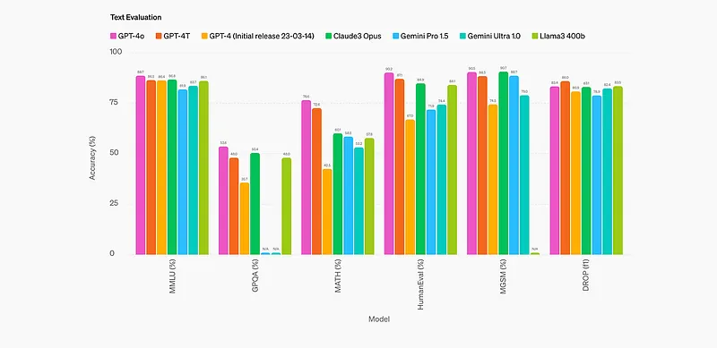 | The key dataset components that contribute to GPT-4o’s capabilities are. |
| 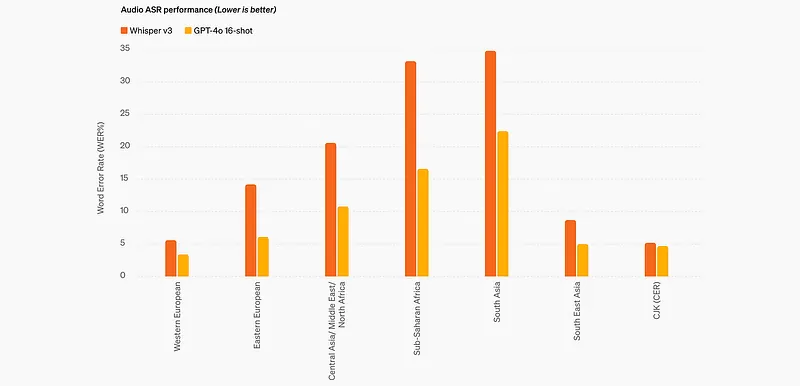 | Improved Reasoning — GPT-4o sets a new high-score of 88.7% on 0-shot COT MMLU (general knowledge questions). |
| 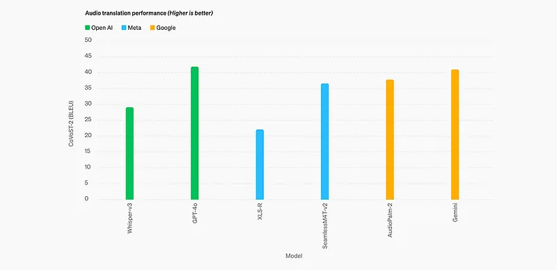 | GPT-4o dramatically improves speech recognition performance over Whisper-v3 across all languages, particularly for lower-resourced... |
| 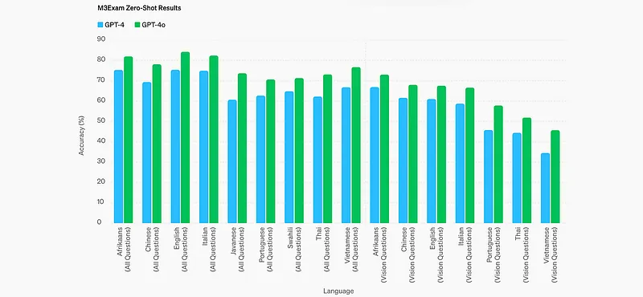 | GPT-4o sets a new state-of-the-art on speech translation and outperforms Whisper-v3 on the MLS benchmark. |
| 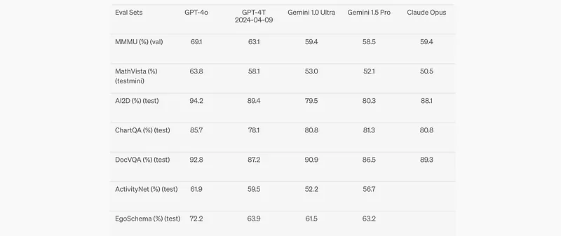 | GPT-4o achieves state-of-the-art performance on visual perception benchmarks. |
| 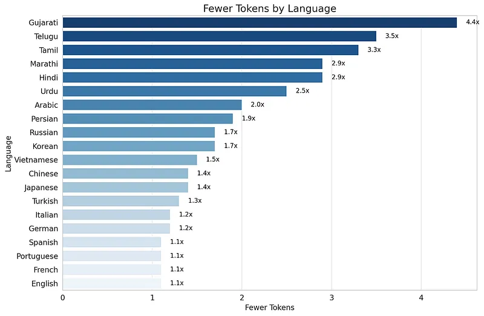 | GPT-4o achieves state-of-the-art performance on visual perception benchmarks. |
| 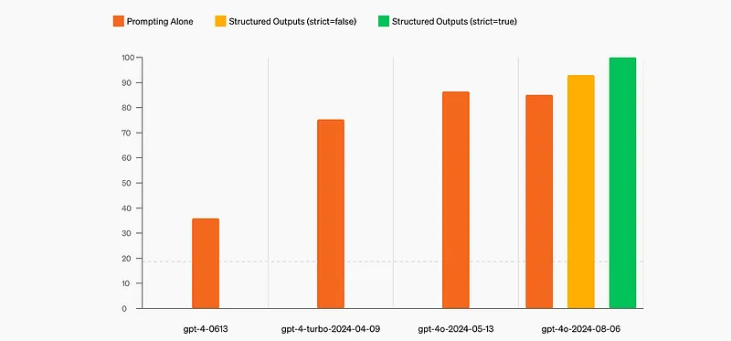 | Structured Outputs. |
| 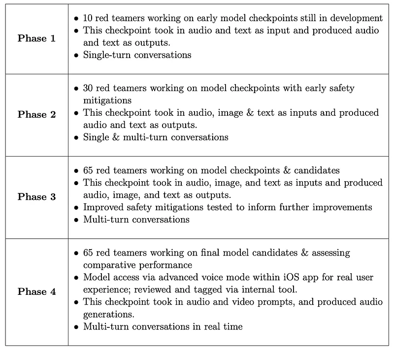 | To evaluate the model’s speech-to-speech capabilities, OpenAI used a text-to-speech (TTS) system called Voice Engine to convert text inputs... |
| 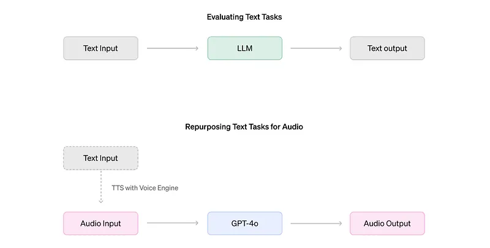 | However, there are some limitations to this evaluation methodology, including. |
| 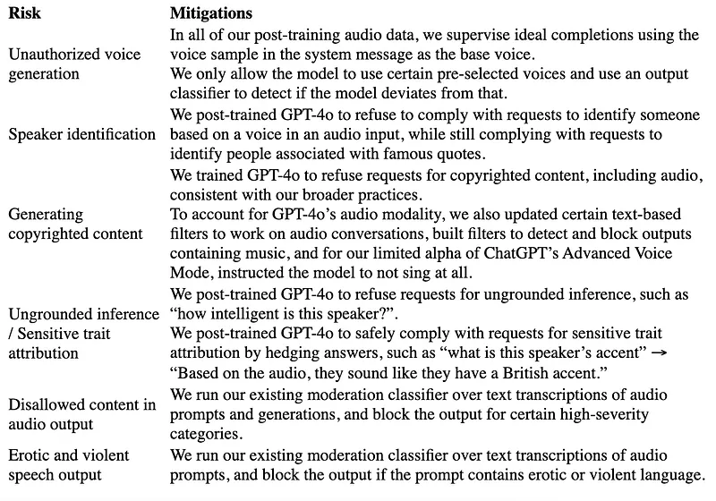 | Risk identification, assessment and mitigation. |
| 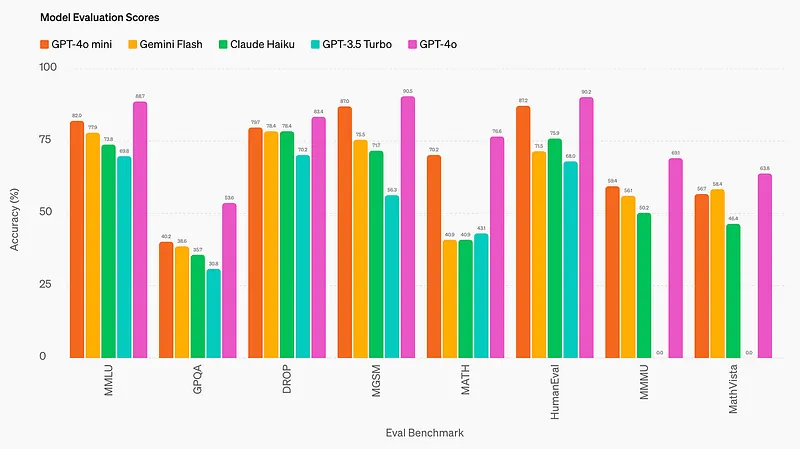 | The model supports text and vision in the API, with support for text, image, video, and audio inputs and outputs coming in the future. |
## Related

- [[Papers Explained Corpus]]
- [[Large Language Models]]
- [[Audio Models]]
- [[Reasoning Models]]
- [[Synthetic Data]]
- [[Code Models]]
- [[Papers Explained 184 - Instruction Pretraining]]
- [[Papers Explained 186 - Grok]]

#summary #topic
