# Papers Explained 186 - Grok

Grok is a 314B Mixture-of-Experts model, with 25% of the weights active on a given token, modeled after the Hitchhiker’s Guide to the Galaxy, hence designed to answer questions with a bit of wit and has a rebellious streak. It will also answer spicy questions that are rejected by most other AI systems .

This page ingests the source article into the wiki and connects it to [[Papers Explained Corpus]], [[Large Language Models]], [[Mixture of Experts]], [[Reasoning Models]], [[Model Compression and Efficiency]], [[Long Context]]. Official primary sources for the Grok lineage live in [[Grok Models]] (17 x.ai news posts, ingested 2026-06-11).

## Source Metadata

- Source file: `raw/2024-08-14_Papers-Explained-186--Grok-0d9f1aef69be.md`
- Source title: Papers Explained 186: Grok
- Published: 2024-08-14
- Canonical: [https://medium.com/@ritvik19/papers-explained-186-grok-0d9f1aef69be](https://medium.com/@ritvik19/papers-explained-186-grok-0d9f1aef69be)

## Key Ideas

- Grok is a 314B Mixture-of-Experts model, with 25% of the weights active on a given token, modeled after the Hitchhiker’s Guide to the Galaxy, hence designed to answer questions with a bit of wit and has a rebellious streak.
- Grok-1 displayed strong results, surpassing all other models in its compute class, including ChatGPT-3.5.
- Grok-1.5 is an advancement over grok, capable of long context understanding up to 128k tokens and advanced reasoning.
- Grok-1.5 can handle longer and more complex prompts, while still maintaining its instruction-following capability, In the Needle In A Haystack (NIAH) evaluation, Grok-1.5 achieved powerful perfect retrieval results for embedded text within contexts of up to...
- Grok-1.5V, is the first multimodal model in the grok series. In addition to its strong text capabilities, Grok 1.5V can process a wide variety of visual information, including documents, diagrams, charts, screenshots, and photographs.

## Notes

Grok is a 314B Mixture-of-Experts model, with 25% of the weights active on a given token, modeled after the Hitchhiker’s Guide to the Galaxy, hence designed to answer questions with a bit of wit and has a rebellious streak. It will also answer spicy questions that are rejected by most other AI systems . It has real-time knowledge of the world via the 𝕏 platform.

Grok-1 displayed strong results, surpassing all other models in its compute class, including ChatGPT-3.5.

## Grok 1.5

Grok-1.5 is an advancement over grok, capable of long context understanding up to 128k tokens and advanced reasoning.

Grok-1.5 can handle longer and more complex prompts, while still maintaining its instruction-following capability, In the Needle In A Haystack (NIAH) evaluation, Grok-1.5 achieved powerful perfect retrieval results for embedded text within contexts of up to 128K tokens.

## Grok 1.5 V

Grok-1.5V, is the first multimodal model in the grok series. In addition to its strong text capabilities, Grok 1.5V can process a wide variety of visual information, including documents, diagrams, charts, screenshots, and photographs.

## Grok 2 and Grok 2 Mini

Grok-2 is a frontier language model with state-of-the-art capabilities in chat, coding, and reasoning on par with Claude 3.5 Sonnet and GPT-4-Turbo. Grok-2 mini is a small but capable sibling of Grok-2.

On the lmsys arena Grok-2 outperforms both Claude 3.5 Sonnet and GPT-4-Turbo.

Both Grok-2 and Grok-2 mini demonstrate significant improvements over the previous Grok-1.5 model.

- * GPT-4-Turbo and GPT-4o scores are from the May 2024 release.

- † Claude 3 Opus and Claude 3.5 Sonnet scores are from the June 2024 release.

- ‡ Grok-2 MMLU, MMLU-Pro, MMMU and MathVista were evaluated using 0-shot CoT.

- § For MATH, maj@1 results are presented.

- ¶ For HumanEval, pass@1 benchmark scores are reported.

## Grok 3 Beta

Grok 3 is a cutting-edge language model developed with a focus on strong reasoning and extensive pretraining knowledge. Trained on the Colossus supercluster with significantly increased compute power, it shows marked improvements in reasoning, mathematics, coding, world knowledge, and instruction-following.

- Advanced Reasoning: Utilizes large-scale reinforcement learning (RL) to refine its chain-of-thought process, enabling it to think for seconds to minutes, correct errors, explore alternatives, and deliver accurate answers. This “Think” mode allows users to inspect the model’s reasoning process.

- High Performance: Achieves leading performance on academic benchmarks and real-world user preferences, including:

- 93.3% on the 2025 American Invitational Mathematics Examination (AIME) with highest test-time compute.

- 84.6% on graduate-level expert reasoning (GPQA).

- 79.4% on LiveCodeBench for code generation and problem-solving.

- An Elo score of 1402 in the Chatbot Arena (early version codenamed “chocolate”).

- Massive Scale Pretraining: Even without the “Think” mode, Grok 3 provides instant, high-quality responses and state-of-the-art results on benchmarks like GPQA (graduate-level science knowledge), MMLU-Pro (general knowledge), AIME (math), MMMU (image understanding), and EgoSchema (video understanding).

- Large Context Window: A 1 million token context window (8x larger than previous models) allows processing of extensive documents and complex prompts while maintaining accuracy. Achieved state-of-the-art accuracy on the LOFT (128k) benchmark for long-context RAG use cases.

- Improved Factual Accuracy and Stylistic Control: Demonstrates enhanced accuracy and control over language style.

- Grok 3 mini: A cost-efficient version for STEM tasks requiring less world knowledge, achieving 95.8% on AIME 2024 and 80.4% on LiveCodeBench.

- Grok Agents (e.g., DeepSearch): Combines reasoning with tool use, including code interpreters and internet access. DeepSearch is designed to synthesize information, reason about conflicting facts, and provide concise summaries.

## Grok 4

Grok 4 represents a significant advancement in AI, building upon previous iterations with enhanced capabilities and new features.

Grok 4’s development leveraged insights and infrastructure from Grok 3, scaling up key training methodologies:

- Built upon Grok 3 Reasoning, which used RL to improve problem-solving accuracy and thinking duration.

- Utilized the Colossus 200k GPU cluster to run RL for refining reasoning abilities at a pretraining scale.

- Innovations: Achieved a 6x increase in compute efficiency for training through new infrastructure and algorithmic work.

- Data Collection: Significantly expanded verifiable training data from primarily math and coding to many more domains.

- Performance Gains: The training run showed smooth performance gains while training on over an order of magnitude more compute than previously.

Native Tool Use:

- Trained with reinforcement learning to use tools.

- Augments its thinking with tools like a code interpreter and web browsing.

- Real-time Information: Chooses its own search queries for real-time information and difficult research questions, diving deeply to craft high-quality responses.

- X Integration: Can use powerful tools to find information deep within X, including advanced keyword and semantic search, and can view media.

Grok 4 Heavy

- Parallel Test-Time Compute: Features further progress on parallel test-time compute, allowing the model to consider multiple hypotheses simultaneously.

- Performance and Reliability: Sets a new standard for performance and reliability.

- Benchmark Saturation: Saturates most academic benchmarks.

Grok 4 Voice Mode

- Enhanced Voice Experience: Offers an upgraded Voice Mode with enhanced realism, responsiveness, and intelligence.

- New Voice: Introduces a serene and brand-new voice, redesigning conversations for a more natural feel.

Visual Analysis (See What You See):

- Allows users to point their camera and speak.

- Pulls live insights, analyzing the scene and responding in real-time from within the voice chat experience.

- This capability is powered by an in-house trained model using a state-of-the-art reinforcement learning framework and speech compression techniques.

## Grok 4 Fast

Grok 4 Fast is a cost-efficient reasoning model, built upon the learnings from Grok 4. It offers frontier-level performance in both Enterprise and Consumer domains with exceptional token efficiency.

- Outperforms Grok 3 Mini on reasoning benchmarks while reducing token costs.

- Achieves comparable performance to Grok 4 with 40% fewer thinking tokens on average, resulting in a 98% reduction in price to achieve the same performance.

- Maximizes performance at minimum cost, achieving a state-of-the-art price-to-intelligence ratio.

- Features a 2M token context window.

- Blends reasoning (long chain-of-thought) and non-reasoning (quick responses) modes in a single model, reducing latency and token costs.

- Trained end-to-end with tool-use reinforcement learning (RL), excelling at using tools like code execution and web browsing.

- Exhibits frontier agentic search capabilities, browsing the web and X to augment queries with real-time data, including images and videos.

## Grok 4.1

Grok 4.1 introduces significant enhancements focused on real-world usability, while retaining the core intelligence and reliability of its predecessors.

- Creative, Emotional, and Collaborative Interactions: The model is exceptionally capable in these areas.

- Perceptive to Nuanced Intent: It demonstrates better understanding of subtle user intentions.

- Compelling to Speak With: Interactions are more engaging.

- Coherent Personality: The model maintains a consistent personality.

- Razor-Sharp Intelligence and Reliability: These foundational strengths from previous versions are fully retained.

- Grok 4.1 Thinking (code name: quasarflux) holds the #1 overall position with 1483 Elo, a 31-point lead over the highest non-xAI model.

- Grok 4.1 non-reasoning (code name: tensor), which uses no thinking tokens for immediate responses, ranks #2 at 1465 Elo. This non-thinking configuration surpasses every other model’s full-reasoning configuration on the public leaderboard.

- Grok 4.1 significantly surpasses Grok 4, which previously held an overall rank of #33.

## Figures

Figures from the Medium HTML export (`raw/2024-08-14_Papers-Explained-186--Grok-0d9f1aef69be.md`); local copies under `wiki/assets/papers-explained-186-grok/` when download succeeded.

| Figure | Caption |
|--------|---------|
| 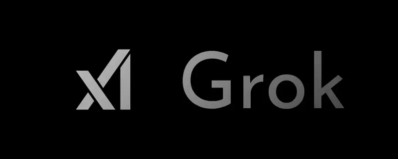 | Title card: Grok. |
| 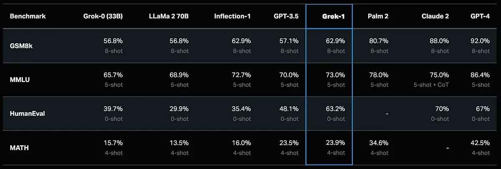 | Grok-1 displayed strong results, surpassing all other models in its compute class, including ChatGPT-3.5. |
| 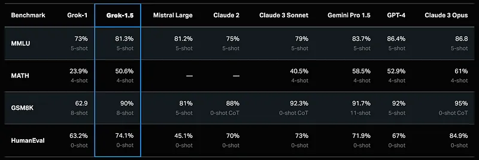 | Grok-1.5 is an advancement over grok, capable of long context understanding up to 128k tokens and advanced reasoning. |
| 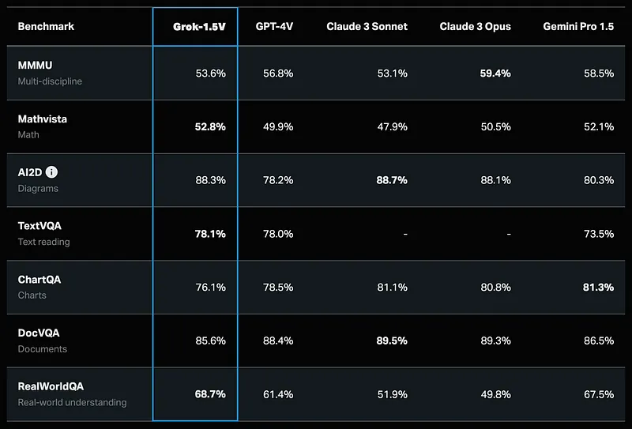 | Grok-1.5V, is the first multimodal model in the grok series. |
| 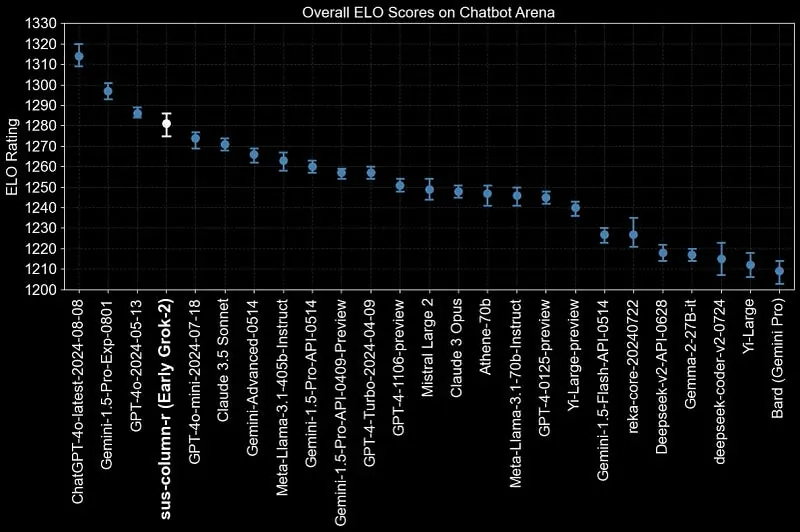 | On the lmsys arena Grok-2 outperforms both Claude 3.5 Sonnet and GPT-4-Turbo. |
| 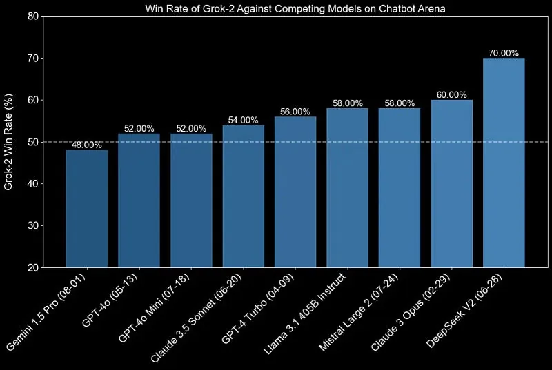 | On the lmsys arena Grok-2 outperforms both Claude 3.5 Sonnet and GPT-4-Turbo. |
| 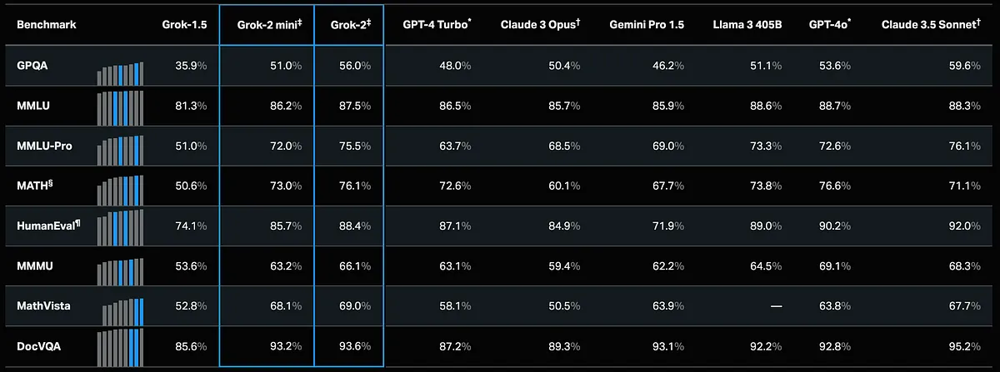 | Both Grok-2 and Grok-2 mini demonstrate significant improvements over the previous Grok-1.5 model. |
| 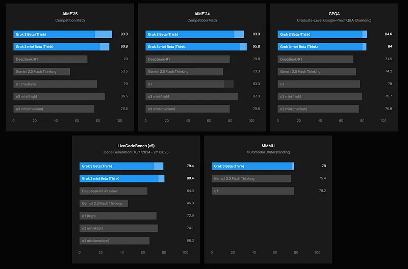 | Grok 3 is a cutting-edge language model developed with a focus on strong reasoning and extensive pretraining knowledge. |
| 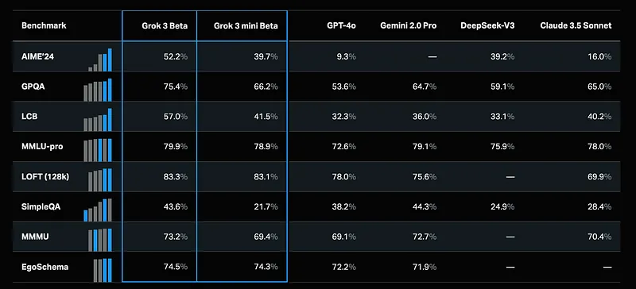 | Grok 3 is a cutting-edge language model developed with a focus on strong reasoning and extensive pretraining knowledge. |
| 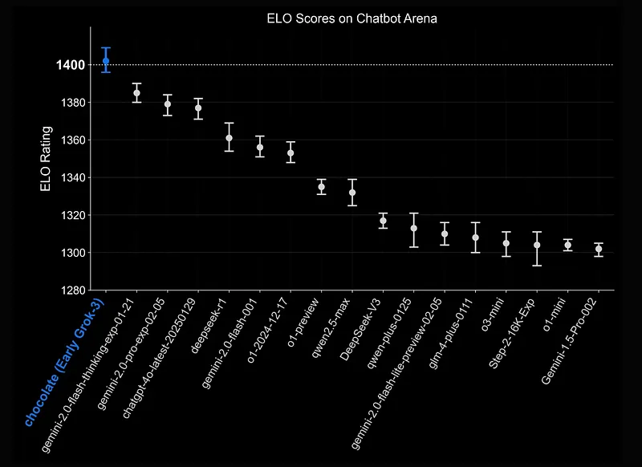 | Grok 3 is a cutting-edge language model developed with a focus on strong reasoning and extensive pretraining knowledge. |
| 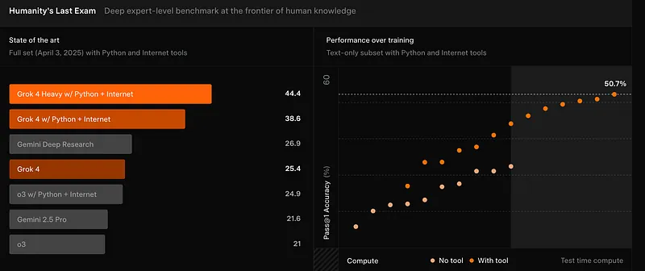 | Grok 4’s development leveraged insights and infrastructure from Grok 3, scaling up key training methodologies. |
| 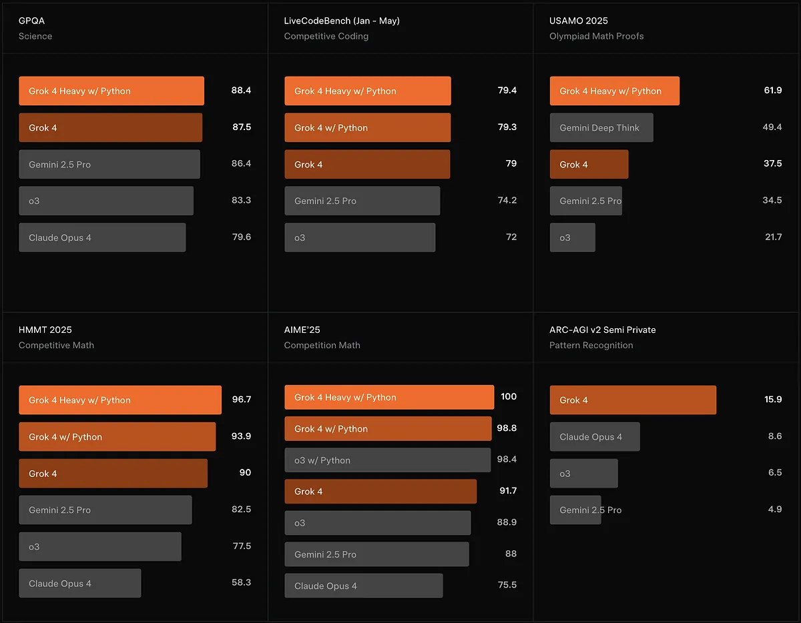 | Grok 4 Heavy. |
| 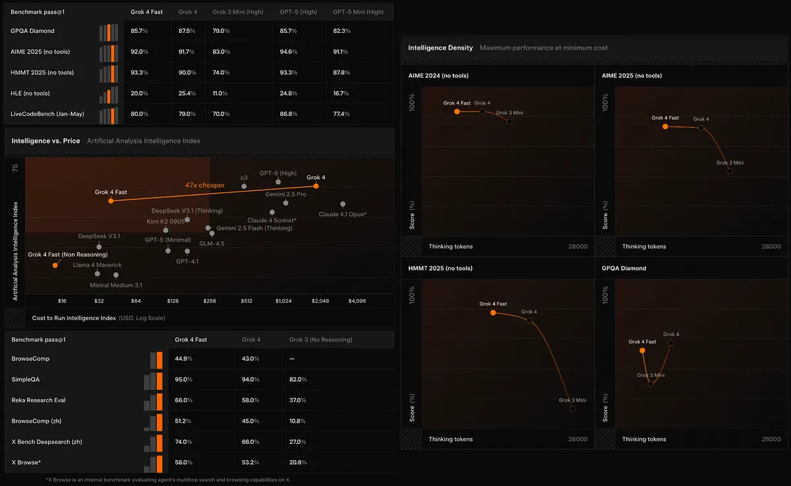 | Grok 4 Fast is a cost-efficient reasoning model, built upon the learnings from Grok 4. |
| 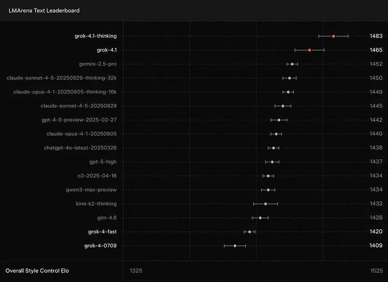 | Visual Analysis (See What You See). |
| 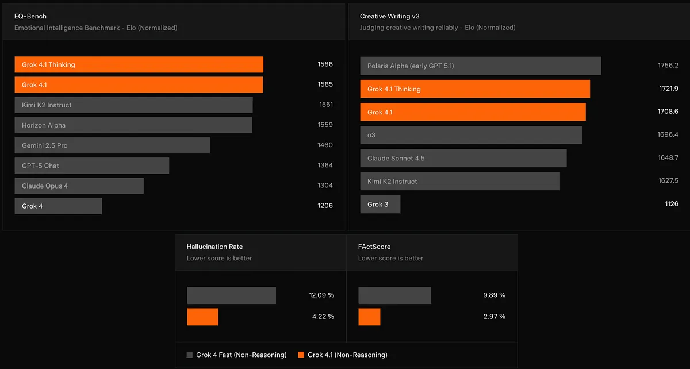 | Visual Analysis (See What You See):: Hungry for more insights? |
## Related

- [[Grok Models]] — official xAI timeline (primary source for releases through Imagine 1.5).
- [[xAI]] — org entity page.
- [[Papers Explained Corpus]]
- [[Large Language Models]]
- [[Mixture of Experts]]
- [[Reasoning Models]]
- [[Model Compression and Efficiency]]
- [[Long Context]]
- [[Papers Explained 185 - GPT-4o]]
- [[Papers Explained 187a - Llama 3]]

#summary #topic
