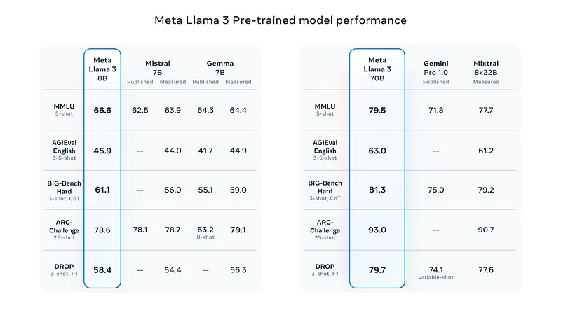
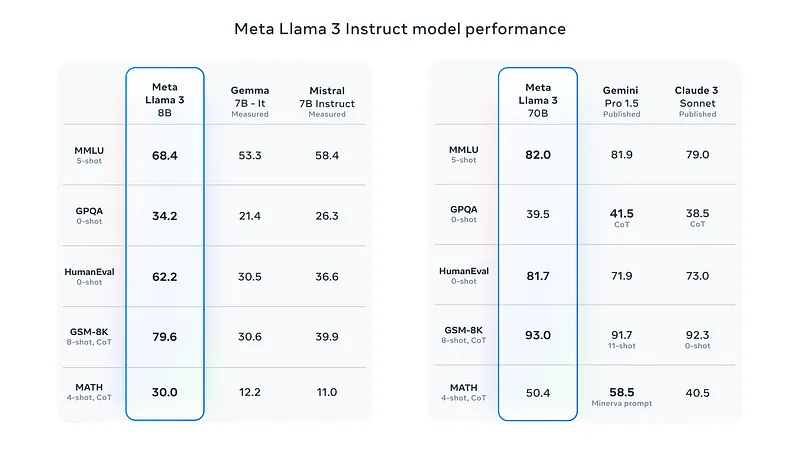
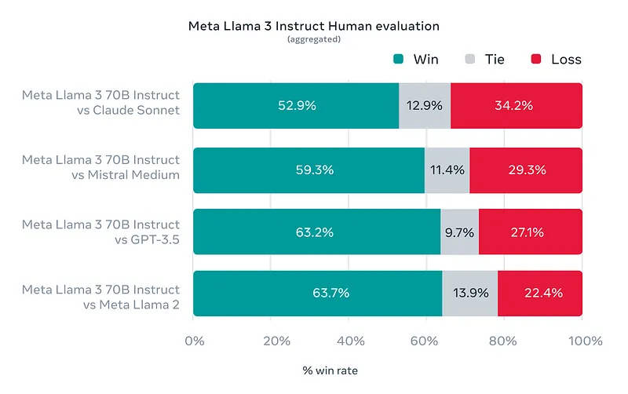

# Papers Explained 187a - Llama 3

Llama 3 is a new set of foundation models, designed for multilinguality, coding, reasoning, and tool usage. The largest model boasts 405B parameters and a 128K token context window performing comparably to leading models like GPT-4 across various tasks. And smaller models outperforming alternatives of similar size.

This page ingests the source article into the wiki and connects it to [[Papers Explained Corpus]], [[Large Language Models]], [[Long Context]], [[Code Models]], [[Reasoning Models]], [[Agentic AI]].

## Source Metadata

- Source file: `raw/2024-08-15_Papers-Explained-187a--Llama-3-51e2b90f63bb.md`
- Source title: Papers Explained 187a: Llama 3
- Published: 2024-08-15
- Canonical: [https://medium.com/@ritvik19/papers-explained-187a-llama-3-51e2b90f63bb](https://medium.com/@ritvik19/papers-explained-187a-llama-3-51e2b90f63bb)

## Key Ideas

- Llama 3 is a new set of foundation models, designed for multilinguality, coding, reasoning, and tool usage. The largest model boasts 405B parameters and a 128K token context window performing comparably to leading models like GPT-4 across various tasks.
- This article covers the llama 3 models released in April 2024.
- The models are available at [HuggingFace](https://huggingface.co/collections/meta-llama/meta-llama-3-66214712577ca38149ebb2b6).
- Llama 3 follows a relatively standard decoder-only transformer architecture. Compared to Llama 2, several key improvements are made.
- A tokenizer with a vocabulary of 128K tokens that encodes language much more efficiently, which leads to substantially improved model performance.

## Notes

Llama 3 is a new set of foundation models, designed for multilinguality, coding, reasoning, and tool usage. The largest model boasts 405B parameters and a 128K token context window performing comparably to leading models like GPT-4 across various tasks. And smaller models outperforming alternatives of similar size.

This article covers the llama 3 models released in April 2024.

The models are available at [HuggingFace](https://huggingface.co/collections/meta-llama/meta-llama-3-66214712577ca38149ebb2b6).

*Figure: Overview of the Llama 3 Herd of models.*

### Architecture

Llama 3 follows a relatively standard decoder-only transformer architecture. Compared to Llama 2, several key improvements are made.

- A tokenizer with a vocabulary of 128K tokens that encodes language much more efficiently, which leads to substantially improved model performance.

- Grouped query attention (GQA) across both the 8B and 70B sizes to improve the inference efficiency.

- The models are trained on sequences of 8,192 tokens, using a mask to ensure self-attention does not cross document boundaries.

### Training Data

Llama 3 is pre-trained on over 15T tokens collected from publicly available sources i.e. 7x larger than that of Llama 2. It includes four times more code.To prepare for upcoming multilingual use cases, over 5% of the Llama 3 pre-training dataset consists of high-quality non-English data that covers over 30 languages.

To ensure Llama 3 is trained on data of the highest quality, a series of data-filtering pipelines are developed including using heuristic filters, NSFW filters, semantic deduplication approaches, and text classifiers to predict data quality. Llama 2 is used to generate the training data for the text-quality classifiers that are powering Llama 3.

### Pretraining

Detailed scaling laws were developed for evaluating downstream benchmarks in Llama 3 models, which allows them to select an optimal data mix and make informed decisions on training compute usage. These scaling laws enable predictions of performance on key tasks (e.g., code generation) before actually training the models, ensuring strong performance across various use cases.

During the development of Llama 3, several new observations were made regarding scaling behavior:

- The Chinchilla-optimal amount of training compute for an 8B parameter model is approximately 200B tokens.

- However, it was found that model performance continues to improve even after being trained on two orders of magnitude more data (up to 15T tokens), with a log-linear improvement.

- Larger models can match the performance of smaller models with less training compute, but smaller models are generally preferred due to their efficiency during inference.

### Instruction Fine Tuning

The approach to post-training is a combination of supervised fine-tuning (SFT), rejection sampling, proximal policy optimization (PPO), and direct preference optimization (DPO).

The quality of the prompts that are used in SFT and the preference rankings that are used in PPO and DPO has an outsized influence on the performance of aligned models.

Learning from preference rankings via PPO and DPO also greatly improved the performance of Llama 3 on reasoning and coding tasks. It is found that if you ask a model a reasoning question that it struggles to answer, the model will sometimes produce the right reasoning trace: The model knows how to produce the right answer, but it does not know how to select it. Training on preference rankings enables the model to learn how to select it.

### Performance

- The pretrained models establishe a new state-of-the-art for LLM models at those scales.

- The new 8B and 70B Llama 3 models are a major leap over Llama 2 and establish a new state-of-the-art for LLM models at those scales.

- Great improvements are observed in capabilities like reasoning, code generation, and instruction following.

- Preference rankings by human annotators highlight the strong performance of our 70B instruction-following model compared to competing models of comparable size in real-world scenarios.

## Paper

[Introducing Meta Llama 3: The most capable openly available LLM to date](https://ai.meta.com/blog/meta-llama-3/)

[Introducing Llama 3.1: Our most capable models to date](https://ai.meta.com/blog/meta-llama-3-1/)

Recommended Reading [LLaMA Models](https://ritvik19.medium.com/list/llama-models-5b8ea07308cb)

## Figures

Figures from the Medium HTML export (`raw/2024-08-15_Papers-Explained-187a--Llama-3-51e2b90f63bb.md`); local copies under `wiki/assets/papers-explained-187a-llama-3/` when download succeeded.

| Figure | Caption |
|--------|---------|
|  | Meta report banner — **The Llama 3 Herd of Models** (Llama Team, Meta AI). |
|  | **Llama 3** vs **Llama 3.1** lineup — finetuned / multilingual / long context / tool use flags and release dates (includes **405B**). |
|  | **Pretrained** benchmarks — **Llama 3 8B** vs Mistral 7B / Gemma 7B; **Llama 3 70B** vs Gemini Pro 1.0 / Mixtral 8×22B (MMLU, AGIEval, BBH, ARC, DROP). |
|  | **Instruct** benchmarks — **Llama 3 8B** vs Gemma / Mistral; **70B** vs Gemini Pro 1.5 / Claude 3 Sonnet (MMLU, GPQA, HumanEval, GSM8K, MATH). |
|  | **Human preference** (aggregated): **Llama 3 70B Instruct** vs Claude Sonnet, Mistral Medium, GPT-3.5, Llama 2 — win / tie / loss stacked bars. |
## HF Blog Cross-References

- [Welcome Llama 3 - Meta's new open LLM](https://huggingface.co/blog/llama3) (2024-04-18) — Hugging Face's launch-day integration post for the April 2024 8B/70B release: model cards and licenses on the Hub, Transformers support, HuggingChat for the 70B, and inference integrations with Inference Endpoints, Google Cloud, and Amazon SageMaker. Same models as covered above.

## Related

- [[Papers Explained Corpus]]
- [[Large Language Models]]
- [[Long Context]]
- [[Code Models]]
- [[Reasoning Models]]
- [[Agentic AI]]
- [[Papers Explained 186 - Grok]]
- [[Papers Explained 187b - Llama 3.1]]

#summary #topic
