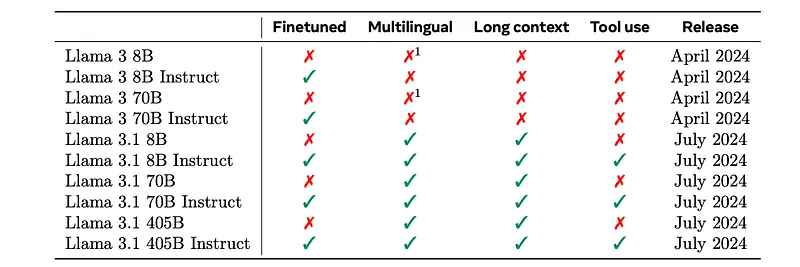
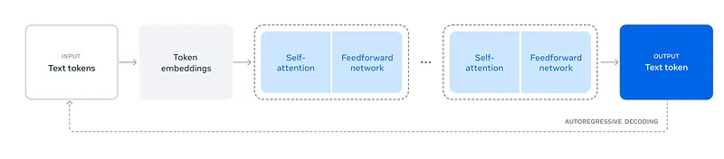
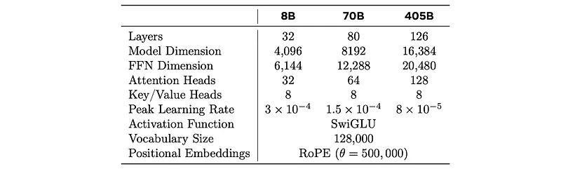
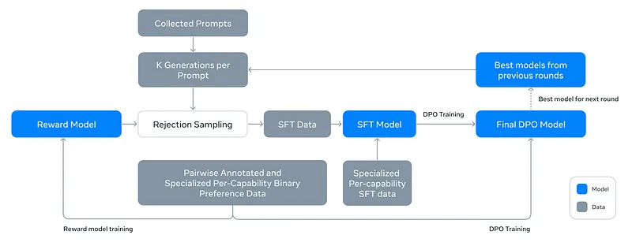
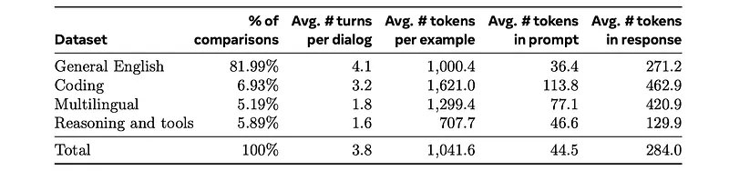
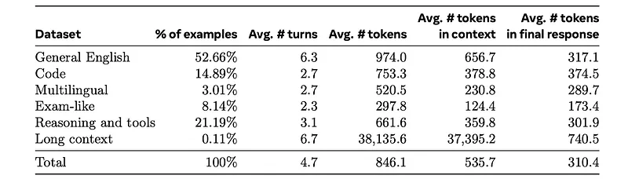
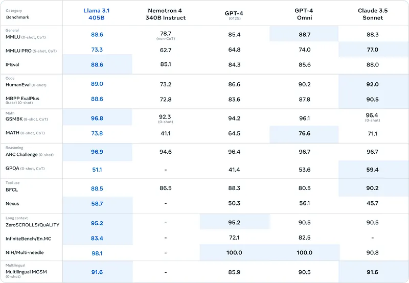
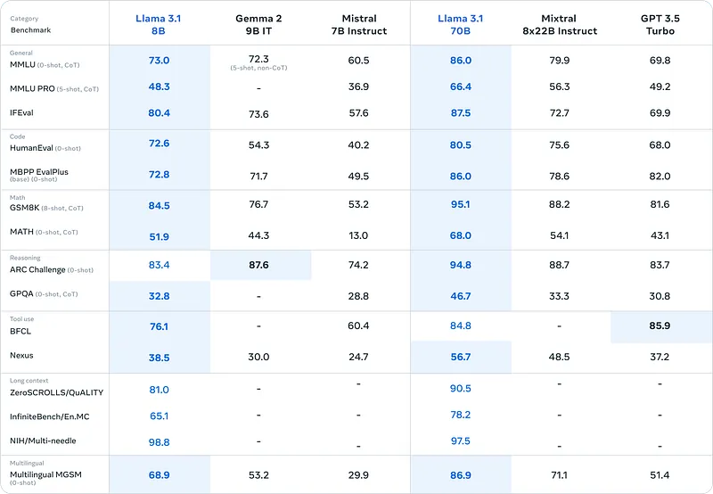
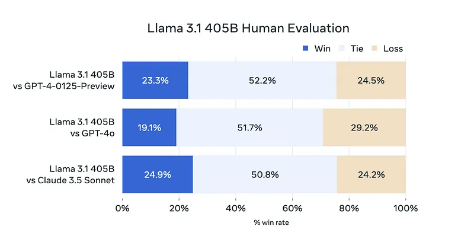

# Papers Explained 187b - Llama 3.1

Llama 3 is a new set of foundation models, designed for multilinguality, coding, reasoning, and tool usage. The largest model boasts 405B parameters and a 128K token context window performing comparably to leading models like GPT-4 across various tasks. And smaller models outperforming alternatives of similar size.

This page ingests the source article into the wiki and connects it to [[Papers Explained Corpus]], [[Large Language Models]], [[Long Context]], [[Reinforcement Learning Topic]], [[Reasoning Models]], [[Code Models]], [[Supervised Fine-Tuning]].

## Source Metadata

- Source file: `raw/2024-08-16_Papers-Explained-187b--Llama-3-1-f0fb06898c59.md`
- Source title: Papers Explained 187b: Llama 3.1
- Published: 2024-08-16
- Canonical: [https://medium.com/@ritvik19/papers-explained-187b-llama-3-1-f0fb06898c59](https://medium.com/@ritvik19/papers-explained-187b-llama-3-1-f0fb06898c59)

## Key Ideas

- Llama 3 is a new set of foundation models, designed for multilinguality, coding, reasoning, and tool usage. The largest model boasts 405B parameters and a 128K token context window performing comparably to leading models like GPT-4 across various tasks.
- This article covers the models released in July 2024.
- Refer the Part A of this article to read about the models released in April 2024: [Papers Explained 187a: Llama 3](https://ritvik19.medium.com/papers-explained-187a-llama-3-51e2b90f63bb)
- The development of Llama 3 language models involves two main stages:
- During the pre-training stage, the model learns the structure of language and obtains knowledge about the world from text.

## Notes

Llama 3 is a new set of foundation models, designed for multilinguality, coding, reasoning, and tool usage. The largest model boasts 405B parameters and a 128K token context window performing comparably to leading models like GPT-4 across various tasks. And smaller models outperforming alternatives of similar size.

This article covers the models released in July 2024.

Refer the Part A of this article to read about the models released in April 2024: [Papers Explained 187a: Llama 3](https://ritvik19.medium.com/papers-explained-187a-llama-3-51e2b90f63bb)

*Figure: Overview of the Llama 3 Herd of models.*

The development of Llama 3 language models involves two main stages:

During the pre-training stage, the model learns the structure of language and obtains knowledge about the world from text. A 405B parameters model is trained on a massive dataset of 15.6T tokens using a context window of 8K tokens, which is then increased to 128K tokens.

The pre-trained language model has a rich understanding of language but does not yet follow instructions or behave like an assistant. To address this, the model undergoes post-training, which involves aligning it with human feedback through supervised finetuning and direct preference optimization in several rounds.

*Figure: The overall architecture and training of Llama 3.*

In addition to language modeling, Llama 3 also includes multi-modal encoders for images and speech.

The image encoder is trained on large amounts of image-text pairs to learn the relation between visual content and natural language descriptions, while the speech encoder is trained using a self-supervised approach that masks out parts of the speech inputs and tries to reconstruct the masked-out parts.

To integrate these multi-modal encoders into the language model, adapters are trained for images and videos. The image adapter consists of cross-attention layers that feed image encoder representations into the language model, while the video adapter aggregates information across frames. Similarly, a speech adapter is trained to convert speech encodings into token representations, enabling high-quality speech understanding. A text-to-speech system is also integrated to Llama 3.

The Models are available at [HuggingFace](https://huggingface.co/collections/meta-llama/llama-31-669fc079a0c406a149a5738f).

## Pre-Training

### Data

The pre-training data is created by combining knowledge from various sources up to 2023.

Web data curation involves processing HTML content using a custom parser that optimizes for precision in boilerplate removal and content recall. PII and safety filtering is applied to remove unsafe content, domains with harmful content, and adult content. Text extraction and cleaning preserves the structure of mathematical content while removing markdown markers. De-duplication is performed at multiple levels using various methods.

Heuristic filtering is used to remove low-quality documents, outliers, and documents with excessive repetitions. This includes duplicated n-gram coverage ratio, “dirty word” counting, and token-distribution Kullback-Leibler divergence.

Model-based quality filtering applies fasttext to detect wikipedia-like text and Roberta-based models trained on Llama 2 data to sub-select high-quality tokens. Multilingual text processing involves language identification, document-level and line-level deduplication, and language-specific heuristics and filters.

To determine the optimal data mix, a classifier is developed to categorize the types of information contained in web data. Scaling law experiments are performed to select a new data mix candidate. The final data mix consists of roughly 50% general knowledge, 25% mathematical and reasoning tokens, 17% code tokens, and 8% multilingual tokens.

Annealing is applied to small amounts of high-quality code and mathematical data to boost the performance of pre-trained models on key benchmarks. The annealing data mix up-samples high-quality data in select domains and does not include training sets from commonly used benchmarks. Evaluations on the GSM8k and MATH training sets show improvements of 24.0% and 6.4%, respectively, demonstrating the efficacy of annealing.

### Model Architecture

Llama 3 uses a standard Transformer architecture similar to Llama and Llama 2, with improvements driven by data quality, diversity, and increased training scale. The model makes a few modifications compared to previous versions:

- Grouped Query Attention (GQA): uses 8 key-value heads to improve inference speed and reduce key-value cache size during decoding.

- Attention Mask: prevents self-attention between different documents within the same sequence, which had limited impact in standard pre-training but was important for continued pre-training on very long sequences.

- Vocabulary: uses a vocabulary with 128K tokens, combining 100K tokens from the tiktoken3 tokenizer and 28K additional tokens to support non-English languages. This improves compression rates on English data (from 3.17 to 3.94 characters per token) and enables the model to “read” more text for the same training compute.

- RoPE Base Frequency: increases the hyperparameter from its default value to 500,000, enabling better support for longer contexts.

*Figure: Overview of the key hyperparameters of Llama 3.*

### Training Recipe

The training recipe for Llama 3 405B consists of three main stages:

- Initial Pre-Training: The initial stage involves adjusting the batch size to improve training stability early on, then increasing it later to improve efficiency. The pre-training data mix is also adjusted during this stage to improve performance on specific downstream tasks, such as non-English and mathematical data. Additionally, recent web data is added in later stages to advance the model’s knowledge cutoff, and lower-quality subsets of the pre-training data are downsampled.

- Long Context Pre-Training: In the final stages of pre-training, Llama 3 405B trains on long sequences to support context windows of up to 128K tokens. The supported context length is increased in increments until the model successfully adapts to the increased context length. This adaptation is measured by assessing whether the model’s performance on short-context evaluations has recovered and whether it can perfectly solve “needle in a haystack” tasks up to that length. In this stage, the pre-training process takes place using approximately 800B training tokens.

- Annealing: During the final stage of pre-training, Llama 3 405B is trained on the remaining 40M tokens while linearly annealing the learning rate to 0. The context length remains at 128K tokens during this phase. Additionally, the data mix is adjusted to upsample high-quality data sources. Finally, the average of model checkpoints during annealing is computed to produce the final pre-trained model.

## Post-Training

We produce the aligned Llama 3 models by applying several rounds of post-training, or aligning the model with human feedback on top of a pre-trained checkpoint. Each round of post-training involves supervised fine-tuning (SFT) followed by Direct Preference Optimization (DPO).

### Modeling

*Figure: Illustration of the overall post-training approach for Llama3.*

The backbone of the post-training strategy is a reward model and a language model. First, a reward model is trained on top of the pre-trained checkpoint using human-annotated preference data. Then pre-trained checkpoints are fine-tuned with SFT, and are further aligned with DPO.

Unlike Llama 2, the margin term is removed from the loss function as diminishing returns are observed after data scaling. A new annotation type, “edited response,” is introduced, where the chosen response from a preference pair is further edited for improvement. This creates a clear ranking (edited > chosen > rejected) for each preference sample.

The reward model is used for rejection sampling on human annotation prompts. This rejection-sampled data, along with other sources (including synthetic data), is used to fine-tune the pre-trained language model using standard cross-entropy loss on target tokens and masking loss on prompt tokens.

SFT models are further trained with DPO (Decision-Policy Optimization) for human preference alignment. Training primarily utilizes the most recent batches of preference data collected using the best-performing models from previous alignment rounds, ensuring data alignment with the policy model being optimized.

In addition, the following algorithmic modifications are applied to DPO:

- Special formatting tokens (headers, terminations) from both chosen and rejected responses are masked out in the loss function to stabilize DPO training. This prevents undesired behaviors like tail repetition or abrupt termination token generation.

- An additional negative log-likelihood (NLL) loss term with a scaling coefficient of 0.2 is added to the chosen sequences. This helps maintain desired formatting and prevent a decrease in log probability of chosen responses.

Models obtained from experiments using various data versions or hyperparameters at each stage (RM, SFT, DPO) are averaged. The above methods are applied in six rounds, with each cycle involving new preference annotations, SFT data collection, and synthetic data sampling from the latest models.

### Data

*Figure: Statistics of human preference data.*

Similar to Llama 2, multiple models are used for annotation and after each round two responses from two different models for each user prompt are sampled. The annotators rate the strength of their preference by categorizing it into one of four levels, based on how much more they prefer the chosen response over the rejected one: significantly better, better, slightly better, or marginally better. Compared to Llama 2, an increase in the average length of prompt and response is observed, suggesting that Llama 3 is trained on more complex tasks, as after each round the prompt complexity is increased accordingly to target areas where the model lags. In each round of post-training, all the available preference data is used at the time, while only the latest batches from various capabilities are used for DPO training.

*Figure: Statistics of SFT data.*

The fine tuning data is largely comprised of the following sources:

- Prompts from the human annotation collection with rejection-sampled responses

- Synthetic data targeting specific capabilities

- Small amounts of human-curated data

During rejection sampling (RS), the latest chat model policy generates K (10–30) outputs for each prompt, and the reward model selects the best candidate. In later rounds, system prompts are introduced to steer RS responses to conform with desirable tone, style, or formatting.

Given that most of our training data is model-generated, it requires careful cleaning and quality control.

Rule-based data removal and modification strategies are implemented to filter out problematic data.

Model-based techniques are also used to remove low-quality training samples and improve overall model performance:

- Finetuning Llama 3 into a topic classifier to classify data into coarse-grained buckets (e.g., “mathematical reasoning”) and fine-grained buckets (e.g., “geometry and trigonometry”)

- Using the reward model and Llama-based signals to obtain a quality score for each sample

- Scoring data using two measures of difficulty: Instag and Llama-based scoring

- Performing semantic deduplication by clustering complete dialogs using RoBERTa, sorting them by quality score × difficulty score, and then selecting examples with maximum cosine similarity less than a threshold to the examples seen so far in the cluster.

### Capabilities

Code
A code expert is trained, by branching the main pre-training run and continuing pre-training on a 1T token mix of mostly (>85%) code data, which along with LLama 3 is used to generate high quality human annotations for code throughout subsequent rounds of post-training.

The 8B and 70B models show significant performance improvements when trained on data generated by a larger, more competent model. However, the initial experiments revealed that training Llama 3 405B on its own generated data is not helpful (and can even degrade performance). To address this limitation, execution feedback is introduced as a source of truth, enabling the model to learn from its mistakes and stay on track.

To generate high-quality synthetic data for post-training a large collection of programming problem descriptions is generated by sampling random code snippets from various sources and prompting the model to generate programming problems inspired by these examples.

The source code is extracted from the generated solution and a combination of static and dynamic analysis techniques are applied to test its correctness, including:

- Running all generated code through a parser and linter to ensure syntactic correctness.

- Generating unit tests for each problem and solution, executed in a containerized environment together with the solution, catching run-time execution errors and some semantic errors.

- When a solution fails at any step, the model is prompted to revise it, including feedback from the parser/linter/tester (stdout, stderr/, and return code).

- Only dialogs that pass all checks are included in the final dataset, used for supervised finetuning (SFT).

The finetuning process is conducted over multiple rounds, with each round building on the previous one. After each round, the model is improved, generating higher-quality synthetic data for the next round.

A performance gap is observed between major programming languages and less common ones. To mitigate this, existing data is supplemented by translating data from common programming languages to less common languages.

To improve certain coding capabilities (e.g., documentation, explanations) where execution feedback is less informative for determining quality, an alternative multi-step approach is applied:

- Generate: Llama 3 is prompted to generate data that represents our target capability

- Backtranslate: the model is prompted to “backtranslate” the synthetically generated data to the original code.

- Filter: Using the original code as a reference, the Llama 3 is prompted to determine the quality of the output. The generated examples with the highest self-verification scores are then used in SFT.

Multilinguality
A multilingual expert is trained by branching off the pre-training run and continuing to pre-train on a data mix that consists of 90% multilingual tokens, which is then used to collect higher quality annotations in non-English languages until pre-training was fully complete.

The multilingual SFT data is:

- 2.4% human annotations

- 44.2% data from other NLP tasks, such as exams-qa and Conic10k, which were rewritten into dialog format to improve language alignment.

- 18.8% rejection sampled data, where the temperature hyperparameter was randomly chosen to balance creative responses with unnatural code-switching.

- 34.6% translated reasoning data, which was machine-translated to prevent translationese, name bias, gender bias, and cultural bias.

Math and Reasoning
Several challenges in training models that excel in mathematical reasoning:

- Lack of prompts: As questions become more complex, there are fewer valid prompts or questions for Supervised Fine-Tuning (SFT), making it difficult to create diverse and representative training datasets.

- Lack of ground truth chain of thought: Effective reasoning requires a step-by-step solution, but there is often a shortage of ground truth chains of thought, which are essential for guiding the model on how to break down the problem step-by-step and reach the final answer.

- Incorrect intermediate steps: When using model-generated chains of thought, the intermediate steps may not always be correct, leading to incorrect final answers.

- Discrepancy between training and inference: There is often a discrepancy between how the model is finetuned during training and how it is used during inference.

To address these challenges, the following methodologies are applied:

- Addressing the lack of prompts:

- Relevant pre-training data is sourced from mathematical contexts and converted into a question-answer format for SFT.

- Mathematical skills where the model under-performs are identified and prompts are actively sourced from humans to teach models those skills.

- Augmenting training data with step-wise reasoning traces:

- Llama 3 is used to generate step-by-step solutions for a set of prompts.

- These generations are filtered based on the correct answer and self-verification is used to improve the quality of the fine tuning data.

- Filtering incorrect reasoning traces:

- Outcome and stepwise reward models are trained to filter training data where the intermediate reasoning steps were incorrect.

- Monte Carlo Tree Search (MCTS) is used with learned step-wise reward models to generate valid reasoning traces for more challenging prompts.

- Interleaving code and text reasoning:

- Llama 3 i s prompted to solve reasoning problems through a combination of textual reasoning and associated python code.

- Code execution is used as a feedback signal to eliminate cases where the reasoning chain was not valid.

- Learning from feedback and mistakes:

- Incorrect generations are utilized and error correction is performed by prompting Llama 3 to yield correct generations.

- The iterative process of using feedback from incorrect attempts and correcting them helps improve the model’s ability to reason accurately and learn from its mistakes.

Long Context
The context length of Llama 3 is extended from 8K tokens to 128K tokens during pre-training, fine-tuning with only short-context data results in significant regressions in long-context capabilities, highlighting the need for incorporating long-context data in the self-supervised fine-tuning (SFT) data mix.

To address this issue, synthetic data is generated based on key long-context use-cases:

- Question answering: a set of long documents is curated and an earlier version of Llama 3 is prompted to generate QA pairs conditional on randomly selected chunks.

- Summarization: hierarchical summarization of long-context documents by first summarizing the chunks of 8K input length using the strongest Llama 3 8K context model, then summarizing the summaries.

- Long context code reasoning: Python files are parsed to identify import statements and dependencies, and the model is prompted to identify which files depended on a missing file and the necessary missing code is generated.

These synthetically generated samples are categorized based on sequence length (16K, 32K, 64K, and 128K) to enable more fine-grained targeting of input lengths. Through careful ablations, it is found that mixing 0.1% of synthetically generated long-context data with the original short-context data optimized performance across both short-context and long-context benchmarks.

In addition, it is observed that using only short context training data in DPO did not negatively impact long-context performance as long as the SFT model was good for long context tasks.

Tool Use
Llama 3 is trained to interact with Search engine (Brave Search), Python Interpreter, Mathematical computational engine (Wolfram Alpha API). It is able to use these tools in a chat setup to solve the user’s queries, including in multi-turn dialogs. If a query requires multiple tool calls, the model can write a step-by-step plan, call the tools in sequence, and do reasoning after each tool call.

Llama 3’s zero-shot tool use capabilities are further improved by training the model to generate correct tool calls given in-context, potentially unseen tool definitions and user queries. Core tools are implemented as Python objects with different methods and zero-shot tools as Python functions with descriptions, documentation, and function signatures.

Factuality
Hallucinations can lead to the spread of misinformation when LLMs are used as knowledge bases. To address this issue, a “hallucination-first” approach is used following the principle that post-training should align the model to “know what it knows”. A a knowledge probing technique is developed that uses Llama 3’s in-context abilities to:

1. Extract data snippets from pre-training data

2. Generate factual questions about these snippets using Llama 3

3. Sample responses from Llama 3 and score their correctness and informativeness

4. Generate refusals for responses that are consistently informative but incorrect

This data is used to encourage the model to only answer questions it has knowledge about and refuse those it is unsure about. Sincepre-training data is not always factually consistent or correct, labeled factuality data on sensitive topics where contradictory or incorrect statements are prevalent is also collected.

## Results

- The 405B model is competitive with leading foundation models across a range of tasks, including GPT-4, GPT-4o, and Claude 3.5 Sonnet.

- The smaller models are competitive with closed and open models that have a similar number of parameters.

## Paper

[Introducing Meta Llama 3: The most capable openly available LLM to date](https://ai.meta.com/blog/meta-llama-3/)

[Introducing Llama 3.1: Our most capable models to date](https://ai.meta.com/blog/meta-llama-3-1/)

Recommended Reading [LLaMA Models](https://ritvik19.medium.com/list/llama-models-5b8ea07308cb)

## Figures

Figures from the Medium HTML export (`raw/2024-08-16_Papers-Explained-187b--Llama-3-1-f0fb06898c59.md`); local copies under `wiki/assets/papers-explained-187b-llama-3-1/` when download succeeded.

| Figure | Caption |
|--------|---------|
|  | Meta report banner — **The Llama 3 Herd of Models**. |
|  | **Llama 3** vs **Llama 3.1** feature matrix — multilingual, long context, tool use (**405B** row). |
|  | Decoder-only **LLM** schematic — token embeddings → stacked Transformer blocks → next-token prediction (**autoregressive** loop). |
|  | **Architecture hyper-parameters** — **8B / 70B / 405B**: layers, dims, **GQA** KV heads, peak LR, SwiGLU, **128K** vocab, **RoPE** base frequency **500k**. |
|  | **Iterative post-training** — reward model on preferences → **rejection sampling** → **SFT** → **DPO**; roll best checkpoint into next annotation round. |
|  | **Human-preference annotation** mix — General English / Coding / Multilingual / Reasoning+tools: % of comparisons and avg turns / tokens. |
|  | **SFT data mix** — % examples and token lengths by bucket (General, Code, Multilingual, Exam-like, Reasoning+tools, **long context** tail). |
|  | **Llama 3.1 405B** vs Nemotron 340B, GPT-4 (0125), GPT-4o, Claude 3.5 Sonnet — general, code, math, reasoning, tools, long context, multilingual. |
|  | **Llama 3.1 8B & 70B** vs Gemma 2 9B IT, Mistral 7B IT, Mixtral 8×22B IT, GPT-3.5 Turbo — same broad benchmark grid. |
|  | **Human eval**: **Llama 3.1 405B** vs GPT-4-0125, GPT-4o, Claude 3.5 Sonnet — win / tie / loss rates. |
## HF Blog Cross-References

- [Llama 3.1 - 405B, 70B & 8B with multilinguality and long context](https://huggingface.co/blog/llama31) (2024-07-23) — Hugging Face's integration post for the July 2024 release, covering the same 8B/70B/405B lineup plus Llama Guard 3 and Prompt Guard. Adds practical detail not in the technical report: memory requirements for inference/training, FP8/AWQ/GPTQ quantization recipes for the 405B, and a TRL fine-tuning + Distilabel synthetic-data walkthrough.

## Related

- [[Papers Explained Corpus]]
- [[Large Language Models]]
- [[Long Context]]
- [[Reinforcement Learning Topic]]
- [[Reasoning Models]]
- [[Code Models]]
- [[Supervised Fine-Tuning]]
- [[Papers Explained 187a - Llama 3]]
- [[Papers Explained 187c - Llama 3.1 — Multimodal Experiments]]

#summary #topic
