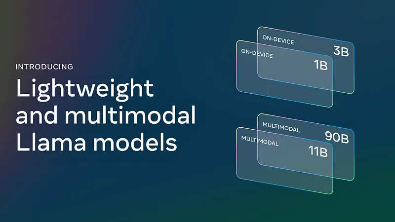
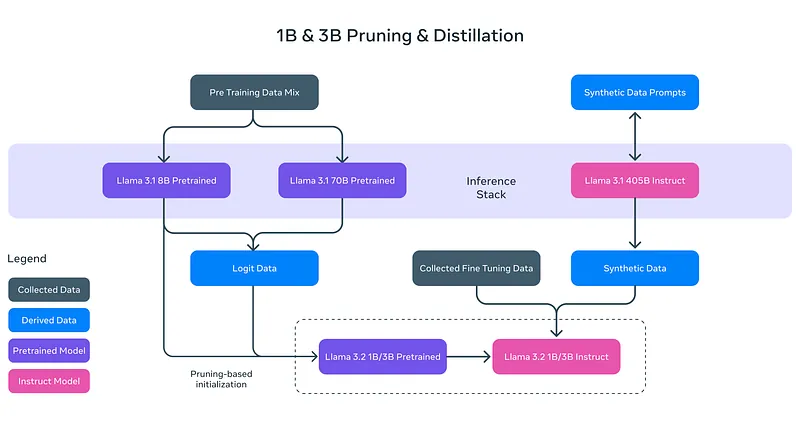
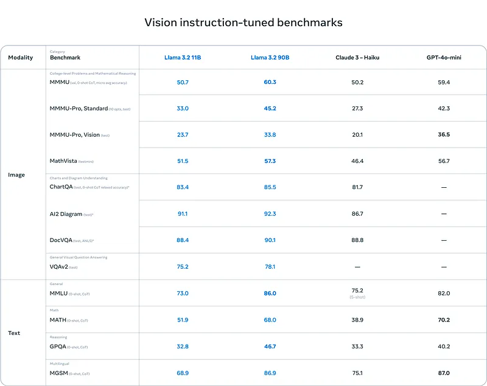
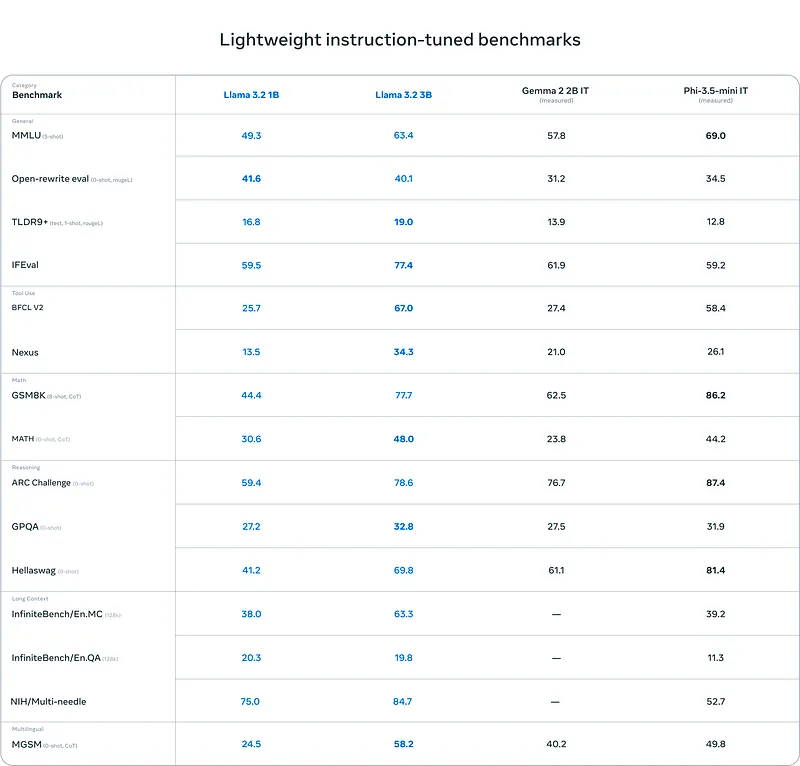

# Papers Explained 187d - Llama 3.2

Llama 3 is a new set of foundation models, designed for multilinguality, coding, reasoning, and tool usage.

This page ingests the source article into the wiki and connects it to [[Papers Explained Corpus]], [[Large Language Models]], [[Vision Language Models]], [[Reasoning Models]], [[Code Models]], [[Agentic AI]].

## Source Metadata

- Source file: `raw/2024-10-07_Papers-Explained-187d--Llama-3-2-e517fa1f2528.md`
- Source title: Papers Explained 187d: Llama 3.2
- Published: 2024-10-07
- Canonical: [https://medium.com/@ritvik19/papers-explained-187d-llama-3-2-e517fa1f2528](https://medium.com/@ritvik19/papers-explained-187d-llama-3-2-e517fa1f2528)

## Key Ideas

- This article covers the Lightweight and Multimodal Llama models, introduced in September 2024. The models are available on [HuggingFace](https://huggingface.co/collections/meta-llama/llama-32-66f448ffc8c32f949b04c8cf).
- Refer the Part A of this article to read about the models released in April 2024: [Papers Explained 187a: Llama 3](https://ritvik19.medium.com/papers-explained-187a-llama-3-51e2b90f63bb)
- Refer the Part B of this article to read about the models released in July 2024: [Papers Explained 187b: Llama 3.1](https://ritvik19.medium.com/papers-explained-187b-llama-3-1-f0fb06898c59)
- Refer the Part C of this article to read about the initial experiments of adding multimodal capabilities to Llama3: [[Papers Explained 187c: Llama 3.1 — Multimodal...
- Llama 3.2 includes small and medium-sized vision LLMs (11B and 90B), and lightweight, text-only models (1B and 3B) that fit onto edge and mobile devices, including pre-trained and instruction-tuned versions.
The Llama 3.2 11B and 90B vision models are drop-in...

## Notes

Llama 3 is a new set of foundation models, designed for multilinguality, coding, reasoning, and tool usage.

This article covers the Lightweight and Multimodal Llama models, introduced in September 2024. The models are available on [HuggingFace](https://huggingface.co/collections/meta-llama/llama-32-66f448ffc8c32f949b04c8cf).

- Refer the Part A of this article to read about the models released in April 2024: [Papers Explained 187a: Llama 3](https://ritvik19.medium.com/papers-explained-187a-llama-3-51e2b90f63bb)

- Refer the Part B of this article to read about the models released in July 2024: [Papers Explained 187b: Llama 3.1](https://ritvik19.medium.com/papers-explained-187b-llama-3-1-f0fb06898c59)

- Refer the Part C of this article to read about the initial experiments of adding multimodal capabilities to Llama3: [Papers Explained 187c: Llama 3.1 — Multimodal Experiments](https://medium.com/@ritvik19/papers-explained-187c-llama-3-1-multimodal-experiments-a1940dd45575)

Llama 3.2 includes small and medium-sized vision LLMs (11B and 90B), and lightweight, text-only models (1B and 3B) that fit onto edge and mobile devices, including pre-trained and instruction-tuned versions.
The Llama 3.2 11B and 90B vision models are drop-in replacements for their corresponding text model equivalents, while exceeding on image understanding tasks compared to closed models, such as Claude 3 Haiku.

## Vision Models

The vision models support image reasoning use cases, such as document-level understanding including charts and graphs, captioning of images, and visual grounding tasks such as directionally pinpointing objects in images based on natural language descriptions. And can also bridge the gap between vision and language by extracting details from an image, understanding the scene, and then crafting a sentence or two that could be used as an image caption to help tell the story.

To add image input support, a set of adapter weights are trained that integrate the pre-trained image encoder into the pre-trained language model. The adapter consists of a series of cross-attention layers that feed image encoder representations into the language model. This training process aligned the image representations with the language representations. During this training, the parameters of the image encoder are updated, but those of the language model are intentionally left unchanged. By doing so, all text-only capabilities remained intact, providing a drop-in replacement for Llama 3.1 models.

The training pipeline consists of multiple stages, starting from pre-trained Llama 3.1 text models. First, image adapters and encoders are added, followed by pre-training on large-scale noisy (image, text) pair data. Next, training occurs on medium-scale high-quality in-domain and knowledge-enhanced (image, text) pair data.

In post-training, a recipe similar to the text models is used. This involves several rounds of alignment through supervised fine-tuning, rejection sampling, and direct preference optimization. Synthetic data generation is leveraged by using the Llama 3.1 model to filter and augment question and answers on top of in-domain images, and a reward model is used to rank all candidate answers to provide high-quality fine-tuning data. Additionally, safety mitigation data is added to produce a model with a high level of safety while retaining helpfulness.

## Light Weight Models

The lightweight 1B and 3B models are highly capable with multilingual text generation and tool calling abilities. These models empower developers to build personalized, on-device agentic applications with strong privacy where data never leaves the device. Running these models locally comes with two major advantages. First, prompts and responses can feel instantaneous, since processing is done locally. Second, running models locally maintains privacy by not sending data such as messages and calendar information to the cloud, making the overall application more private.

Pruning allowed for the reduction of the size of existing models in the Llama herd while recovering as much knowledge and performance as possible. For the 1B and 3B models, structured pruning is used in a single shot manner from the Llama 3.1 8B model. This involved systematically removing parts of the network and adjusting the magnitude of the weights and gradients to create a smaller, more efficient model that retains the performance of the original network.

Knowledge distillation is used after pruning to recover performance. For the 1B and 3B models in Llama 3.2, logits from the Llama 3.1 8B and 70B models are incorporated into the pre-training stage of the model development, where outputs (logits) from these larger models are used as token-level targets.

In post-training, a similar recipe is used as in Llama 3.1, producing final chat models by doing several rounds of alignment on top of the pre-trained model. Each round involved supervised fine-tuning (SFT), rejection sampling (RS), and direct preference optimization (DPO).

## Evaluation

- Llama 3.2 vision models are competitive with leading foundation models, Claude 3 Haiku and GPT4o-mini on image recognition and a range of visual understanding tasks.

- The 3B model outperforms the Gemma 2 2.6B and Phi 3.5-mini models on tasks such as following instructions, summarization, prompt rewriting, and tool-use, while the 1B is competitive with Gemma.

## Paper

[Llama 3.2: Revolutionizing edge AI and vision with open, customizable models](https://ai.meta.com/blog/llama-3-2-connect-2024-vision-edge-mobile-devices/)

Recommended Reading [LLaMA Models](https://ritvik19.medium.com/list/llama-models-5b8ea07308cb)

## Figures

Figures from the Medium HTML export (`raw/2024-10-07_Papers-Explained-187d--Llama-3-2-e517fa1f2528.md`); local copies under `wiki/assets/papers-explained-187d-llama-3-2/` when download succeeded.

| Figure | Caption |
|--------|---------|
|  | Launch graphic — **Llama 3.2** **on-device 1B / 3B** and **multimodal 11B / 90B**. |
|  | **1B & 3B** recipe — **pruned init** from Llama 3.1 8B, **logit distillation** from 8B/70B teachers, **synthetic SFT** from **Llama 3.1 405B Instruct**. |
|  | **Vision instruction-tuned** scores — **Llama 3.2 11B / 90B** vs Claude 3 Haiku / GPT-4o-mini (MMMU, charts, DocVQA, VQAv2 + text-side MMLU/MATH/GPQA/MGSM). |
|  | **Small-model** suite — **Llama 3.2 1B / 3B** vs Gemma 2 2B IT / Phi-3.5-mini IT (general, tools, math, reasoning, **128k** long-context, multilingual). |
## Related

- [[Papers Explained Corpus]]
- [[Large Language Models]]
- [[Vision Language Models]]
- [[Reasoning Models]]
- [[Code Models]]
- [[Agentic AI]]
- [[Papers Explained 225 - FastViT]]
- [[Papers Explained 226 - RewardBench]]

#summary #topic
