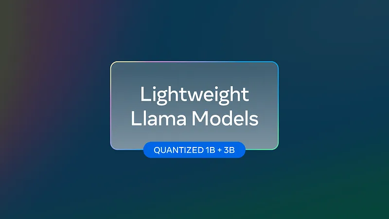
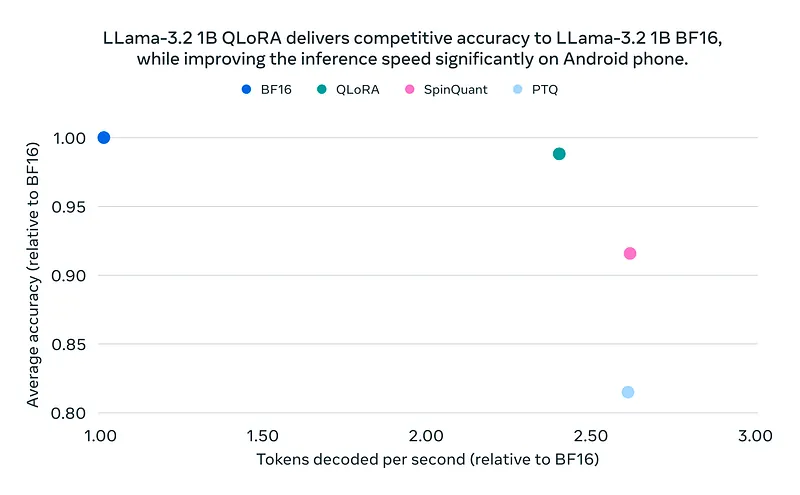
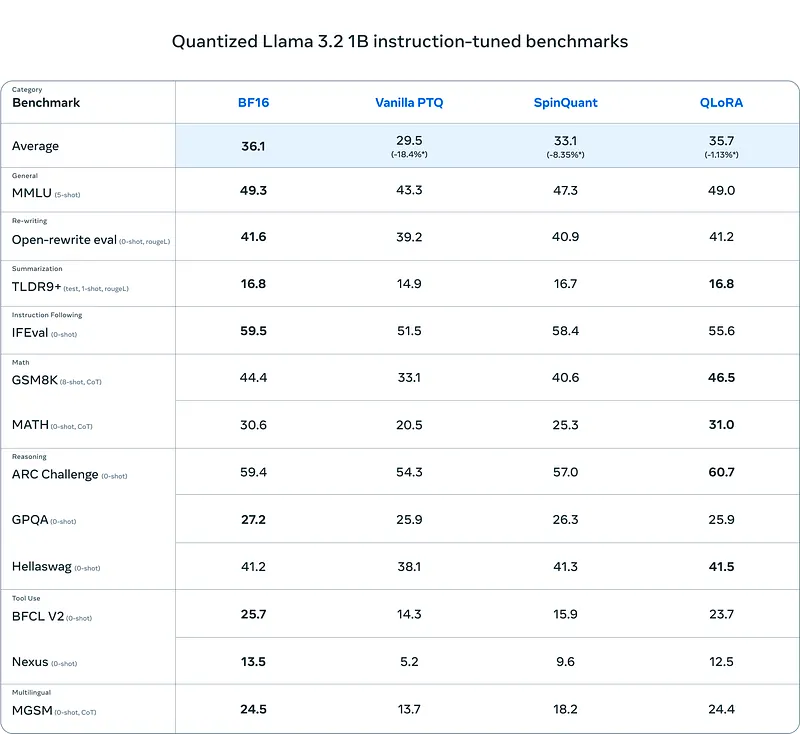
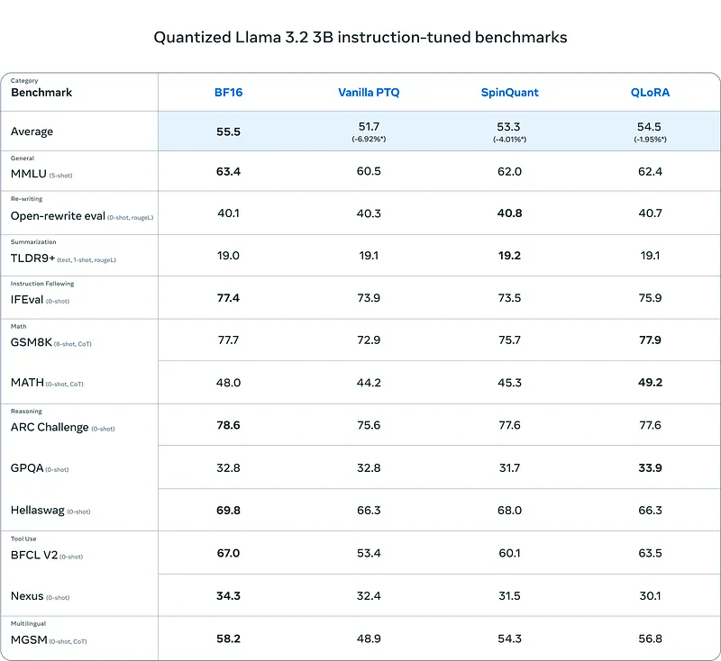
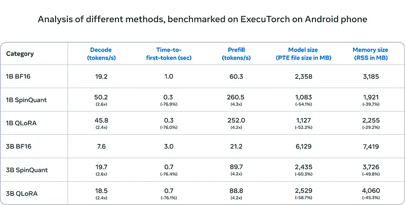
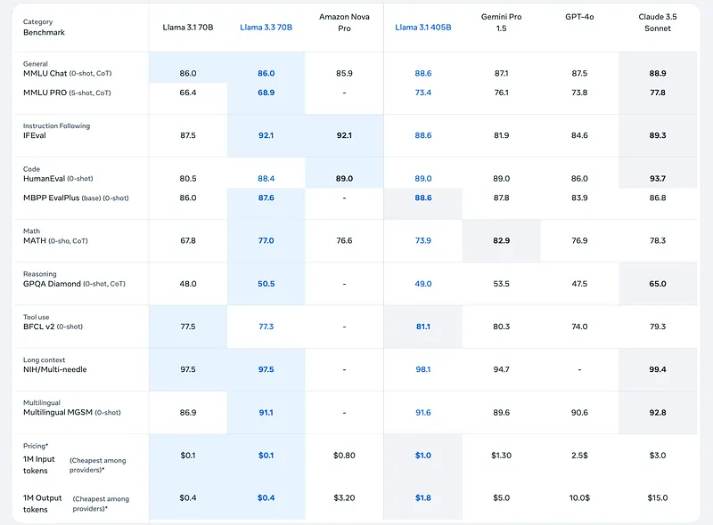

# Papers Explained 187e - Quantized Llama 3.2, Llama 3.3

Llama 3 is a new set of foundation models, designed for multilinguality, coding, reasoning, and tool usage.

This page ingests the source article into the wiki and connects it to [[Papers Explained Corpus]], [[Large Language Models]], [[Model Compression and Efficiency]], [[Vision Language Models]], [[Reasoning Models]], [[Code Models]].

## Source Metadata

- Source file: `raw/2024-11-02_Papers-Explained-187e--Quantized-Llama-3-2--Llama-3-3-cc6965f61370.md`
- Source title: Papers Explained 187e: Quantized Llama 3.2, Llama 3.3
- Published: 2024-11-02
- Canonical: [https://medium.com/@ritvik19/papers-explained-187e-quantized-llama-3-2-cc6965f61370](https://medium.com/@ritvik19/papers-explained-187e-quantized-llama-3-2-cc6965f61370)

## Key Ideas

- This article covers the Quantized Lightweight Llama models, introduced in October 2024. The models are available on [HuggingFace](https://huggingface.co/collections/meta-llama/llama-32-66f448ffc8c32f949b04c8cf).
- Further it covers Llama 3.3, introduced in December 2024, available on [HuggingFace](https://huggingface.co/meta-llama/Llama-3.3-70B-Instruct).
- Refer the Part A of this article to read about the models released in April 2024: [Papers Explained 187a: Llama 3](https://ritvik19.medium.com/papers-explained-187a-llama-3-51e2b90f63bb)
- Refer the Part B of this article to read about the models released in July 2024: [Papers Explained 187b: Llama 3.1](https://ritvik19.medium.com/papers-explained-187b-llama-3-1-f0fb06898c59)
- Refer the Part C of this article to read about the initial experiments of adding multimodal capabilities to Llama3: [[Papers Explained 187c: Llama 3.1 — Multimodal...

## Notes

Llama 3 is a new set of foundation models, designed for multilinguality, coding, reasoning, and tool usage.

This article covers the Quantized Lightweight Llama models, introduced in October 2024. The models are available on [HuggingFace](https://huggingface.co/collections/meta-llama/llama-32-66f448ffc8c32f949b04c8cf).

Further it covers Llama 3.3, introduced in December 2024, available on [HuggingFace](https://huggingface.co/meta-llama/Llama-3.3-70B-Instruct).

- Refer the Part A of this article to read about the models released in April 2024: [Papers Explained 187a: Llama 3](https://ritvik19.medium.com/papers-explained-187a-llama-3-51e2b90f63bb)

- Refer the Part B of this article to read about the models released in July 2024: [Papers Explained 187b: Llama 3.1](https://ritvik19.medium.com/papers-explained-187b-llama-3-1-f0fb06898c59)

- Refer the Part C of this article to read about the initial experiments of adding multimodal capabilities to Llama3: [Papers Explained 187c: Llama 3.1 — Multimodal Experiments](https://medium.com/@ritvik19/papers-explained-187c-llama-3-1-multimodal-experiments-a1940dd45575)

- Refer the Part D of this article to read about the 3.2 models which consists of 11B and 90B vision language models and 3B and 1B small language models: [Papers Explained 187d: Llama 3.2](https://ritvik19.medium.com/papers-explained-187d-llama-3-2-e517fa1f2528)

## Quantized Llama 3.2

Quantized Llama have been optimized for use on resource-constrained devices like mobile phones.

These models are developed using Quantization-Aware Training with LoRA adaptors to optimize performance in low-precision environments and SpinQuant, a technique that enables us to determine the best possible combination for compression while retaining the most possible quality.

### The Quantization Setup

The quantization scheme involves three parts.

- All linear layers in all transformer blocks are quantized to a 4-bit groupwise scheme (with a group size of 32) for weights and 8-bit per-token dynamic quantization for activations.

- The classification layer is quantized to 8-bit per-channel for weight and 8-bit per-token dynamic quantization for activation.

- Additionally, an 8-bit per-channel quantization is employed for embedding.

### Quantization-Aware Training and LoRA

Quantization-Aware Training (QAT) is used to simulate the effects of quantization during the training of Llama 3.2 models, enabling optimization of their performance in low-precision environments. To initialize QAT, BF16 Llama 3.2 model checkpoints are used after supervised fine-tuning (SFT), followed by an additional full round of SFT training with QAT. The backbone of the QAT model is then frozen and another round of SFT training is performed with low-rank adaptation (LoRA) adaptors applied to all layers within the transformer block, while maintaining LoRA adaptors’ weights and activations in BF16. Finally, the resulting model (both backbone and LoRA adaptors) is fine-tuned using direct preference optimization (DPO).

### SpinQuant

Although QAT gives the best results, some people might want to quantize their fine-tuned 1B and 3B models or quantize the models for different targets with different quantization settings. For this reason, a state-of-the-art technique for post-training quantization called SpinQuant is used.

While the method is less accurate than QAT + LoRA, a key advantage of SpinQuant is its portability and ability to operate without requiring access to training datasets, which are often private. It’s an attractive solution for applications where data availability or computational resources are limited.

In experiments, WikiText, a small calibration dataset, is utilized to learn rotation matrices in SpinQuant. These matrices enable the smoothing of outliers and facilitate more effective quantization. After this, best practices in quantization such as range setting and generative post-training quantization are applied. The SpinQuant matrices are optimized for the quantization scheme similar to QAT + LoRA.

### Results

## Llama 3.3

The Meta Llama 3.3 multilingual large language model (LLM) is an instruction-tuned generative model in 70B. The LLM is optimized for multilingual dialogue use cases and outperforms many of the available open source and closed chat models on common industry benchmarks.

This model uses an auto-regressive language architecture, specifically an optimized transformer architecture. The tuned versions employ supervised fine-tuning (SFT) and reinforcement learning with human feedback (RLHF) to align with human preferences for helpfulness and safety.

The Llama 3.3 model supports eight languages: English, German, French, Italian, Portuguese, Hindi, Spanish, and Thai. Token counts refer to pretraining data only, and all model versions use Grouped-Query Attention (GQA) for improved inference scalability.

Llama 3.3 was pretrained on approximately 15 trillion tokens of data from publicly available sources. The fine-tuning data includes publicly available instruction datasets, as well as over 25 million synthetically generated examples. The pretraining data has a cutoff of December 2023.

The fine-tuning data is collected through a multi-faceted approach, combining human-generated data with synthetic data to mitigate potential safety risks. Many large language model (LLM)-based classifiers are used to thoughtfully select high-quality prompts and responses, enhancing data quality control.

## Paper

[Introducing quantized Llama models with increased speed and a reduced memory footprint](https://ai.meta.com/blog/meta-llama-quantized-lightweight-models/)

Recommended Reading [LLaMA Models](https://ritvik19.medium.com/list/llama-models-5b8ea07308cb)

## Figures

Figures from the Medium HTML export (`raw/2024-11-02_Papers-Explained-187e--Quantized-Llama-3-2--Llama-3-3-cc6965f61370.md`); local copies under `wiki/assets/papers-explained-187e-quantized-llama-3-2-llama-3-3/` when download succeeded.

| Figure | Caption |
|--------|---------|
|  | Promo card — **quantized lightweight Llama** (**1B + 3B**). |
|  | **Android** scatter — **Llama 3.2 1B**: avg accuracy vs decode speed (BF16 baseline vs **QLoRA**, **SpinQuant**, vanilla **PTQ**). |
|  | **Quantized Llama 3.2 1B Instruct** — BF16 vs vanilla PTQ / SpinQuant / **QLoRA** across general, rewrite, summarization, IFEval, math, reasoning, tools, MGSM. |
|  | Same matrix for **Llama 3.2 3B** — average gap vs BF16 smallest under **QLoRA**. |
|  | **ExecuTorch on Android** — decode / TTFT / prefill throughput, **PTE size**, RSS memory for **BF16 vs SpinQuant vs QLoRA** (1B and 3B). |
|  | **Llama 3.3 70B** vs Llama 3.1 70B/405B, Nova Pro, Gemini Pro 1.5, GPT-4o, Claude 3.5 Sonnet — benchmarks plus **$/1M tokens** pricing row. |
## Related

- [[Papers Explained Corpus]]
- [[Large Language Models]]
- [[Model Compression and Efficiency]]
- [[Vision Language Models]]
- [[Reasoning Models]]
- [[Code Models]]
- [[Papers Explained 244 - Gemma APS]]
- [[Papers Explained Review 06 - Parameter Efficient FineTuning]]

#summary #topic
