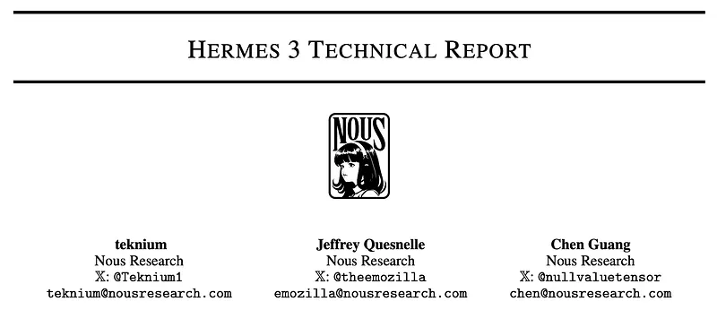
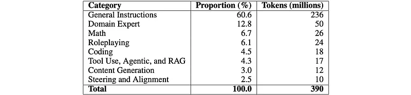
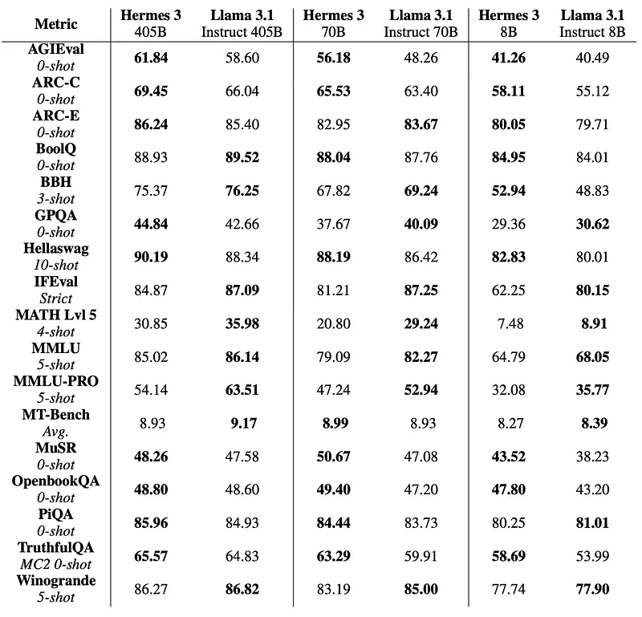

# Papers Explained 188 - Hermes 3

The models are available at [HuggingFace](https://huggingface.co/collections/NousResearch/hermes-3-66bd6c01399b14b08fe335ea).

This page ingests the source article into the wiki and connects it to [[Papers Explained Corpus]], [[Reasoning Models]], [[Large Language Models]], [[Embedding and Retrieval]], [[Agentic AI]], [[Safety and Alignment]], [[Supervised Fine-Tuning]].

## Source Metadata

- Source file: `raw/2024-08-19_Papers-Explained-188--Hermes-3-67d36cfe07d8.md`
- Source title: Papers Explained 188: Hermes 3
- Published: 2024-08-19
- Canonical: [https://medium.com/@ritvik19/papers-explained-188-hermes-3-67d36cfe07d8](https://medium.com/@ritvik19/papers-explained-188-hermes-3-67d36cfe07d8)

## Key Ideas

- Hermes 3 incorporates several features to improve its ability to solve complex problems step-by-step, including:
- Implementing scratchpads for intermediate processing
- Generating internal monologues for transparent decision-making
- Creating Mermaid diagrams for visual communication
- Employing step-labeled reasoning and planning

## Notes

Hermes 3 are neutrally-aligned generalist instruct and tool use models created by fine-tuning Llama 3.1 8B, 70B, and 405B, with strong reasoning and creative abilities. The training data strongly encourages the models to follow the system and instruction prompts exactly and neutrally. This distinguishes Hermes from popular closed weight commercial models, which may refuse instructions on moral grounds. The models are therefore highly sensitive to the system prompt. The effect of this sensitivity is particularly pronounced in its largest 405B version, where an empty system prompt does not necessarily elicit the “helpful assistant” persona.

The models are available at [HuggingFace](https://huggingface.co/collections/NousResearch/hermes-3-66bd6c01399b14b08fe335ea).

## Extended capabilities

Hermes 3 incorporates several features to improve its ability to solve complex problems step-by-step, including:

- Using XML tags for structured output

- Implementing scratchpads for intermediate processing

- Generating internal monologues for transparent decision-making

- Creating Mermaid diagrams for visual communication

- Employing step-labeled reasoning and planning

Utilizing the extra reserved tokens in the Llama 3.1 tokenizer, the model is trained on reasoning tasks making use of the <SCRATCHPAD>, <REASONING>, <INNER_MONOLOGUE>, <PLAN>, <EXECUTION>, <REFLECTION>, <THINKING>, <SOLUTION>, <EXPLANATION>, and <UNIT_TEST> tokens.

Hermes 3’s tool use and retrieval augmented generation (RAG) skills, further expand its agentic capabilities. Tools can be specified and invoked via the Hermes Function Calling standard.

- tool definitions are placed (as JSON schemas) in <tools>

- invocations and responses are placed in <tool_call> and <tool_response> respectively.

- For RAG, the model has been trained to cite retrieval sources using the <co> tag.

These features collectively improve the model’s ability to handle complex tasks, explain its approach, and communicate ideas effectively across various domains.

## Data Mixture

*Figure: Proportions and token count of dataset categories in Hermes 3.*

The Hermes 3 dataset features a diverse collection of high-quality instruction data, meticulously curated and generated to encompass a wide range of domains and use cases. The curation methodology incorporates both existing sources and domain-specific data generation. For existing sources, evaluation is based on coherence, educational value, and reliability, contributing significantly to the General Instructions category, which accounts for a substantial portion of its 236M tokens.

Recognizing the limitations of general instructions, which tend to consist of arbitrary questions posed by everyday users, domain-specific data is supplemented to the dataset. Generation schemes inspired by Evol-Instruct are employed for this purpose, despite the increased computational intensity, to ensure comprehensive coverage of crucial domains.

To refine the collected data and maintain the highest quality standards, a series of filtering techniques are implemented. These include token length thresholds to balance conversation lengths, removal of refusals and improperly formatted responses, elimination of conversations with missing or empty turns, and prioritization of conversations generated by the strongest models.

The final dataset mixture consists of approximately 390M tokens. Of these, 270M (69%) are output (response) tokens contributing to the optimizer’s cross-entropy loss objective, while the remaining 120M are input (instruction) tokens.

## Training Recipe

The training recipe consists of two phases: a supervised fine-tuning (SFT) phase and a direct preference optimization (DPO) phase.

The SFT phase primarily involves standard instruct fine-tuning. Multiple samples are packed together into a single sequence, utilizing the attention mask-free variable sequence length ability of Flash Attention 2 to avoid cross-attention contamination of samples. This sample packing greatly increases the efficiency of SFT since the training data includes a highly heterogeneous mix of sample lengths. A target sequence length of 8192 is selected to match Llama 3.1’s native training context window, and overall packing is achieved at a 96% efficiency, which means that only 4% of tokens are the padding token.

When applying DPO rather than tuning a full model, a LoRA adapter with r = 32, α = 16 and a dropout of 0.05 targets all linear layers is trained. Overall, DPO provides a moderate but positive impact on benchmarks for an 8B model. For larger model sizes, DPO provides only negligible performance improvements, so it is chosen to remain with the SFT-phase checkpoints.

## Evaluation

*Figure: Final downstream task evaluations.*

For the 405B models, evaluations are performed under FP8 quantization.

## Paper

[Hermes 3 Technical Report](https://nousresearch.com/wp-content/uploads/2024/08/Hermes-3-Technical-Report.pdf)

## Figures

Figures from the Medium HTML export (`raw/2024-08-19_Papers-Explained-188--Hermes-3-67d36cfe07d8.md`); local copies under `wiki/assets/papers-explained-188-hermes-3/` when download succeeded.

| Figure | Caption |
|--------|---------|
|  | **Hermes 3 Technical Report** title card — Nous Research authors. |
|  | **Hermes 3** instruction dataset mix — proportion and **token counts** (~**390M** total) across general, domain expert, math, roleplay, code, tools/RAG, generation, steering. |
|  | **Hermes 3** vs **Llama 3.1 Instruct** at **405B / 70B / 8B** — AGIEval, ARC, BBH, GPQA, MMLU(-PRO), MT-Bench, TruthfulQA, etc. (**405B eval under FP8** per article). |
## Related

- [[Papers Explained Corpus]]
- [[Reasoning Models]]
- [[Large Language Models]]
- [[Embedding and Retrieval]]
- [[Agentic AI]]
- [[Safety and Alignment]]
- [[Supervised Fine-Tuning]]
- [[Papers Explained 187c - Llama 3.1 — Multimodal Experiments]]
- [[Papers Explained 189 - Proofread]]

#summary #topic
