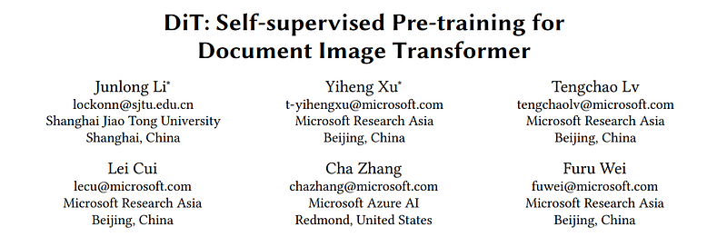
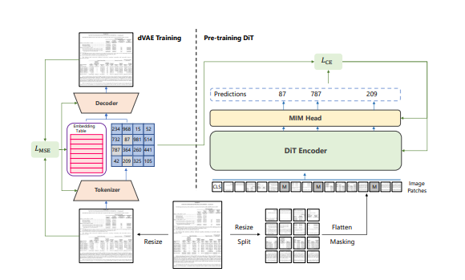
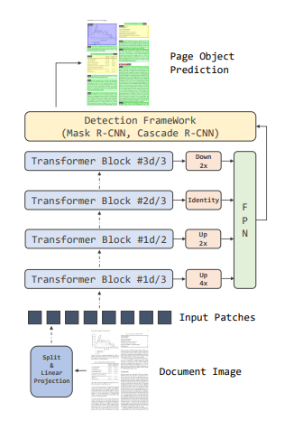

# Papers Explained 19 - Dit

DiT is a self-supervised pre-trained Document Image Transformer model using large-scale unlabeled text images for Document AI tasks. We leverage DiT as the backbone network in a variety of vision-based Document AI tasks, including document image classification, document layout analysis, table detection as well as text detection for OCR.

This page ingests the source article into the wiki and connects it to [[Papers Explained Corpus]], [[Document AI]], [[Computer Vision]], [[Large Language Models]], [[Embedding and Retrieval]], [[Model Compression and Efficiency]].

## Source Metadata

- Source file: `raw/2023-02-07_Papers-Explained-19--Dit-b6d6eccd8c4e.html`
- Source title: Papers Explained 19: Dit
- Published: 2023-02-07
- Canonical: [https://medium.com/@ritvik19/papers-explained-19-dit-b6d6eccd8c4e](https://medium.com/@ritvik19/papers-explained-19-dit-b6d6eccd8c4e)

## Key Ideas

- DiT is a self-supervised pre-trained Document Image Transformer model using large-scale unlabeled text images for Document AI tasks.
- Following ViT, the vanilla Transformer architecture is used as the backbone of DiT. We divide a document image into non-overlapping patches and obtain a sequence of patch embeddings.
- Inspired by BEiT, Masked Image Modeling (MIM) is used as the pre-training objective. In this procedure, the images are represented as image patches and visual tokens in two views respectively.
- The new dVAE tokenizer is trained with a combination of a MSE loss to reconstruct the input image, and a perplexity loss to increase the
use of the quantized codebook representations.
- Image Classification For image classification, average pooling is used to aggregate the representation of image patches. Next, the global representation is passed into a simple linear classifier.

## Notes

DiT is a self-supervised pre-trained Document Image Transformer model using large-scale unlabeled text images for Document AI tasks. We leverage DiT as the backbone network in a variety of vision-based Document AI tasks, including document image classification, document layout analysis, table detection as well as text detection for OCR.

A typical pipeline for pre-training Document AI models usually start with the vision-based understanding such as Optical Character Recognition (OCR) or document layout analysis, which still heavily relies on the supervised computer vision backbone models with human-labeled training samples. Although good results have been achieved on benchmark datasets, these vision models are often confronted with the performance gap in real-world applications due to domain shift and template/format mismatch from the training data.

There is no commonly used large-scale human-labeled benchmark like ImageNet, which makes large-scale supervised pre-training impractical. Even though weakly supervised methods have been used to create Document AI benchmarks, the domain of these datasets is often from the academic papers that share similar templates and formats, which are different from real-world documents such as forms, invoice/receipts, reports, and many others. This may lead to unsatisfactory results for general Document AI problems. Therefore, it is vital to pre-train the document image backbone models with large-scale unlabeled data from general domains, which can support a variety of Document AI tasks.

Model Architecture

Following ViT, the vanilla Transformer architecture is used as the backbone of DiT. We divide a document image into non-overlapping patches and obtain a sequence of patch embeddings. After adding the 1d position embedding, these image patches are passed into a stack of Transformer blocks with multi-head attention. Finally, the output of the Transformer encoder are taken as the representation of image patches.

Pretraining

Inspired by BEiT, Masked Image Modeling (MIM) is used as the pre-training objective. In this procedure, the images are represented as image patches and visual tokens in two views respectively. During pre-training, DiT accepts the image patches as input and predicts the visual tokens with the output representation.

Like text tokens in natural language, an image can be represented as a sequence of discrete tokens obtained by an image tokenizer.
BEiT uses the discrete variational auto-encoder (dVAE) from DALLE as the image tokenizer, which is trained on a large data collection including 400 million images. However, there exists a domain mismatch between natural images and document images, which makes the DALL-E tokenizer not appropriate for the document images. Therefore, to get better discrete visual tokens for the document image domain, a dVAE is trained on the IIT-CDIP dataset that includes 42 million document images.

The new dVAE tokenizer is trained with a combination of a MSE loss to reconstruct the input image, and a perplexity loss to increase the
use of the quantized codebook representations.

To effectively pre-train the DiT model, we randomly mask a subset of inputs with a special token [MASK] given a sequence of image patches. The DiT encoder embeds the masked patch sequence by a linear projection with added positional embeddings, and then contextualizes it with a stack of Transformer blocks. The model is required to predict the index of visual tokens with the output from masked positions. Instead of predicting the raw pixels, the masked image modeling task requires the model to predict the discrete visual tokens obtained by the image tokenizer.

Fine-Tuning

Image Classification For image classification, average pooling is used to aggregate the representation of image patches. Next, the global representation is passed into a simple linear classifier.

Object Detection For object detection, Mask R-CNN and Cascade R-CNN are leveraged as detection frameworks and use ViT-based models as the backbone. Resolution modifying modules are used at four different transformer blocks to adapt the single-scale ViT to the multi-scale FPN.

Let 𝑑 be the total number of blocks, the 1𝑑/3th block is upsampled by 4× using a module with 2 stride-two 2×2 transposed convolution. For the output of the 1𝑑/2th block, a single stride-two 2×2 transposed convolution is used to upsample 2×. The output of the 2𝑑/3th block is utilized without additional operations. Finally, the output of 3𝑑/3th block is downsampled by 2× with stride-two 2×2 max pooling.

Evaluation
The pre-trained DiT models are evaluated on four publicly available Document AI benchmarks:

- RVL-CDIP dataset for document image classification

- PubLayNet dataset for document layout analysis

- ICDAR 2019 cTDaR dataset for table detection

- FUNSD dataset for OCR text detection

## Paper

DiT: Self-supervised Pre-training for Document Image Transformer [2203.02378](https://arxiv.org/abs/2203.02378)

## Figures

Figures from the Medium HTML export (`raw/2023-02-07_Papers-Explained-19--Dit-b6d6eccd8c4e.html`); local copies under `wiki/assets/papers-explained-19-dit/` when download succeeded.

| Figure | Caption |
|--------|---------|
|  | Title card: Dit. |
|  | Model Architecture. |
|  | Fine-Tuning. |
## Related

- [[Papers Explained Corpus]]
- [[Document AI]]
- [[Computer Vision]]
- [[Large Language Models]]
- [[Embedding and Retrieval]]
- [[Model Compression and Efficiency]]
- [[Papers Explained 18 - TableNet]]
- [[Papers Explained 20 - Donut]]

#summary #topic
