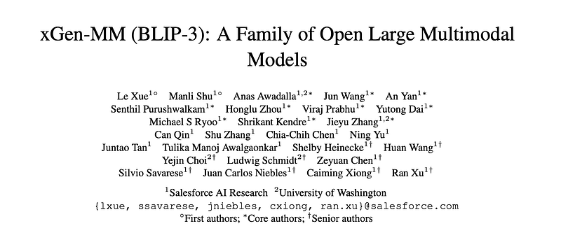
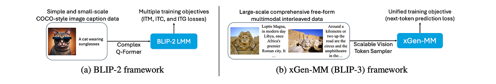
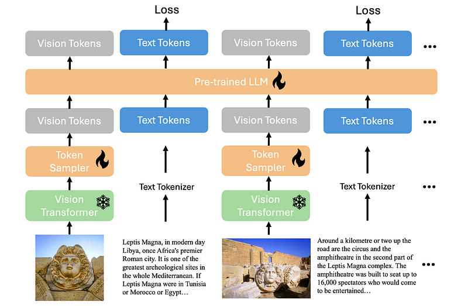
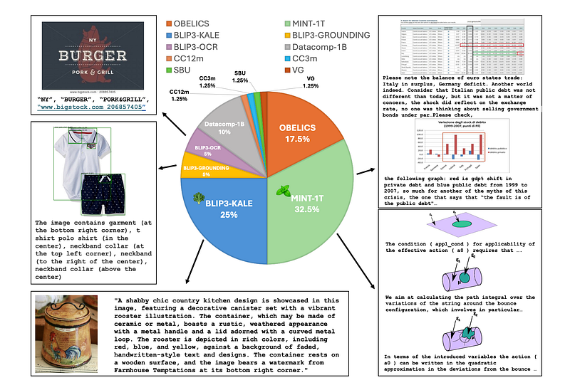
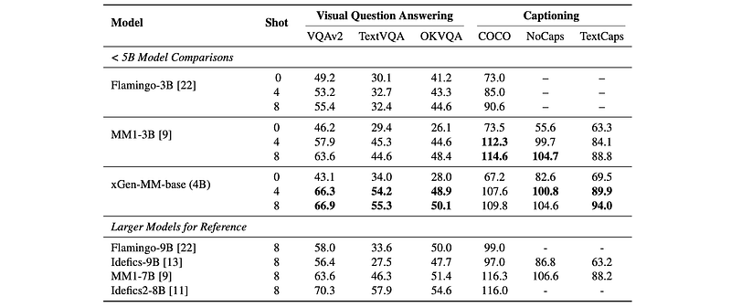
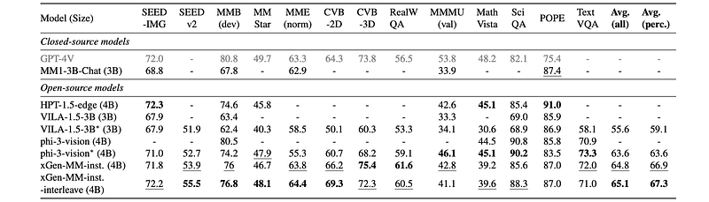
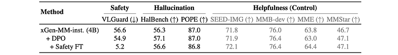

# Papers Explained 190 - BLIP-3 (xGen-MM)

xGen-MultiModal (xGen-MM) also known as BLIP-3, expands the Salesforce xGen initiative on foundation AI models. It is a framework for developing Large Multimodal Models consisting of meticulously curated datasets, a training recipe, model architectures, and a resulting suite of LMMs.

This page ingests the source article into the wiki and connects it to [[Papers Explained Corpus]], [[Vision Language Models]], [[Large Language Models]], [[Synthetic Data]], [[Model Compression and Efficiency]], [[Embedding and Retrieval]], [[Supervised Fine-Tuning]].

## Source Metadata

- Source file: `raw/2024-08-21_Papers-Explained-190--BLIP-3--xGen-MM--6a9c04a3892d.html`
- Source title: Papers Explained 190: BLIP-3 (xGen-MM)
- Published: 2024-08-21
- Canonical: [https://medium.com/@ritvik19/papers-explained-190-blip-3-xgen-mm-6a9c04a3892d](https://medium.com/@ritvik19/papers-explained-190-blip-3-xgen-mm-6a9c04a3892d)

## Key Ideas

- xGen-MultiModal (xGen-MM) also known as BLIP-3, expands the Salesforce xGen initiative on foundation AI models.
- The models are available at [HuggingFace](https://huggingface.co/collections/Salesforce/xgen-mm-1-models-662971d6cecbf3a7f80ecc2e).
- Recommended Reading [Papers Explained 155: BLIP 2](https://ritvik19.medium.com/papers-explained-155-blip-2-135fff70bf65)
- The xGen-MM (BLIP-3) framework consists of a ViT, a vision token sampler (perceiver resampler) to downsample image embeddings, and a pre-trained Large Language Model (phi3-mini).
- A dynamic high-resolution image encoding strategy is adopted at the fine-tuning and post-training stages.

## Notes

xGen-MultiModal (xGen-MM) also known as BLIP-3, expands the Salesforce xGen initiative on foundation AI models. It is a framework for developing Large Multimodal Models consisting of meticulously curated datasets, a training recipe, model architectures, and a resulting suite of LMMs.

The models are available at [HuggingFace](https://huggingface.co/collections/Salesforce/xgen-mm-1-models-662971d6cecbf3a7f80ecc2e).

Recommended Reading [Papers Explained 155: BLIP 2](https://ritvik19.medium.com/papers-explained-155-blip-2-135fff70bf65)

## Model Architecture

*Figure: Overview of the xGen-MM (BLIP-3) framework.*

The xGen-MM (BLIP-3) framework consists of a ViT, a vision token sampler (perceiver resampler) to downsample image embeddings, and a pre-trained Large Language Model (phi3-mini). The input to the model can be freeform multimodal interleaved texts and vision tokens from diverse multimodal data sources.

A dynamic high-resolution image encoding strategy is adopted at the fine-tuning and post-training stages. This enables higher-resolution image understanding with image patch-wise encoding, which preserves the resolution of the original image as much as possible by splitting a single image into multiple patches and encoding them separately. The encoded image patches are then concatenated with a downsized original image that provides global information.

In the VL connector, a perceiver resampler is used to downsample vision tokens. With any-resolution image encoding, downsampling is performed for each image patch (including the downsized original image) independently. The downsampled vision tokens are then concatenated together and sent to the LLM. As a result, the sequence length of vision tokens can be reduced by a factor of five or more depending on the number of query tokens in the perceiver resampler.

## Training

### Pre-training

The pre-training objective is to predict the next text token across the dataset mixture. The resulting base model xGen-MM-Phi3-mini-base-r is pre-trained for about 100B multimodal tokens from the ensembled dataset, and the pre-training resolution is 384x384 pixels, which aligns with SigLIP.

### Supervised Fine-tuning (SFT)

The pre-trained models are fine tuned on instruction-following examples to make them better understand and follow user queries, using a collection of publically available instruction-following datasets.

### Interleaved Multi-Image Supervised Fine-tuning

A second-stage fine-tuning is conducted on the instruction fine-tuned model using a mixture of multi-image and single-image instructions-following samples to improve the model’s ability to comprehend interleaved image-text input, which is beneficial for multimodal in-context learning, multi-image question answering, and various practical use cases.

### Post-training

Finally, two stages of post-training are performed to improve the model’s helpfulness while mitigating harmful qualities such as hallucination and toxicity. The first stage involves direct preference optimization (DPO) to improve the model’s helpfulness and visual faithfulness. The second stage consists of safety fine-tuning to improve the model’s harmlessness.

## Data

### Pre-training Data

*Figure: Overview of xGen-MM (BLIP-3) Pre-training Datasets.*

Interleaved Dataset Mixture:

- MINT-1T is a trillion token scale multimodal interleaved dataset, containing data sources from HTML, PDF, and ArXiv. In xGen-MM (BLIP-3), these three subsets are mixed in a 7:5:1 ratio.

- OBELICS is another large-scale multimodal interleaved dataset constructed from HTML documents solely. It differs slightly in domain coverage from MINT-1T due to the specific preprocessing steps adopted.

Caption Dataset Mixture:

- BLIP3-KALE is a large-scale curated high-quality caption dataset.

- BLIP3-OCR-200M is a curated large-scale OCR dataset designed to address limitations in handling text-rich images like documents and charts, as traditional image-text datasets often lack adequate OCR annotations. The annotations are created with OCR data (Paddle OCR) by identifying and extracting textual elements. Text segments in a caption like “… text …” are modified to include OCR information as “… text ( ocr_info ) …”, where ocr_info contains bounding box coordinates for the extracted text, specifying its exact position within the image in the format “<bbox>x1, y1, x2, y2</bbox>”.

- BLIP3-GROUNDING-50M is a curated large-scale grounding dataset designed to enhance the ability to ground semantic concepts in visual features, which is crucial for tasks like object detection, semantic segmentation, and understanding referring expressions. Objects and their location information are identified using one of the state-of-the-art open-world image tagging and object detection models. Objects mentioned in a caption like “… object . ..” are modified to include grounding information as “ … object ( grounding_info ) …”, where grounding_info contains bounding box information in one of three formats: (1) <bbox>x1, y1, x2, y2</bbox>, (2) “starts at (x1, y1) and extends up to (x2, y2)”, or (3) “top-left corner of the image”.

- Additionally, other publicly available datasets such as uncurated Datacomp-1B image-text pairs, CC12M, CC3M, VG, and SBU are included.

### Supervised Fine-tuning Data

The datasets used in the fine-tuning stage are from public datasets of different domains including multimodal conversation, image captioning, visual question answering, chart/document understanding, science and math were sampled. In addition to the multi-modal image-text data, pure text instruction following data is also mixed in during visual instruction tuning. A total of 1M publicly available instruction-tuning samples are collected, on which the model is fine-tuned for one epoch.

The multi-image instruction tuning stage starts with a model fine-tuned on single-image samples. A mixture of public multi-image/interleaved image-text instruction data is used. To prevent the model from deteriorating on single-image capabilities, a subset of single-image datasets used in the previous fine-tuning stage is reused and mixed into the multi-image training data.

### Post-training Data

Improving Truthfulness involves utilizing the VLFeedback dataset, which contains 80k multimodal instructions with responses generated by VLMs. The instructions are scored by GPT4-V along three axes: helpfulness, visual faithfulness, and ethics. Preference data is constructed by marking as preferred the response with the highest average score across models, and dispreferred the response with the lowest average score. This generates 62.6k preference examples.

One epoch of DPO is performed on the combined preference dataset while updating a subset of LLM backbone weights using LoRA. An additional set of responses that capture the model’s intrinsic hallucinations is generated by performing a second step of DPO per-iteration against the models’ output to a noised version of the input image and original query, which is treated as an additional dispreferred response.

Improving Harmlessness involves utilizing the VLGuard dataset for safety fine-tuning, which contains 2k examples of unsafe images and instructions. The dataset consists of two types of unsafe examples: objectionable images paired with safe instructions and a desirable abstention response, and safe images paired with two types of instruction-response pairs, one safe and another unsafe.

The dataset includes various subcategories of unsafe examples, such as privacy-violating, risky/sensitive topics (e.g. politics, sex, violence), deception, and discrimination. 5k additional examples are randomly sampled from the instruction fine-tuning dataset to retain the model’s helpfulness without exaggerating its safety behavior.

Three epochs of safety fine-tuning are performed on the train split of the VLGuard dataset while updating a subset of LLM backbone weights using LoRA.

## Evaluations

### Pre-training

The pre-trained model is evaluated on classic captioning and VQA tasks, using zero-shot and few-shot (4- and 8-shot) learning approaches.

*Figure: Few-shot Pretraining Evaluation.*

- The model achieves competitive performance compared to other large language models (LLMs) in multimodal in-context learning.

- The model significantly outperforms models like MM1–3B, Idefics-9B, and MM1–7B on OCR tasks (TextCaps and TextVQA) and VQA-v2.

- Increasing the number of shots in few-shot learning improves performance, demonstrating the model’s adaptability.

### Supervised Fine-tuning

The performance of xGen-MM-instruct model is evaluated on a variety of multi-modal benchmarks, covering general VQA, visual perception, domain knowledge, OCR ability, hallucination, and multi-image understanding.

*Figure: Evaluation on single-image benchmarks.*

- xGen-MM-instruct outperforms previous baselines on both general VQA and visual perception benchmarks.

- xGen-MM-instruct-interleave achieves the highest overall scores across all benchmarks.

*Figure: Evaluation on multi-image benchmarks.*

- xGen-MM-instruct performs poorly on multi-image benchmarks, suggesting that single-image fine-tuning is insufficient for this task.

- xGen-MM-instruct-interleave, with multi-image fine-tuning, shows significantly improved performance on multi-image benchmarks.

### Post-training

*Figure: Post-training results.*

- DPO improves performance on hallucination benchmarks (HallusionBench and POPE), indicating enhanced truthfulness.

- Safety Fine-tuning significantly reduces the ASR on the VLGuard test split, demonstrating improved safety.

- Both strategies lead to a slight improvement in helpfulness, as measured by comprehension benchmarks.

## Paper

xGen-MM (BLIP-3): A Family of Open Large Multimodal Models [2408.08872](https://arxiv.org/abs/2408.08872)

Recommended Reading [BLIP Series](https://ritvik19.medium.com/list/blip-series-4b0831017c5b) [Multi Modal Transformers](https://ritvik19.medium.com/list/multi-modal-transformers-67453f215ecf)

## Figures

Figures from the Medium HTML export (`raw/2024-08-21_Papers-Explained-190--BLIP-3--xGen-MM--6a9c04a3892d.html`); local copies under `wiki/assets/papers-explained-190-blip-3-xgen-mm/` when download succeeded.

| Figure | Caption |
|--------|---------|
|  | Paper header — **xGen-MM (BLIP-3): A Family of Open Large Multimodal Models** (Salesforce AI Research, UW). |
|  | **BLIP-2** vs **xGen-MM (BLIP-3)** — small COCO-style caption data + complex **Q-Former** / multi-loss vs **large interleaved** mixture + **scalable vision token sampler** + unified **next-token** LM loss. |
|  | **Training forward pass** — frozen **ViT** → trainable **token sampler** → vision tokens interleaved with text tokens in a **fine-tuned LLM**; LM loss on text targets. |
|  | **Pretraining mixture** pie (**MINT-1T**, BLIP3-KALE, OBELICS, Datacomp-1B, OCR/grounding, CC/SBU/VG…) plus qualitative panels (OCR, grounding, captions, docs, STEM figures). |
|  | **In-context VQA & captioning** — **&lt;5B** models (Flamingo-3B, MM1-3B, **xGen-MM-base ~4B**) vs larger reference rows (8–9B class). |
|  | **Instruction-tuned ~4B** leaderboard — **xGen-MM-inst.** vs **xGen-MM-inst.-interleave** and phi-3-vision / VILA / HPT vs MM1-3B-Chat / GPT-4V refs (SEED, MMB, MMMU, CV-Bench, POPE, averages). |
|  | **Multi-image reasoning** — BLINK, **QBench-2**, **Mantis-eval**: **interleaved** xGen-MM vs baseline inst. and VILA; GPT-4V reference. |
|  | **Alignment ablations** — **+ DPO** on hallucination probes; **+ Safety FT** slashes **VLGuard** risk score while holding POPE / SEED / MMB / MME / MMStar roughly flat. |
## Related

- [[Papers Explained Corpus]]
- [[Vision Language Models]]
- [[Large Language Models]]
- [[Synthetic Data]]
- [[Model Compression and Efficiency]]
- [[Embedding and Retrieval]]
- [[Supervised Fine-Tuning]]
- [[Papers Explained 189 - Proofread]]
- [[Papers Explained - An Introduction to Vision-Language Modeling]]

#summary #topic
