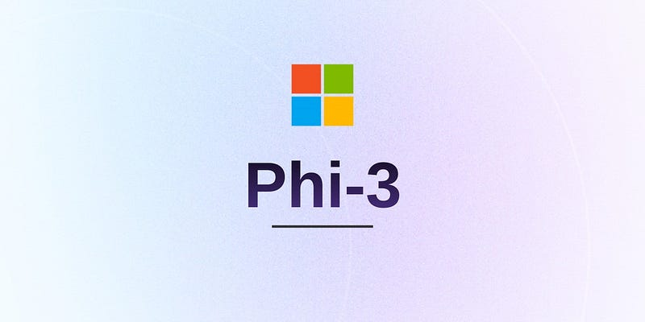
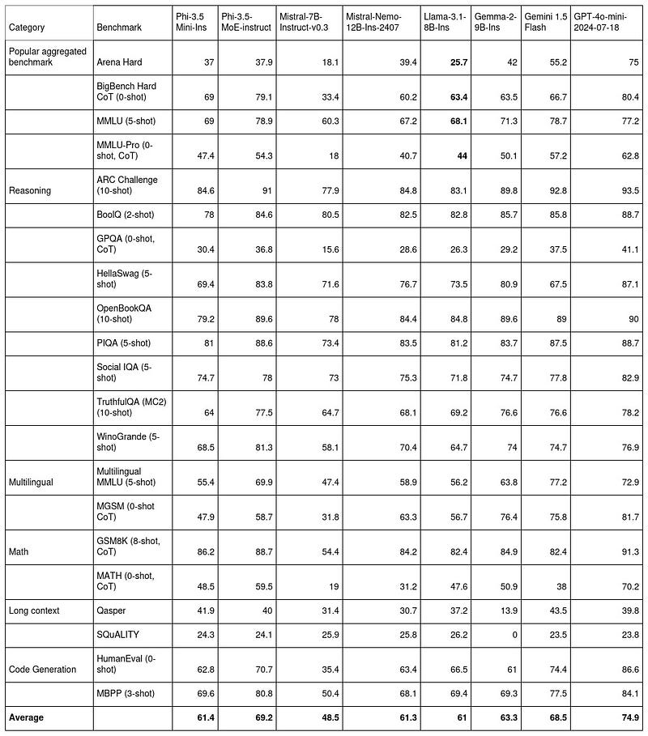
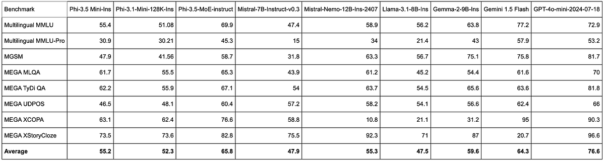
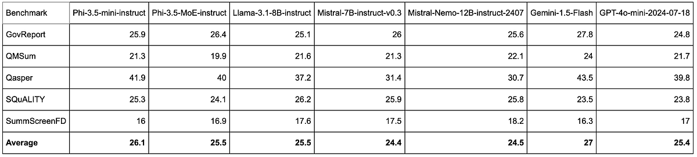
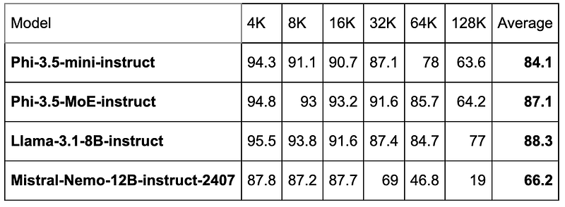
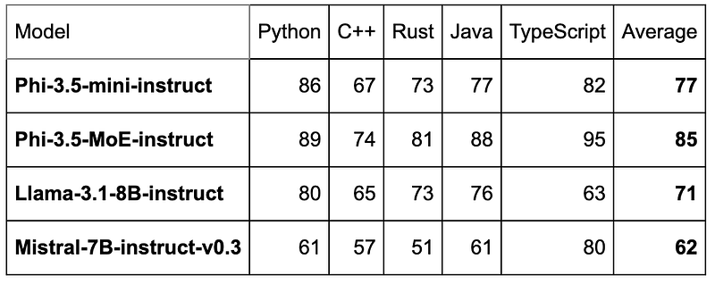
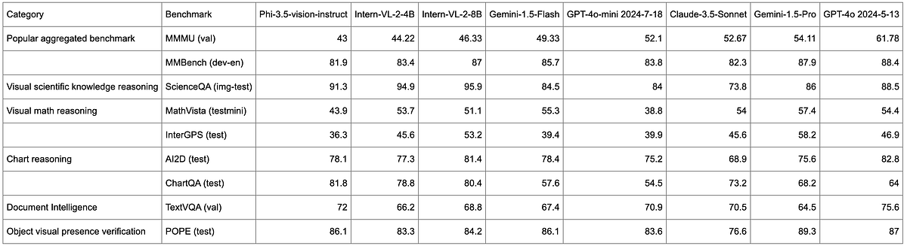
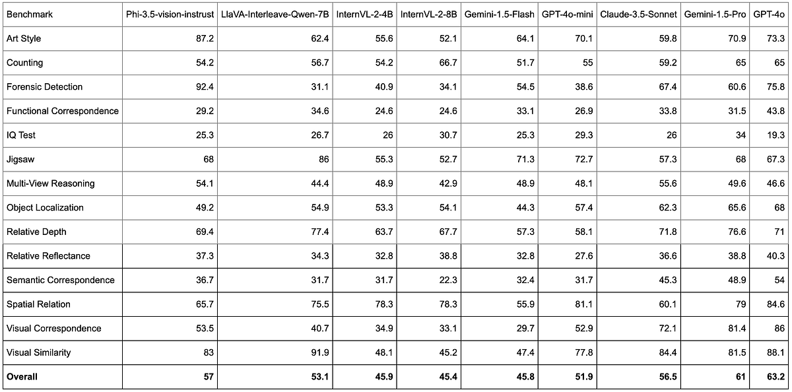
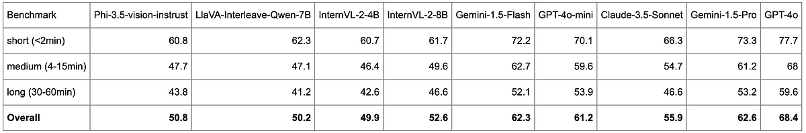

# Papers Explained 192 - Phi-3.5

Phi-3.5 is a family of lightweight, state-of-the-art open models built upon datasets used for Phi-3 — synthetic data and filtered publicly available documents — with a focus on very high-quality, reasoning dense data. The models support multilingual and come with 128K context length (in tokens).

This page ingests the source article into the wiki and connects it to [[Papers Explained Corpus]], [[Large Language Models]], [[Synthetic Data]], [[Reinforcement Learning Topic]], [[Reasoning Models]], [[Multilingual Models]], [[Supervised Fine-Tuning]], [[Reinforcement Learning]].

## Source Metadata

- Source file: `raw/2024-08-23_Papers-Explained-192--Phi-3-5-a95429ea26c9.html`
- Source title: Papers Explained 192: Phi-3.5
- Published: 2024-08-23
- Canonical: [https://medium.com/@ritvik19/papers-explained-192-phi-3-5-a95429ea26c9](https://medium.com/@ritvik19/papers-explained-192-phi-3-5-a95429ea26c9)

## Key Ideas

- Phi-3.5 is a family of lightweight, state-of-the-art open models built upon datasets used for Phi-3 — synthetic data and filtered publicly available documents — with a focus on very high-quality, reasoning dense data.
- The models are available at [HuggingFace](https://huggingface.co/collections/microsoft/phi-3-6626e15e9585a200d2d761e3/).
- Recommended Reading [Papers Explained 130: Phi-3](https://ritvik19.medium.com/papers-explained-130-phi-3-0dfc951dc404)
- Phi-3.5-MoE has 16x3.8B parameters with 6.6B active parameters when using 2 experts. The model is a mixture-of-expert decoder-only Transformer model using the tokenizer with vocabulary size of 32,064. It is trained on 4.9T tokens.
- Phi-3.5-mini has 3.8B parameters and is a dense decoder-only Transformer model using the same tokenizer as Phi-3 Mini. It is trained on 3.4T tokens.

## Notes

Phi-3.5 is a family of lightweight, state-of-the-art open models built upon datasets used for Phi-3 — synthetic data and filtered publicly available documents — with a focus on very high-quality, reasoning dense data. The models support multilingual and come with 128K context length (in tokens). The models underwent a rigorous enhancement process, incorporating supervised fine-tuning, proximal policy optimization, and direct preference optimization to ensure precise instruction adherence and robust safety measures.

The models are available at [HuggingFace](https://huggingface.co/collections/microsoft/phi-3-6626e15e9585a200d2d761e3/).

Recommended Reading [Papers Explained 130: Phi-3](https://ritvik19.medium.com/papers-explained-130-phi-3-0dfc951dc404)

The Phi-3.5 model family includes:

- Phi-3.5-MoE-instruct

- Phi-3.5-mini-instruct

- Phi-3.5-vision-instruct

Phi-3.5-MoE has 16x3.8B parameters with 6.6B active parameters when using 2 experts. The model is a mixture-of-expert decoder-only Transformer model using the tokenizer with vocabulary size of 32,064. It is trained on 4.9T tokens.

Phi-3.5-mini has 3.8B parameters and is a dense decoder-only Transformer model using the same tokenizer as Phi-3 Mini. It is trained on 3.4T tokens.

Phi-3.5-vision has 4.2B parameters and contains image encoder, connector, projector, and Phi-3 Mini language model. It is trained on 500B tokens.

The training data includes a wide variety of sources, including 10% multilingual, and is a combination of

- publicly available documents filtered rigorously for quality, selected high-quality educational data, and code. The focus is on the quality of data that could potentially improve the reasoning ability for the model.

- selected high-quality image-text interleave data. (for vision model)

- newly created synthetic, “textbook-like” data for the purpose of teaching math, coding, common sense reasoning, general knowledge of the world (science, daily activities, theory of mind, etc.).

- newly created image data, e.g., chart/table/diagram/slides, newly created multi-image and video data, e.g., short video clips/pair of two similar images. (for vision model)

- high quality chat format supervised data covering various topics to reflect human preferences on different aspects such as instruct-following, truthfulness, honesty and helpfulness.

## Evaluation

### Text Benchmarks

Phi-3.5 Mini-Instruct performs exceptionally well on GSM8K (86.2) and ARC Challenge (84.6), indicating strong capabilities in math and reasoning.

- It shows a balanced performance across various benchmarks, with scores like 69 in BigBench Hard CoT and MMLU, making it reliable for general-purpose tasks.

- With a HumanEval score of 62.8 and an MBPP score of 69.6, it demonstrates decent proficiency in code generation tasks, contributing to its overall competitiveness.

- Phi-3.5-MoE-Instruct excels in reasoning tasks, as seen in the ARC Challenge (91) and OpenBookQA (89.6), positioning it as a strong model for complex reasoning.

- It scores 69.9 on Multilingual MMLU, which is significantly higher than many other models, making it well-suited for multilingual tasks.

- The model achieves high scores in coding benchmarks, particularly in MBPP (80.8) and HumanEval (70.7), indicating its strong coding capabilities and making it a top choice for programming-related tasks.

Multilingual

- Phi-3.5-Mini-Instruct delivers strong performance across most benchmarks, notably achieving 63.1 in MEGA XCOPA and 73.5 in MEGA XStoryCloze, showing its capability in multilingual and narrative understanding tasks.

- While its overall average is 55.2, Phi-3.5-Mini-Instruct shows relatively consistent performance across various tasks, reflecting a well-rounded model that handles a diverse set of challenges effectively.

- Although Phi-3.5-Mini-Instruct performs well, it generally ranks behind more specialized or larger models, such as Phi-3.5-MoE-Instruct and GPT-4o-mini, indicating room for improvement in complex multilingual and reasoning tasks.

- With a score of 69.9 in Multilingual MMLU and 76.6 in MEGA XCOPA, Phi-3.5-MoE-Instruct excels in tasks requiring multilingual understanding, outperforming many models in these benchmarks.

- The model achieves an impressive average score of 65.8, positioning it as a leading model in the set, especially in benchmarks involving complex, multilingual, and contextual challenges.

- Phi-3.5-MoE-Instruct shows notable strength in reasoning tasks like MGSM and MEGA TyDi QA, with scores of 58.7 and 67.1 respectively, indicating its effectiveness in handling intricate and logic-based questions.

Long Context

- Phi3.5-mini-instruct maintains an overall average score of 26.1, which is the second highest among the models listed, indicating consistent performance across various benchmarks.

- Despite strong individual scores, Phi-3.5-MoE-instruct has a slightly lower overall average of 25.5, suggesting some variability in performance across different tasks.

RULER: a retrieval-based benchmark for long context understanding

- Phi-3.5-mini-instruct shows robust performance with 94.3% at 4K, though the performance gradually declines as the context length increases.

- Despite the decline at higher contexts, Phi-3.5-mini-instruct maintains a solid average performance score of 84.1%, making it competitive in long-context scenarios.

- Phi-3.5-MoE-instruct exhibits consistently high performance across all context lengths, with minimal drop-off, particularly notable with 94.8% at 4K and 85.7% at 64K.

RepoQA: a benchmark for long context code understanding

- With an average score of 77, Phi-3.5-mini-instruct demonstrates solid overall performance, making it a reliable choice for multi-language code understanding tasks.

- With an average score of 85, Phi-3.5-MoE-instruct is the best-performing model overall, suggesting it is highly optimized for long context code understanding across multiple languages.

### Vision Benchmarks

- Phi-3.5-vision-instruct performs notably well in document intelligence tasks, particularly in TextVQA (val), where it achieves a score of 72. This positions it better than several other models in this specific area.

- In the ScienceQA (img-test) benchmark, Phi-3.5-vision-instruct scores 91.3, which is higher than several models but still lower than some of the leading models like Intern-VL-2–8B and GPT-4o 2024–5–13. It indicates strong performance in visual scientific knowledge reasoning but not the highest among all.

- Phi-3.5-vision-instruct shows variable results in visual math reasoning tasks. It scores 43.9 in MathVista (testmini) and 36.3 in InterGPS (test), which is lower compared to models like Intern-VL-2–4B and Intern-VL-2–8B, suggesting that while it performs reasonably, there is room for improvement in this area.

BLINK: a benchmark with 14 visual tasks that humans can solve very quickly but are still hard for current multimodal LLMs.

- With an overall score of 57, phi-3.5-vision-instruct is competitive among the models tested. It performs better than some of the mid-sized models but lags behind the more advanced and larger models like GPT-4o.

Video-MME: comprehensively assess the capabilities of MLLMs in processing video data, covering a wide range of visual domains, temporal durations, and data modalities.

- phi-3.5-vision-instruct has an overall benchmark score of 50.8, which is lower than several larger models but shows that it performs reasonably well given its small size.

## Paper

- [microsoft/Phi-3.5-mini-instruct](https://huggingface.co/microsoft/Phi-3.5-mini-instruct)

- [microsoft/Phi-3.5-MoE-instruct](https://huggingface.co/microsoft/Phi-3.5-MoE-instruct)

- [microsoft/Phi-3.5-vision-instruct](https://huggingface.co/microsoft/Phi-3.5-vision-instruct)

Recommended Reading [Small LLMs](https://ritvik19.medium.com/list/small-llms-41124d5c7c80) [Phi Series](https://ritvik19.medium.com/list/phi-series-b029e31edb1c)

## Figures

Figures from the Medium HTML export (`raw/2024-08-23_Papers-Explained-192--Phi-3-5-a95429ea26c9.html`); local copies under `wiki/assets/papers-explained-192-phi-3-5/` when download succeeded.

| Figure | Caption |
|--------|---------|
|  | Microsoft header graphic — **Phi-3** branding (series covers **Phi-3.5**). |
|  | Text benchmarks — **Phi-3.5 Mini / MoE Instruct** vs Mistral, Llama 3.1, Gemma 2, Gemini 1.5 Flash, GPT-4o-mini (reasoning, multilingual, math, long-context, code + average). |
|  | Multilingual suite — **Phi-3.5** vs baselines on Multilingual MMLU(-Pro), MGSM, MEGA MLQA / TyDi QA / UDPOS / XCOPA / XStoryCloze. |
|  | Long-document benchmarks — GovReport, QMSum, Qasper, SQuALITY, SummScreenFD — **Phi-3.5** vs Llama 3.1, Mistral-Nemo, Gemini Flash, GPT-4o-mini. |
|  | **RULER** — retrieval accuracy vs context length (**4K–128K**) for Phi-3.5 Mini / MoE vs Llama 3.1-8B vs Mistral-Nemo-12B. |
|  | **RepoQA** — multi-language long-code understanding (Python, C++, Rust, Java, TypeScript + average). |
|  | **Vision** — Phi-3.5-vision-instruct vs InternVL, Gemini, GPT-4o, Claude on MMMU, ScienceQA, MathVista, charts, TextVQA, POPE. |
|  | **BLINK** — fine-grained perception tasks (14 subtasks + overall). |
|  | **Video-MME** — scores by clip length (short / medium / long + overall). |
## Related

- [[Papers Explained Corpus]]
- [[Large Language Models]]
- [[Synthetic Data]]
- [[Reinforcement Learning Topic]]
- [[Reasoning Models]]
- [[Multilingual Models]]
- [[Supervised Fine-Tuning]]
- [[Reinforcement Learning]]
- [[Papers Explained - An Introduction to Vision-Language Modeling]]
- [[Papers Explained 193 - BERTopic]]

#summary #topic
