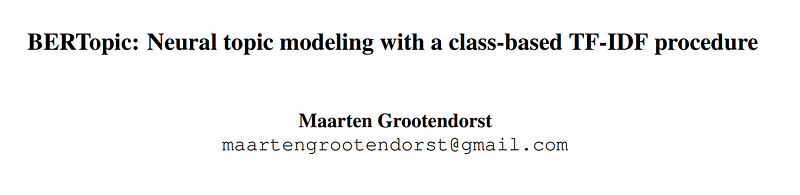
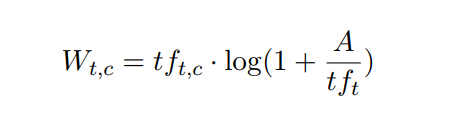
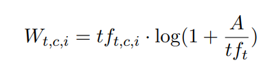
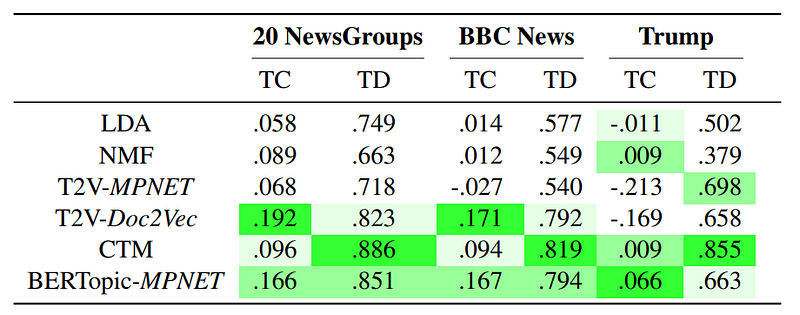
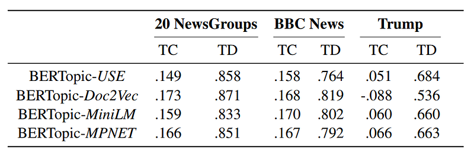
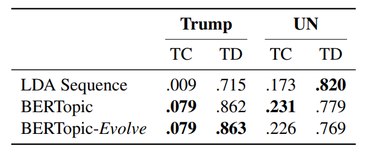
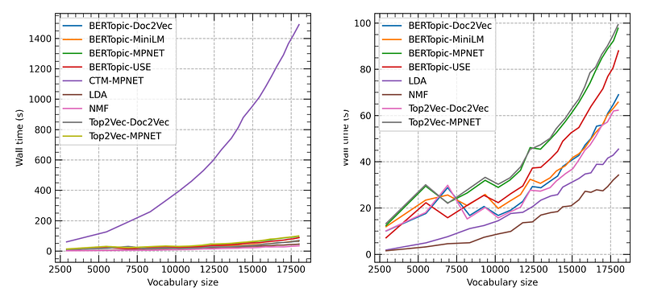

# Papers Explained 193 - BERTopic

BERTopic generates document embedding with pre-trained transformer-based language models, clusters these embeddings, and finally, generates topic representations with the class-based TF-IDF procedure.

This page ingests the source article into the wiki and connects it to [[Papers Explained Corpus]], [[Large Language Models]], [[Embedding and Retrieval]], [[Document AI]].

## Source Metadata

- Source file: `raw/2024-08-24_Papers-Explained-193--BERTopic-f9aec10cd5a6.html`
- Source title: Papers Explained 193: BERTopic
- Published: 2024-08-24
- Canonical: [https://medium.com/@ritvik19/papers-explained-193-bertopic-f9aec10cd5a6](https://medium.com/@ritvik19/papers-explained-193-bertopic-f9aec10cd5a6)

## Key Ideas

- BERTopic generates topic representations through three steps.
- Each document is converted to its embedding representation using a pre-trained language model.
- Before clustering these embeddings, the dimensionality of the resulting embeddings is reduced to optimize the clustering process.
- From the clusters of documents, topic representations are extracted using a custom class-based variation of TF-IDF.
- To perform the embedding step, BERTopic uses the Sentence-BERT (SBERT) framework.

## Notes

BERTopic generates document embedding with pre-trained transformer-based language models, clusters these embeddings, and finally, generates topic representations with the class-based TF-IDF procedure.

## BERTopic

BERTopic generates topic representations through three steps.

- Each document is converted to its embedding representation using a pre-trained language model.

- Before clustering these embeddings, the dimensionality of the resulting embeddings is reduced to optimize the clustering process.

- From the clusters of documents, topic representations are extracted using a custom class-based variation of TF-IDF.

### Document embeddings

To perform the embedding step, BERTopic uses the Sentence-BERT (SBERT) framework.

### Document clustering

As data increases in dimensionality, distance to the nearest data point approaches the distance to the farthest data point. As a result, in high dimensional space, the concept of spatial locality becomes ill-defined and distance measures differ little.

Hence UMAP is used to reduce the dimensionality of document embeddings.

The reduced embeddings are clustered using HDBSCAN, an extension of DBSCAN that finds clusters of varying densities by converting DBSCAN into a hierarchical clustering algorithm. HDBSCAN models clusters using a soft-clustering approach allowing noise to be modeled as outliers. This prevents unrelated documents from being assigned to any cluster and is expected to improve topic representations.

### Topic Representation

TF-IDF, a measure for representing the importance of a word to a document, is modified such that it allows for a representation of a term’s importance to a topic instead. This allows to generate topic-word distributions for each cluster of documents.

First, all documents in a cluster are treated as a single document by simply concatenating the documents. Then, TF-IDF is adjusted to account for this representation by translating documents to clusters:

Finally, by iteratively merging the c-TF-IDF representations of the least common topic with its most similar one, the number of topics can be reduced to a user-specified value.

## Dynamic Topic Modeling

In BERTopic it is assumed that the temporal nature of topics should not influence the creation of global topics. The same topic might appear across different times, albeit possibly represented differently.Thus, first a global representation of topics is generated, regardless of their temporal nature, before developing a local representation.

To do this, BERTopic is first fitted on the entire corpus as if there were no temporal aspects to the data in order to create a global view of topics. Then, a local representation of each topic can be created by simply multiplying the term frequency of documents at timestep i with the pre-calculated global IDF values:

A major advantage of using this technique is that these local representations can be created without the need to embed and cluster documents which allow for fast computation.

### Smoothing

In the above formulation the topic representation at timestep t is independent of timestep t-1. However for linearly evolving topics, the topic representation at timestep t depends on the topic representation at timestep t-1.

To overcome this, the c-TF-IDF vector for each topic and timestamp is normalized by dividing the vector with the L1-norm. Then, for each topic and representation at timestep t, the average of the normalized c-TF-IDF vectors at t and t-1 is taken . This allows to influence the topic representation at t by incorporating the representation at t-1. Thus, the resulting topic representations are smoothed based on their temporal position.

## Evaluation

Experimental Setup: Utilized OCTIS for running experiments, validating results, and preprocessing data. BERTopic and other models’ implementations are made freely available.

Datasets: Employed three datasets (20 NewsGroups, BBC News, Trump’s tweets) with varying levels of preprocessing to test BERTopic. Additionally, used UN general debates for dynamic topic modeling.

Models Compared: BERTopic was compared with LDA, NMF, CTM, and Top2Vec using different language models and settings.

Evaluation Metrics: Topic coherence (TC) and topic diversity (TD) were the primary metrics for evaluation, calculated using normalized pointwise mutual information (NPMI) and the percentage of unique words across topics, respectively.

### General Performance

*Figure: Ranging from 10 to 50 topics with steps of 10, topic coherence (TC) and topic diversity (TD) were calculated at each step for each topic model. All results were averaged across 3 runs for each step. Thus, each score is the average of 15 separate runs.*

BERTopic showed high topic coherence across all datasets, especially on the slightly preprocessed Trump’s tweets dataset. However, it was consistently outperformed by CTM in terms of topic diversity.

### Performance Across Language Models

*Figure: Using four different language models in BERTopic, coherence score (TC) and topic diversity (TD) were calculated ranging from 10 to 50 topics with steps of 10. All results were averaged across 3 runs for each step. Thus, each score is the average of 15 separate runs.*

BERTopic demonstrated stability in both topic coherence and diversity across different SBERT language models. The “all-MiniLM-L6-v2” model was highlighted as a preferable choice for limited GPU capacity due to its balance between speed and performance.

### Dynamic Topic Modeling

*Figure: The topic coherence (TC) and topic diversity (TD) scores were calculated on dynamic topic modeling tasks. The TC and TD scores were calculated for each of the 9 timesteps in each dataset. Then, all results were averaged across 3 runs for each step. Thus, each score represents the average of 27 values.*

BERTopic performed well in dynamic topic modeling tasks, outperforming LDA in all measures for the Trump dataset and achieving top scores in topic coherence for the UN dataset. The assumption of linearly evolving topics did not significantly impact performance.

### Computation Time

*Figure: Computation time (wall time) in seconds of each topic model on the Trump dataset. Increasing sizes of vocabularies were regulated through selection of documents ranging from 1000 documents until 43000 documents with steps of 2000. Left: computational results with CTM. Right: computational results without CTM as it inflates the y-axis making differentiation between other topic models difficult to visualize.*

CTM was significantly slower compared to other models. Classical models like NMF and LDA were faster than neural network-based techniques. BERTopic and Top2Vec had similar wall times when using the same language models, with MiniLM SBERT model being a good compromise between speed and performance.

## Paper

BERTopic: Neural topic modeling with a class-based TF-IDF procedure [2203.05794](https://arxiv.org/abs/2203.05794)

## Figures

Figures from the Medium HTML export (`raw/2024-08-24_Papers-Explained-193--BERTopic-f9aec10cd5a6.html`); local copies under `wiki/assets/papers-explained-193-bertopic/` when download succeeded.

| Figure | Caption |
|--------|---------|
|  | Paper title block — **BERTopic: Neural topic modeling with a class-based TF-IDF procedure** (Maarten Grootendorst). |
|  | **Class-based TF-IDF** weight **W_{t,c}** — cluster term-frequency scaled by a log IDF-like factor using global term frequency **tf_t**. |
|  | **Dynamic topic modeling** local weight **W_{t,c,i}** — same IDF scaling using term frequencies conditioned on timestep **i**. |
|  | **Topic count sweep (10–50)** — TC / TD averaged over runs; LDA, NMF, Top2Vec, CTM, **BERTopic** on 20 NewsGroups, BBC, Trump. |
|  | **Embedding backends** — BERTopic with USE, Doc2Vec, MiniLM, MPNET across the same datasets (TC / TD). |
|  | **Dynamic modeling** — Trump vs UN: LDA-sequence vs **BERTopic** vs **BERTopic-Evolve** (TC / TD). |
|  | **Wall time vs vocabulary size** — Trump corpus; left: **CTM** outlier (~1500s); right: zoom without CTM (BERTopic, Top2Vec, LDA, NMF). |
## Related

- [[Papers Explained Corpus]]
- [[Large Language Models]]
- [[Embedding and Retrieval]]
- [[Document AI]]
- [[Papers Explained 192 - Phi-3.5]]
- [[Papers Explained 194 - PaLI]]

#summary #topic
