# Papers Explained 194 - PaLI

At its core, PaLI has a text encoder decoder Transformer.To include vision as input, the text encoder is fed with a sequence of visual “tokens”: output patch features of a Vision Transformer which takes as input an image.

This page ingests the source article into the wiki and connects it to [[Papers Explained Corpus]], [[Computer Vision]], [[Vision Language Models]], [[Synthetic Data]], [[Multilingual Models]], [[Large Language Models]].

## Source Metadata

- Source file: `raw/2024-08-26_Papers-Explained-194--PaLI-c1fffc14068c.md`
- Source title: Papers Explained 194: PaLI
- Published: 2024-08-26
- Canonical: [https://medium.com/@ritvik19/papers-explained-194-pali-c1fffc14068c](https://medium.com/@ritvik19/papers-explained-194-pali-c1fffc14068c)

## Key Ideas

- ViT-e, the largest vanilla ViT architecture is developed, having the same architecture and the same training recipe as the 1.8B ViT-G model, while scaling to 4B parameters.
- It is observed that ViT-e is only marginally better than ViT-G on ImageNet, However, it leads to substantial performance improvements on vision-language tasks in PaLI.
- The mT5 backbone is adopted as the language component.
- The WebLi dataset is a multilingual image-language dataset built from images and texts available on the public web, aiming to unlock the potential of multilingual image-language pre-training.
- The data collection process is similar to those reported in previous studies. With the abundance of multilingual content on the internet, the dataset can be scaled to cover: 10B images and 12B alt-texts

## Notes

PaLI (Pathways Language and Image model) is a joint language-vision model that generates text based on visual and textual inputs. To train PaLI, large pre-trained encoder-decoder language models and Vision Transformers (ViTs) are used. It is found that joint scaling of the vision and language components is important, as existing language Transformers are much larger than their vision counterparts, a specific ViT, called ViT-e, 4B is trained. Additionally, a large multilingual mix of pre-training tasks is created using a new image-text training set containing 10 billion images and texts in over 100 languages.

## The PaLI Model

*Figure: The PaLI architecture.*

At its core, PaLI has a text encoder decoder Transformer.To include vision as input, the text encoder is fed with a sequence of visual “tokens”: output patch features of a Vision Transformer which takes as input an image. No pooling is applied to the output of the Vision Transformer before passing the visual tokens to the encoder-decoder model via cross-attention.

The visual component

*Figure: ViT-e architecture details.*

ViT-e, the largest vanilla ViT architecture is developed, having the same architecture and the same training recipe as the 1.8B ViT-G model, while scaling to 4B parameters.

It is observed that ViT-e is only marginally better than ViT-G on ImageNet, However, it leads to substantial performance improvements on vision-language tasks in PaLI.

The language component

*Figure: The size in terms of number of parameters for the trained PaLI model versions.*

The mT5 backbone is adopted as the language component.

## Data

### WebLi Dataset

The WebLi dataset is a multilingual image-language dataset built from images and texts available on the public web, aiming to unlock the potential of multilingual image-language pre-training. The dataset scales up the image-language data collection from English-only datasets to 109 languages, enabling multilingual pre-training and downstream tasks across many languages.

The data collection process is similar to those reported in previous studies. With the abundance of multilingual content on the internet, the dataset can be scaled to cover: 10B images and 12B alt-texts

In addition to annotation with web text, the dataset uses publicly available automatic services to extract OCR annotations on all images, resulting in: 29B image-OCR pairs

To balance quality and retain scale, the dataset is filtered to the highest quality subset, retaining only the top 10% scoring of the original WebLi image-text pairs (about 1B examples), which are used to train PaLI.

### Training mixture

The PaLI model is trained using a mixture of eight pre-training tasks to accommodate diverse tasks in the image-language space. The tasks are designed to span a range of general capabilities useful for downstream tasks:

- Span corruption on text-only data

- Split-captioning on WebLI alt-text data

- Captioning on CC3M-35L

- OCR on WebLI OCR-text data

- English and Cross-Lingual VQA

- English and Cross-Lingual visual question generation (VQG)

- Object-Aware (OA) VQA

- Object detection

Each task is specified using a training data source and a template-based prompt, and the model is trained using language-model–style teacher forcing with a standard softmax cross-entropy loss.

*Figure: Mixing ratio of each task for pretraining.*

The coefficients for the training mixture are empirically determined, and the total number of examples in the mixture is 1.6B. The dataset follows a long-tailed distribution over the 100+ languages covered. To prevent leakage between pre-training examples and downstream benchmarks, WebLI has undergone near deduplication against the train, validation, and test splits of 68 common vision/vision-language datasets.

## Model Training

All PaLI variants are trained for one epoch over the entire pre-training dataset (1.6B) with 224×224 image resolution. Only the parameters of the language component are updated, the vision component is frozen.

For the largest model, PaLI-17B, an additional high-res (588×588) phase is performed. This phase is only for 10k steps, covering 10M examples in total, with all the parameters of PaLI updated.

## Evaluation

### Image Captioning

*Figure: CIDEr results for image captioning over the English benchmarks COCO Captions (Karpathy split), NoCaps, TextCaps, and VizWiz-Cap.*

- COCO Captions: PaLI outperforms the latest SOTA model trained with cross-entropy loss and achieves a new high CIDEr score of 149.1.

- NoCaps: PaLI-17B achieves a CIDEr score of 124.4 on the test set, comparable to GIT2. PaLI-17B shows slightly sub-optimal domain transfer from COCO to NoCaps compared to models pre-trained with English only. However, it still outperforms all prior models on recognizing and describing long-tail objects outside COCO’s domain.

*Figure: CIDEr scores on image captioning for the Crossmodal-3600 benchmark for seven diverse languages (English, French, Hindi, Hebrew, Romanian, Thai, and Chinese), as well as the average of the 35 languages covered by the benchmark.*

- Crossmodal-3600 (Multilingual Captioning): PaLI significantly outperforms previous SOTA models on this benchmark. Scores highlight PaLI’s performance across different language families and scripts. Back-translation results demonstrate consistent performance on both English and other languages.

### Visual Question Answering

*Figure: VQA Accuracy results on VQAv2, OKVQA, TextVQA, VizWiz-QA, and ANLS result on ST-VQA.*

- PaLI achieves 84.3 accuracy on VQAv2, outperforming previous SOTA models:

- PaLI-17B achieves 64.5 accuracy on OKVQA, surpassing KAT (Gui et al., 2021) at 54.4 accuracy by 10.1 points.

- PaLI-17B’s performance on OKVQA suggests that leveraging external knowledge can be achieved with generic large-capacity models trained on vast amounts of data.

*Figure: Cross-lingual VQA results on xGQA and multilingual VQA results on MaXM.*

- PaLI demonstrates significant gains on both xGQA and MaXM benchmarks across all 13 languages.

### Language Understanding

*Figure: Results on SuperGLUE and three XTREME tasks.*

- PaLI-17B maintains high-level English language understanding, performing comparably to mT5-XXL.

- PaLI-17B achieves state-of-the-art results on the XTREME benchmarks in the zero-shot setting.

### Zero Shot Image Classification

*Figure: Top 1 accuracy results of 0-shot image classification on I.mageNet, ImageNet-R, ImageNet-A, ImageNet-Sketch, Imagenet-v2, and ObjectNet*

- PaLI-17B significantly outperforms smaller PaLI variants on ImageNet and ImageNet OOD evaluation sets.

- PaLI achieves better performance than Flamingo in a zero-shot setting compared to Flamingo’s 1-shot learning result.

### Model Scaling

*Figure: PaLI scaling for a number of tasks.*

- Scaling the visual component is crucial: Scaling from ViT-G to ViT-e (a 13% increase in model size) yields a larger performance improvement (+3.2) than scaling the language model (+3.1) despite a much larger parameter increase (+12B).

- High-resolution pre-training is beneficial: Adding this phase at 588x588 resolution contributes an additional +2.0 points.

- Scaling benefits are consistent across benchmarks: A significant improvement is observed from PaLI-15B to 17B on generative ImageNet zero-shot classification.

*Figure: Result on a 5B version of PaLI consisting of mT5-Large and ViT-e.*

- Scaling benefits apply to smaller models: 5B version of PaLI with mT5-L and ViT-e also benefits from joint scaling.

- PaLI’s approach differs from prior work: Previous V&L scaling often focused on lower model capacities or primarily scaled the language model (e.g., CoCa, Flamingo).

*Figure: PaLI Scaling performance across multiple languages, using the Crossmodal3600 benchmark.*

- Scale impacts multilingual performance: a significant impact of scale is observed on multilingual performance on the Crossmodal-3600 benchmark.

## Paper

PaLI: A Jointly-Scaled Multilingual Language-Image Model [2209.06794](https://arxiv.org/abs/2209.06794)

Recommended Reading [Multi Modal Transformers](https://ritvik19.medium.com/list/multi-modal-transformers-67453f215ecf)

## Figures

Figures from the Medium HTML export (`raw/2024-08-26_Papers-Explained-194--PaLI-c1fffc14068c.md`); local copies under `wiki/assets/papers-explained-194-pali/` when download succeeded.

| Figure | Caption |
|--------|---------|
| 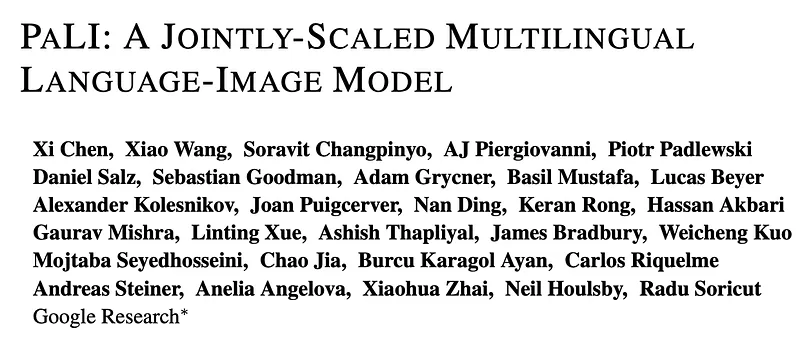 | Paper title block — **PaLI: A Jointly-Scaled Multilingual Language-Image Model** (Google Research). |
| 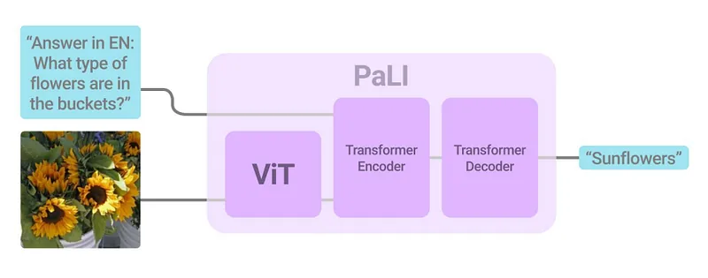 | **PaLI inference schematic** — ViT image tokens + text into encoder–decoder (example VQA: sunflowers in buckets). |
| 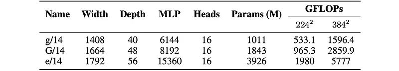 | **ViT scaling ladder** — g/14 vs **G/14** vs **e/14** width, depth, params, GFLOPs at 224² / 384². |
| 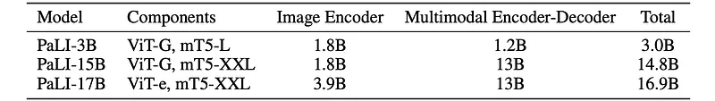 | **PaLI checkpoints** — 3B / 15B / 17B: ViT-G vs **ViT-e**, mT5-L vs **mT5-XXL**, encoder-decoder and total params. |
| 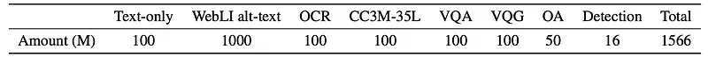 | **Pretraining mixture sizes** — millions of examples per objective (WebLI alt-text, OCR, CC3M-35L, VQA/VQG, OA, detection… **~1.57B** total). |
| 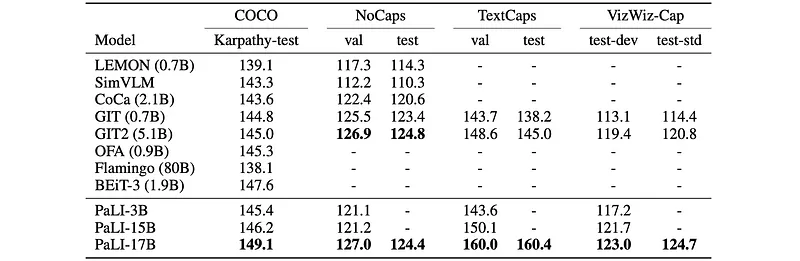 | **English captioning leaderboard** — COCO (Karpathy-test), NoCaps, TextCaps, VizWiz-Cap; PaLI-**17B** bolded vs GIT2, BEiT-3, Flamingo, etc. |
|  | **Crossmodal-3600** — per-language scores + **35-language average**; baseline vs PaLI-3B vs PaLI-**17B**. |
| 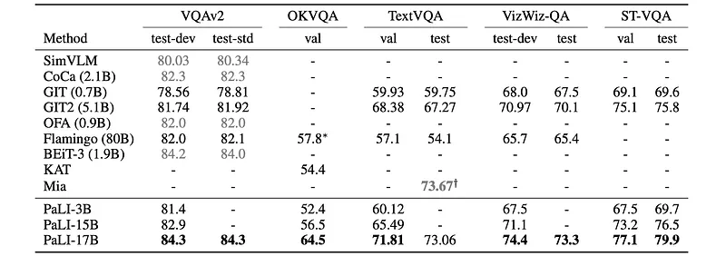 | **VQA suite** — VQAv2, OKVQA, TextVQA, VizWiz-QA, ST-VQA (val/test); PaLI scales vs SoTA rows. |
| 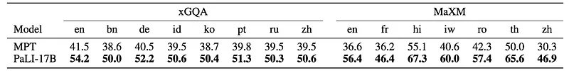 | **Multilingual VQA** — **xGQA** (8 langs) and **MaXM** (7 langs); PaLI-17B vs MPT. |
| 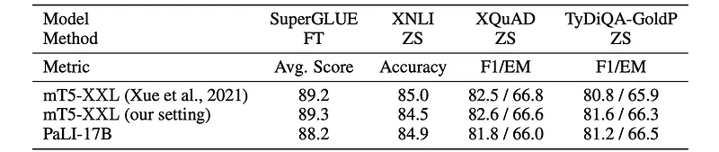 | **Language encoder quality** — SuperGLUE FT + XNLI / XQuAD / TyDi QA zero-shot; PaLI-17B vs mT5-XXL repro settings. |
| 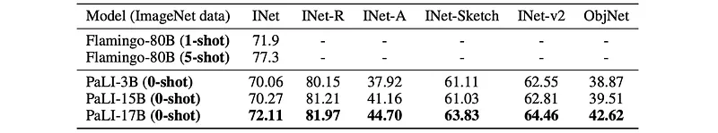 | **Zero-shot classification** — ImageNet + robustness splits + ObjectNet; PaLI vs Flamingo shots. |
| 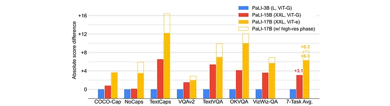 | **Scaling ablations** — absolute gains vs PaLI-3B across caption/VQA tasks; **high-resolution** phase stacked on PaLI-17B. |
| 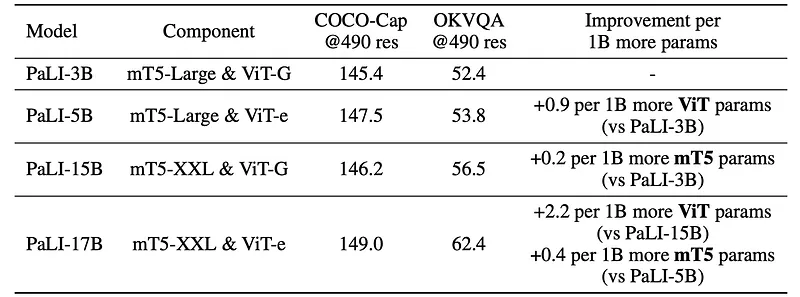 | **Vision vs language scaling** — COCO-Cap / OKVQA @490px and **gain per +1B params** when scaling ViT-e vs mT5-XXL. |
| 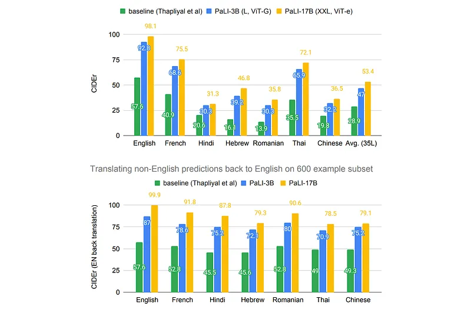 | **Crossmodal-3600 bars** — direct CIDEr vs EN **back-translation** subset; baseline vs PaLI-3B vs PaLI-17B. |
## Related

- [[Papers Explained Corpus]]
- [[Computer Vision]]
- [[Vision Language Models]]
- [[Synthetic Data]]
- [[Multilingual Models]]
- [[Large Language Models]]
- [[Papers Explained 193 - BERTopic]]
- [[Papers Explained 195 - PaLI-X]]

#summary #topic
