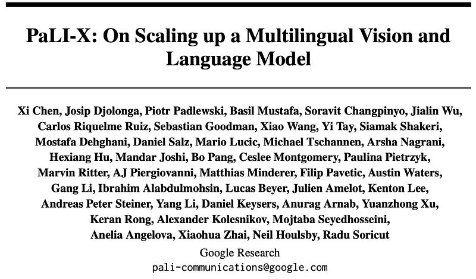
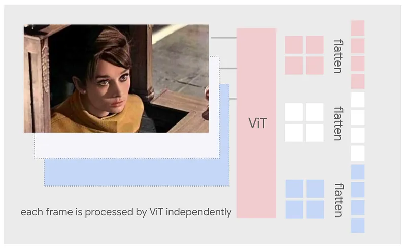
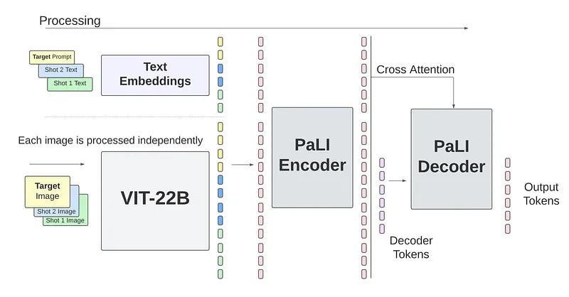
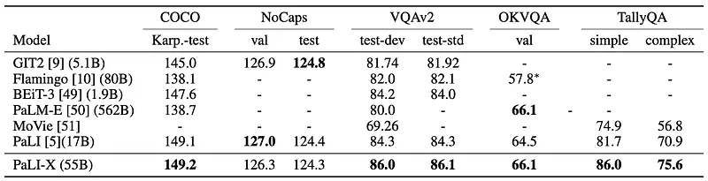
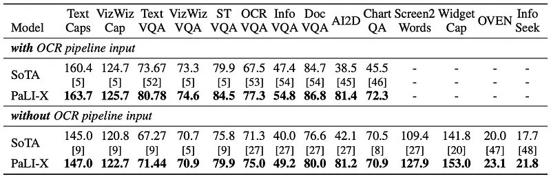
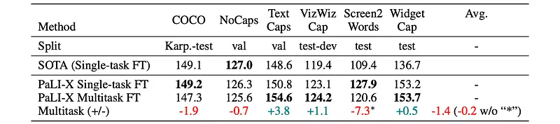
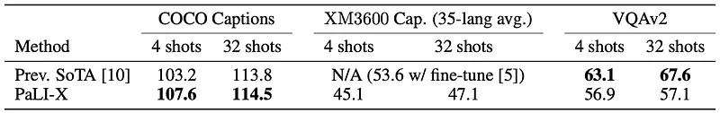
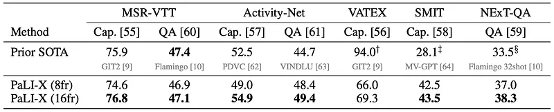
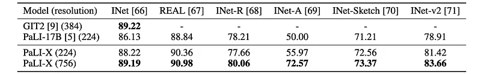
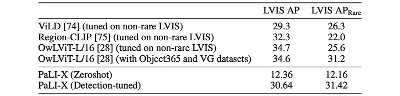

# Papers Explained 195 - PaLI-X

This work focuses on scaling a Vision-Language model to achieve outstanding performance on a wide variety of benchmarks.

This page ingests the source article into the wiki and connects it to [[Papers Explained Corpus]], [[Vision Language Models]], [[Large Language Models]], [[Embedding and Retrieval]], [[Document AI]], [[Synthetic Data]].

## Source Metadata

- Source file: `raw/2024-08-27_Papers-Explained-195--PaLI-X-f9859e73fd97.md`
- Source title: Papers Explained 195: PaLI-X
- Published: 2024-08-27
- Canonical: [https://medium.com/@ritvik19/papers-explained-195-pali-x-f9859e73fd97](https://medium.com/@ritvik19/papers-explained-195-pali-x-f9859e73fd97)

## Key Ideas

- Recommended Reading [Papers Explained 194: PaLI](https://ritvik19.medium.com/papers-explained-194-pali-c1fffc14068c)
- The PaLI-X model architecture follows the encoder-decoder architecture: image(s) are processed by a ViT encoder, with the resulting visual embeddings fed to an encoder-decoder backbone, along with embeddings from additional text input (e.g., question / prefix...
- The visual backbone is scaled to 22B parameters, To equip the model with a variety of complex vision-language tasks, an OCR-based pre training is incorporated as follows: images from the WebLI dataset are annotated with OCR-text detected by GCP Vision API;
- PaLI-X is designed to take n >= 1 images as inputs (for few-shot and video understanding)
- The encoder-decoder backbone is initialized from a variant of the UL2 encoder decoder model that uses 32B parameters.

## Notes

This work focuses on scaling a Vision-Language model to achieve outstanding performance on a wide variety of benchmarks. PaLI-X is a multilingual vision and language model consisting of a large-capacity visual encoder and a language-only encoder-decoder, both pre trained and further trained at-scale on a vision-and-language data mixture using self-supervision and full-supervision signals that achieves state-of-the-art (SoTA) results on 25+ benchmarks.

Recommended Reading [Papers Explained 194: PaLI](https://ritvik19.medium.com/papers-explained-194-pali-c1fffc14068c)

## Model Architecture

*Figure: Visual input for videos.*

The PaLI-X model architecture follows the encoder-decoder architecture: image(s) are processed by a ViT encoder, with the resulting visual embeddings fed to an encoder-decoder backbone, along with embeddings from additional text input (e.g., question / prefix / prompt).

Vision Model

The visual backbone is scaled to 22B parameters, To equip the model with a variety of complex vision-language tasks, an OCR-based pre training is incorporated as follows: images from the WebLI dataset are annotated with OCR-text detected by GCP Vision API; the encoder is then further pre-trained with a mixture of the original JFT-based classification task and a new OCR-based classification task (whether or not a given token occurred in the image according to OCR results).

PaLI-X is designed to take n >= 1 images as inputs (for few-shot and video understanding)

Language Model

The encoder-decoder backbone is initialized from a variant of the UL2 encoder decoder model that uses 32B parameters.

Overall Model

The visual embeddings, after going through a projection layer, are concatenated with the token embeddings of the text input, and fed to the encoder-decoder backbone.

### Few-shot formulation

PaLI-X processes few shot input as follows: all images, including the target one, are first independently processed by the visual encoder, and the resulting patch-level embeddings are flattened and concatenated to form the visual input sequence. After going through a projection layer, they are concatenated with the text embeddings to form the multimodal input sequence used by the encoder.

## Pre Training Data

The pretraining mixture consists of the following data and objectives:

- Span corruption on text-only data (15% of tokens)

- Split-captioning on WebLI alt-text data

- Captioning on CC3M native and translated alt-text data (35 languages)

- Split-OCR on WebLI OCR annotations

- Visual-question-answering objective over image, question, answer pairs generated using VQ2A method (CC3M training split, 35 language pairs)

- Visual-question-generation objective using the same pairs as above

- Visual-question-answering objective over image, question, answer pairs using Object-Aware method (English only)

- Captioning on Episodic WebLI examples (target alt-text predicted from remaining alt-text and images)

- Visual-question-answering on 4-pair examples (resembling Episodic WebLI, using VQ2A-CC3M pairs), with answer target conditioned on other pairs of image, question, answer data

- Pix2struct objective targeting page layout and structure using screenshot images paired with DOM-tree representations of html pages

- Captioning on short video data using VTP data (four frames per video)

- Object-detection objective on WebLI data using OWL-ViT model (L/14) to annotate WebLI images, resulting in hundreds of pseudo object labels and bounding boxes per image

- Image-token prediction objective tokenizing WebLI images (256x256 resolution) using ViT-VQGAN model with patch size 16x16 (256 tokens per image), framed as a 2D masked-token task

### Training Stages

The model is trained in two stages.

- The visual encoder (after mixed-objective training) is kept frozen, while the rest of the parameters are trained on a total of 2.2B examples at the base resolution 224×224 (native to ViT-22B), using the entire mixture.

- It continues training using only the OCR-related objectives (pix2struct and split-ocr) plus the object detection objective; this is done in several substages, during which image resolution is gradually increased to 448×448, 672×672 and finally 756×756.

## Evaluation

### Image Captioning and Visual Question Answering

Per-task fine-tuning results

- Scale Advantage: PaLI-X’s larger capacity demonstrates significant benefits for challenging scene-text and document understanding tasks.

- Superior Performance: PaLI-X outperforms state-of-the-art models on diverse vision-language tasks, achieving substantial margins in some cases.

Multitask Fine-tuning

*Figure: Scores from multitask fine-tuning compared with those from single-task fine-tuning for Image Captioning. Validation or test-dev set numbers are reported for some tasks.*

- PaLI-X achieves on-par performance with single-task fine-tuning across multiple benchmarks, demonstrating the effectiveness of multitask learning.

Few-shot Evaluation

*Figure: Few-shot performance of the PaLI-X model (multilingual captioning for XM3600).*

- PaLI-X excels in few-shot learning, achieving SOTA results on COCO captioning with both 4 and 32 shots, and demonstrating strong multilingual capabilities on XM3600.

### Video Captioning and Question Answering

*Figure: Results for Video Captioning and Video-QA using 8 frames (8fr) or 16 frames (16fr).*

- The 16-frames version of the model outperformed the 8-frame version in most cases, with a significant margin in some instances (e.g., a 6 point increase in CIDEr score for ActivityNet Captions).

- PaLI-X achieved new SOTA performance for 5 out of 7 tasks, and performed very close to prior SOTA on MSR-VTT-QA.

### Image classification

*Figure: Classification accuracy (top-1) fine-tuned on Imagenet.*

- PaLI-X achieved state-of-the-art (SOTA) performance for generative models on ImageNet and comparable or superior performance on out-of-distribution datasets compared to the current SOTA generative model with an open vocabulary, GIT2, which was fine-tuned at a 384 image resolution.

### Object Detection

*Figure: PaLI-X object detection results on LVIS.*

- The detection-tuned model achieved a mean Average Precision (mAP) of 31 on the LVIS dataset, with a higher mAP of 31.4 specifically on rare classes.

- In zero-shot evaluation, the model obtained an mAP of approximately 12 for both common and rare classes on the LVIS dataset.

- The model demonstrated comparable performance on rare classes as on common classes, which traditionally required complex sampling schedules and augmentations. This was attributed to the diverse training mix provided by PaLI-X.

## Paper

PaLI-X: On Scaling up a Multilingual Vision and Language Model [2305.18565](https://arxiv.org/abs/2305.18565)

Recommended Reading [Multi Modal Transformers](https://ritvik19.medium.com/list/multi-modal-transformers-67453f215ecf)

## Figures

Figures from the Medium HTML export (`raw/2024-08-27_Papers-Explained-195--PaLI-X-f9859e73fd97.md`); local copies under `wiki/assets/papers-explained-195-pali-x/` when download succeeded.

| Figure | Caption |
|--------|---------|
|  | Paper header — **PaLI-X: On Scaling up a Multilingual Vision and Language Model** (Google Research author list). |
|  | **Video frames** — each frame encoded by **ViT** independently, patches **flatten**ed into a token sequence. |
|  | **Few-shot multimodal encoder–decoder** — multi-shot text + images (**ViT-22B**) → **PaLI encoder** → cross-attn **decoder** → output tokens. |
|  | **Caption / VQA leaderboard** — COCO, NoCaps, VQAv2, OKVQA, TallyQA; **PaLI-X (55B)** row vs GIT2, Flamingo, BEiT-3, PaLM-E, PaLI. |
|  | **Scene-text / doc-heavy benchmarks** — with vs **without OCR pipeline**; PaLI-X vs prior SoTA across TextCaps, TextVQA, DocVQA, ChartQA, Screen2Words, … |
|  | **Multitask vs single-task FT** — caption benchmarks (COCO, NoCaps, TextCaps, VizWiz, Screen2Words, Widget Cap); aggregate **±** row calls out Screen2Words outlier. |
|  | **Few-shot** — COCO + **XM3600** caption + VQAv2 at **4 / 32 shots** vs prior SoTA (Flamingo). |
|  | **Video** — MSR-VTT, ActivityNet, VATEX, SMIT, NExT-QA (cap / QA); **8fr vs 16fr** PaLI-X vs prior SoTA footnotes. |
|  | **ImageNet classification FT** — GIT2 vs PaLI-17B vs **PaLI-X** at **224 vs 756** px (top-1, ReaL, variants). |
|  | **LVIS detection** — specialized detectors vs **PaLI-X zero-shot** vs **detection-tuned** (**AP / AP_rare**). |
## Related

- [[Papers Explained Corpus]]
- [[Vision Language Models]]
- [[Large Language Models]]
- [[Embedding and Retrieval]]
- [[Document AI]]
- [[Synthetic Data]]
- [[Papers Explained 194 - PaLI]]
- [[Papers Explained 196 - PaLI-3]]

#summary #topic
