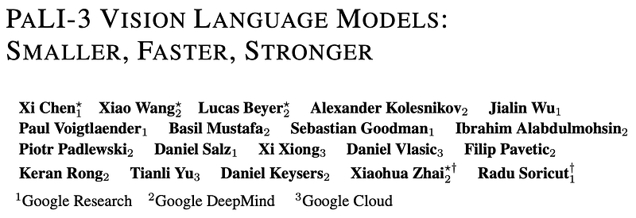
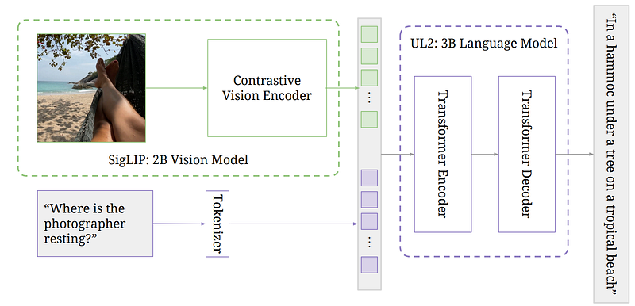
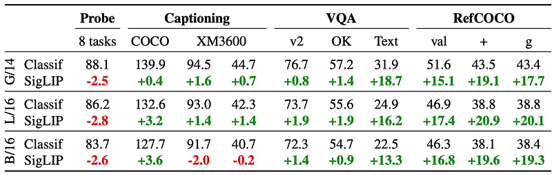
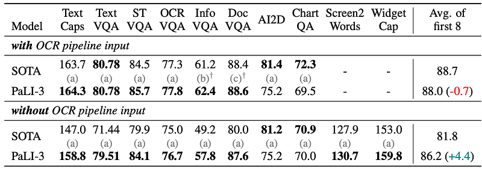
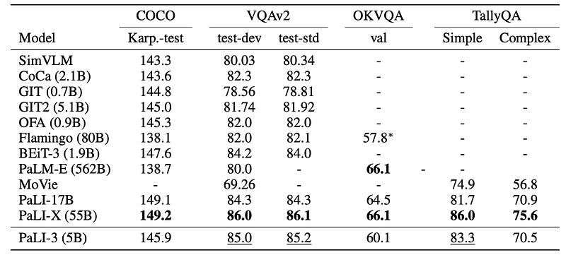
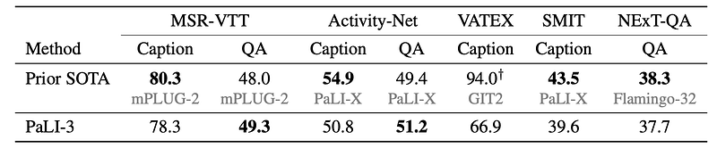
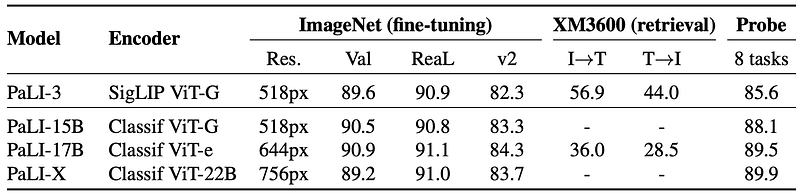

# Papers Explained 196 - PaLI-3

PaLI-3 is a 5B vision language model that outperforms larger models on various benchmarks. It uses a multilingual contrastive vision model scaled to 2B parameters, obtained using the SigLIP recipe.

This page ingests the source article into the wiki and connects it to [[Papers Explained Corpus]], [[Vision Language Models]], [[Large Language Models]], [[Computer Vision]], [[Multilingual Models]], [[Embedding and Retrieval]].

## Source Metadata

- Source file: `raw/2024-08-28_Papers-Explained-196--PaLI-3-2f5cf92f60a8.html`
- Source title: Papers Explained 196: PaLI-3
- Published: 2024-08-28
- Canonical: [https://medium.com/@ritvik19/papers-explained-196-pali-3-2f5cf92f60a8](https://medium.com/@ritvik19/papers-explained-196-pali-3-2f5cf92f60a8)

## Key Ideas

- Recommended Reading [Papers Explained 152: SigLip](https://ritvik19.medium.com/papers-explained-152-siglip-011c48f9d448) [Papers Explained 194: PaLI](https://ritvik19.medium.com/papers-explained-194-pali-c1fffc14068c)
- On a high level, the architecture follows PaLI-X: ViT encodes the image into tokens which, together with text input (the question, prompt, instruction), are passed to an encoder-decoder transformer that generates a text output.
- The vision backbone of PaLI-3 is initialized from a contrastively pretrained ViT-G/142 model (approx. 2B parameters) using the SigLIP training recipe.
- In brief, an image embedding ViT-G/14 and a text embedding transformer are trained to separately embed images and texts, such that a binary classifier using the sigmoid crossentropy of the dot product of image and text embeddings correctly classifies whether...
- The outputs of the ViT image encoder before pooling form the visual tokens, which are linearly projected and prepended to the embedded input text tokens.

## Notes

PaLI-3 is a 5B vision language model that outperforms larger models on various benchmarks. It uses a multilingual contrastive vision model scaled to 2B parameters, obtained using the SigLIP recipe. Despite not pretraining on any video data, PaLI-3 achieves new SOTA on several video QA benchmarks, indicating powerful generalization abilities.

Recommended Reading [Papers Explained 152: SigLip](https://ritvik19.medium.com/papers-explained-152-siglip-011c48f9d448) [Papers Explained 194: PaLI](https://ritvik19.medium.com/papers-explained-194-pali-c1fffc14068c)

## Model Architecture

On a high level, the architecture follows PaLI-X: ViT encodes the image into tokens which, together with text input (the question, prompt, instruction), are passed to an encoder-decoder transformer that generates a text output.

Visual component

The vision backbone of PaLI-3 is initialized from a contrastively pretrained ViT-G/142 model (approx. 2B parameters) using the SigLIP training recipe.

In brief, an image embedding ViT-G/14 and a text embedding transformer are trained to separately embed images and texts, such that a binary classifier using the sigmoid crossentropy of the dot product of image and text embeddings correctly classifies whether the respective image and text correspond to each other or not.

Full PaLI model

The outputs of the ViT image encoder before pooling form the visual tokens, which are linearly projected and prepended to the embedded input text tokens. Together, these tokens are passed into a pretrained 3B parameter UL2 encoder-decoder language model, which generates text output.

## Training

The training procedure is similar to that of PaLI and PaLI-X and consists of multiple stages:

Stage 0: Unimodal pretraining: The image encoder is pretrained contrastively on image-text pairs from the web, following the SigLIP training protocol. This differs from PaLI and PaLI-X, where a JFT classification pretrained encoder was used.The text encoder-decoder is a 3B UL2 model.

Stage 1: Multimodal Training

The combined PaLI model is trained on a multimodal task and data mixture, albeit keeping the image encoder frozen and using its native (224×224) resolution. The main mixture component is again derived from the WebLI dataset by heuristic filtering of the text quality and using the SplitCap training objective. Further ingredients are multilingual captioning on CC3M-35L and WebLI OCR, cross-lingual VQA and VQG using VQ2A-CC3M-35L, object-aware VQA, as well as object detection.

Notably, no task or data derived from video are included.

Document and text understanding capabilities are further improved by enriching WebLI with PDF documents with dense text and web-images described as posters or documents, in over 100 languages.

Stage 2: Resolution Increase

PaLI-3’s resolution is increased by fine-tuning the whole model (unfreezing the image encoder) with a short curriculum of increasing resolutions, keeping checkpoints at 812×812 and 1064×1064 resolution. The data mixture focuses on the part that involves visually-situated text and object detection.

Task specialization

Finally, for each individual task (benchmark), the PaLI-3 model is finetuned with frozen ViT image encoder on the task’s training data. For most tasks, the 812×812 resolution checkpoint is fine tuned, but for two document understanding tasks, 1064×1064 resolution checkpoint is used.

## Evaluation

### Classification Or Contrastively Pretrained ViT?

*Figure: Performance comparison between contrastively pre-trained (“SigLIP”) models and classification pre-trained (“Classif”) ViT image encoders using the same PaLI setup.*

- SigLIP models, initially performing worse in few-shot linear classification, showed moderate improvements in simpler tasks like captioning and question-answering.

- SigLIP models demonstrated large gains in more complex tasks such as TextVQA and RefCOCO variants, indicating their superiority in these areas.

### Visually Situated Text Understanding

*Figure: Results on benchmarks more focused on understanding visually-situated text.*

- PaLI-3 achieves SOTA performance on a majority of captioning and VQA benchmarks with and without external OCR input.

- Performance is slightly lower on AI2D and ChartQA benchmarks, which require advanced reasoning capabilities, compared to PaLI-X .

- When using external OCR systems, PaLI-3 is only 0.7 points behind all SOTA methods combined across 8 benchmarks.

- Without external OCR systems, PaLI-3 outperforms all SOTA methods by 4.4 points overall and by 8 points or more on specific benchmarks like TextCaps, TextVQA, InfographicVQA, and DocVQA.

- PaLI-3 without external OCR is only 1.8 points behind when using such systems, indicating a strong intrinsic OCR capability.

### Referring Expression Segmentation

*Figure: PaLI referring expression segmentation results on RefCOCO variants.*

- Contrastive pretraining significantly outperforms classification pretraining for localization tasks.

- The full PaLI-3 model achieves slightly better performance than the current state-of-the-art in referring expression segmentation.

### Natural Image Understanding

*Figure: Results on COCO Captions (Karpathy split), VQAv2, OKVQA, and TallyQA. (*Flamingo reports 32 shot result).*

- Strong Performance: PaLI-3 demonstrates very strong performance on all benchmarks despite being significantly smaller than state-of-the-art (SOTA) models.

- COCO Captions: PaLI-3 outperforms all models except BEiT-3 and the 17B and 55B PaLI models.

- VQAv2 & TallyQA: PaLI-3 surpasses all previous models except PaLI-X, with a small gap (less than 1 point) on VQAv2.

- OKVQA: PaLI-3 is only behind PaLM-E (562B) and PaLI-X (55B) but outperforms the 32-shot Flamingo (80B) model.

### Video Captioning and Question Answering

*Figure: Results for Video Captioning and Video-QA using up to 16 frames.*

- PaLI-3 achieves state-of-the-art (SOTA) performance on MSR-VTT-QA and ActivityNet-QA benchmarks.

- It shows competitive results on the NExT-QA benchmark.

- PaLI-3 performs respectably on video captioning tasks, lagging behind the SOTA by only 3 CIDEr points on average.

- The model’s strong performance in both image and video QA tasks demonstrates the benefits of contrastive ViTs.

- Due to its size and performance, PaLI-3 is presented as a practical and effective choice for video understanding tasks.

### Direct Image Encoder Evaluation

*Figure: Evaluations of the visual component in isolation.*

- Image Classification: SigLIP slightly lags behind classification-pretrained ViTs in top-1 and v2 accuracy on ImageNet but matches in ReaL accuracy, suggesting better generalization.

- Multilingual Image-Text Retrieval: SigLIP ViT-G model significantly outperforms the classification-pretrained larger ViT-e model.

- Linear Probing: SigLIP lags behind in few-shot classification tasks, likely due to the representation not being pretrained for linear separability.

- Overall: While classification-pretrained image encoders perform slightly better on standard classification tasks, SigLIP pretrained encoders are significantly better for vision-language tasks.

## Paper

PaLI-3 Vision Language Models: Smaller, Faster, Stronger [2310.09199](https://arxiv.org/abs/2310.09199)

Recommended Reading [Multi Modal Transformers](https://ritvik19.medium.com/list/multi-modal-transformers-67453f215ecf)

## Figures

Figures from the Medium HTML export (`raw/2024-08-28_Papers-Explained-196--PaLI-3-2f5cf92f60a8.html`); local copies under `wiki/assets/papers-explained-196-pali-3/` when download succeeded.

| Figure | Caption |
|--------|---------|
|  | Title block — **PaLI-3: Smaller, Faster, Stronger** vision-language models (Google Research / DeepMind). |
|  | **End-to-end diagram** — **SigLIP 2B** visual tokens + text tokens → **UL2 3B** encoder–decoder → answer string (VQA example). |
|  | **SigLIP vs classification ViT** — probes, captioning, VQA, RefCOCO deltas for **G/14, L/16, B/16** (green gains vs red probe hits). |
|  | **Visually situated text** — with / without OCR pipeline; PaLI-3 vs SoTA on TextCaps, TextVQA, DocVQA, ChartQA, Screen2Words, averages. |
|  | **Referring-expression segmentation** — RefCOCO / RefCOCO+ / G-Ref vs RefTr, PolyFormer; **PaLI-3** bolded. |
|  | **Natural-image benchmarks** — COCO caption, VQAv2, OKVQA, TallyQA; **PaLI-3 (5B)** vs PaLI-17B, PaLI-X (55B), Flamingo, … |
|  | **Video caption / QA** — MSR-VTT, ActivityNet, VATEX, SMIT, NExT-QA; PaLI-3 vs prior SoTA refs (despite **no video pretraining**). |
|  | **Vision encoder in isolation** — SigLIP **ViT-G** vs classif ViT-G / ViT-e / ViT-22B on ImageNet FT, **XM3600** retrieval, linear probes. |
## Related

- [[Papers Explained Corpus]]
- [[Vision Language Models]]
- [[Large Language Models]]
- [[Computer Vision]]
- [[Multilingual Models]]
- [[Embedding and Retrieval]]
- [[Papers Explained 195 - PaLI-X]]
- [[Papers Explained 197 - Pali Gemma]]

#summary #topic
