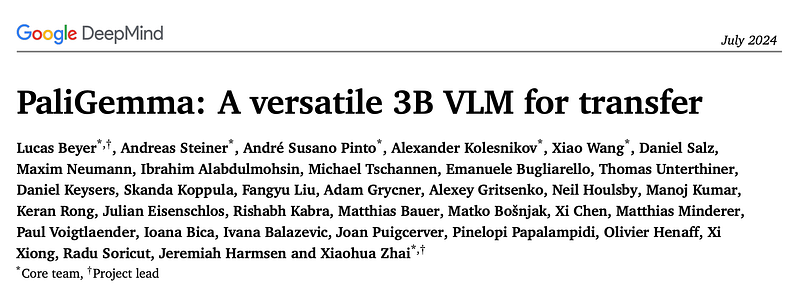
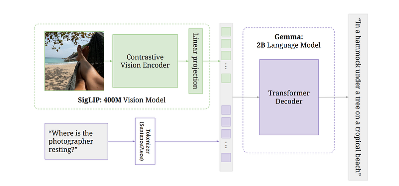
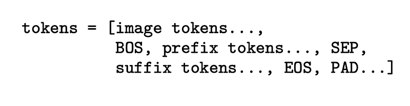
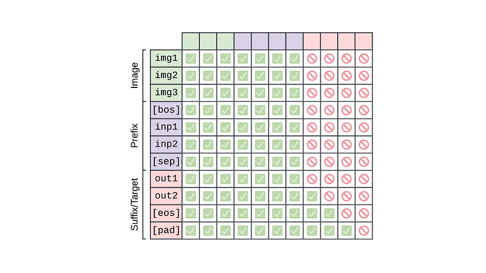
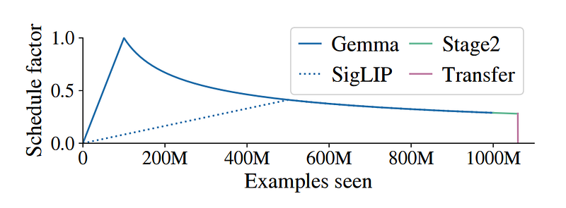
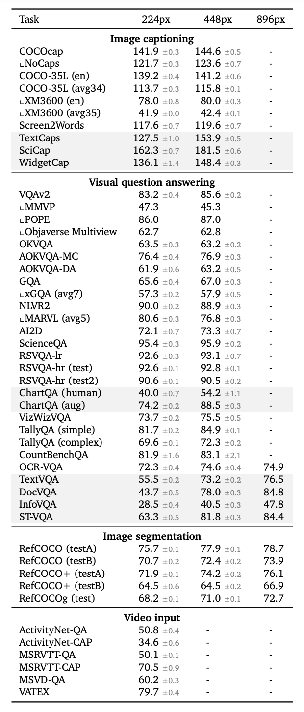

# Papers Explained 197 - Pali Gemma

PaliGemma is an open model that continues the line of PaLI vision-language models by combining the SigLIP-So400m vision encoder with the Gemma-2B language model.

This page ingests the source article into the wiki and connects it to [[Papers Explained Corpus]], [[Large Language Models]], [[Vision Language Models]], [[Computer Vision]], [[Multilingual Models]].

## Source Metadata

- Source file: `raw/2024-08-29_Papers-Explained-197--Pali-Gemma-6899e871998e.html`
- Source title: Papers Explained 197: Pali Gemma
- Published: 2024-08-29
- Canonical: [https://medium.com/@ritvik19/papers-explained-197-pali-gemma-6899e871998e](https://medium.com/@ritvik19/papers-explained-197-pali-gemma-6899e871998e)

## Key Ideas

- PaLI is a series of state-of-the-art vision-language models. The first PaLI used a classification-pretrained ViT and mT5 language model. PaLI-X and PaLM-E combined ViT-22 B with a 32B UL2 language model or the 540B PaLM language model, respectively.
- Gemma is a family of auto-regressive decoder-only open large language models built from the same research and technology used to create the Gemini models.
- The models are available at [HuggingFace](https://huggingface.co/collections/google/paligemma-release-6643a9ffbf57de2ae0448dda).
- Recommended Reading [Papers Explained 106: Gemma](https://ritvik19.medium.com/papers-explained-106-gemma-ca2b449321ac) [Papers Explained 196: PaLI-3](https://ritvik19.medium.com/papers-explained-196-pali-3-2f5cf92f60a8)
- PaliGemma takes one or more images and a textual description of the task, referred to as the prefix. It then autoregressively generates a prediction in the form of a text string, known as the suffix.

## Notes

PaliGemma is an open model that continues the line of PaLI vision-language models by combining the SigLIP-So400m vision encoder with the Gemma-2B language model.

PaLI is a series of state-of-the-art vision-language models. The first PaLI used a classification-pretrained ViT and mT5 language model. PaLI-X and PaLM-E combined ViT-22 B with a 32B UL2 language model or the 540B PaLM language model, respectively. Finally, PaLI-3 combines SigLIP, a 2B vision encoder, with a 3B language model.

Gemma is a family of auto-regressive decoder-only open large language models built from the same research and technology used to create the Gemini models.

The models are available at [HuggingFace](https://huggingface.co/collections/google/paligemma-release-6643a9ffbf57de2ae0448dda).

Recommended Reading [Papers Explained 106: Gemma](https://ritvik19.medium.com/papers-explained-106-gemma-ca2b449321ac) [Papers Explained 196: PaLI-3](https://ritvik19.medium.com/papers-explained-196-pali-3-2f5cf92f60a8)

## Model

PaliGemma takes one or more images and a textual description of the task, referred to as the prefix. It then autoregressively generates a prediction in the form of a text string, known as the suffix.

### Architecture

*Figure: PaliGemma’s architecture.*

PaliGemma consists of three components:

- Image Encoder: A publicly available SigLIP checkpoint, specifically the “shape optimized” ViTSo400m image encoder, which was contrastively pre-trained at large scale using the sigmoid loss.

- Decoder-only Language Model: A publicly available Gemma-2B v1.0 raw pretrained checkpoint, which strikes a great balance between performance and size.

- Linear Projection Layer: A linear layer that projects SigLIP’s output tokens into the same dimensions as Gemma2B’s vocabulary tokens, allowing them to be concatenated.

The architecture works as follows:

- The image (resized to a fixed square size 224, 448, or 896 pixels) is passed through the image encoder, which converts it into a sequence of N_img tokens.

- The text is converted into N_txt tokens using Gemma’s SentencePiece tokenizer and embedded with Gemma’s vocabulary embedding layer.

- The image tokens are projected with a zero-initialized linear projection.

- sequence of input tokens to the decoder is created by concatenating the projected image tokens, BOS token (marking the start of text tokens), and SEP token (separating prefix and suffix).

- The model uses full attention on the whole input (image and prefix tokens) to allow image tokens to “lookahead” at the task at hand.

- The suffix is covered by an auto-regressive mask, including PAD tokens.

*Figure: PaliGemma’s Prefix-LM masking: block attention throughout image and prefix, autoregressive attention on the suffix.*

## Pretraining

The training of PaliGemma follows the same steps as previous PaLI models :

### Stage0: Unimodal pretraining

The unimodal components are first trained separately to take advantage of established and well-scaled training methods. Specifically, no custom pre-training is performed for PaliGemma, and instead, existing publicly available checkpoints are utilized.

### Stage1: Multimodal pretraining

The unimodal models are combined and trained on a large-scale mixture of vision language tasks, differing from common practice of freezing the backbones while training the whole model. To prevent negative effects from initially misaligned gradients coming from the language model, a slow linear warm-up is used for the image encoder’s learning rate. This ensures that the quality of the image encoder is not compromised by the initially incorrect gradients.

*Figure: Learning-rate schedule across stages.*

Stage1 is trained at resolution 224px (hence, 𝑁img = 256 image tokens) and sequence length 𝑁txt = 128 for a total of 1B examples.

### Stage2: Resolution increase

This stage involves two additional model checkpoints for higher resolutions: 448x448 and 896x896 pixels. For each resolution, the training process is the same as stage 1, fewer total examples are used, but with increased cost and information density per example. For 448 resolution, an additional 50M examples are trained and for 896 resolution, an additional 10M examples are trained. Additionally, the text sequence length is increased to 512 tokens.

### Stage3: Transfer

The outcome of Stages 1 and 2 is three PaliGemma checkpoints with different resolutions (224px, 448px, and 896px) that were pre-trained on broad visual knowledge. However, these checkpoints are not designed to be user-friendly or benchmark-friendly because their training focused solely on density of learning signals rather than creating a usable interface.

To make them more useful, the checkpoints were transferred to various individual academic benchmarks using a simple and unified transfer recipe with minimal hyper-parameters. Additionally, PaliGemma was applied to tasks that require processing multiple images as input, such as NLVR2 (which asks one question about two images) and standard short-video understanding tasks subsampled to 16 frames.

The hyper-parameters modified per-task, in decreasing order of importance:

- Resolution (i.e. checkpoint): 224, 448, 896.

- Epochs: 1, 3, 10, 30, 100.

- Learning-rate: 3e-5, 1e-5, 3e-6.

- Label-smoothing: 0.0, 0.1, 0.3.

- Dropout in the LLM: 0.0, 0.1, 0.3.

- Weight decay: 0.0 or 0.1 × learning-rate.

- Freeze ViT: false, true.

- Beam-search may benefit captioning.

## Pre-train datasets

PaliGemma is pre-trained on the following mixture of datasets:

- WebLI: WebLI (Web Language Image) is a web-scale multilingual image-text dataset built from the public web. A wide range of WebLI splits are used to acquire versatile model capabilities, such as visual semantic understanding, object localization, visually-situated text understanding, multilinguality, etc.

- CC3M-35L: Curated English image-alt_text pairs from webpages.It is translated into 34 additional languages using the Google Cloud Translation API.

- VQ²A-CC3M-35L/VQG-CC3M-35L: A subset of VQ2A-CC3M , translated into the same additional 34 languages as CC3M-35L, using the Google Cloud Translation API.

- OpenImages: Detection and object-aware questions and answers generated by handcrafted rules on the OpenImages dataset.

- WIT: Images and texts collected from Wikipedia.

### Data responsibility filtering

The following filters are applied to WebLI, with the goal of training PaliGemma on clean data:

- Pornographic image filtering: This filter removes images deemed to be of pornographic nature.

- Text safety filtering: Images paired with unsafe text are filtered out. Unsafe text is any text deemed to contain or be about CSAI, pornography, vulgarities, or otherwise offensive.

- Text toxicity filtering: Images paired with text deemed insulting, obscene, hateful or otherwise toxic are identified and filtered out using the Perspective API.

- Text personal information filtering: Certain personal information and other sensitive data were filtered out using the Cloud Data Loss Prevention (DLP) API to protect the privacy of individuals. Identifiers such as social security numbers and other sensitive information types were removed.

- Additional methods: Filtering based on content quality and safety in line with google’s policies and practices.

## Evaluation

To verify the transferability of PaliGemma, it is finetunedon more than 30 academic benchmarks that were not part of the original pretraining data mixture and were explicitly excluded from the web-scale pretraining data.

Hyperparameters for transferring PaliGemma to new tasks were optimized through a parameter sweep, starting from recommended values.

## Paper

[Introducing PaliGemma, Gemma 2, and an Upgraded Responsible AI Toolkit](https://developers.googleblog.com/en/gemma-family-and-toolkit-expansion-io-2024/)

[PaliGemma — Google’s Cutting-Edge Open Vision Language Model](https://huggingface.co/blog/paligemma)

Recommended Reading [Small LLMs](https://ritvik19.medium.com/list/small-llms-41124d5c7c80) [Gemini / Gemma Models](https://ritvik19.medium.com/list/gemini-gemma-models-4cb7dfc50d42) [Multi Modal Transformers](https://ritvik19.medium.com/list/multi-modal-transformers-67453f215ecf)

## Figures

Figures from the Medium HTML export (`raw/2024-08-29_Papers-Explained-197--Pali-Gemma-6899e871998e.html`); local copies under `wiki/assets/papers-explained-197-pali-gemma/` when download succeeded.

| Figure | Caption |
|--------|---------|
|  | Technical report header — **PaliGemma: A versatile 3B VLM for transfer** (Google DeepMind, Jul 2024). |
|  | **Architecture walkthrough** — **SigLIP-So400m** patches + tokenizer → concat → **Gemma 2B** decoder-only LM → VQA answer. |
|  | **Token layout** — `[image…, BOS, prefix…, SEP, suffix…, EOS, PAD…]` multimodal sequence template. |
|  | **Prefix-LM mask** — full (bidirectional) attention over image + prefix; **causal** decoding on suffix targets. |
|  | **Stage-1 LR schedule** — slow **SigLIP** warmup vs **Gemma** cosine decay over **1B** multimodal examples (+ Stage2 / transfer markers). |
|  | **Resolution ladder** — captioning, VQA (incl. OCR-heavy rows), RefCOCO segmentation, video @ **224 / 448 / 896** px checkpoints. |
## Related

- [[Papers Explained Corpus]]
- [[Large Language Models]]
- [[Vision Language Models]]
- [[Computer Vision]]
- [[Multilingual Models]]
- [[Papers Explained 196 - PaLI-3]]
- [[Papers Explained 198 - ColPali]]

#summary #topic
