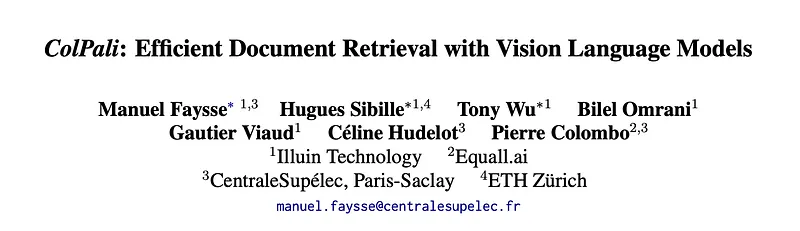
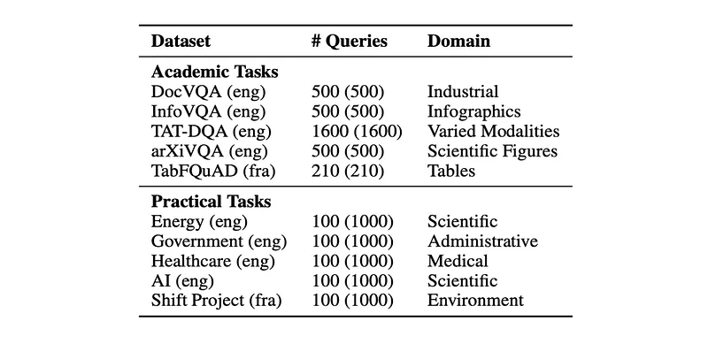
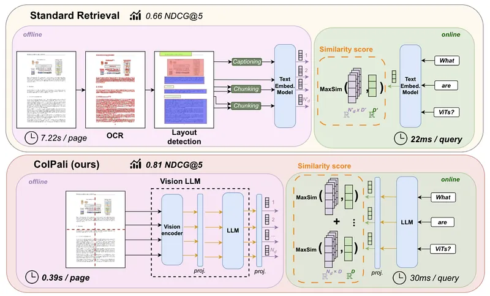
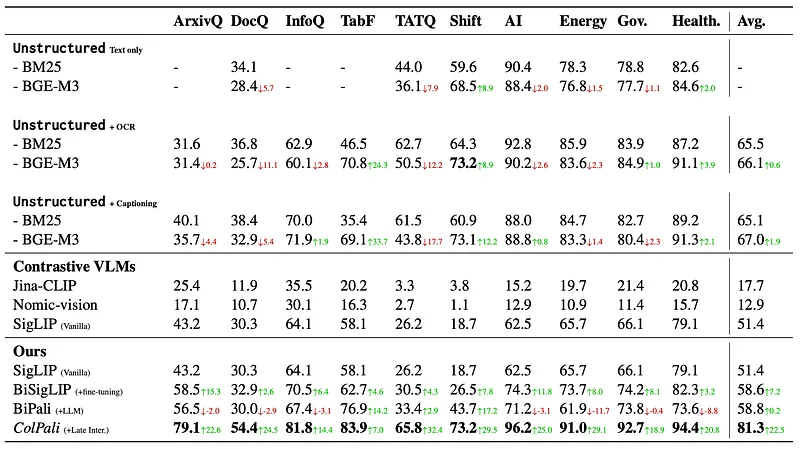
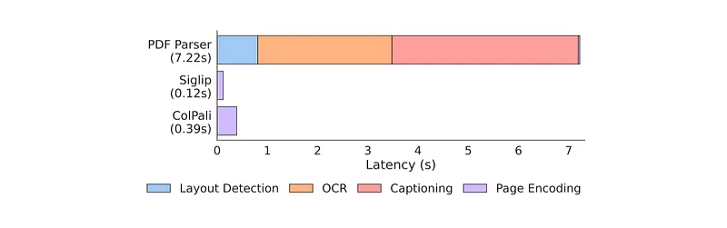

# Papers Explained 198 - ColPali

ColPali leverages the document understanding capabilities of recent Vision Language Models to produce high-quality contextualized embeddings solely from images of document pages.

This page ingests the source article into the wiki and connects it to [[Papers Explained Corpus]], [[Document AI]], [[Embedding and Retrieval]], [[Large Language Models]], [[Vision Language Models]], [[Model Compression and Efficiency]].

## Source Metadata

- Source file: `raw/2024-08-30_Papers-Explained-198--ColPali-b3be70cbe252.md`
- Source title: Papers Explained 198: ColPali
- Published: 2024-08-30
- Canonical: [https://medium.com/@ritvik19/papers-explained-198-colpali-b3be70cbe252](https://medium.com/@ritvik19/papers-explained-198-colpali-b3be70cbe252)

## Key Ideas

- To benchmark current systems on visually rich document retrieval, the study introduces the Visual Document Retrieval Benchmark ViDoRe, composed of various page-level retrieving tasks spanning multiple domains, languages, and settings.
- The project artifacts are available at [HuggingFace](https://huggingface.co/vidore).
- Recommended Reading [Papers Explained 88: ColBERT](https://ritvik19.medium.com/papers-explained-88-colbert-fe2fd0509649) [Papers Explained 197: Pali Gemma](https://ritvik19.medium.com/papers-explained-197-pali-gemma-6899e871998e)
- Widely used visual question-answering benchmarks are repurposed for retrieval tasks: using question as the query, and the associated page as the gold document.
- Moreover, TabFQuAD, a human-labeled dataset on tables extracted from French industrial PDF documents is also used.

## Notes

ColPali leverages the document understanding capabilities of recent Vision Language Models to produce high-quality contextualized embeddings solely from images of document pages. Combined with a late interaction matching mechanism, ColPali largely outperforms modern document retrieval pipelines while being drastically faster and end-to-end trainable.

To benchmark current systems on visually rich document retrieval, the study introduces the Visual Document Retrieval Benchmark ViDoRe, composed of various page-level retrieving tasks spanning multiple domains, languages, and settings.

The project artifacts are available at [HuggingFace](https://huggingface.co/vidore).

Recommended Reading [Papers Explained 88: ColBERT](https://ritvik19.medium.com/papers-explained-88-colbert-fe2fd0509649) [Papers Explained 197: Pali Gemma](https://ritvik19.medium.com/papers-explained-197-pali-gemma-6899e871998e)

## The ViDoRe Benchmark

*Figure: The composition of ViDoRe.*

Widely used visual question-answering benchmarks are repurposed for retrieval tasks: using question as the query, and the associated page as the gold document.

Moreover, TabFQuAD, a human-labeled dataset on tables extracted from French industrial PDF documents is also used.

Topic-specific retrieval benchmarks that cover multiple domains are created to go beyond using repurposed QA datasets. Publicly accessible PDF documents are collected and queries related to each document page are generated using Claude-3 Sonnet. 1,000 document pages per topic are collected and associated with 100 queries that have been extensively filtered for quality and relevance by human annotators.

### Evaluation Metrics

Efficient document retrieval systems exhibit joint properties of high retrieval performance (R1), low latency during querying (R2), and high throughput during indexation (R3).

To evaluate performance on the benchmark (R1) standard metrics from the retrieval literature: NDCG, Recall@K, MRR are used. Specifically,NDCG@5. To validate compliance with practical industrial constraints, query latencies (R2) and indexing throughputs (R3) are also considered.

## ColPali

*Figure: ColPali Approach.*

The key concept is to leverage the alignment between output embeddings of text and image tokens acquired during multimodal finetuning.To this extent, ColPali is a Paligemma-3B extension that is capable of generating ColBERT-style multi-vector representations of text and images.

A projection layer is added to map the output language modeling embeddings to a vector space of reduced dimension D = 128 as used in the ColBERT to keep lightweight bag-of-embedding representations.

### Late Interaction

Given query q and document d, Eq and Ed denote their respective multi-vector representation in the common embedding space.

The late interaction operator, LI (q, d), is the sum over all query vectors Ed(j), of its maximum dot product ⟨·|·⟩ with each of the Nd document embedding vectors Ed(1:Nd).

### Contrastive Loss

Following ColBERT the in-batch contrastive loss L is defined as the softmaxed cross-entropy of the positive scores w.r.t. the maximal negative scores.

### Dataset

The training dataset of 127,460 fully english query — page pairs is comprised of train sets of openly available academic datasets (63%) and a synthetic dataset made up of pages from web-crawled PDF documents and augmented with VLM-generated (Claude-3 Sonnet) pseudo-questions (37%).

### Parameters

All models are trained for 1 epoch on the train set in bfloat16 format, using LoRA, with α = 32 and r = 32 on the transformer layers from the language model, as well as the final randomly initialized projection layer.

### Query Augmentation

As in ColBERT, 5 <unused0> are appended tokens to the query tokens to serve as a soft, differentiable query expansion or re-weighting mechanism.

## Evaluation

### Performance (R1)

*Figure: Comprehensive evaluation of baseline models and our proposed method on ViDoRe.*

- Started with an off-the-shelf SigLIP model pretrained on the English split of WebLI, a large corpus of image-text pairs.

- Fine-tuned the textual component of SigLIP on a document-oriented dataset to improve performance on document retrieval tasks (BiSigLip).

- Integrated SigLIP with a language model (PaliGemma) to create BiPali, and then fine-tuned it on the training dataset.

- SigLIP outperformed Jina CLIP and Nomic-vision on document retrieval tasks, particularly in English.

- BiSigLip showed clear improvements over SigLIP on figure and table retrieval tasks (ArxivQA and TabFQuAD).

- BiPali performed slightly worse in English than the fine-tuned BiSigLIP variant but significantly better in French tasks, indicating the benefits of the LLM (Gemma 2B) for multilingual text understanding.

- ColPali outperformed strong baselines and all evaluated text-image embedding models across various benchmarks, including InfographicVQA, ArxivQA, and TabFQuAD.

- Text-centric documents were better retrieved by ColPali models across all domains and languages.

### Online Querying (R2)

- ColPali’s language model took approximately 30 ms to encode a query with 15 tokens, while BGE-M3 encoding took about 22 ms under similar conditions.

- For smaller corpus sizes, the late interaction operation introduced only marginal overhead (≈ 1 ms per 1000 pages).

- The cosine similarity computation between bi-encoder vectors was found to be very fast and did not significantly contribute to the overall latency.

- Optimized late interaction engines were effective in scaling corpus sizes to millions of documents with minimal latency degradation.

### Offline Indexing (R3)

*Figure: Offline indexing Latency.*

- ColPali achieves significant speedups in indexing compared to standard retrieval methods.

- Although the encoder model is larger than standard retrieval encoders, skipping the preprocessing allows large speedups at indexing.

## Paper

ColPali: Efficient Document Retrieval with Vision Language Models [2407.01449](https://arxiv.org/abs/2407.01449)

Recommended Reading [Retrieval and Representation Learning](https://ritvik19.medium.com/list/retrieval-and-representation-learning-bcd23de0bd8e)

## Figures

Figures from the Medium HTML export (`raw/2024-08-30_Papers-Explained-198--ColPali-b3be70cbe252.md`); local copies under `wiki/assets/papers-explained-198-colpali/` when download succeeded.

| Figure | Caption |
|--------|---------|
|  | Paper title — **ColPali: Efficient Document Retrieval with Vision Language Models** (Illuin / Equall.ai / CentraleSupélec / ETH). |
|  | **ViDoRe tasks** — academic QA splits (DocVQA, InfoVQA, ArxivQA, TabFQuAD, …) vs practical **100-query** domain slices (Energy, Gov, Health, …). |
|  | **Pipelines** — classical OCR → chunk → text embed vs **ColPali** page-image → VLM → multi-vector doc embed; **MaxSim** late interaction + **NDCG@5** callouts. |
|  | **Late interaction score** — sum over query tokens of **max** patch similarity (**ColBERT-style** MaxSim). |
|  | **ViDoRe leaderboard** — BM25 / BGE-M3 / VLMs / BiSigLIP / BiPali vs **ColPali + late interaction** (**NDCG@5**, dataset columns + average). |
|  | **Offline indexing latency** — stacked PDF parser (layout + OCR + captioning) vs single-pass **SigLIP** vs **ColPali** page encoding bars (seconds per page). |
## Related

- [[Papers Explained Corpus]]
- [[Document AI]]
- [[Embedding and Retrieval]]
- [[Large Language Models]]
- [[Vision Language Models]]
- [[Model Compression and Efficiency]]
- [[Papers Explained 197 - Pali Gemma]]
- [[Papers Explained 199 - CvT]]

#summary #topic
