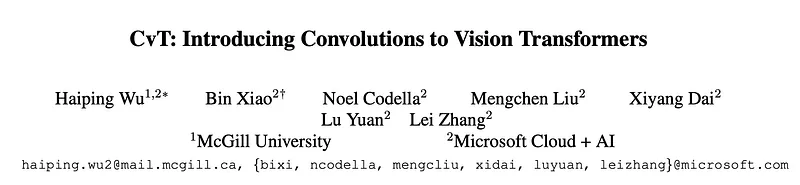
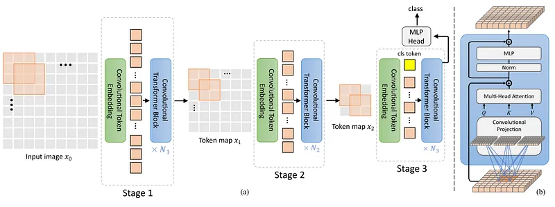
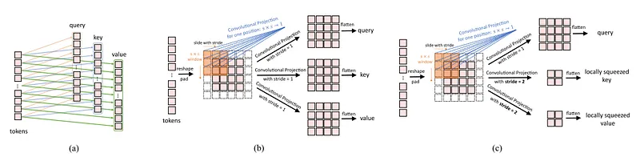
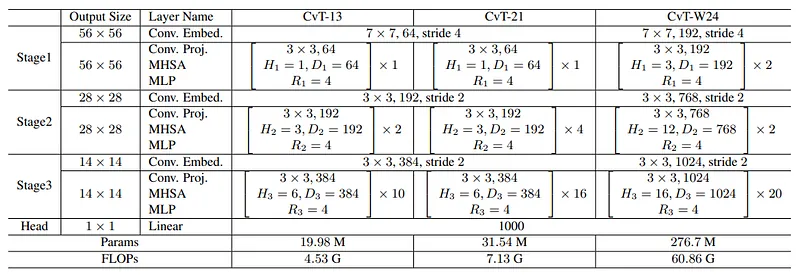
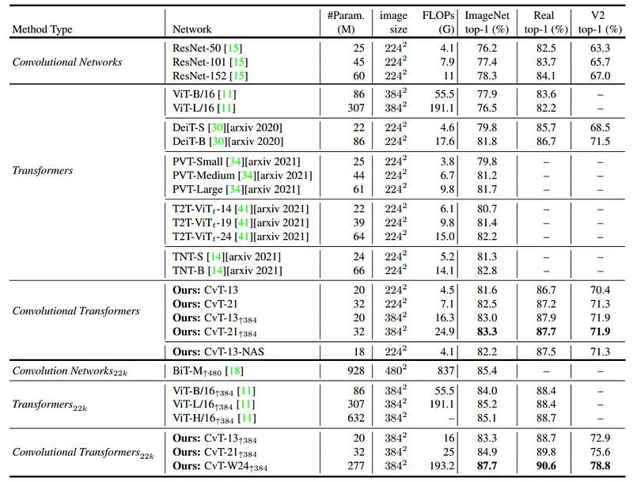
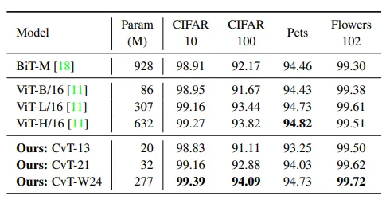
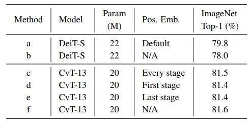
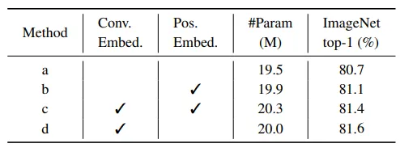
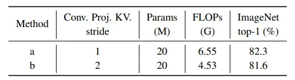
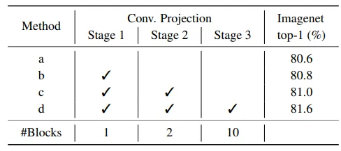

# Papers Explained 199 - CvT

Convolutional vision Transformer (CvT) improves Vision Transformer (ViT) in performance and efficiency by introducing convolutions into ViT to yield the best of both designs. These changes introduce desirable properties of convolutional neural networks (CNNs) to the ViT architecture (i.e.

This page ingests the source article into the wiki and connects it to [[Papers Explained Corpus]], [[Computer Vision]], [[Large Language Models]], [[Model Compression and Efficiency]], [[Synthetic Data]], [[Evaluation and Benchmarks]].

## Source Metadata

- Source file: `raw/2024-08-31_Papers-Explained-199--CvT-fb4a5c05882e.md`
- Source title: Papers Explained 199: CvT
- Published: 2024-08-31
- Canonical: [https://medium.com/@ritvik19/papers-explained-199-cvt-fb4a5c05882e](https://medium.com/@ritvik19/papers-explained-199-cvt-fb4a5c05882e)

## Key Ideas

- Convolutional vision Transformer (CvT) improves Vision Transformer (ViT) in performance and efficiency by introducing convolutions into ViT to yield the best of both designs.
- CvT introduces two convolution-based operations into the Vision Transformer architecture, namely the Convolutional Token Embedding and Convolutional Projection.
- The Convolutional Projection layer aims to enhance local spatial context modeling while maintaining computational efficiency by replacing the original position-wise linear projection in the Multi-Head Sept Attention with Depth-wise Separable Convolutions.
- For evaluation, the ImageNet dataset, with 1.3M images and 1k classes, as well as its superset ImageNet-22k with 22k classes and 14M images is used.
- CvT-13 and CvT-21 are the basic models, with parameters of 19.98M and 31.54M, respectively. CvT-X represents Convolutional Vision Transformer with a total of X Transformer Blocks.

## Notes

Convolutional vision Transformer (CvT) improves Vision Transformer (ViT) in performance and efficiency by introducing convolutions into ViT to yield the best of both designs. These changes introduce desirable properties of convolutional neural networks (CNNs) to the ViT architecture (i.e. shift, scale, and distortion invariance) while maintaining the merits of Transformers (i.e. dynamic attention, global context, and better generalization).

## Architecture

*Figure: The pipeline of the proposed CvT architecture.*

CvT introduces two convolution-based operations into the Vision Transformer architecture, namely the Convolutional Token Embedding and Convolutional Projection. A multi-stage hierarchy design borrowed from CNNs is employed, where three stages in total are used in this work. Each stage has two parts.

First, the input image (or 2D reshaped token maps) are subjected to the Convolutional Token Embedding layer, which is implemented as a convolution with overlapping patches with tokens reshaped to the 2D spatial grid as the input (the degree of overlap can be controlled via the stride length). An additional layer normalization is applied to the tokens. This allows each stage to progressively reduce the number of tokens (i.e. feature resolution) while simultaneously increasing the width of the tokens (i.e. feature dimension), thus achieving spatial downsampling and increased richness of representation, similar to the design of CNNs.

Next, a stack of the proposed Convolutional Transformer Blocks comprise the remainder of each stage. Convolutional Transformer Block, where a depth-wise separable convolution operation, referred as Convolutional Projection, is applied for query, key, and value embeddings respectively, instead of the standard position-wise linear projection in ViT. Additionally, the classification token is added only in the last stage. Finally, an MLP (i.e. fully connected) Head is utilized upon the classification token of the final stage output to predict the class.

### Convolutional Token Embedding

Convolutional Token Embedding (CTE) applies 2D convolutions to input token maps, capturing local spatial contexts. The resulting token map is flattened, normalized, and fed into Transformer blocks. This integration enables CvT to combine convolutional and self-attention mechanisms, allowing it to represent intricate visual patterns over larger areas, akin to Convolutional Neural Networks (CNNs). CTE’s flexibility in adjusting token dimensions and quantities across stages enhances CvT’s ability to progressively capture complex image features.

### Convolutional Projection for Attention

The Convolutional Projection layer aims to enhance local spatial context modeling while maintaining computational efficiency by replacing the original position-wise linear projection in the Multi-Head Sept Attention with Depth-wise Separable Convolutions. This results in a more versatile Transformer block with more efficiency and reduced computation cost (using depth-wise separable convolutions reduces the number of parameters and computational operations, by employing larger strides for key & value projections).

*Figure: (a) Linear projection in ViT. (b) Convolutional projection. (c) Squeezed convolutional projection.*

## Experiments

For evaluation, the ImageNet dataset, with 1.3M images and 1k classes, as well as its superset ImageNet-22k with 22k classes and 14M images is used. The models pretrained on ImageNet-22k are further finetuned to downstream tasks, including CIFAR-10/100, Oxford-IIIT-Pet, Oxford-IIIT-Flower.

CvT-13 and CvT-21 are the basic models, with parameters of 19.98M and 31.54M, respectively. CvT-X represents Convolutional Vision Transformer with a total of X Transformer Blocks. Additionally, a wider model, CvT-W24 (W denoting Wide), having a larger token dimension for each stage, resulting in 298.3M parameters is trianed, in order to validate the scaling ability of the proposed architecture.

*Figure: Architectures for ImageNet classification. Input image size is 224 × 224 by default. Conv. Embed.: Convolutional Token Embedding. Conv. Proj.: Convolutional Projection. Hi and Di is the number of heads and embedding feature dimension in the ith MHSA module. Ri is the feature dimension expansion ratio in the ith MLP layer.*

## Results

### Comparison to state of the art

*Figure: Accuracy of manual designed architecture on ImageNet, ImageNet Real and ImageNet V2 matched frequency. Subscript 22k indicates the model pre-trained on ImageNet22k, and finetuned on ImageNet1k with the input size of 384 × 384, except BiT-M finetuned with input size of 480 × 480.*

- Compared to Transformer based models, CvT achieves a much higher accuracy with fewer parameters and FLOPs.

- Compared to CNN-based models, CvT further closes the performance gap of Transformer-based models. The smallest model CvT-13 with 20M parameters surpasses the large ResNet-152 model by 3.2% on ImageNet Top-1 accuracy, while ResNet-151 having 3 times the parameters.

- When more data are involved, the wide model CvT-W24 pretrained on ImageNet-22k reaches to 87.7% Top-1 Accuracy on ImageNet without extra data, surpassing the previous best Transformer based models ViT-L/16 by 2.5% with similar number of model parameters.

### Downstream task transfer

*Figure: Top-1 accuracy on downstream tasks. All the models are pre-trained on ImageNet-22k data*

- CvT-W24 model is able to obtain the best performance across all the downstream tasks considered, even when compared to the large BiT-R152x4 model, which has more than 3× the number of parameters.

### Ablations

Removing Position Embedding

*Figure: Ablations on position embedding.*

- Given that convolutions are introduced into the model, allowing local context to be captured, removing position embedding of CvT does not degrade the performance.

Convolutional Token Embedding

*Figure: Ablations on Convolutional Token Embedding.*

- The introduction of Convolutional Token Embedding not only improves the performance, but also helps CvT model spatial relationships without position embedding.

Convolutional Projection

*Figure: Ablations on Convolutional Projection with different strides for key and value projection. Conv. Proj. KV.: Convolutional Projection for key and value. We apply Convolutional Projection in all Transformer blocks.*

- By using a stride of 2 for key and value projection, a 0.3% drop is observed in ImageNet Top-1 accuracy, but with 30% fewer FLOPs.

*Figure: Ablations on Convolutional Projection v.s. Position-wise Linear Projection. ✓ indicates the use of Convolutional Projection, otherwise use Position-wise Linear Projection.*

- Replacing the original Position-wise Linear Projection with the proposed Convolutional Projection improves the Top-1 Accuracy on ImageNet from 80.6% to 81.5%.

- The performance continually improves as more stages use the design, validating this approach as an effective modeling strategy

## Paper

CvT: Introducing Convolutions to Vision Transformers [2103.15808](https://arxiv.org/abs/2103.15808)

Recommended Reading [Vision Transformers](https://ritvik19.medium.com/list/vision-transformers-61e6836230f1)

## Figures

Figures from the Medium HTML export (`raw/2024-08-31_Papers-Explained-199--CvT-fb4a5c05882e.md`); local copies under `wiki/assets/papers-explained-199-cvt/` when download succeeded.

| Figure | Caption |
|--------|---------|
|  | **CvT pipeline** — hierarchical conv **token embedding** + conv **QKV projections** inside Transformer blocks (multi-stage ViT hybrid). |
|  | **Projection geometry** — (a) ViT linear patch projection vs (b) convolutional token embedding vs (c) squeezed conv projection foot-print. |
|  | **ImageNet architectures** — stage-wise depths, conv-embed / conv-proj headers, **MHSA** heads/dims per stage (**224×224** defaults). |
|  | **Top-1 accuracy** — manual CvT variants on ImageNet / **ReaL** / **V2** matched-frequency (**ImageNet-22k** pretrain rows noted). |
|  | **Transfer top-1** — downstream datasets with **IN-22k** pretraining (all conv projection variants summarized). |
|  | **Positional embedding ablations** — learned pos embed vs conv projections stages / pooling choices on ImageNet top-1. |
|  | **Convolutional token embedding** — kernel / stride choices vs flatten-patch ViT baseline (**top-1 %**). |
|  | **Conv projection strides** — effect of stride on **key/value** conv projections (full hierarchy of CvT blocks). |
|  | **Conv vs linear projection** — stage-wise toggles (✓ conv projection) vs linear baseline grid on ImageNet accuracy. |
|  | **Depth-wise rollout** — incrementally enable conv projection in stages **1→3**; ImageNet top-1 climbs **80.6 → 81.6%** (#blocks row). |
## Related

- [[Papers Explained Corpus]]
- [[Computer Vision]]
- [[Large Language Models]]
- [[Model Compression and Efficiency]]
- [[Synthetic Data]]
- [[Evaluation and Benchmarks]]
- [[Papers Explained 198 - ColPali]]
- [[Papers Explained 200 - SimCLR]]

#summary #topic
