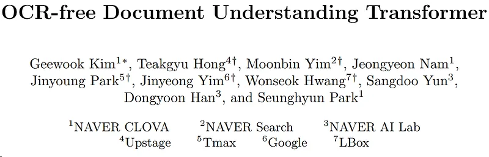
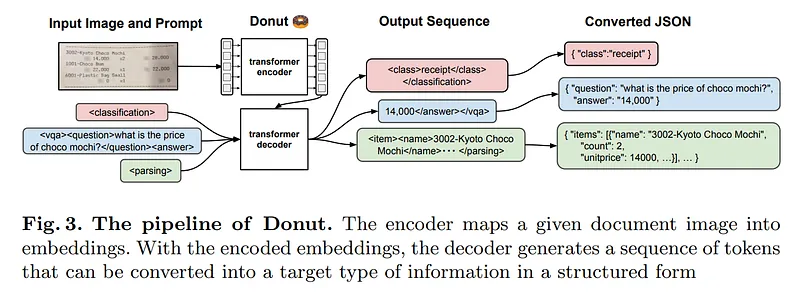

# Papers Explained 20 - Donut

Donut is an end-to-end (i.e., self-contained) VDU model for general understanding of document images. The architecture of Donut is quite simple, which consists of a Transformer based visual encoder and textual decoder modules.

This page ingests the source article into the wiki and connects it to [[Papers Explained Corpus]], [[Document AI]], [[Large Language Models]], [[Synthetic Data]], [[Vision Language Models]], [[Evaluation and Benchmarks]].

## Source Metadata

- Source file: `raw/2023-02-07_Papers-Explained-20--Donut-cb1523bf3281.md`
- Source title: Papers Explained 20: Donut
- Published: 2023-02-07
- Canonical: [https://medium.com/@ritvik19/papers-explained-20-donut-cb1523bf3281](https://medium.com/@ritvik19/papers-explained-20-donut-cb1523bf3281)

## Key Ideas

- Donut does not rely on any modules related to OCR functionality but uses a visual encoder for extracting features from a given document image.
- Given the {z}, the textual decoder generates a token sequence is an one-hot vector for the i-th token. BART is used as the decoder architecture.
- Following the original Transformer, a teacher-forcing scheme is used, which is a model training strategy that uses the ground truth as input instead of model output from a previous time step.
- The model is trained to read all texts in the image in reading order (from top-left to bottom-right, basically). The objective is to minimize cross-entropy loss of next token prediction by jointly conditioning on the image and previous contexts.
- CORD. The Consolidated Receipt Dataset (CORD) is a public benchmark that consists of 0.8K train, 0.1K valid, 0.1K test receipt images. The letters of receipts is in Latin alphabet.

## Notes

Donut is an end-to-end (i.e., self-contained) VDU model for general understanding of document images. The architecture of Donut is quite simple, which consists of a Transformer based visual encoder and textual decoder modules.

Donut does not rely on any modules related to OCR functionality but uses a visual encoder for extracting features from a given document image. The following textual decoder maps the derived features into a sequence of subword tokens to construct a desired structured format. Each model component is Transformer-based, and thus the model is trained easily in an end-to-end manner.

Encoder

The visual encoder converts the input document image into a set of embeddings. Although CNN-based models or Transformer-based models can be used as the encoder network, but Swin Transformer is used because it shows the best performance in the preliminary study in document parsing. Swin Transformer first splits the input image x into non-overlapping patches. Swin Transformer blocks, consist of a shifted window-based multi-head self-attention module and a two-layer MLP, are applied to the patches. Then, patch merging layers are applied to the patch tokens at each stage. The output of the final Swin Transformer block {z} is fed into the following textual decoder.

Decoder

Given the {z}, the textual decoder generates a token sequence is an one-hot vector for the i-th token. BART is used as the decoder architecture. Specifically, the decoder model weights are initialized with those from the publicly available pre-trained multi-lingual BART model.

Model Input

Following the original Transformer, a teacher-forcing scheme is used, which is a model training strategy that uses the ground truth as input instead of model output from a previous time step. In the test phase, inspired by GPT-3, the model generates a token sequence given a prompt.
New special tokens are added for the prompt for each downstream task in our experiments.

## Pre-training

The model is trained to read all texts in the image in reading order (from top-left to bottom-right, basically). The objective is to minimize cross-entropy loss of next token prediction by jointly conditioning on the image and previous contexts. This task can be interpreted as a pseudo-OCR task. The model is trained as a visual language model over the visual corpora, i.e., IIT CDIP dataset.

## Downstream Tasks

- Document Classification: RVL CDIP

- Document Information Extraction:

- CORD. The Consolidated Receipt Dataset (CORD) is a public benchmark that consists of 0.8K train, 0.1K valid, 0.1K test receipt images. The letters of receipts is in Latin alphabet. The number of unique fields is 30 containing
menu name, count, total price, and so on. There are complex structures (i.e., nested groups and hierarchies such as items>item>{name, count, price}) in the information.

- Ticket. This is a public benchmark dataset that consists of 1.5K train and 0.4K test Chinese train ticket images. We split 10% of the train set as a validation set. There are 8 fields which are ticket number, starting station, train number, and so on. The structure of information is simple and all keys are guaranteed to
appear only once and the location of each field is fixed.

- Business Card (In-Service Data). The dataset consists of 20K train, 0.3K valid, 0.3K test Japanese business cards. The number of fields is 11, including name, company, address, and so on. The structure of information is similar to the Ticket dataset.

- Receipt (In-Service Data). The dataset consists of 40K train, 1K valid, 1K test Korean receipt images. The number of unique field is 81, which includes store information, payment information, price information, and so on. Each sample has complex structures compared to the aforementioned datasets.

- Document Visual Question Answering: DocVQA

Swin-B is used as a visual encoder of Donut with slight modification. The layer numbers and window size are set as {2, 2, 14, 2} and 10. In further consideration of the speed-accuracy trade-off, the first four layers of BART are used as a decoder.

## Paper

OCR-free Document Understanding Transformer [2111.15664](https://arxiv.org/abs/2111.15664)

## Figures

Figures from the Medium HTML export (`raw/2023-02-07_Papers-Explained-20--Donut-cb1523bf3281.md`); local copies under `wiki/assets/papers-explained-20-donut/` when download succeeded.

| Figure | Caption |
|--------|---------|
|  | Title card: Donut. |
|  | Donut does not rely on any modules related to OCR functionality but uses a visual encoder for extracting features from a given document... |
## Related

- [[Papers Explained Corpus]]
- [[Document AI]]
- [[Large Language Models]]
- [[Synthetic Data]]
- [[Vision Language Models]]
- [[Evaluation and Benchmarks]]
- [[Papers Explained 19 - Dit]]
- [[Papers Explained 21 - Feature Pyramid Network]]

#summary #topic
