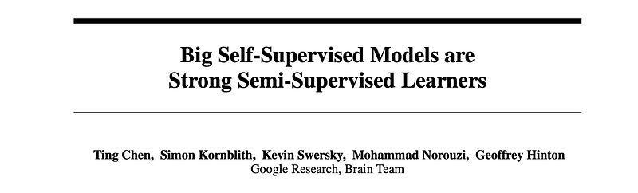
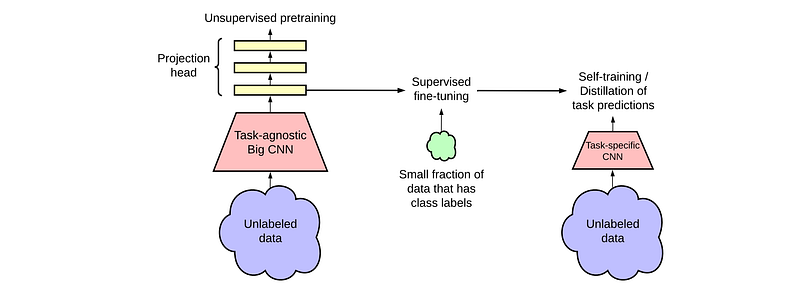
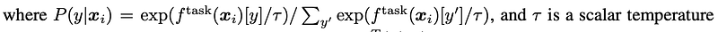
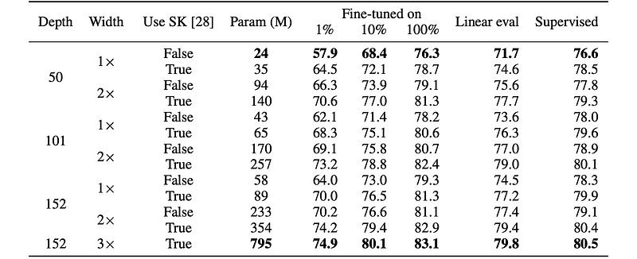
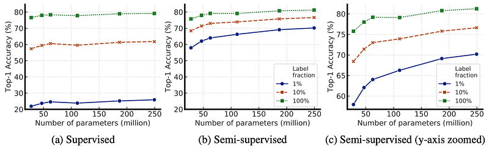
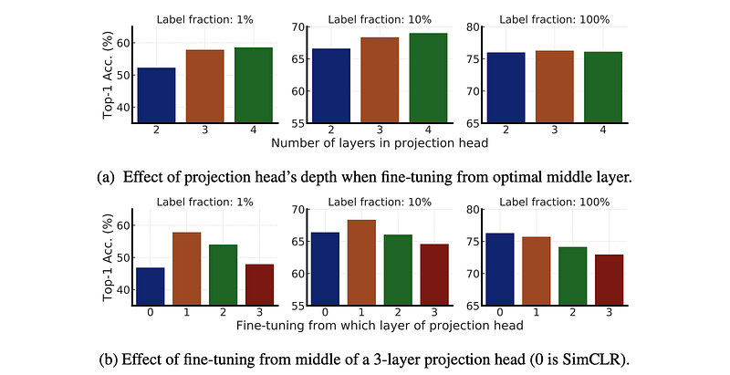
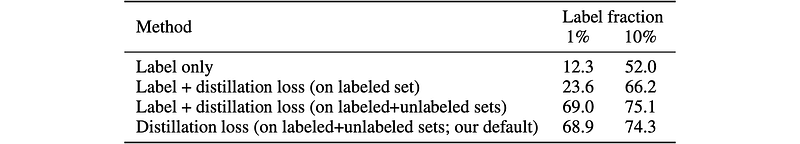
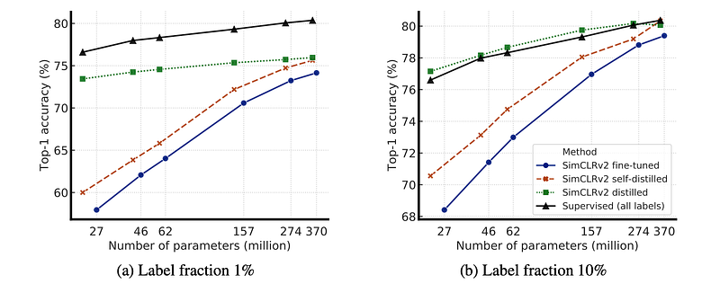
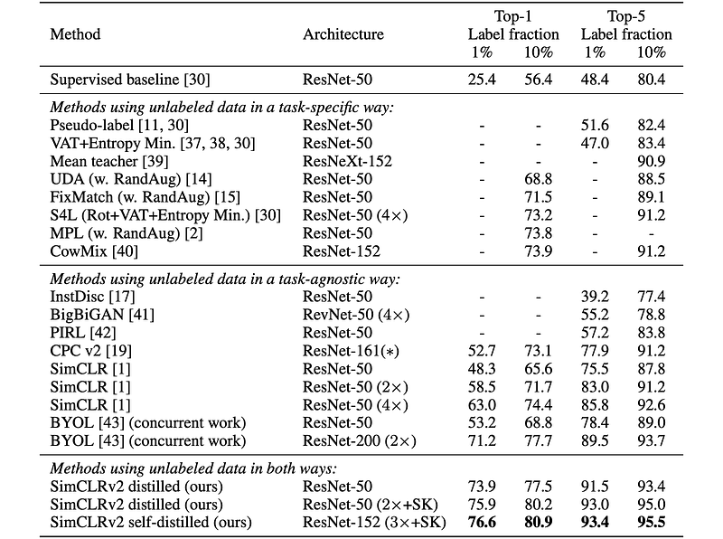

# Papers Explained 201 - SimCLRv2

The study proposes a semi-supervised learning framework that combines Unsupervised or self-supervised pre training (SimCLRv2) to learn general visual representations, Supervised fine-tuning on a few labeled examples to adapt the model to a specific classification task And Distillation using unlabeled data to refine and transfer the...

This page ingests the source article into the wiki and connects it to [[Papers Explained Corpus]], [[Model Compression and Efficiency]], [[Supervised Fine-Tuning]], [[Model Distillation]].

## Source Metadata

- Source file: `raw/2024-09-03_Papers-Explained-201--SimCLRv2-bc3fe72b8b48.html`
- Source title: Papers Explained 201: SimCLRv2
- Published: 2024-09-03
- Canonical: [https://medium.com/@ritvik19/papers-explained-201-simclrv2-bc3fe72b8b48](https://medium.com/@ritvik19/papers-explained-201-simclrv2-bc3fe72b8b48)

## Key Ideas

- The study proposes a semi-supervised learning framework that combines Unsupervised or self-supervised pre training (SimCLRv2) to learn general visual representations, Supervised fine-tuning on a few labeled examples to adapt the model to a specific...
- Recommended Reading [Papers Explained 200: SimCLR](https://ritvik19.medium.com/papers-explained-200-simclr-191ecf19d2fc)
- The proposed semi-supervised learning framework leverages unlabeled data in both task-agnostic and task-specific ways.
- SimCLR learns representations by maximizing agreement between differently augmented views of the same data example via a contrastive loss in the latent space. SimCLRv2 improves upon SimCLR in three major ways :
- To fully leverage the power of general pretraining, larger ResNet models are explored. Models that are deeper but less wide are trained.

## Notes

The study proposes a semi-supervised learning framework that combines Unsupervised or self-supervised pre training (SimCLRv2) to learn general visual representations, Supervised fine-tuning on a few labeled examples to adapt the model to a specific classification task And Distillation using unlabeled data to refine and transfer the task-specific knowledge to a smaller network.

Recommended Reading [Papers Explained 200: SimCLR](https://ritvik19.medium.com/papers-explained-200-simclr-191ecf19d2fc)

## Method

The proposed semi-supervised learning framework leverages unlabeled data in both task-agnostic and task-specific ways. The first time the unlabeled data is used, it is in a task-agnostic way, for learning general (visual) representations via unsupervised pre training. The general representations are then adapted for a specific task via supervised fine-tuning. The second time the unlabeled data is used, it is in a task-specific way, for further improving predictive performance and obtaining a compact model.

*Figure: The proposed semi-supervised learning framework.*

### Self-supervised pre training with SimCLRv2

SimCLR learns representations by maximizing agreement between differently augmented views of the same data example via a contrastive loss in the latent space. SimCLRv2 improves upon SimCLR in three major ways :

- To fully leverage the power of general pretraining, larger ResNet models are explored. Models that are deeper but less wide are trained. The largest model trained is a 152-layer ResNet with 3× wider channels and selective kernels (SK), a channel-wise attention mechanism that improves the parameter efficiency of the network.

- The capacity of the non-linear network g(·) (a.k.a. projection head) is increased by making it deeper. Instead of throwing away g(·) entirely after pretraining as in SimCLR, fine-tuning is done from a middle layer.

- The memory mechanism from MoCo is incorporated, designating a memory network (with a moving average of weights for stabilization) whose output will be buffered as negative examples.

### Fine-tuning

In SimCLR, the MLP projection head g(·) is discarded entirely after pretraining, while only the ResNet encoder f(·) is used during the fine-tuning. Instead, the model is fine-tuned from a middle layer of the projection head, instead of the input layer of the projection head as in SimCLR.

### Self-training / knowledge distillation via unlabeled examples

The fine-tuned network is used as a teacher to impute labels for training a student network. Specifically, the following distillation loss is minimized where no real labels are used:

### Experiment Settings and Implementation Details

The LARS optimizer (with a momentum of 0.9) is used throughout for pretraining, fine-tuning, and distillation. For pretraining, the model is trained for a total of 800 epochs, utilizing a 3-layer MLP projection head on top of a ResNet encoder. The memory buffer is set to 64K, and exponential moving average (EMA) decay is set to 0.999. The same set of simple augmentations as SimCLR is used, namely random crop, color distortion, and Gaussian blur.

For fine-tuning, the model is fine-tuned from the first layer of the projection head for 1%/10% of labeled examples, but from the input of the projection head when 100% labels are present. Fine-tuning is performed for 60 epochs with 1% of labels, and 30 epochs with 10% of labels, as well as full ImageNet labels.

For distillation, only unlabeled examples are used. Two types of distillation are considered: self-distillation, where the student has the same model architecture as the teacher (excluding the projection head), and big-to-small distillation, where the student is a much smaller network. The temperature is set to 0.1 for self-distillation and 1.0 for large-to-small distillation. The models are trained for 400 epochs. Only random crop and horizontal flips of training images are applied during fine-tuning and distillation.

## Empirical Study

### Bigger Models Are More Label-Efficient

To investigate the effectiveness of different model architectures for both supervised and self-supervised learning, it was sought to explore the impact of model size (width and depth) and selective kernels (SK) on performance. To achieve this, ResNet models were trained with varying width, depth, and the use of SK.

*Figure: Top-1 accuracy of fine-tuning SimCLRv2 models or training a linear classifier on the representations.*

*Figure: Top-1 accuracy for supervised vs semi-supervised (SimCLRv2 fine-tuned) models of varied sizes on different label fractions.*

- Increasing model size (width and depth) and using SK generally improves performance.

- For supervised learning, the difference in accuracy between the smallest and largest models was modest (4%), but for self-supervised learning, the difference was more significant (up to 17% for fine-tuning on 1% of labeled images).

- Benefits of width may plateau: ResNet-152 (3×+SK) shows only marginal improvement over ResNet-152 (2×+SK) despite a significant increase in parameters.

- Parameter efficiency varies: Some models (e.g., those with SK) are more parameter-efficient than others, suggesting the importance of architectural exploration.

### Bigger/Deeper Projection Heads Improve Representation Learning

To investigate the impact of projection head depth on fine-tuning performance in ResNet-50 models pre-trained with SimCLRv2, ResNet-50 was pret rained with SimCLRv2 using different numbers of projection head layers (2 to 4 fully connected layers). Fine-tuning performance was evaluated from various layers within the projection head.

*Figure: Top-1 accuracy via fine-tuning under different projection head settings and label fractions (using ResNet-50).*

- Deeper projection heads during pretraining lead to better fine-tuning performance, especially when fine-tuning from the first layer of the projection head.

- The optimal layer for fine-tuning is often the first layer of the projection head, particularly when using fewer labeled examples.

- The benefit of a deeper projection head diminishes when using larger ResNet architectures. This could be because wider ResNets already have wider projection heads due to the width multiplier.

- Fine-tuning accuracy correlates with linear evaluation accuracy.

- Fine-tuning from the optimal middle layer of the projection head yields a stronger correlation with linear evaluation accuracy compared to fine-tuning from the projection head input.

### Distillation Using Unlabeled Data Improves Semi-Supervised Learning

A distillation loss is utilized to encourage the student model to match the output distribution of a teacher model. This distillation loss is combined with a supervised cross-entropy loss on labeled data. Experiments are conducted using distillation loss alone for simplicity. Self-distillation, where a large model is distilled before being used to train smaller models, is also employed.

*Figure: Top-1 accuracy of a ResNet-50 trained on different types of targets.*

*Figure: Top-1 accuracy of distilled SimCLRv2 models compared to the fine-tuned models as well as supervised learning with all labels.*

*Figure: ImageNet accuracy of models trained under semi-supervised settings.*

- Using unlabeled examples significantly improves performance when training with the distillation loss.

- Distillation loss alone performs almost as well as balancing distillation and label losses when the labeled fraction is small.

- Distillation improves model efficiency by transferring knowledge to smaller student models.

- Self-distillation meaningfully improves semi-supervised learning performance even when student and teacher models have the same architecture.

- The proposed approach outperforms previous state-of-the-art semi-supervised learning methods on ImageNet.

## Paper

Big Self-Supervised Models are Strong Semi-Supervised Learners [2006.10029](https://arxiv.org/abs/2006.10029)

Recommended Reading [Retrieval and Representation Learning](https://ritvik19.medium.com/list/retrieval-and-representation-learning-bcd23de0bd8e)

## Figures

Figures from the Medium HTML export (`raw/2024-09-03_Papers-Explained-201--SimCLRv2-bc3fe72b8b48.html`); local copies under `wiki/assets/papers-explained-201-simclrv2/` when download succeeded.

| Figure | Caption |
|--------|---------|
|  | SimCLRv2 paper header from the arXiv preprint. |
|  | Proposed SimCLRv2 semi-supervised workflow: pretrain then fine-tune or distill. |
|  | Top-1 accuracy for linear evaluation vs full fine-tuning across model sizes. |
|  | Supervised vs SimCLRv2 fine-tuning across model sizes and low-label fractions. |
|  | Projection-head ablation on ResNet-50 under different label fractions. |
|  | Target-type ablation for ResNet-50 training objectives. |
|  | Distilled SimCLRv2 vs fine-tuned and fully supervised baselines. |
|  | Label-only vs distillation-loss variants at 1% and 10% labels. |
|  | Accuracy vs parameter count for 1% and 10% labels: fine-tuned, self-distilled, and supervised. |
|  | ImageNet semi-supervised leaderboard: SimCLRv2 distilled and self-distilled vs prior methods. |
## Related

- [[Papers Explained Corpus]]
- [[Model Compression and Efficiency]]
- [[Supervised Fine-Tuning]]
- [[Model Distillation]]
- [[Papers Explained 200 - SimCLR]]
- [[Papers Explained 202 - SynCLR]]

#summary #topic
