# Papers Explained 202 - SynCLR

SynCLR (Synthetic Contrastive Learning) leverages generative models to redefine the granularity of visual classes for improving visual representations.

This page ingests the source article into the wiki and connects it to [[Papers Explained Corpus]], [[Large Language Models]], [[Synthetic Data]], [[Computer Vision]].

## Source Metadata

- Source file: `raw/2024-09-04_Papers-Explained-202--SynCLR-85b50ef0081b.md`
- Source title: Papers Explained 202: SynCLR
- Published: 2024-09-04
- Canonical: [https://medium.com/@ritvik19/papers-explained-202-synclr-85b50ef0081b](https://medium.com/@ritvik19/papers-explained-202-synclr-85b50ef0081b)

## Key Ideas

- Recommended Reading [Papers Explained 200: SimCLR](https://ritvik19.medium.com/papers-explained-200-simclr-191ecf19d2fc)
- To craft specific prompt engineering templates that guide a language model (LLM) to produce a collection of captions that not only precisely depict an image but also exhibit diversity to encompass a broad spectrum of visual concepts, a concept list C is...
- c –> caption. As the most direct and simple approach, a sentence is sampled for the concept c by the Llama-2 model.
- c, bg –> caption. The visual concept c is combined with a background or setting bg. A list of suitable backgrounds for the chosen concepts is generated using GPT-4.
- c, rel –> caption. Given a visual concept c, pairing it with a positional relationship word, rel, is considered. To add variety, 10 different positional relationship words are randomly selected from.

## Notes

SynCLR (Synthetic Contrastive Learning) leverages generative models to redefine the granularity of visual classes for improving visual representations. It uses text-to-image diffusion models to generate multiple images for synthetic caption generated through large language models, resulting in a large-scale synthetic dataset of 600M images. Visual representation models are then trained using multi-positive contrastive learning and masked image modeling.

Recommended Reading [Papers Explained 200: SimCLR](https://ritvik19.medium.com/papers-explained-200-simclr-191ecf19d2fc)

*Figure: Three paradigms for visual representation learning.*

## Approach

The approach hinges on the utilization of three key resources: a language generation model (g1), a text-to-image generative model (g2), and a curated list of visual concepts ©. The exploration includes three steps. First, g1 is employed to synthesize a comprehensive set of image descriptions T, which encompass the range of visual concepts in C. Next, for each caption in T, multiple images are generated using g2, culminating in an extensive synthetic image dataset X. Finally, training on X yields a visual representation encoder f. Llama-2 7B and Stable Diffusion 1.5 are used as g1 and g2, respectively

### Synthesizing captions

To craft specific prompt engineering templates that guide a language model (LLM) to produce a collection of captions that not only precisely depict an image but also exhibit diversity to encompass a broad spectrum of visual concepts, a concept list C is gathered from some existing datasets, such as ImageNet21k and Places-365. For each concept c ∈ C, three straightforward templates are considered to generate captions effectively.

- c –> caption. As the most direct and simple approach, a sentence is sampled for the concept c by the Llama-2 model.

- c, bg –> caption. The visual concept c is combined with a background or setting bg. A list of suitable backgrounds for the chosen concepts is generated using GPT-4.

- c, rel –> caption. Given a visual concept c, pairing it with a positional relationship word, rel, is considered. To add variety, 10 different positional relationship words are randomly selected from.

*Figure: Examples for the three synthesis templates.*

For each of the three templates, multiple demonstration examples have been prepared that serve as instructions for the LLM to complete the caption synthesis task. In total, there are 106 examples for c–>prompt, 50 examples for c, bg–>prompt, and 20 examples for c, rel–>prompt. These examples are mostly collected by prompting GPT-4, with a handful from humans.

*Figure: In-context caption generation using Llama-2.*

In the stage of generating captions in-context, a concept is selected and one of the three templates is chosen. Next, three examples are randomly picked from the chosen template, and the caption generation is framed as a text completion task.

### Synthesizing Images

For each text caption, four images are generated by starting a reverse diffusion process with different random noise inputs. The Classifier-Free Guidance (CFG) scale plays a crucial role in this process. A higher CFG scale produces high-quality images that closely match the original text-image alignment, while a lower scale results in more diverse and varied image samples that better adhere to the original conditional distribution of images based on the given text. In this case, a lower CFG scale of 2.5 is chosen.

### Representation Learning

The representation learning method builds on StableRep, utilizing a multi-positive contrastive learning loss to align images generated from the same caption. This approach integrates techniques from other self-supervised learning methods, including patch-level masked image modeling.

StableRep minimizes the cross-entropy loss between a ground-truth assignment distribution and a contrastive assignment distribution. For an encoded anchor sample a and a set of encoded candidates {b1, b2, …, bK}., the contrastive assignment distribution q predicts the likelihood of a and b being generated from the same caption, while the ground-truth distribution p indicates the actual matches. The contrastive loss is defined as:

where,

The iBOT method involves masking a localized patch and predicting its tokenized representation, adapting the DINO objective to the patch level. The iterative Sinkhorn-Knopp (SK) algorithm replaces the softmax-centering method to build the prediction target. The Exponential Moving Average (EMA) model, introduced by MoCo, encodes crops and produces targets for the iBOT loss, updating the EMA model following a cosine schedule.

The multi-crop strategy improves computation efficiency by encoding local crops only with the student network and matching them to global crops from the same caption encoded by the EMA model. This strategy saves computation by reusing global crops. For each image x, where we generate a single global crop x g alongside n local crops x l , the final loss can be expressed as follows:

### Implementation

Class names from various datasets are concatenated, including IN-1k, IN-21k (keeping the most frequent 13k classes), Aircraft, Cars, DTD, Flowers, Pets, Sun397, Caltech-101, Food101, and Places-365. If the concept is a place (i.e. SUN397 and Places) or a texture (i.e. DTD), only the c –> caption template is applied. For fine-grained classes such as pets or flowers, GPT-4 generates a consolidated list of probable backgrounds, rather than producing distinct lists for each specific class.

## Experiments

### Study different components

To evaluate the effectiveness of different components of the SynCLR method for image representation learning, their impact is analyzed on two key metrics: linear probing performance on ImageNet (IN-1k) and average accuracy of linear transfer on fine-grained datasets.

To achieve this, various caption synthesis methods are tested, including randomly combining ImageNet classes with hypernyms and a place class, using an in-context synthesis template with ImageNet and Places classes, using GPT-4 generated background classes instead of Places, and the full SynCLR configuration. A total of 10 million captions are generated for each configuration.

Caption Synthesis:

*Figure: Comparison of different caption synthesis strategies.*

- Simply concatenating IN and Places classes improves ImageNet linear accuracy but hurts fine-grained classification.

- Naive in-context synthesis with Llama performs worst.

- Replacing random Places backgrounds with GPT-generated backgrounds improves accuracy.

- The full SynCLR configuration achieves the best accuracy on both ImageNet and fine-grained classification.

Image Synthesis:

*Figure: Classifier-free guidance scale (CFG).*

- Generating 4 images per caption achieves performance comparable to StableRep (10 images).

- Contrastive loss prefers small CFG scale but is not very sensitive to it.

Model Components:

*Figure: Important components for our model.*

- Adding a teacher EMA model, iBOT local objective, or multi-crop strategy individually improved accuracy, with the best performance from combining all modules.

Comparison to SimCLR and supervised training

*Figure: Comparison of different learning objectives.*

- SynCLR’s multi-positive objective outperformed both supervised cross-entropy training and SimCLR by significant margins on both ImageNet linear evaluation and fine-grained classification tasks.

### Scaling up

To evaluate the effectiveness of SynCLR, a self-supervised learning method using synthetically generated images and captions, for various downstream tasks. A dataset of 150M captions was synthesized to generate 600M images (SynCaps-150M). ViT-B/16 and ViT-L/14 models were trained on SynCaps-150M.

ImageNet linear evaluation and Fine-grained classification

*Figure: Comparison on ImageNet linear evaluation and fine-grained classificaton.*

- SynCLR achieved 80.7% with ViT-B and 83.0% with ViT-L, comparable to CLIP but lagging behind DINO v2 (partially due to distillation in DINO v2). SynCLR outperformed other self-supervised methods pre-trained directly on ImageNet1k.

- SynCLR achieved similar accuracy to DINO v2 on nine fine-grained datasets, outperforming CLIP and StableRep. SynCLR excelled on Aircraft and Cars datasets, possibly due to biased sampling towards these categories in the synthetic data.

Semantic segmentation

*Figure: ADE20K semantic segmentation (mIoU) using UperNet, with single scale at 512x512 resolution.*

- SynCLR outperformed self-supervised methods trained on ImageNet by a significant margin, achieving comparable performance to DINO v2 despite not using high-resolution pre-training.

ImageNet fine-tuning

*Figure: Top-1 accuracy on ImageNet with fine-tuning evaluation.. Models are fine-tuned at 224x224 resolution.*

- SynCLR outperformed models trained on ImageNet images or large-scale image datasets, including OpenCLIP ViT-L trained on Laion-2B (the dataset used for training Stable Diffusion).

## Paper

Learning Vision from Models Rivals Learning Vision from Data [2312.17742](https://arxiv.org/abs/2312.17742)

Recommended Reading [Retrieval and Representation Learning](https://ritvik19.medium.com/list/retrieval-and-representation-learning-bcd23de0bd8e)

## Figures

Figures from the Medium HTML export (`raw/2024-09-04_Papers-Explained-202--SynCLR-85b50ef0081b.md`); local copies under `wiki/assets/papers-explained-202-synclr/` when download succeeded.

| Figure | Caption |
|--------|---------|
| 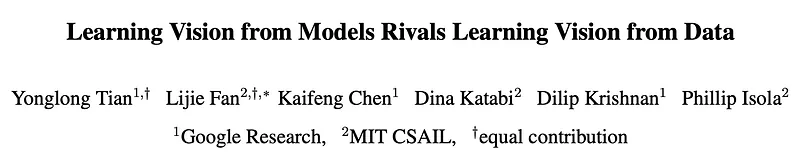 | Three visual-representation paradigms: supervised, SSL on real images, and synthetic-only SynCLR. |
| 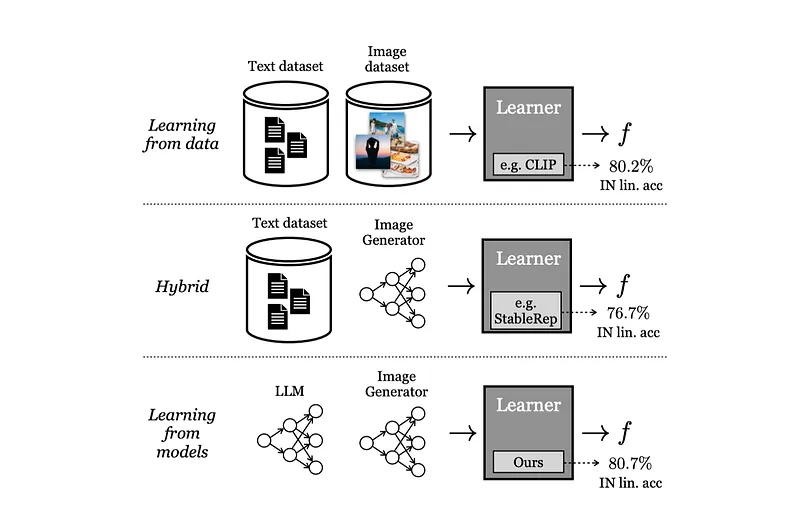 | Example synthesis templates used to generate synthetic training data. |
| 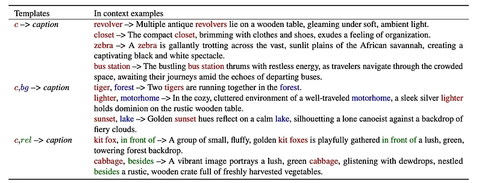 | In-context caption generation pipeline with Llama-2. |
| 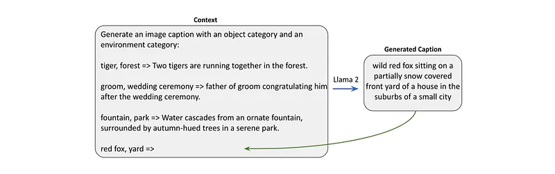 | Caption-synthesis strategy comparison. |
| 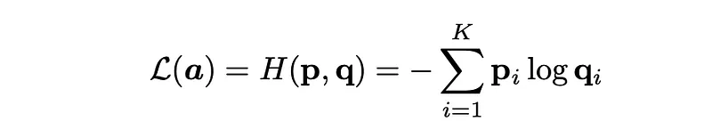 | Classifier-free guidance scale ablation. |
| 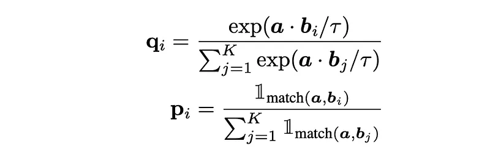 | Key SynCLR components ablation. |
| 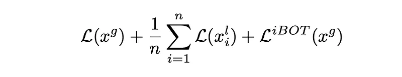 | Learning-objective comparison for SynCLR training. |
| 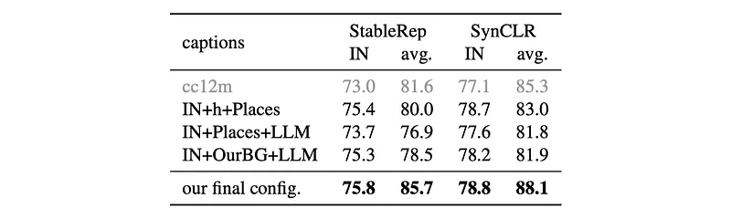 | ImageNet linear and fine-grained classification comparison. |
|  | ADE20K semantic segmentation comparison using UperNet at 512x512. |
| 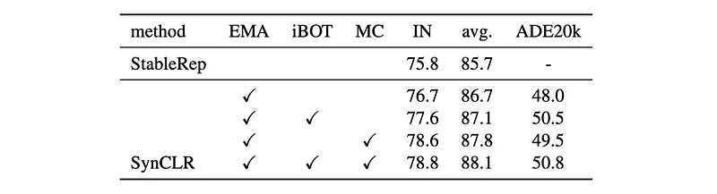 | ImageNet fine-tuning top-1 at 224x224 for different pretraining recipes. |
|  | ImageNet and average downstream comparison: Supervised CE vs SimCLR vs SynCLR. |
| 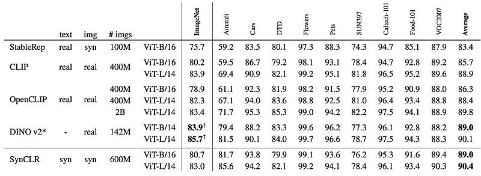 | Downstream classification transfer table across multiple datasets and ViT sizes. |
| 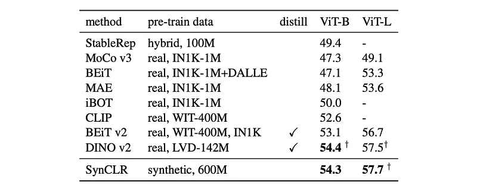 | Linear-probe benchmark against MoCo, MAE, iBOT, DINOv2, and others. |
| 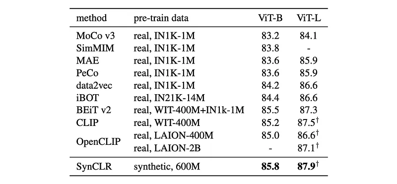 | Fine-tuning benchmark against real-data pretraining baselines; SynCLR row highlighted. |
## Related

- [[Papers Explained Corpus]]
- [[Large Language Models]]
- [[Synthetic Data]]
- [[Computer Vision]]
- [[Papers Explained 201 - SimCLRv2]]
- [[Papers Explained 203 - Gecko]]

#summary #topic
