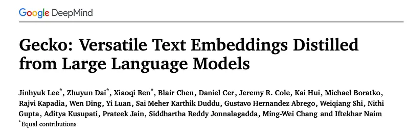
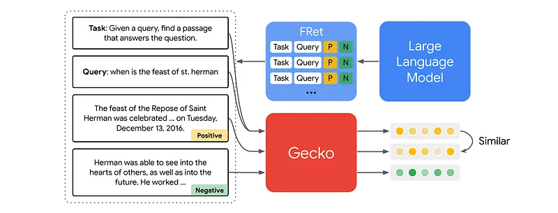
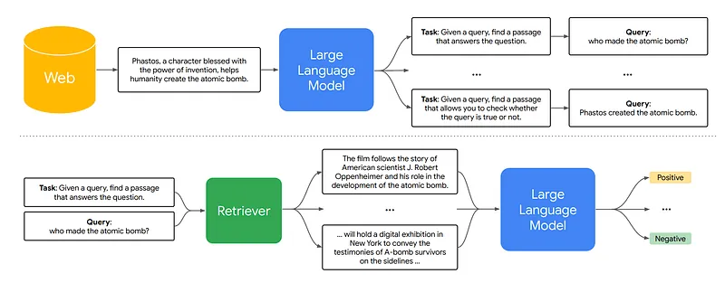
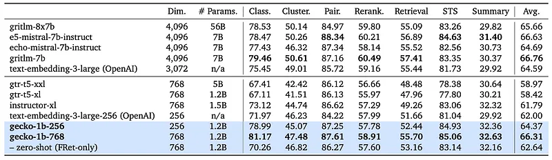
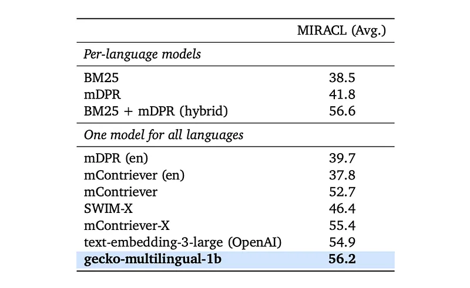

# Papers Explained 203 - Gecko

Gecko is a versatile text embedding model trained on a variety of tasks including document retrieval, semantic similarity, and classification. It leverages knowledge distillation from LLMs into a retriever. The two-step distillation process begins with generating diverse, synthetic paired data using an LLM.

This page ingests the source article into the wiki and connects it to [[Papers Explained Corpus]], [[Embedding and Retrieval]], [[Large Language Models]], [[Synthetic Data]], [[Model Compression and Efficiency]], [[Document AI]], [[Model Distillation]], [[Supervised Fine-Tuning]].

## Source Metadata

- Source file: `raw/2024-09-05_Papers-Explained-203--Gecko-8889158b17e6.md`
- Source title: Papers Explained 203: Gecko
- Published: 2024-09-05
- Canonical: [https://medium.com/@ritvik19/papers-explained-203-gecko-8889158b17e6](https://medium.com/@ritvik19/papers-explained-203-gecko-8889158b17e6)

## Key Ideas

- Gecko is a versatile text embedding model trained on a variety of tasks including document retrieval, semantic similarity, and classification. It leverages knowledge distillation from LLMs into a retriever.
- Gecko is based on a 1.2B parameter pre-trained transformer language model that undergoes two additional training stages: pre-fine tuning and fine-tuning.
- A large-scale community QA dataset from “Large dual encoders are generalizable retrievers”, which includes text pairs such as question-answer pairs from online forums and QA websites, and a corpus of title-body text pairs crawl from the Web are used.
- A pre-trained language model M outputs a series of contextualized token embeddings W given a sequence of n tokens and an embedding dimension d.
- Before each query, a dataset-specific task feature t is prepended to inform the query which task is being optimized. Simple task features such as question answering or search result are used depending on the dataset.

## Notes

Gecko is a versatile text embedding model trained on a variety of tasks including document retrieval, semantic similarity, and classification. It leverages knowledge distillation from LLMs into a retriever. The two-step distillation process begins with generating diverse, synthetic paired data using an LLM. Next, we further refine the data quality by retrieving a set of candidate passages for each query, and relabeling the positive and hard negative passages using the same LLM.

## Training Recipe for Gecko

*Figure: Overview of Gecko.*

Gecko is based on a 1.2B parameter pre-trained transformer language model that undergoes two additional training stages: pre-fine tuning and fine-tuning. A novel fine-tuning dataset called FRet, the Few-shot Prompted Retrieval dataset is created for a diverse set of downstream tasks via a two-step LLM distillation, which identifies both positive and hard negative passages for each generated query.

### Pre Fine Tuning

A large-scale community QA dataset from “Large dual encoders are generalizable retrievers”, which includes text pairs such as question-answer pairs from online forums and QA websites, and a corpus of title-body text pairs crawl from the Web are used.

A pre-trained language model M outputs a series of contextualized token embeddings W given a sequence of n tokens and an embedding dimension d. For a set of text pairs Dpre = {(qi, pi)}N i=1, vector representations of qi and pi are obtained by taking the mean of W along the n axis.

Before each query, a dataset-specific task feature t is prepended to inform the query which task is being optimized. Simple task features such as question answering or search result are used depending on the dataset.

A mini-batch of size B is used to optimize the contrastive learning objective with in-batch negatives.

### FRet

*Figure: Overview of FRet.*

The LLM is instructed to read a sampled web passage and generate both the task description and a relevant query for the task:

where 𝑝seed is a passage drawn randomly from the web corpus C and ℙQG is a fixed prompt. The LLM generates a task description 𝑡, which describes the type of retrieval, and a query 𝑞 that aligns with the task.

The diversity of FRet comes from two sources. First, a web corpus inherently contains a variety of topics as well as styles of writing, such as blog posts, news, Wikipedia-like content, and forum posts. Second, by adding many diverse task descriptions in the prompt, this encourages the LLM to generate more diverse task descriptions and therefore more diverse queries.

An existing embedding model is used to retrieve top N neighbors P from the corpus given a generated query q. The same LLM used for the query generation is then employed to rank these retrieved passages based on their relevance to the query. Specifically, two well-known few-shot prompted LLM ranking functions are used: query likelihood and relevance classification. Query likelihood uses an LLM to measure the log-likelihood of a generated query q given a passage p. Relevance classification uses an LLM to measure the log-likelihood of a specific relevance label given the query q and a passage p.

The rankings from two different prompting results are ensembled using the standard Reciprocal Rank Fusion (RRF) approach. Given the scores from LLMs after ensembling, the set of passages P is indexed according to their ranking. A new positive target is then chosen, and the LLM scores can also be used to select hard negative passages. One straightforward option is to select the lowest scoring negative. Another is to sample from the remaining nearest neighbors.

Combining all generation results along with the positive and negative mining, an FRet dataset is created, comprising 6.6M examples, each containing a task, a query, a positive passage, and a negative passage.

### Unified Fine-Tuning Mixture

A novel fine-tuning mixture is created by combining FRet with other academic training datasets in the same format: Natural Questions, HotpotQA, FEVER, MedMCQA, SNLI, MNLI, and several classification datasets from HuggingFace. For the multilingual model, additional training sets from MIRACL are added.

Given a classification input text x with a label y ∈ Y, each input x is paired with another input x+, which shares the same label y. This positive target for x is then used. At the same time, a hard negative input x− is randomly selected, which has any label other than y.

For fine-tuning, the in-batch cross-entropy loss is optimized, where query qi should distinguish pi+ from the hard negative pi-, as well as other passages in the batch {pj} Bj=1 and other queries in the batch {qj} Bj=1 \ {qi}. The use of other queries in the batch is also known as “same-tower negatives”. Given a mini-batch of size B, the following objective is optimized:

To support multiple different dimensions of embeddings with a single model, the MRL loss is added, which optimizes with sub-dimensions smaller than d. Two embedding dimensions d = 768 and d = 256 are used for Gecko.

## Experiments

### Main Results

*Figure: Results on MTEB.*

- Gecko significantly outperforms all similarly-sized baselines (<= 1k embedding dimensions, <= 5B parameters) on all MTEB tasks.

- Gecko-1b-256 outperforms models like text-embedding-3-large-256, GTR, and Instructor.

- Gecko-1b-768 often matches or exceeds the performance of larger models (3–4k embedding dimensions, >7B parameters) like text-embedding-3-large, E5-mistral, GRit, and Echo embeddings.

- Gecko excels at balancing retrieval and STS (Semantic Textual Similarity) performance.

- Gecko sets new state-of-the-art results on classification, STS, and summary tasks.

- Even when trained solely on FRet (making MTEB a pure zero-shot benchmark), Gecko demonstrates strong performance compared to other baselines.

### Multilingual Retrieval Results

To evaluate the performance of a multilingual version of the Gecko model on the MTEB benchmark, The training dataset included the MIRACL dataset in addition to the standard Gecko training data.

*Figure: Results on MIRACL.*

The multilingual Gecko model outperformed other baselines on the MTEB benchmark.

- Despite being trained primarily on English-only data (FRet), the multilingual Gecko model achieved superior performance on multilingual tasks.

- This suggests that training on English-only data can effectively translate to multilingual performance.

## Paper

Gecko: Versatile Text Embeddings Distilled from Large Language Models [2403.20327](https://arxiv.org/abs/2403.20327)

Recommended Reading [Retrieval and Representation Learning](https://ritvik19.medium.com/list/retrieval-and-representation-learning-bcd23de0bd8e)

## Figures

Figures from the Medium HTML export (`raw/2024-09-05_Papers-Explained-203--Gecko-8889158b17e6.md`); local copies under `wiki/assets/papers-explained-203-gecko/` when download succeeded.

| Figure | Caption |
|--------|---------|
|  | Gecko paper title block. |
|  | Overview of Gecko retrieval training pipeline. |
|  | FRet overview for synthetic query generation and filtering. |
|  | MTEB benchmark summary table for Gecko variants and strong baselines. |
|  | Synthetic query generation flow using web passages, retriever, and LLM judgments. |
|  | LLM-based prompt transformation equation for query generation. |
|  | Main contrastive ranking loss used in Gecko training. |
|  | MTEB results table with gecko-1b and gecko-1b-768 highlighted. |
|  | MIRACL average retrieval results with gecko-multilingual-1b highlighted. |
## Related

- [[Papers Explained Corpus]]
- [[Embedding and Retrieval]]
- [[Large Language Models]]
- [[Synthetic Data]]
- [[Model Compression and Efficiency]]
- [[Document AI]]
- [[Model Distillation]]
- [[Supervised Fine-Tuning]]
- [[Papers Explained 202 - SynCLR]]
- [[Papers Explained 204 - Matryoshka Adaptor]]

#summary #topic
