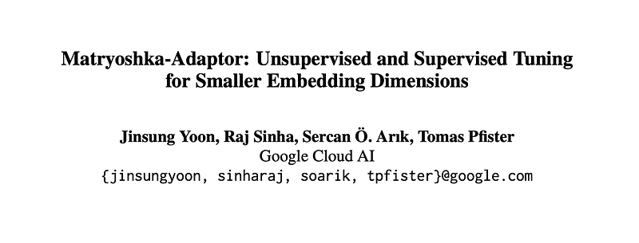
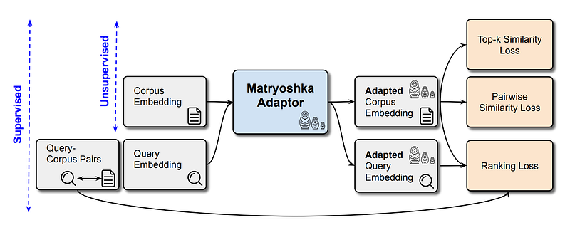
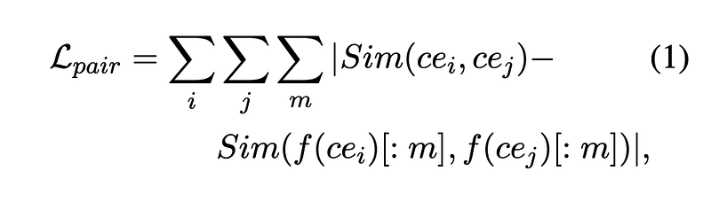
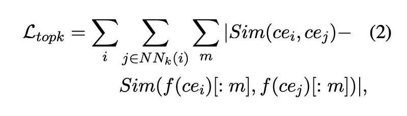
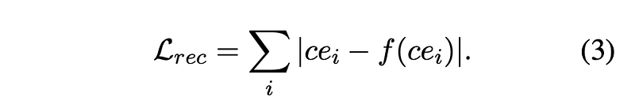
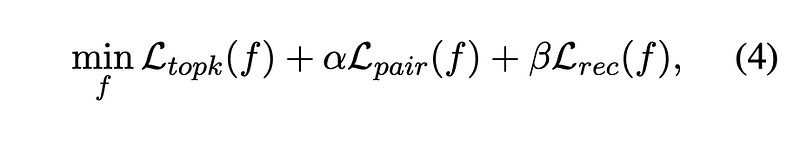
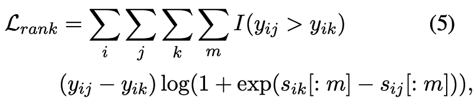
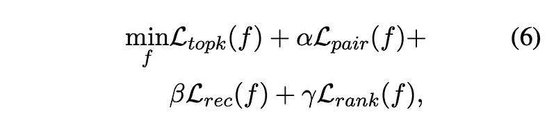
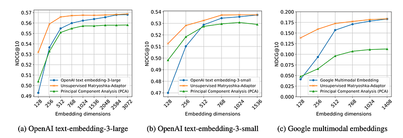
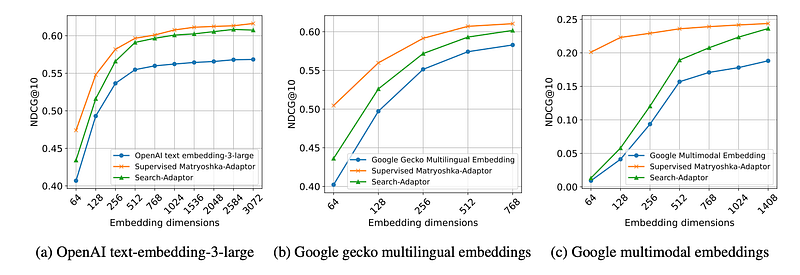

# Papers Explained 204 - Matryoshka Adaptor

Matryoshka-Adaptor is a framework designed to customize LLM embeddings for improved computational efficiency and cost-effectiveness. The framework achieves substantial dimensionality reduction while maintaining comparable performance levels, making it suitable for both unsupervised and supervised learning settings.

This page ingests the source article into the wiki and connects it to [[Papers Explained Corpus]], [[Embedding and Retrieval]], [[Model Compression and Efficiency]], [[Large Language Models]].

## Source Metadata

- Source file: `raw/2024-09-06_Papers-Explained-204--Matryoshka-Adaptor-c22f76488959.html`
- Source title: Papers Explained 204: Matryoshka Adaptor
- Published: 2024-09-06
- Canonical: [https://medium.com/@ritvik19/papers-explained-204-matryoshka-adaptor-c22f76488959](https://medium.com/@ritvik19/papers-explained-204-matryoshka-adaptor-c22f76488959)

## Key Ideas

- Matryoshka-Adaptor is a framework designed to customize LLM embeddings for improved computational efficiency and cost-effectiveness.
- Recommended Reading [Papers Explained 96: Matryoshka Representation Learning](https://ritvik19.medium.com/papers-explained-matryoshka-representation-learning-e7a139f6ad27)
- Given a corpus set, denoted as C = {c1, c2, …, cN} and a pre-trained embedding model E. The embeddings extracted from the corpus are represented as CE = {ce1, ce2, …, ceN}, where each embedding vector cei = E(ci).
- A Matryoshka embedding, characterized by m dimensions, is defined as the initial m dimensions of the original d dimensional embedding, where m < d. This can be expressed as CE[: m] = {ce1[: m], ce2[: m], …, ceN[: m]}.
- A fundamental characteristic of Matryoshka embeddings is their capacity to preserve the essential properties of the original embeddings, even within a reduced dimensional space.

## Notes

Matryoshka-Adaptor is a framework designed to customize LLM embeddings for improved computational efficiency and cost-effectiveness. The framework achieves substantial dimensionality reduction while maintaining comparable performance levels, making it suitable for both unsupervised and supervised learning settings.

Recommended Reading [Papers Explained 96: Matryoshka Representation Learning](https://ritvik19.medium.com/papers-explained-matryoshka-representation-learning-e7a139f6ad27)

*Figure: Block diagrams illustrating both the unsupervised and supervised Matryoshka-Adaptor frameworks.*

## Problem formulation

Given a corpus set, denoted as C = {c1, c2, …, cN} and a pre-trained embedding model E. The embeddings extracted from the corpus are represented as CE = {ce1, ce2, …, ceN}, where each embedding vector cei = E(ci).

A Matryoshka embedding, characterized by m dimensions, is defined as the initial m dimensions of the original d dimensional embedding, where m < d. This can be expressed as CE[: m] = {ce1[: m], ce2[: m], …, ceN[: m]}.

A fundamental characteristic of Matryoshka embeddings is their capacity to preserve the essential properties of the original embeddings, even within a reduced dimensional space.

## Unsupervised Matryoshka-Adaptor

The proposed Matryoshka-Adaptor is represented by the function f. The set of customized corpus embeddings is defined as ˆCE = { ˆce1, ˆce2, …, ˆceN} and their corresponding Matryoshka embeddings as ˆCE[: m] = { ˆce1[: m], ˆce2[: m], …, ˆceN[: m]} where ˆcei = f(cei).

The primary objective of the function f is to maximize the Matryoshka properties through this customization process. This means ensuring that the similarity between any two embeddings remains as consistent as possible, whether they are represented in the original high-dimensional space or the reduced low-dimensional space.

To achieve this objective, two loss functions are introduced. The first loss function, denoted as Lpair, is designed to preserve the pairwise similarity between the original embeddings in their reduced dimension Matryoshka form.

*Figure: where Sim represents an arbitrary similarity function, which is chosen to be the cosine similarity.*

The second loss function, denoted as Ltopk, focuses on preserving local similarity relationships among neighboring embeddings.

*Figure: where NNk(i) denotes the set of the top k most similar embeddings to cei .*

In order to mitigate any substantial deviation from the original embeddings, regularizations are integrated into the methodology. A skip connection is implemented within the architecture of the learnable function, f, ensuring that this function learns solely the difference from the original embedding, represented as ceˆ i = cei + f(cei). Additionally, a reconstruction loss, denoted as Lrec, is introduced as an additional regularizer.

The overall objective function, designed to minimize the aggregate loss, is given as:

*Figure: with α, β > 0 being hyperparameters, set to α = 1.0, β = 1.0.*

## Supervised Matryoshka-Adaptor

In supervised setting, the Matryoshka-Adaptor undergoes optimization to enhance both its Matryoshka properties and the retrieval performance of the Matryoshka embeddings. This process utilizes paired query-corpus samples, in conjunction with the original query and corpus embeddings ((qi , cj , yij) where yij > 0 signifies the relevance score between query qi and corpus cj ). A ranking loss, denoted as Lrank, is introduced to align the ranking between query and corpus considering different Matryoshka embedding dimensions.

*Figure: where sij [: m] represents the cosine similarity between the adapted query embedding and the adapted corpus embedding*

The same adaptor f is used for both query and corpus embeddings. This ranking loss is crucial for effective learning of lower dimensional representations with their information content for the ranking objective being considered.

The supervised Matryoshka-Adaptor is trained using a joint objective function that encompasses the ranking loss as well as the unsupervised Matryoshka losses (Ltopk, Lpair, and Lrec). This joint training approach aims to improve the quality of the embeddings while preserving their Matryoshka representations. Query-corpus pairs are employed for the ranking loss, while query and corpus embeddings are utilized for the Matryoshka representation learning.

*Figure: with α, β, γ ≥ 0 being hyper-parameters with fixed values as α = 1.0, β = 1.0 and γ = 1.0.*

## Experiments

To improve convergence, a two-stage training strategy is employed. Initially, the MatryoshkaAdaptor is trained in an unsupervised way, subsequent tuning is conducted in a supervised way.

### Unsupervised tuning

*Figure: Experimental results of the unsupervised Matryoshka-Adaptor applied to three different embedding models.*

- The Matryoshka-Adaptor significantly improves retrieval performance, especially at lower embedding dimensions, compared to embeddings without the adaptor.

- Lower-dimensional embeddings processed with the Matryoshka-Adaptor achieve comparable performance to original high-dimensional embeddings.

- The Matryoshka-Adaptor achieves faster performance saturation with increasing embedding dimensionality, leading to reduced latency and memory requirements for retrieval applications.

- While PCA shows some improvement at lower dimensions, its performance degrades at higher dimensions, becoming worse than the original embeddings.

### Supervised tuning

*Figure: Experimental results of the supervised Matryoshka-Adaptor on retrieval tasks, utilizing three different embedding models.*

- The Supervised Matryoshka-Adaptor consistently outperforms alternative methods (e.g., Search-Adaptor) across 13 BEIR, 17 MIRACL, and 5 Fashion-200K datasets.

- The Supervised Matryoshka-Adaptor performs particularly well with lower dimensional embeddings, achieving comparable results to higher dimensional embeddings. This suggests potential for reduced latency and memory requirements in applications like retrieval.

### Tuning for Multimodal Embeddings

- Matryoshka-Adaptor consistently improves the performance of multimodal base embedding models for text-to-image retrieval.

- The Matryoshka-Adaptor outperforms alternative methods: PCA in unsupervised learning setups, Search-Adaptor in supervised learning setups.

- This performance advantage is particularly noticeable when using lower embedding dimensions.

### Tuning for Multilingual Embeddings

- Matryoshka-Adaptor achieves performance gains on both English and non-English language datasets.

- The proposed tuning method is effective across different language models, including the latest Gecko multilingual embedding models.

## Paper

Matryoshka-Adaptor: Unsupervised and Supervised Tuning for Smaller Embedding Dimensions [2407.20243](https://arxiv.org/abs/2407.20243?s=31)

Recommended Reading [Retrieval and Representation Learning](https://ritvik19.medium.com/list/retrieval-and-representation-learning-bcd23de0bd8e)

## Figures

Figures from the Medium HTML export (`raw/2024-09-06_Papers-Explained-204--Matryoshka-Adaptor-c22f76488959.html`); local copies under `wiki/assets/papers-explained-204-matryoshka-adaptor/` when download succeeded.

| Figure | Caption |
|--------|---------|
|  | Unsupervised and supervised Matryoshka-Adaptor framework diagrams. |
|  | Similarity-based objective definition used by the adaptor. |
|  | Top-k nearest-neighbor term used in the unsupervised objective. |
|  | Hyperparameter-weighted loss formulation with alpha and beta. |
|  | Truncated-dimension cosine-similarity term used for retrieval optimization. |
|  | Supervised objective with alpha, beta, and gamma weighting. |
|  | Unsupervised Matryoshka-Adaptor results across embedding models. |
|  | Supervised Matryoshka-Adaptor retrieval results across embedding models. |
|  | NDCG@10 vs embedding dimension for unsupervised adaptor variants. |
|  | NDCG@10 vs embedding dimension for supervised adaptor variants. |
## Related

- [[Papers Explained Corpus]]
- [[Embedding and Retrieval]]
- [[Model Compression and Efficiency]]
- [[Large Language Models]]
- [[Papers Explained 203 - Gecko]]
- [[Papers Explained 205 - LeViT]]

#summary #topic
