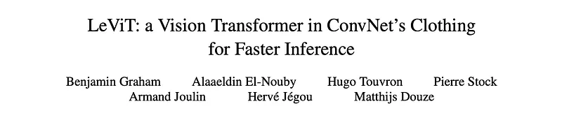
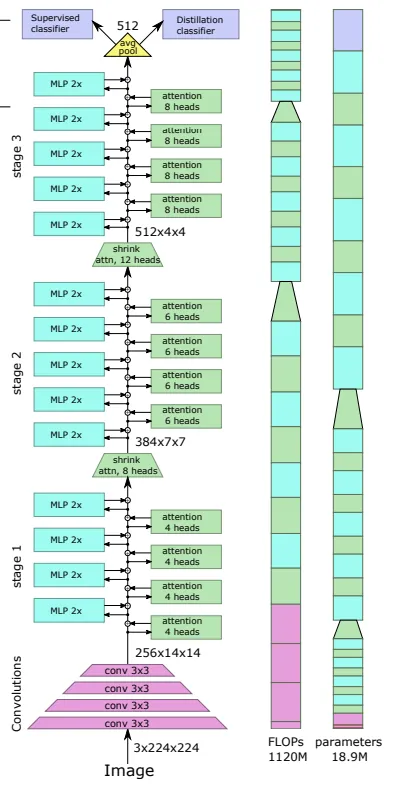
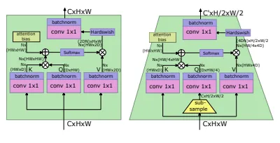
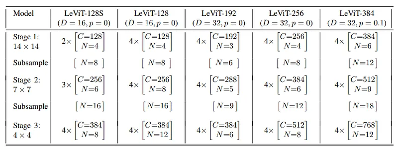
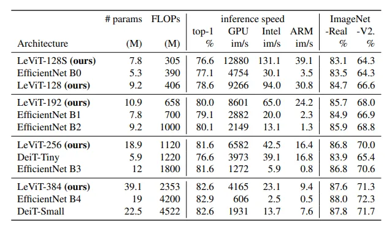
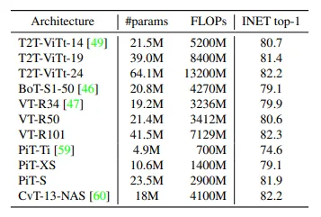

# Papers Explained 205 - LeViT

LeViT is a hybrid neural network for fast inference image classification. LeViT significantly outperforms existing convnets and vision transformers with respect to the speed/accuracy tradeoff. For example, at 80% ImageNet top-1 accuracy, LeViT is 5 times faster than EfficientNet on CPU.

This page ingests the source article into the wiki and connects it to [[Papers Explained Corpus]], [[Computer Vision]], [[Large Language Models]], [[Model Compression and Efficiency]], [[Embedding and Retrieval]], [[Model Distillation]].

## Source Metadata

- Source file: `raw/2024-09-08_Papers-Explained-205--LeViT-89a2defc2d18.md`
- Source title: Papers Explained 205: LeViT
- Published: 2024-09-08
- Canonical: [https://medium.com/@ritvik19/papers-explained-205-levit-89a2defc2d18](https://medium.com/@ritvik19/papers-explained-205-levit-89a2defc2d18)

## Key Ideas

- LeViT is a hybrid neural network for fast inference image classification. LeViT significantly outperforms existing convnets and vision transformers with respect to the speed/accuracy tradeoff.
- LeViT builds upon the ViT architecture and DeiT training method.
- LeViT applies 4 layers of 3×3 convolutions (stride 2) to the input to perform the resolution reduction. The number of channels goes C = 3, 32, 64, 128, 256.
- To use the BCHW tensor format, the classification token is replaced with average pooling on the last activation map, (which produces an embedding used in the classifier), similar to convolutional networks.
- For LeViT, each convolution is followed by a batch normalization and all of LeViT’s non-linear activations are Hardswish.

## Notes

LeViT is a hybrid neural network for fast inference image classification. LeViT significantly outperforms existing convnets and vision transformers with respect to the speed/accuracy tradeoff. For example, at 80% ImageNet top-1 accuracy, LeViT is 5 times faster than EfficientNet on CPU.

## Architecture

*Figure: Block diagram of the LeViT-256 architecture. The two bars on the right indicate the relative resource consumption of each layer, measured in FLOPs, and the number of parameters.*

LeViT builds upon the ViT architecture and DeiT training method.

### Patch embedding

LeViT applies 4 layers of 3×3 convolutions (stride 2) to the input to perform the resolution reduction. The number of channels goes C = 3, 32, 64, 128, 256. The patch extractor for LeViT-256 transforms the image shape (3, 224, 224) into (256, 14, 14) with 184 MFLOPs.

### No classification token

To use the BCHW tensor format, the classification token is replaced with average pooling on the last activation map, (which produces an embedding used in the classifier), similar to convolutional networks. For distillation during training, separate heads are trained. At test time, the average of the output from the two heads is considered.

### Normalization layers and activations

For LeViT, each convolution is followed by a batch normalization and all of LeViT’s non-linear activations are Hardswish.

### Multi-resolution pyramid

*Figure: The LeViT attention blocks, using similar notations to. Left: regular version, Right: with 1/2 reduction of the activation map. The input activation map is of size C × H × W. N is the number of heads, the multiplication operations are performed independently per head.*

LeViT integrates the ResNet stages within the transformer architecture. Inside the stages, the architecture is similar to a visual transformer: a residual structure with alternated MLP and activation blocks.

### Downsampling

Between the LeViT stages, a shrinking attention block reduces the size of the activation map: a subsampling is applied before the Q transformation, which then propagates to the output of the soft activation.

### Attention bias instead of a positional embedding

An attention bias is addedto the attention maps to provide positional information within each attention block, and to explicitly inject relative position information in the attention mechanism.

### Smaller keys

The bias term reduces the pressure on the keys to encode location information, so we reduce the size of the keys matrices relative to the V matrix. If the keys have size D ∈ {16, 32}, V will have 2D channels. Restricting the size of the keys reduces the time needed to calculate the key product QK^T. For downsampling layers, where there is no residual connection, V is set to 4D to prevent loss of information.

### Reducing the MLP blocks

For LeViT, the “MLP” is a 1×1 convolution, followed by the usual batch normalization. To reduce the computational cost of that phase, the expansion factor of the convolution is reducted from 4 to 2.

## Experiments

*Figure: LeViT models*

LeViT are identified by the number of input channels to the first transformer, e.g. LeViT-256 has 256 channels at the input of the transformer stage.

Each stage consists of a number of pairs of Attention and MLP blocks. N: number of heads, C: number of channels, D: output dimension of the Q and K operators. Separating the stages are shrinking attention blocks whose values of C, C 0 are taken from the rows above and below respectively. Drop path with probability p is applied to each residual connection. The value of N in the stride-2 blocks is C/D to make up for the lack of a residual connection. Each attention block is followed by an MLP with expansion factor two.

LeViT are trained on the ImageNet-2012 dataset and evaluated on its validation set.

## Results

### Speed-accuracy tradeoffs

*Figure: Characteristics of LeViT w.r.t. two strong families of competitors: DeiT and EfficientNet. The top-1 numbers are accuracies on ImageNet or ImageNet-Real and ImageNet-V2 (two last columns). The others are images per second on the different platforms. LeViT models optimize the trade-off between efficiency and accuracy (and not #params). The rows are sorted by FLOP counts.*

- LeViT-384 is on-par with DeiTSmall in accuracy but uses half the number of FLOPs.

- LeViT-128S is on-par with DeiT-Tiny and uses 4× fewer FLOPs.

- LeViT-192 and LeViT-256 have about the same accuracies as EfficientNet B2 and B3 but are 5× and 7× faster on CPU, respectively.

- LeViT-256 achieves the same score on Imagenet Real as EfficientNet B3, but is slightly worse (-0.6) on Imagenet V2 matched frequency.

- LeViT-384 performs slightly worse (-0.2) on Imagenet Real and -0.4 on Imagenet V2 matched frequency compared to DeiT-Small.

- Despite slightly lower accuracy on alternative test sets, LeViT maintains speed-accuracy trade-offs compared to EfficientNet and DeiT.

### Comparison with the state of the art

*Figure: Comparison with the recent state of the art in the high-throughput regime. All inference are performed on images of size 224×224, and training is done on ImageNet only*

- Token-to-token ViT variants require around 5× more FLOPs than LeViT-384 and more parameters for similar accuracies.

- Bottleneck transformers, “Visual Transformers,” and pyramid vision transformer are slower by about 5× compared to LeViT-192 with comparable accuracy.

- LeViT’s advantage comes from DeiT-like distillation, making it more accurate when trained on ImageNet alone.

- Pooling-based vision transformer (PiT) and CvT (ViT variants with pyramid structure) come close to LeViT, with PiT being the most promising but still 1.2× to 2.4× slower than LeViT.

## Paper

LeViT: a Vision Transformer in ConvNet’s Clothing for Faster Inference [2104.01136](https://arxiv.org/abs/2104.01136)

Recommended Reading [Vision Transformers](https://ritvik19.medium.com/list/vision-transformers-61e6836230f1)

## Figures

Figures from the Medium HTML export (`raw/2024-09-08_Papers-Explained-205--LeViT-89a2defc2d18.md`); local copies under `wiki/assets/papers-explained-205-levit/` when download succeeded.

| Figure | Caption |
|--------|---------|
|  | LeViT-256 architecture with per-layer FLOPs and parameter contribution bars. |
|  | LeViT attention block variants: regular and reduced-resolution activation map. |
|  | LeViT model family table. |
|  | LeViT characteristics vs DeiT and EfficientNet families. |
|  | High-throughput state-of-the-art comparison at 224x224 on ImageNet. |
|  | Throughput-focused baseline table including T2T-ViT, BoTNet, VTR, PiT, and CVT-13-NAS. |
## Related

- [[Papers Explained Corpus]]
- [[Computer Vision]]
- [[Large Language Models]]
- [[Model Compression and Efficiency]]
- [[Embedding and Retrieval]]
- [[Model Distillation]]
- [[Papers Explained 204 - Matryoshka Adaptor]]
- [[Papers Explained 206 - Nemotron-4 15B]]

#summary #topic
