# Papers Explained 206 - Nemotron-4 15B

Nemotron-4 15B is a large multilingual language model trained on 8T text tokens by Nvidia.It exhibits high downstream accuracies across a wide range of English, code, and multilingual evaluation areas.

This page ingests the source article into the wiki and connects it to [[Papers Explained Corpus]], [[Large Language Models]], [[Multilingual Models]], [[Code Models]], [[Embedding and Retrieval]], [[Synthetic Data]].

## Source Metadata

- Source file: `raw/2024-09-09_Papers-Explained-206--Nemotron-4-15B-7d895fb56134.html`
- Source title: Papers Explained 206: Nemotron-4 15B
- Published: 2024-09-09
- Canonical: [https://medium.com/@ritvik19/papers-explained-206-nemotron-4-15b-7d895fb56134](https://medium.com/@ritvik19/papers-explained-206-nemotron-4-15b-7d895fb56134)

## Key Ideas

- Nemotron-4 uses a standard decoder-only Transformer architecture with causal attention masks. It has 3.2B embedding parameters and 12.5B non embedding parameters.
- At a high-level, the data blend is split into three different types of data: English natural language data (70%), multilingual natural language data (15%), and source-code data (15%).
- The English corpus consists of curated documents from a variety of sources and domains including web documents, news articles, scientific papers, books, etc
- The code and multilingual data consists of a diverse set of natural and programming languages.
- It is found that appropriately sampling tokens from these languages is key to strong accuracies in these domains.

## Notes

Nemotron-4 15B is a large multilingual language model trained on 8T text tokens by Nvidia.It exhibits high downstream accuracies across a wide range of English, code, and multilingual evaluation areas.

## Architecture

Nemotron-4 uses a standard decoder-only Transformer architecture with causal attention masks. It has 3.2B embedding parameters and 12.5B non embedding parameters. It uses Rotary Position Embeddings (RoPE), SentencePiece tokenizer, squared ReLU activations in the MLP layers, no bias terms, dropout rate of zero, and untied input-output embeddings. Grouped Query Attention is used for faster inference and lower memory footprint.

*Figure: Key hyper-parameters affecting size of Nemotron-4 15B.*

## Data

At a high-level, the data blend is split into three different types of data: English natural language data (70%), multilingual natural language data (15%), and source-code data (15%).

The English corpus consists of curated documents from a variety of sources and domains including web documents, news articles, scientific papers, books, etc

*Figure: Data composition of the English tokens used for pre-training.*

The code and multilingual data consists of a diverse set of natural and programming languages.

*Figure: Data distribution of the 43 programming languages used for pre-training.*

*Figure: Data distribution of the 53 natural languages used for pre-training, aside from English*

It is found that appropriately sampling tokens from these languages is key to strong accuracies in these domains.

A BPE tokenizer is trained in SentencePiece on a randomly sampled subset of the pretraining data.To have better coverage of low-resource languages in the tokenizer, non-English data is upsampled relative to the final training dataset distribution.

The tokenizer preserves whitespaces (including leading and trailing ones), splits numbers into their individual digits, and relies on byte-level backoff to handle unknown character sequences. The final vocabulary size is 256,000 tokens.

## Training

Similar to Gemini, it is found that switching the data distribution and learning rate decay schedule at the end of model training greatly improves model quality.

In this additional phase of continued training, two distinct data distributions are used.

- The first distribution utilizes tokens that have already been introduced during pre-training but with a larger sampling weight on higher quality sources.

- The second distribution introduces a small number of benchmark-style alignment examples to better allow the model to respond to such questions in downstream evaluations while also upweighting data sources that come from areas of low model performance.

## Evaluation

Benchmarks:

- Commonsense Reasoning (0-shot): SIQA, ARC easy and challenge, PIQA, Winogrande, and Hellaswag.

- Popular Aggregated Benchmarks: MMLU (5-shot) and BBH (3-shot).

- Math: GSM8K (8-shot with maj@1).

- Code: Pass@1 scores on HumanEval (0-shot), MBPP (3-shot), and MultiPL-E (0-shot).

- Multilingual: classification via XCOPA (0 and 4-shot), machine translation with FLORES-101 (8-shot), and generation tasks such as MGSM (8-shot) and TyDiQA (1-shot).

### Commonsense Reasoning

- Nemotron-4 15B achieves the strongest average performance among the compared baselines.

### Popular Aggregated Benchmarks

- Nemotron-4 15B achieves the best score on BBH across existing models.

- Nemotron-4 is significantly better than LLaMA-2 70B model on the BBH benchmark.

- Nemotron-4 15B additionally attains a highly competitive MMLU score.

### Math and Code

- On mathematical reasoning Nemotron-4 15B achieves strong performance as it attains a similar score to Gemma 7B, but lags behind models such as Baichuan-2 and QWEN.

- On code tasks, Nemotron-4 performs on par with QWEN 14B while remaining slightly behind Gemma 7B.

- Across both types of tasks, Nemotron-4 15B is able to outperform Mistral 7B and LlaMA-2 13B/34B.

### Multilingual

Classification

- Nemotron-4 achieves the best performance amongst all models — realizing almost a 12% improvement in the four-shot setting

Generation

- Nemotron-4 15B is able to significantly improve upon the next best model, PaLM 62B-cont.

- Nemotron-4 15B achieves the best performance amongst compared models and improves upon the closest score by nearly 30%.

Machine Translation

- Nemotron-4 15B outperforms both LLaMA-2 13B and Baichuan-2 13B — improving upon their performance by 90.2% and 44.1% respectively.

- Nemotron-4 15B does not solely perform well on translating from Chinese into English but is able to attain impressive results on the direct translation of Chinese into other languages.

## Paper

Nemotron-4 15B Technical Report [2402.16819](https://arxiv.org/abs/2402.16819)

## Figures

Figures from the Medium HTML export (`raw/2024-09-09_Papers-Explained-206--Nemotron-4-15B-7d895fb56134.html`); local copies under `wiki/assets/papers-explained-206-nemotron-4-15b/` when download succeeded.

| Figure | Caption |
|--------|---------|
| 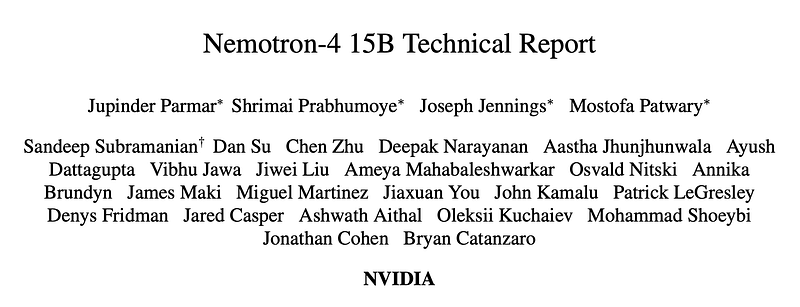 | Nemotron-4 15B technical report title and author block. |
| 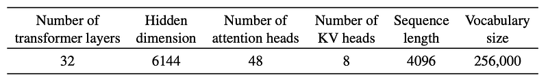 | Key architecture hyperparameters for Nemotron-4 15B. |
| 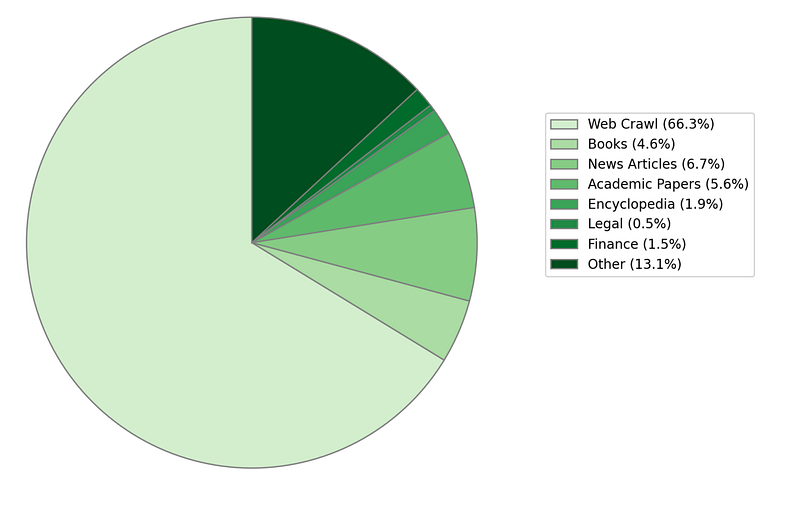 | English pretraining-token composition pie chart. |
| 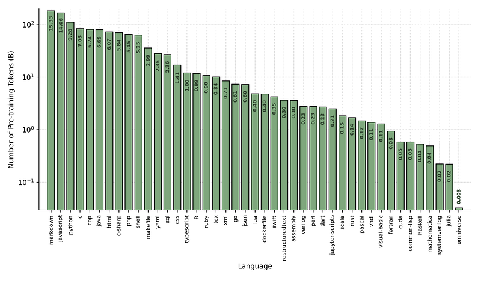 | Programming-language token distribution used during pretraining. |
| 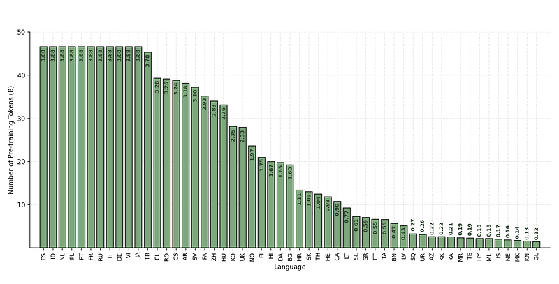 | Natural-language token distribution excluding English. |
| 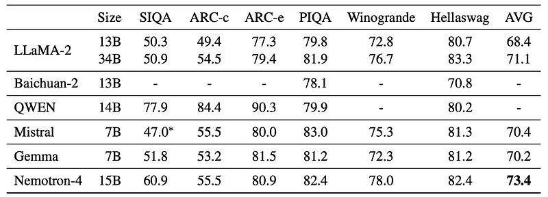 | Reasoning benchmark table: SIQA, ARC, PIQA, Winogrande, HellaSwag. |
| 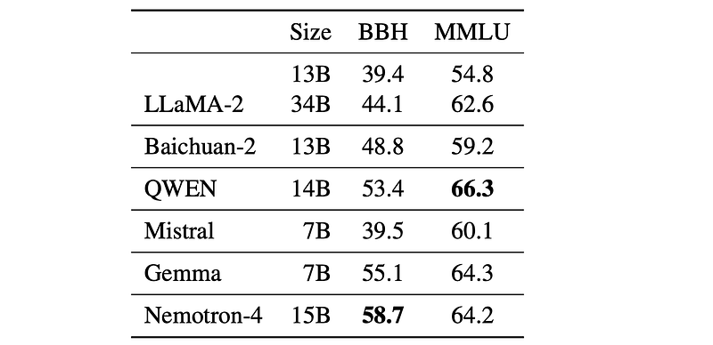 | BBH and MMLU comparison against LLaMA-2, QWEN, Mistral, and Gemma. |
| 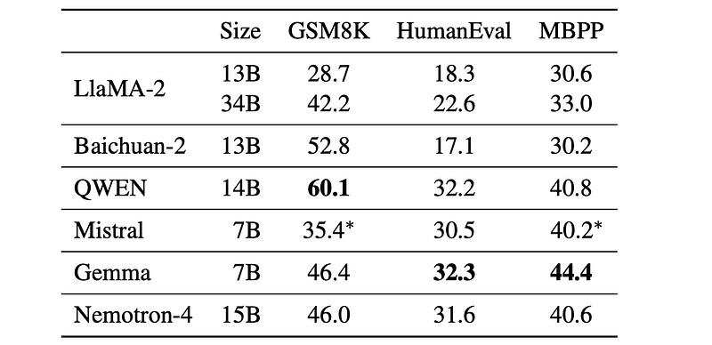 | GSM8K and coding benchmarks: HumanEval and MBPP. |
| 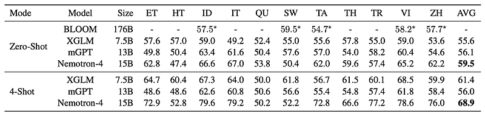 | Multilingual zero-shot and 4-shot results across ten languages. |
| 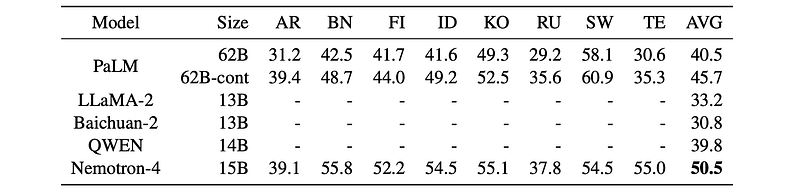 | Multilingual benchmark table across AR, BN, FI, ID, KO, RU, SW, TE. |
| 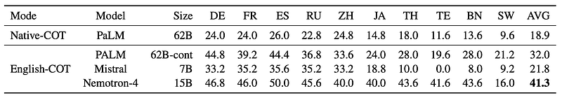 | Chain-of-thought multilingual reasoning results: native COT vs English COT. |
| 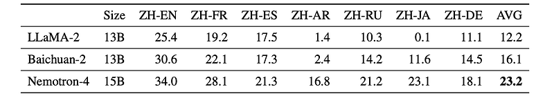 | Chinese-to-multilingual translation benchmark results. |
## Related

- [[Papers Explained Corpus]]
- [[Large Language Models]]
- [[Multilingual Models]]
- [[Code Models]]
- [[Embedding and Retrieval]]
- [[Synthetic Data]]
- [[Papers Explained 205 - LeViT]]
- [[Papers Explained 207 - Nemotron-4 340B]]

#summary #topic
