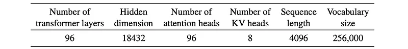
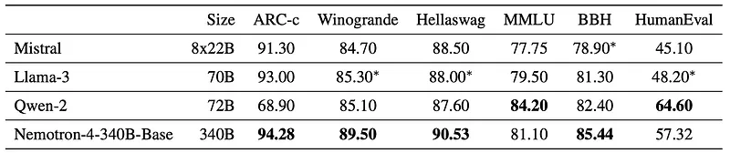
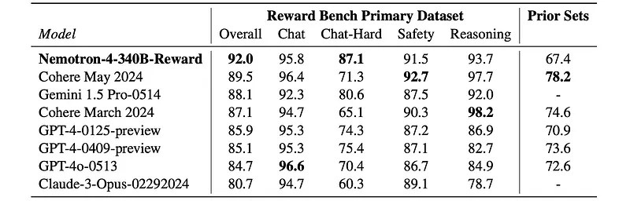
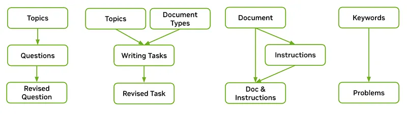
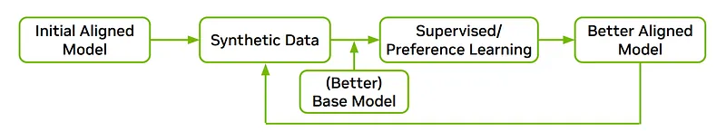
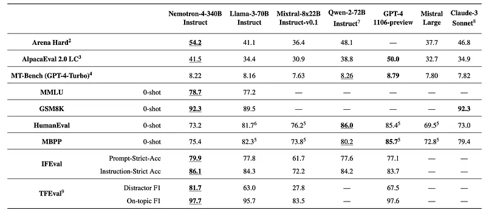
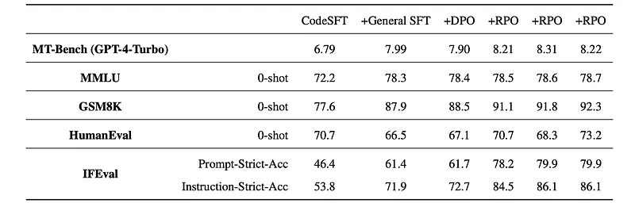
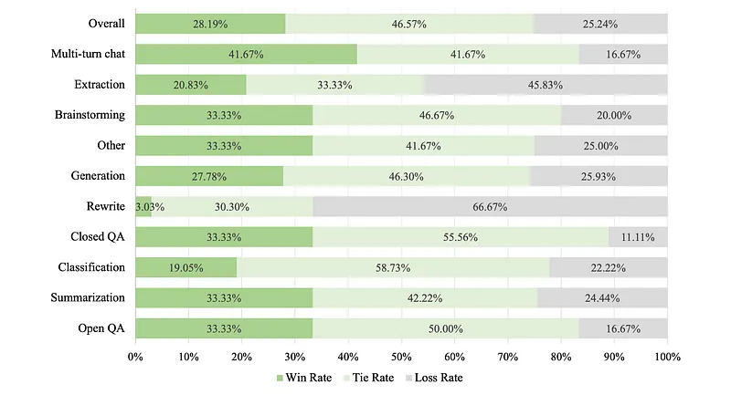
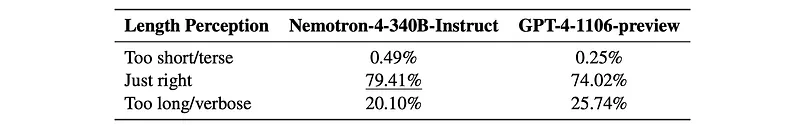

# Papers Explained 207 - Nemotron-4 340B

A family of 340B models including a base model, instruct model and a reward model, aimed to benefit in various research studies and commercial applications, especially for generating synthetic data to train smaller language models.

This page ingests the source article into the wiki and connects it to [[Papers Explained Corpus]], [[Large Language Models]], [[Synthetic Data]], [[Reinforcement Learning Topic]], [[Embedding and Retrieval]], [[Safety and Alignment]], [[Reinforcement Learning]].

## Source Metadata

- Source file: `raw/2024-09-10_Papers-Explained-207--Nemotron-4-340B-4cfe268439f8.md`
- Source title: Papers Explained 207: Nemotron-4 340B
- Published: 2024-09-10
- Canonical: [https://medium.com/@ritvik19/papers-explained-207-nemotron-4-340b-4cfe268439f8](https://medium.com/@ritvik19/papers-explained-207-nemotron-4-340b-4cfe268439f8)

## Key Ideas

- The models and HelpSteer2 dataset are available at [HuggingFace](https://huggingface.co/collections/nvidia/nemotron-4-340b-666b7ebaf1b3867caf2f1911).
- Recommended Reading [Papers Explained 206: Nemotron-4 15B](https://ritvik19.medium.com/papers-explained-206-nemotron-4-15b-7d895fb56134)
- Nemotron-4–340B-Base follows the same data blend as Nemotron-4–15B-Base.
- Nemotron-4–340B-Base is similar in architecture to Nemotron-4–15B-Base. It is a standard decoder-only Transformer architecture, with causal attention masks, uses Rotary Position Embeddings (RoPE), SentencePiece tokenizer, and squared ReLU activations in the...
- Nemotron-4–340B-Base follows the same continued pretraining recipe as Nemotron-4–15B-Base.

## Notes

A family of 340B models including a base model, instruct model and a reward model, aimed to benefit in various research studies and commercial applications, especially for generating synthetic data to train smaller language models. Notably, over 98% of data used in our model alignment process is synthetically generated, showcasing the effectiveness of these models in generating synthetic data.

The models and HelpSteer2 dataset are available at [HuggingFace](https://huggingface.co/collections/nvidia/nemotron-4-340b-666b7ebaf1b3867caf2f1911).

Recommended Reading [Papers Explained 206: Nemotron-4 15B](https://ritvik19.medium.com/papers-explained-206-nemotron-4-15b-7d895fb56134)

## Pretraining

### Data

Nemotron-4–340B-Base follows the same data blend as Nemotron-4–15B-Base.

### Architectural Details

Nemotron-4–340B-Base is similar in architecture to Nemotron-4–15B-Base. It is a standard decoder-only Transformer architecture, with causal attention masks, uses Rotary Position Embeddings (RoPE), SentencePiece tokenizer, and squared ReLU activations in the MLP layers. It has no bias terms, has a dropout rate of zero, and untied input-output embeddings. It also uses Grouped Query Attention. It has 9.4 billion embedding parameters and 331.6 billion non-embedding parameters.

*Figure: Key hyper-parameters affecting size of Nemotron-4–340B-Base.*

### Training Details

Nemotron-4–340B-Base follows the same continued pretraining recipe as Nemotron-4–15B-Base.

### Base Model Evaluation

*Figure: Results on standard reasoning benchmarks.*

- Nemotron-4–340B-Base achieves the strongest accuracy on commonsense reasoning tasks as well as on popular benchmarks like BBH.

- It is competitive on MMLU and code benchmarks like HumanEval.

## Reward Modeling

The reward model plays a pivotal role in model alignment hence a dataset of 10k human preference data, called HelpSteer2 is collected following a methodology similar to the one described in HelpSteer.

As compared to pairwise ranking models, multi-attribute regression reward models are more effective at disentangling real helpfulness from irrelevant artifacts, such as preferring longer but unhelpful responses solely due to their length.

The regression reward model is built on top of Nemotron-4–340B-Base model by replacing the final softmax layer with a new reward “head”, which maps hidden states of the last layer into a five-dimensional vector of HelpSteer attributes (Helpfulness, Correctness, Coherence, Complexity, Verbosity). During inference, these attribute values can be aggregated by a weighted sum to be an overall reward.

*Figure: Model Accuracy on Reward Bench.*

- Nemotron4–340B-Reward achieves the top accuracy on Reward Bench’s primary dataset, in particular on the challenging “Chat-Hard” category.

- Its comparatively lower accuracy on Prior Sets is likely due to not using the training data from those datasets.

## Alignment Data

This work explores Synthetic data generation (SDG) as a solution to the inadequacy of existing permissive data and the time consuming and costly endeavor of human annotations. Notably, only approximately 20k human-annotated data points were used (10k for supervised fine-tuning and 10k for reward model training and preference fine-tuning), while the data generation pipeline synthesized over 98% of the data used for training and fine-tuning.

### Prompt Preparation

The permissive Mixtral-8x7B-Instruct-v0.1 is used as the generator to generate synthetic prompts separately for the tasks including open Q&A, writing, closed Q&A, math and coding.

Synthetic Single Turn Prompts

*Figure: Synthetic single-turn prompts generation for open Q&A, writing, closed Q&A, math and coding.*

Collect diverse topics:

- Generate macro-topics and then subtopics for each topic

- Gather 3K topics in total (synthetic macro topics, synthetic subtopics, and manually collected topics)

Generate open Q&A prompts:

- Start with a given topic and generate questions related to it

- Refine the question to be more detailed and specific

Generate writing prompts:

- Include instructions about generating certain types of documents (e.g., newsletters, essays) about a given topic

- Refine the generated task to include more details

Generate closed Q&A prompts:

- Use texts from the C4 dataset as input

- Ask the generator to output respected instructions (e.g., summarize the text or answer a question based on the text)

- Concatenate the document with the generated instruction using manually defined templates

Generate math and coding prompts:

- Collect diverse keywords from mathematics and python programming (12K python-related keywords, 17K math-related keywords)

- Generate high-level topics and subtopics for math and python programming

- Prompt the generator to classify whether Wikipedia entities are related to math or python programming

- Parse python pretraining data to collect frequent python keywords and include manually collected math-related keywords

- Generate problems related to each keyword

The various prompts used are [here](https://arxiv.org/pdf/2406.11704#page=25&zoom=100,96,466).

Synthetic two-turn prompts: The first user prompts are sourced from ShareGPT, and the assistant response and the next turn question are generated with intermediate instruction models.

Real-world LMSYS prompts: Prompts from LMSYS-Chat-1M are drawn to better mimic the real world. All prompts are combined in a balanced ratio and divided into two distinct sets: one for supervised learning and another for preference learning, with no overlap between the two. The prompts from LMSYS that are flagged as potentially unsafe are removed in the supervised-learning split to avoid eliciting undesired dialogue. Those prompts are retained in the preference-learning split, allowing the model to learn to distinguish between safe and unsafe responses.

Synthetic Dialogue Generation : Synthetic conversations are initiated by prompting an instructive model to generate responses based on input prompts. To foster multi-turn conversation capabilities, dialogues are designed to comprise three turns. Through iterative role-playing, a model alternates between simulating the Assistant’s and User’s roles.

The various prompts used are [here](https://arxiv.org/pdf/2406.11704#page=29&zoom=100,96,217).

### Synthetic Preference Data Generation

Apart from the HelpSteer2 preference data, more diverse and high-quality data with additional ground-truth signals is needed to train Nemotron-4–340B-Reward. To achieve this, synthetic preference data in the form of triplets (prompt, chosen response, rejected response) is generated. The prompts include single-turn, instruction-following, two-turn, and real-world prompts from various datasets.

For each prompt, multiple random intermediate models are used to generate responses, ensuring diverse responses. Additionally, more challenging synthetic preference examples are created by generating multiple responses from the best-performing model according to MT-Bench.

To judge the preference ranking of the generated responses, a combination of ground-truth labels and verifiers (e.g., instruction following responses validated with a Python program) are used. Since most prompts do not have an objective answer, the Reward-Model-as-Judge approach is used as it showed higher accuracy in the Chat-Hard category, as compared to LLM-as-Judge.

The various prompts used are [here](https://arxiv.org/pdf/2406.11704#page=29&zoom=100,96,856).

### Iterative Weak-to-Strong Alignment

An iterative approach called Iterative Weak-to-Strong Alignment to refine their data towards optimality. This approach combines alignment training and data synthesis to mutually enhance each other and drive continuous improvement.

*Figure: Demonstration of the proposed Iterative Weak-to-Strong Alignment workflow.*

The workflow involves using an initial aligned model as a generator for both dialogue and preference data, which is then used to align a better base model using supervised fine-tuning and preference tuning.

The process involves two iterations:

- In the first iteration, an initial aligned model (Mixtral-8x7B-Instruct-v0.1) is used to generate data, which is then used to train an intermediate checkpoint of Nemotron-4–340B-Base (340B-Interm-1-Base). This intermediate base model outperforms the initial aligned model, enabling the resulting instruct model (340B-Interm-1-Instruct) to surpass the initial aligned model.

- In the second iteration, the resultant 340B-Interm-1-Instruct model is used as a new data generator, producing higher-quality synthetic data than in the first iteration. This data is then used to train an improved base model (340B-Interm-2-Base) and instruct model (340B-Interm-2-Chat).

This iterative process creates a self-reinforcing flywheel effect, where improvements can be attributed to two aspects:

- The strength of the base model has a direct impact on the instruct model, with stronger base models yielding stronger instruct models.

- The quality of the dataset plays a critical role in determining the effectiveness of the instruct model, with higher-quality data leading to stronger instruct models.

Throughout the entire alignment procedure, multiple rounds of data generation and refinement are conducted, continually improving the quality of the models.

## Alignment Algorithms

A two-stage protocol is followed for model alignment, which involves Supervised Fine-tuning (SFT) and Preference Fine-tuning.

Supervised Fine-tuning

The first stage is divided into two sub-stages: Code SFT and General SFT.

- Code SFT: Conducts SFT solely on coding data to improve the model’s coding abilities. This involves generating synthetic samples using Genetic Instruct, an approach that mimics evolutionary processes. Trains the model for one epoch.

- General SFT: Uses a blended dataset of 200K samples from various tasks, including 2% code generation samples from the preceding Code SFT stage. Trains the model for three epochs..

Preference Fine-tuning

The preference fine-tuning stage involves multiple iterations of model improvement, using both the Direct Preference Optimization and the new alignment algorithm, the Reward-aware Preference optimization.

The second stage involves learning preference examples in the form of (prompt, chosen response, rejected response) triplets.

- Direct Preference Optimization (DPO): Optimizes the policy network to maximize the implicit reward gap between chosen and rejected responses.

- Reward-aware Preference Optimization (RPO) Approximates the reward gap using the implicit reward defined by the policy network. This new algorithm prevents overfitting and “unlearning” high-quality rejected responses.

The final model is trained for one iteration of DPO and three iterations of RPO, with each iteration using the checkpoint from the previous iteration as initialization and reference policy. The final checkpoint is Nemotron-4–340B-Instruct.

## Instruct Model Evaluation

### Automatic Benchmarks

*Figure: Evaluation results of instruct models on automatic benchmarks.*

- Nemotron-4–340B-Instruct is competitive with currently available open access models.

*Figure: Evaluation results of each intermediate model in the alignment process.*

- The CodeSFT stage significantly improves HumanEval to 70.7 from the base model’s 57.3.

- The following General SFT then greatly improves accuracy in other categories such as MT-Bench and MMLU, with a slight degradation on HumanEval.

- The DPO step further increases most metrics with a slight drop in the MT-bench.

- Finally, the RPO step boosts all metrics uniformly. Specifically, MT-Bench increases from 7.90 to 8.22 and IFEval Prompt-Strict-Acc increases from 61.7 to 79.9.

### Human Evaluation

*Figure: Human evaluations comparing Nemotron-4–340B-Instruct with GPT-4–1106-preview across ten task categories.*

- With exception of extraction and rewrite, win rates for Nemotron-4–340B-Instruct are comparable or better than GPT-4–1106-preview, with strong results on multi-turn chat.

- The model has an overall ratio of win : tie : loss = 28.19% : 46.57% : 25.24% on the whole evaluation set.

*Figure: Human evaluation results regarding perception of response length.*

- Annotators consider Nemotron-4–340B-Instruct to have a slightly higher rate of appropriate response length (79.41% vs 74.02%) when compared to GPT-4–1106-preview.

- It is noteworthy that this gain comes mainly from a lower rate of long/verbose responses (20.10% vs 25.74%).

## Paper

Nemotron-4 340B Technical Report [2406.11704](https://arxiv.org/abs/2406.11704)

## Figures

Figures from the Medium HTML export (`raw/2024-09-10_Papers-Explained-207--Nemotron-4-340B-4cfe268439f8.md`); local copies under `wiki/assets/papers-explained-207-nemotron-4-340b/` when download succeeded.

| Figure | Caption |
|--------|---------|
|  | Nemotron-4 340B technical report title block. |
|  | Key architecture hyperparameters for Nemotron-4 340B Base. |
|  | Standard reasoning benchmark comparison vs Llama-3, Qwen-2, and Mixtral. |
|  | RewardBench model-accuracy table with Nemotron-4-340B-Reward. |
|  | Synthetic single-turn prompt generation workflows for major task types. |
|  | Iterative weak-to-strong alignment workflow diagram. |
|  | Automatic benchmark results for instruct models. |
|  | Intermediate alignment-stage results from CodeSFT through RPO. |
|  | Human evaluation win-tie-loss rates vs GPT-4-1106 by task category. |
|  | Human judgment of response length: terse, just right, verbose. |
## Related

- [[Papers Explained Corpus]]
- [[Large Language Models]]
- [[Synthetic Data]]
- [[Reinforcement Learning Topic]]
- [[Embedding and Retrieval]]
- [[Safety and Alignment]]
- [[Reinforcement Learning]]
- [[Papers Explained 206 - Nemotron-4 15B]]
- [[Papers Explained 208 - Minitron]]

#summary #topic
