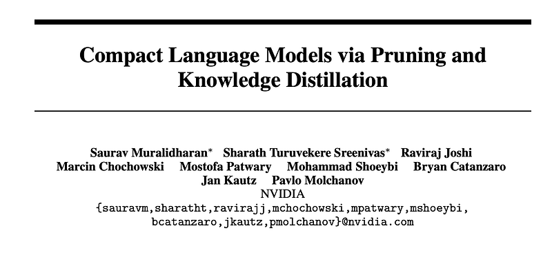
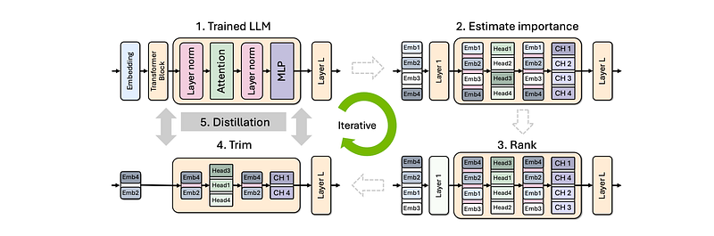
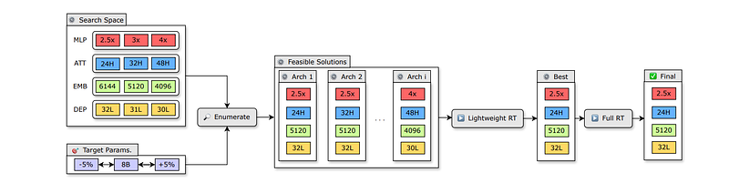
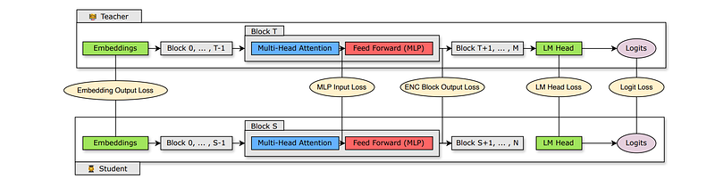
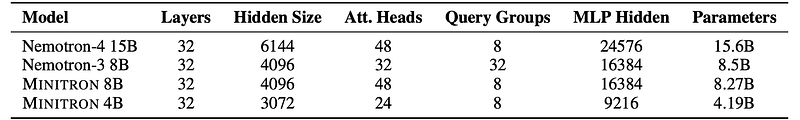
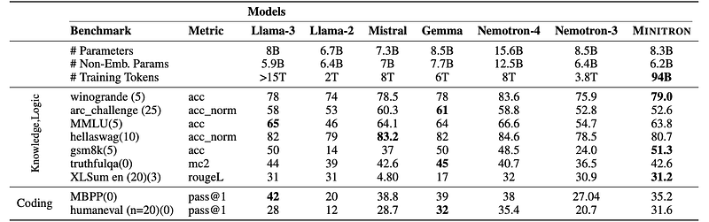
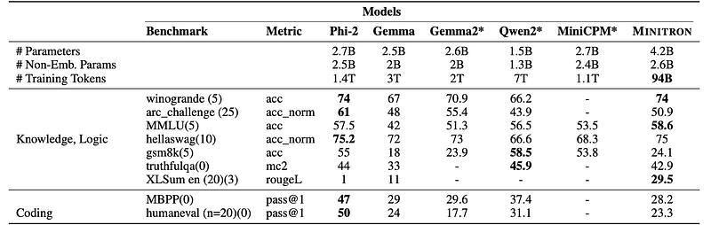
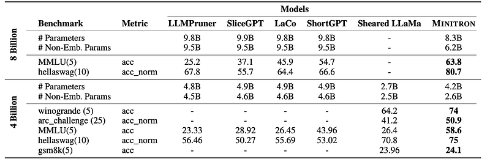

# Papers Explained 208 - Minitron

The study investigates whether pruning an existing Large Language Model (LLM) and re-training it with a fraction of the original training data can be a suitable alternative to repeated, full retraining.

This page ingests the source article into the wiki and connects it to [[Papers Explained Corpus]], [[Large Language Models]], [[Model Compression and Efficiency]], [[Synthetic Data]], [[Embedding and Retrieval]], [[Evaluation and Benchmarks]], [[Model Distillation]].

## Source Metadata

- Source file: `raw/2024-09-11_Papers-Explained-208--Minitron-e55ea374d9dd.html`
- Source title: Papers Explained 208: Minitron
- Published: 2024-09-11
- Canonical: [https://medium.com/@ritvik19/papers-explained-208-minitron-e55ea374d9dd](https://medium.com/@ritvik19/papers-explained-208-minitron-e55ea374d9dd)

## Key Ideas

- Using this approach, the Nemotron-4 family of LLMs is compressed by a factor of 2–4×, resulting in compute cost savings of 1.8× for training the full model family (15B, 8B, and 4B).
- The models are available at [HuggingFace](https://huggingface.co/collections/nvidia/minitron-669ac727dc9c86e6ab7f0f3e/) and the project is available at [GitHub](https://github.com/NVlabs/Minitron/).
- Recommended Reading [Papers Explained 206: Nemotron-4 15B](https://ritvik19.medium.com/papers-explained-206-nemotron-4-15b-7d895fb56134)
- A purely activation-based importance estimation strategy is proposed that simultaneously computes sensitivity information for all the axes (depth, neuron, head, and embedding channel) using a small (1024 samples) calibration dataset and only forward...
- The importance of each head, neuron and embedding channel is computed by activation-based importance scores on the calibration dataset D:

## Notes

The study investigates whether pruning an existing Large Language Model (LLM) and re-training it with a fraction of the original training data can be a suitable alternative to repeated, full retraining. They develop a set of compression best practices for LLMs that combine depth, width, attention, and MLP pruning with knowledge distillation-based retraining.

Using this approach, the Nemotron-4 family of LLMs is compressed by a factor of 2–4×, resulting in compute cost savings of 1.8× for training the full model family (15B, 8B, and 4B). The compressed models, called Minitron, exhibit up to a 16% improvement in MMLU scores compared to training from scratch.

The models are available at [HuggingFace](https://huggingface.co/collections/nvidia/minitron-669ac727dc9c86e6ab7f0f3e/) and the project is available at [GitHub](https://github.com/NVlabs/Minitron/).

Recommended Reading [Papers Explained 206: Nemotron-4 15B](https://ritvik19.medium.com/papers-explained-206-nemotron-4-15b-7d895fb56134)

## Pruning Methodology

*Figure: High-level overview of the proposed iterative pruning and distillation approach*

### Importance Analysis

A purely activation-based importance estimation strategy is proposed that simultaneously computes sensitivity information for all the axes (depth, neuron, head, and embedding channel) using a small (1024 samples) calibration dataset and only forward propagation passes:

Width:

The importance of each head, neuron and embedding channel is computed by activation-based importance scores on the calibration dataset D:

*Figure: Summation B,S refers to aggregation along the batch and sequence dimensions*

Depth:

The importance of each layer is evaluated using two metrics:

Perplexity (PPL): simply remove a single layer and compute its effect on perplexity of this pruned model

Block Importance (BI): serves as the “importance” or sensitivity of the layer using the cosine distance between the input and output of a layer.

### Iterative Importance

Pruning and importance estimation are iteratively alternated for a given axis or combination of axes. Given number of iterations T and source and target dimensions (layers, heads, etc.) ds and dt, respectively, importance is computed on ds − i · (ds −dt)/T dimensions and pruning to ds − (i + 1) · (ds −dt)/T dimensions; i ∈ [0, T − 1].

### Obtaining a Pruned Model

For a given architecture configuration, the elements of each axis are ranked according to the computed importance and then trimmed (reshaped) directly in the corresponding weight matrices.

For neuron and head pruning, MLP and MHA layer weights are trimmed, respectively. In the case of embedding channels, the embedding dimension of the weight matrices in MLP, MHA, and LayerNorm layers are trimmed.

*Figure: Overview of the neural architecture search algorithm.*

Given a search space and parameter budget (left side of the figure), all feasible architectures meeting the parameter budget by sticking are enumerated to commonly used neuron, head and embedding dimensions. The feasible candidates then undergo lightweight retraining (∼1.8B tokens).

## Retraining

*Figure: Overview of Distillation.*

Retraining refers to the accuracy recovery process following pruning. A combination of Conventional training with ground truth labels and knowledge distillation (KD) using supervision from an unpruned model (teacher) is used for retraining.

The output probability distribution of an LLM for a given token xi is computed as:

*Figure: where τ is the softmax temperature and |V | is the vocabulary size*

Logit-based KD loss across the sequence of all output tokens is represented as

*Figure: here, p k t (x, τ ) and p k s (x, τ ) represent the teacher and student probability distributions on the k th token, respectively, and l represents the sequence lengt*

Various loss functions and combinations of intermediate states and mappings across the Transformer model are explored for distillation, along with their respective trade-offs.

The intermediate state-based KD loss across a sequence of Transformer-specific hidden states is represented as

*Figure: where h ki t and h ki s represent the k th teacher and student hidden state for the i th token, respective*

The mismatch in student and teacher hidden states is handled by learning a shared linear transformation during distillation to upscale the student hidden state to the teacher hidden state dimension.

The total loss L is computed as L = LCLM + Llogits + α × Lis; where LCLM is the student cross entropy loss against the ground truth labels, and α is a weighting coefficient.

## Experiment Setup

The Nemotron-4 model with 15.6B parameters is compressed to two target parameter ranges: 8B and 4B.

The retraining process used the Nemotron-4 curated dataset, consisting of: 8T tokens, For lightweight retraining, 1.8 billion tokens are used. A calibration dataset D is created for importance estimation, consisting of 1024 random samples drawn from the full dataset.

*Figure: Architecture details of the uncompressed Nemotron and pruned Minitron models. Vocabulary size is 256k for all models.*

## Structured Compression Best Practices

> 1. To train a family of LLMs, train the largest one and prune+distill iteratively to smaller LLMs.

> 2. Use (batch=L2, seq=mean) importance estimation for width axes and PPL/BI for depth.

> 3. Use single-shot importance estimation; iterative provides no benefit.

> 4. Prefer width pruning over depth for the model scales we consider (≤ 15B).

> 5. Retrain exclusively with distillation loss using KLD instead of conventional training.

> 6. Use (logit+intermediate state+embedding) distillation when depth is reduced significantly.

> 7. Use logit-only distillation when depth isn’t reduced significantly.

> 8. Prune a model closest to the target size.

> 9. Perform lightweight retraining to stabilize the rankings of searched pruned candidates.

> 10. If the largest model is trained using a multi-phase training strategy, it is best to prune and retrain the model obtained from the final stage of training.

## Results

Minitron 8B outperforms Nemotron-3 8B and LLaMa-2 7B, and performs similarly to Mistral 7B, Gemma 7B, and LLaMa-3 8B, while using significantly fewer training tokens.

Minitron 4B retains model capabilities better than smaller specialized models and outperforms Gemma2.

Minitron 8B significantly outperforms multiple depth-pruned models of larger size (∼ 10B parameters).

## Paper

Compact Language Models via Pruning and Knowledge Distillation [2407.14679](https://www.arxiv.org/abs/2407.14679)

## Figures

Figures from the Medium HTML export (`raw/2024-09-11_Papers-Explained-208--Minitron-e55ea374d9dd.html`); local copies under `wiki/assets/papers-explained-208-minitron/` when download succeeded.

| Figure | Caption |
|--------|---------|
|  | Compact Language Models via Pruning and Knowledge Distillation paper title. |
|  | Iterative pruning and distillation overview for Minitron. |
|  | Importance-score formulas aggregated over batch and sequence dimensions. |
|  | Block-importance formula used in architecture search. |
|  | Neural architecture search pipeline from search space to final model. |
|  | Distillation overview with teacher-student losses at embedding, block, head, and logits levels. |
|  | Temperature-softmax probability formula used in distillation. |
|  | Logits distillation loss formulation. |
|  | Hidden-state distillation loss formulation. |
|  | Architecture details for Nemotron and pruned Minitron variants. |
|  | Benchmark comparison vs Llama-3 8B, Llama-2, Mistral, Gemma, Nemotron-4, and Nemotron-3. |
|  | Benchmark comparison vs Phi-2, Gemma variants, Qwen2, and MiniCPM. |
|  | Compression-method comparison against LLMPruner, SliceGPT, LaCo, and ShortGPT. |
## Related

- [[Papers Explained Corpus]]
- [[Large Language Models]]
- [[Model Compression and Efficiency]]
- [[Synthetic Data]]
- [[Embedding and Retrieval]]
- [[Evaluation and Benchmarks]]
- [[Model Distillation]]
- [[Papers Explained 207 - Nemotron-4 340B]]
- [[Papers Explained 209 - Minitron Approach in Practice]]

#summary #topic
