# Papers Explained 209 - Minitron Approach in Practice

This work presents a comprehensive report on compressing the Llama 3.1 8B and Mistral NeMo 12B models to 4B and 8B parameters, respectively, using the Minitron Approach.

This page ingests the source article into the wiki and connects it to [[Papers Explained Corpus]], [[Large Language Models]], [[Model Compression and Efficiency]], [[Synthetic Data]], [[Model Distillation]], [[Supervised Fine-Tuning]], [[KL Regularization]].

## Source Metadata

- Source file: `raw/2024-09-12_Papers-Explained-209--Minitron-Approach-in-Practice-6b473f67328d.html`
- Source title: Papers Explained 209: Minitron Approach in Practice
- Published: 2024-09-12
- Canonical: [https://medium.com/@ritvik19/papers-explained-209-minitron-approach-in-practice-6b473f67328d](https://medium.com/@ritvik19/papers-explained-209-minitron-approach-in-practice-6b473f67328d)

## Key Ideas

- The models are available at [HuggingFace](https://huggingface.co/collections/nvidia/minitron-669ac727dc9c86e6ab7f0f3e).
- Recommended Reading [Papers Explained 208: Minitron](https://ritvik19.medium.com/papers-explained-208-minitron-e55ea374d9dd)
- The teacher model is first lightly fine tuned on the target dataset to be used for distillation — referred as teacher correction. Next, pruning is applied to compress the model, following which distillation is used to recover any lost model accuracy.
- Retraining: The approach to retraining involves logit-only distillation, which minimizes the forward KL Divergence loss across the teacher and student probabilities, while ignoring the LM cross-entropy loss altogether.
- To evaluate the instruction-following capabilities of our distilled models, supervised finetuning (SFT) is performed on the Llama-3.1-Minitron 4B models using NeMo-Aligner with the instruction tuning dataset used for Nemotron-4 340B.

## Notes

This work presents a comprehensive report on compressing the Llama 3.1 8B and Mistral NeMo 12B models to 4B and 8B parameters, respectively, using the Minitron Approach.

The models are available at [HuggingFace](https://huggingface.co/collections/nvidia/minitron-669ac727dc9c86e6ab7f0f3e).

Recommended Reading [Papers Explained 208: Minitron](https://ritvik19.medium.com/papers-explained-208-minitron-e55ea374d9dd)

## Methodology

*Figure: High-level overview of the proposed pruning and distillation approach.*

The teacher model is first lightly fine tuned on the target dataset to be used for distillation — referred as teacher correction. Next, pruning is applied to compress the model, following which distillation is used to recover any lost model accuracy.

### Pruning

*Figure: Pruning and distillation process outlined in the original paper.*

For width pruning, l2-norm and mean are used as the aggregation functions across the batch and sequence dimensions, respectively. Single-shot pruning is performed, avoiding iterative approaches. For depth pruning, a continuous subgroup of layers is dropped that results in the least accuracy drop on Winogrande. In this work, the lightweight neural architecture search (NAS) phase is skipped, and manual architecture configurations are used for both Llama-3.1-Minitron-4B and MN-Minitron-8B. The architectures developed are inspired by the Minitron-4B and Minitron-8B models.

*Figure: Architecture details of the compressed models.*

### Distillation

*Figure: Overview of Distillation.*

Teacher Correction: The Mistral NeMo 12B model performs sub-optimally when used directly as a teacher on our dataset. This is attributed to the change in distribution of sub-word tokens across the original dataset the teacher model was trained on versus the dataset being distilled on. To address this issue, the teacher model is fine-tuned on our dataset using approximately 127B tokens. This technique is applied to both the Mistral-NeMo and Llama-3.1 teacher models. The fine-tuning process has a minor effect on the teacher model’s accuracy on downstream tasks, with some tasks improving and others degrading. It is hypothesized that this outcome is an artifact of the dataset used for fine tuning.

Retraining: The approach to retraining involves logit-only distillation, which minimizes the forward KL Divergence loss across the teacher and student probabilities, while ignoring the LM cross-entropy loss altogether.

*Figure: Hyperparameters used during distillationbased retraining.*

### Instruction Tuning

To evaluate the instruction-following capabilities of our distilled models, supervised finetuning (SFT) is performed on the Llama-3.1-Minitron 4B models using NeMo-Aligner with the instruction tuning dataset used for Nemotron-4 340B.

## Evaluation

### Base Models

*Figure: Accuracy numbers for the MN-Minitron-8B and Llama-3.1-Minitron-4B models.*

- MN-Minitron-8B outperforms comparable models like Llama 3.1 8B in accuracy.

- Llama-3.1-Minitron 4B models perform well against their teacher model (Llama 3.1 8B) and the previous generation Minitron 4B.

- Width-pruned variants consistently outperform depth-pruned variants

### Instruct Models

*Figure: Accuracy numbers for the aligned Llama-3.1-Minitron models.*

- Llama-3.1-Minitron 4B models show strong instruction-following and roleplay abilities, performing well on IFEval and MT-Bench, though slightly behind Gemma2.

- Minitron models achieve state-of-the-art results on retrieval-based question answering (ChatRAG-Bench) and function-calling (BFCL).

## Recipes

### Llama-3.1-Minitron-4B-Width:

> Starting model: Llama 3.1 8B

> Hidden dimension: 4096 → 3072

> MLP hidden dimension: 14336 → 9216

> Attention heads: unchanged

> Depth: unchanged

### Llama-3.1-Minitron-4B-Depth:

> Starting model: Llama 3.1 8B

> Hidden dimension: unchanged

> MLP hidden dimension: unchanged

> Attention heads: unchanged

> Depth: 32 → 16

### MN-Minitron-8B:

> Starting model: Mistral NeMo 12B

> Hidden dimension: 5120 → 4096

> MLP hidden dimension: 14336 → 11520

> Attention heads: unchanged

> Depth: unchanged

## Insights

### General

> Teacher correction is crucial for distillation to work optimally on a new, unseen dataset. Finetuning the teacher with the dataset used for distillation in this manner yields over a 6% reduction in LM validation loss. Teacher correction doesn’t affect the optimality of pruning and can even be performed in parallel with distillation.

> In line with the Minitron paper’s observations, we require only 380B tokens to achieve state-of-the-art accuracy post pruning with distillation.

> For width pruning, we achieve stronger accuracy by retaining attention heads and pruning the other dimensions (MLP intermediate dimension, embedding channels).

### Mistral NeMo 12B to MN-Minitron-8B:

> Our compressed model outperforms the teacher on two benchmarks, GSM8k and HumanEval after pruning and distillation: GSM8k increases from 55.7% to 58.5% and HumanEval increases from 23.8% to 36.2%. This improvement is likely influenced by the dataset. However, retraining is performed using the distillation loss alone.

### Llama 3.1 8B to Llama-3.1-Minitron 4B:

> Width pruning delivers better accuracy with MMLU at 60.5%, while depth pruning yields 58.7%, for Llama-3.1 compression.

> Reasoning ability is impacted further significantly, with GSM8K accuracy at 41.24% for width and 16.8% for depth.

> Depth pruning boosts throughput, achieving ∼ 2.7× speedup over Llama-3.1 8B, while width pruning provides ∼ 1.7× speed up.

> For depth pruning, we observe that dropping contiguous layers from the model is more effective than using non-contiguous, importancebased pruning.

## Llama 3.1-Nemotron-51B

[23 Sep 2024] Llama 3.1-Nemotron-51B is derived from Meta’s Llama-3.1–70B, using NAS and knowledge distillation derived from the ‘reference model’ — Llama 3.1–70B. It yields 2.2x faster inference compared to the reference model while maintaining nearly the same accuracy.

The developed NAS can select neural architectures that optimize various constraints from enormous design spaces that include a zoo of non-standard transformer models that can utilize alternative attention and FFN blocks of varying efficiency degrees, up to a complete block elimination in the extreme case.

*Figure: Block-distillation — For blocks of the reference model (blue), multiple variants for the ‘student model’ (yellow) are created that mimic the block-wise teacher functionality.*

Block-distillation framework is used to train all block variants for all layers of a (large) parent LLM in parallel. In a basic version of block-distillation, training data is passed through the reference model (also known as a teacher). For each block, its input is taken from the teacher and injected into the matching block of the student. The outputs of the teacher and student for the block are compared and the student block is trained so that the student block mimics the functionality of the teacher block.

Next, the Puzzle algorithm is used to efficiently score each alternative replacement “puzzle piece” and search our enormous design space for the most accurate models, while adhering to a set of inference constraints, such as memory size and required throughput. Finally, by using knowledge distillation (KD) loss for both block scoring and training, the potential to narrow the accuracy gap between our model and the reference model using a much more efficient architecture with a tiny fraction of the reference model training costs is demonstrated.

*Figure: Runtime of Puzzle chosen blocks (layers) for attention layers (blue) and FFN layers (red) across the 80 layers of the reference model. Green areas correspond to overall runtime savings.*

The Llama-3.1-Nemotron-51B-Instruct architecture is unique in its irregular block structure with many layers in which the attention and FFN are reduced or pruned, resulting in better utilization of H100 and highlighting the importance of optimizing LLMs for inference.

*Figure: Accuracy comparison of the Nemotron model to the Llama 3.1–70B-Instruct across several industry benchmarks.*

## Paper

LLM Pruning and Distillation in Practice: The Minitron Approach [2408.11796](https://arxiv.org/abs/2408.11796)

[Advancing the Accuracy-Efficiency Frontier with Llama-3.1-Nemotron-51B](https://developer.nvidia.com/blog/advancing-the-accuracy-efficiency-frontier-with-llama-3-1-nemotron-51b/)

## Figures

Figures from the Medium HTML export (`raw/2024-09-12_Papers-Explained-209--Minitron-Approach-in-Practice-6b473f67328d.html`); local copies under `wiki/assets/papers-explained-209-minitron-approach-in-practice/` when download succeeded.

| Figure | Caption |
|--------|---------|
| 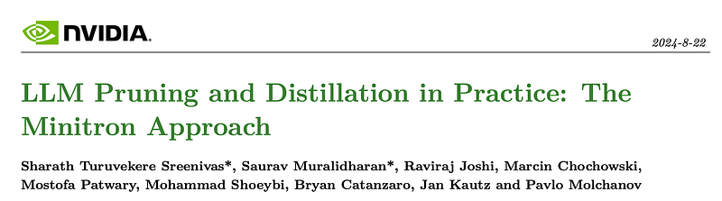 | NVIDIA blog header: LLM Pruning and Distillation in Practice - The Minitron Approach. |
| 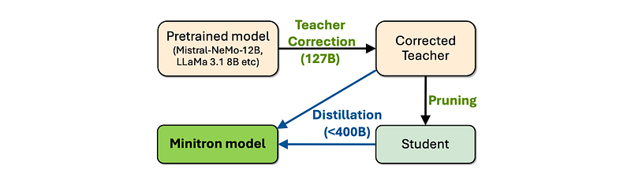 | High-level practical pipeline: teacher correction, pruning, and distillation into Minitron. |
| 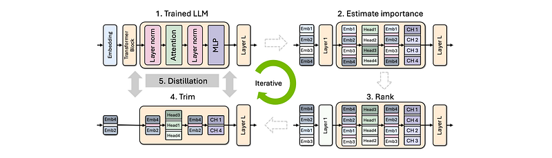 | Iterative pruning-and-distillation process from the original Minitron paper. |
| 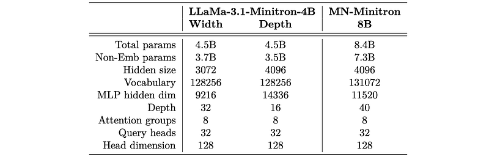 | Architecture details for Llama-3.1-Minitron-4B variants and MN-Minitron-8B. |
| 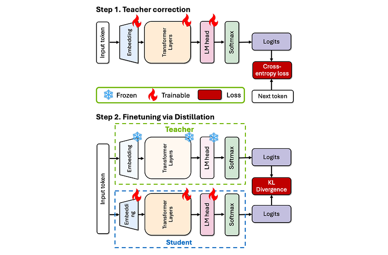 | Two-stage distillation diagram: teacher correction then KL-based student training. |
| 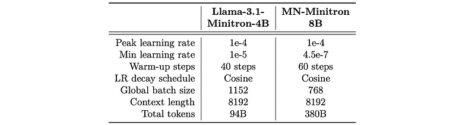 | Distillation hyperparameters for Llama-3.1-Minitron-4B and MN-Minitron-8B. |
| 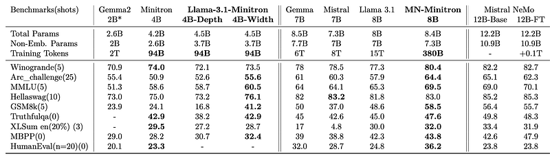 | Accuracy table for MN-Minitron-8B and Llama-3.1-Minitron-4B variants. |
| 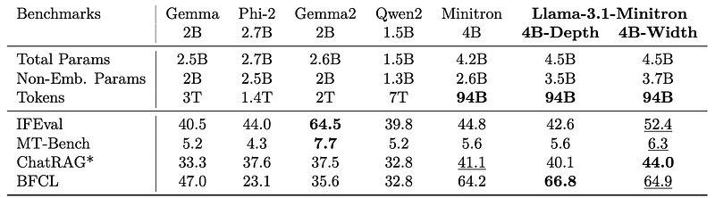 | Aligned-model benchmark comparison for Gemma, Phi-2, Qwen2, and Llama-3.1 Minitron variants. |
| 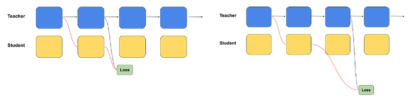 | Block-distillation schematic for selecting student blocks from teacher blocks. |
| 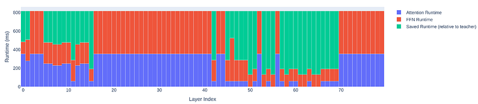 | Layer-wise runtime profile showing attention and FFN savings from Puzzle block choices. |
| 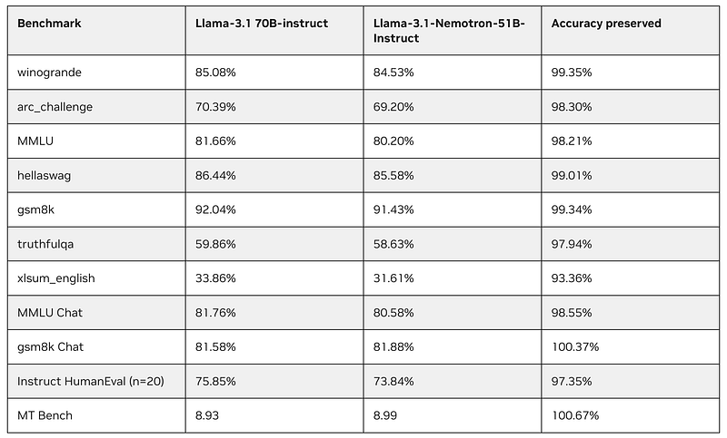 | Accuracy-preservation table: Llama-3.1-70B-Instruct vs Llama-3.1-Nemotron-51B-Instruct. |
## Related

- [[Papers Explained Corpus]]
- [[Large Language Models]]
- [[Model Compression and Efficiency]]
- [[Synthetic Data]]
- [[Model Distillation]]
- [[Supervised Fine-Tuning]]
- [[KL Regularization]]
- [[Papers Explained 208 - Minitron]]
- [[Papers Explained 210 - MaxViT]]

#summary #topic
