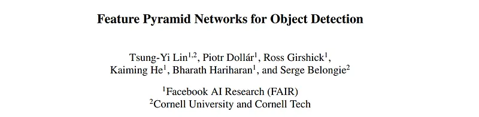
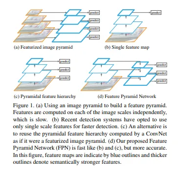
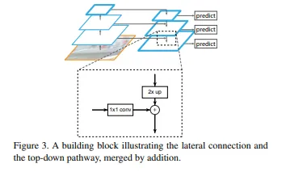

# Papers Explained 21 - Feature Pyramid Network

Feature pyramids are a basic component in recognition systems for detecting objects at different scales. But recent deep learning object detectors have avoided pyramid representations, in part because they are compute and memory intensive.

This page ingests the source article into the wiki and connects it to [[Papers Explained Corpus]], [[Computer Vision]].

## Source Metadata

- Source file: `raw/2023-02-07_Papers-Explained-21--Feature-Pyramid-Network-6baebcb7e4b8.md`
- Source title: Papers Explained 21: Feature Pyramid Network
- Published: 2023-02-07
- Canonical: [https://medium.com/@ritvik19/papers-explained-21-feature-pyramid-network-6baebcb7e4b8](https://medium.com/@ritvik19/papers-explained-21-feature-pyramid-network-6baebcb7e4b8)

## Key Ideas

- In ablation experiments, we find that for bounding box proposals, FPN significantly increases the Average Recall (AR) by 8.0 points;
- The goal is to leverage a ConvNet’s pyramidal feature hierarchy, which has semantics from low to high levels, and build a feature pyramid with high-level semantics throughout.
- This method takes a single-scale image of an arbitrary size as input, and outputs proportionally sized feature maps at multiple levels, in a fully convolutional fashion. This process is independent of the backbone convolutional architectures.
- RPN is a sliding-window class-agnostic object detector. In the original RPN design, a small subnetwork is evaluated on dense 3×3 sliding windows, on top of a singlescale convolutional feature map, performing object/nonobject binary classification and bounding...
- This is realized by a 3×3 convolutional layer followed by two sibling 1×1 convolutions for classification and regression, which is referred to as a network head.

## Notes

Feature pyramids are a basic component in recognition systems for detecting objects at different scales. But recent deep learning object detectors have avoided pyramid representations, in part because they are compute and memory intensive.

Feature Pyramid Network exploit the inherent multi-scale, pyramidal hierarchy of deep convolutional networks to construct feature pyramids with marginal extra cost. A topdown architecture with lateral connections is developed for building high-level semantic feature maps at all scales. This architecture shows significant improvement as a generic feature extractor in several applications. Using FPN in a basic Faster R-CNN system, achieves state-of-the-art singlemodel results on the COCO detection benchmark, surpassing all existing single-model entries including those from the COCO 2016 challenge winners.

The goal of this paper is to naturally leverage the pyramidal shape of a ConvNet’s feature hierarchy while creating a feature pyramid that has strong semantics at all scales. To achieve this goal, we rely on an architecture that combines low-resolution, semantically strong features with high-resolution, semantically weak features via a top-down pathway and lateral connections (Fig. 1(d)). The result is
a feature pyramid that has rich semantics at all levels and is built quickly from a single input image scale. In other words, we show how to create in-network feature pyramids that can be used to replace featurized image pyramids without sacrificing representational power, speed, or memory.

In ablation experiments, we find that for bounding box proposals, FPN significantly increases the Average Recall (AR) by 8.0 points; for object detection, it improves the COCO-style Average Precision (AP) by 2.3 points and PASCAL-style AP by 3.8 points, over a strong single-scale baseline of Faster R-CNN on ResNets.

## Architecture

The goal is to leverage a ConvNet’s pyramidal feature hierarchy, which has semantics from low to high levels, and build a feature pyramid with high-level semantics throughout. The resulting Feature Pyramid Network is general purpose with a focus on sliding window proposers (Region Proposal Network, RPN for short) and region-based detectors (Fast R-CNN).

This method takes a single-scale image of an arbitrary size as input, and outputs proportionally sized feature maps at multiple levels, in a fully convolutional fashion. This process is independent of the backbone convolutional architectures. The construction of the pyramid involves a bottom-up pathway, a top-down pathway, and lateral connections:

Bottom-up pathway

The bottom-up pathway is the feedforward computation of the backbone ConvNet, which computes a feature hierarchy consisting of feature maps at several scales with a scaling step of 2. There are often many layers producing output maps of the same size and these layers are said to be in the same network stage. For the feature pyramid, one pyramid level is defined for each stage. The output of the last layer of each stage is choosen as the reference set of feature maps, which will be enriched to create the pyramid. This choice is natural since the deepest layer of each stage should have the strongest features.

Top-down pathway and lateral connections
The topdown pathway hallucinates higher resolution features by upsampling spatially coarser, but semantically stronger, feature maps from higher pyramid levels. These features are then enhanced with features from the bottom-up pathway via lateral connections. Each lateral connection merges feature maps of the same spatial size from the bottom-up pathway and the top-down pathway. The bottom-up feature map is of lower-level semantics, but its activations are more accurately localized as it was subsampled fewer times.

## Feature Pyramid Networks for RPN

RPN is a sliding-window class-agnostic object detector. In the original RPN design, a small subnetwork is evaluated on dense 3×3 sliding windows, on top of a singlescale convolutional feature map, performing object/nonobject binary classification and bounding box regression.

This is realized by a 3×3 convolutional layer followed by two sibling 1×1 convolutions for classification and regression, which is referred to as a network head. The object/nonobject criterion and bounding box regression target are defined with respect to a set of reference boxes called anchors. The anchors are of multiple pre-defined scales and aspect ratios in order to cover objects of different shapes.

RPN is adapted by replacing the single-scale feature map with the FPN. A head of the same design (3×3 conv and two sibling 1×1 convs) is attached to each level on our feature pyramid. Because the head slides densely over all locations in all pyramid levels, it is not necessary to have multi-scale anchors on a specific level. Instead, we assign anchors of a single scale to each level.

## Feature Pyramid Networks for Fast R-CNN

Fast R-CNN is a region-based object detector in which Region-of-Interest (RoI) pooling is used to extract features. Fast R-CNN is most commonly performed on a single-scale feature map. To use it with our FPN, we need to assign RoIs of different scales to the pyramid levels.

The feature pyramid is viewed as if it were produced from an image pyramid. Thus we can adapt the assignment strategy of region-based detectors, in the case when they are run on image pyramids. Formally, we assign an RoI of width w and height h (on the input image to the network) to the level Pk of our feature pyramid by:

k = [k0 + log2(√wh/224)].

Analogous to the ResNet based Faster RCNN system, we set k0 to 4.

We attach predictor heads (in Fast R-CNN the heads are class-specific classifiers and bounding box regressors) to all RoIs of all levels.

## Paper

Feature Pyramid Networks for Object Detection [1612.03144](https://arxiv.org/abs/1612.03144)

## Figures

Figures from the Medium HTML export (`raw/2023-02-07_Papers-Explained-21--Feature-Pyramid-Network-6baebcb7e4b8.md`); local copies under `wiki/assets/papers-explained-21-feature-pyramid-network/` when download succeeded.

| Figure | Caption |
|--------|---------|
|  | Feature Pyramid Network Overview: Comparison of different architectures for building pyramids. |
|  | Feature Pyramid Network Architecture: A top-down architecture with lateral connections. |
|  | A building block illustrating the lateral connection and the top-down pathway. |
## Related

- [[Papers Explained Corpus]]
- [[Computer Vision]]
- [[Papers Explained 20 - Donut]]
- [[Papers Explained 22 - Focal Loss for Dense Object Detection (RetinaNet)]]
- [[Object Detection Part 4]] — featurized image pyramid in RetinaNet (Weng).

#summary #topic
