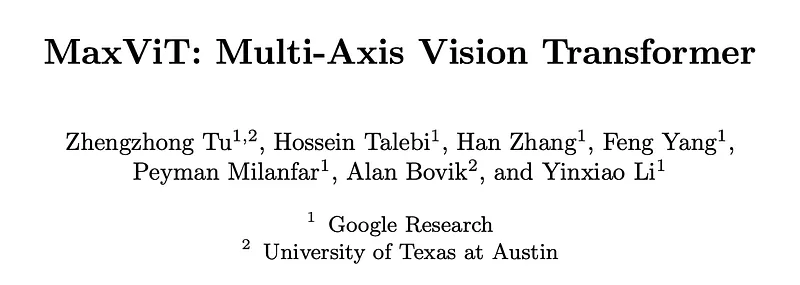
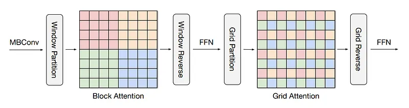
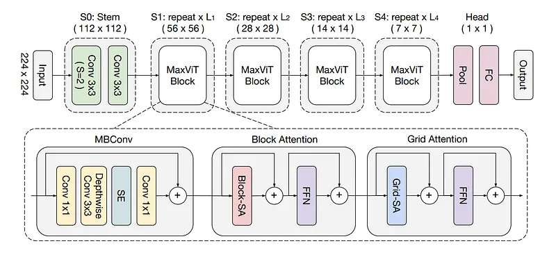
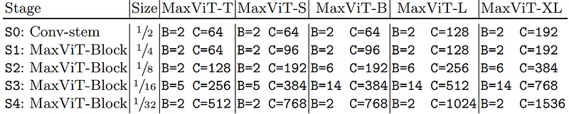
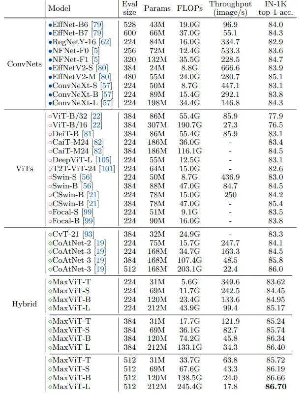
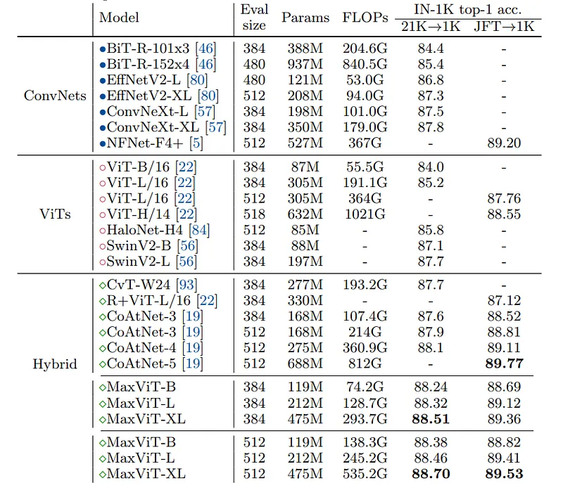
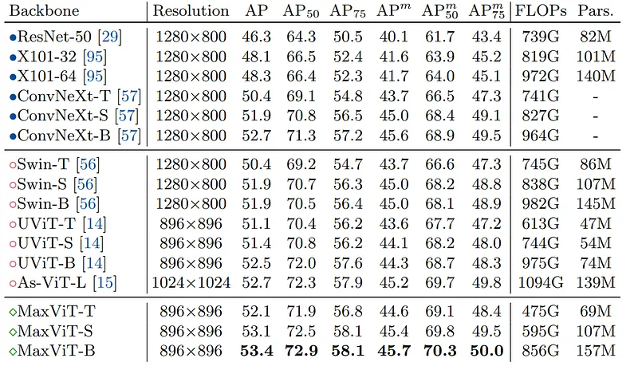

# Papers Explained 210 - MaxViT

Max ViT introduces an efficient and scalable attention model called multi-axis attention, consisting of two aspects: blocked local and dilated global attention. These design choices allow global-local spatial interactions on arbitrary input resolutions with only linear complexity.

This page ingests the source article into the wiki and connects it to [[Papers Explained Corpus]], [[Computer Vision]], [[Model Compression and Efficiency]].

## Source Metadata

- Source file: `raw/2024-09-13_Papers-Explained-210--MaxViT-6c68cc515413.md`
- Source title: Papers Explained 210: MaxViT
- Published: 2024-09-13
- Canonical: [https://medium.com/@ritvik19/papers-explained-210-maxvit-6c68cc515413](https://medium.com/@ritvik19/papers-explained-210-maxvit-6c68cc515413)

## Key Ideas

- Max ViT introduces an efficient and scalable attention model called multi-axis attention, consisting of two aspects: blocked local and dilated global attention.
- Let X ∈ R^H×W×C be an input feature map. Instead of applying attention on the flattened spatial dimension HW, the feature is blocked into a tensor of shape ( H / P × W / P , P × P, C), representing partitioning into non-overlapping windows, each of size P ×...
- Despite bypassing the notoriously heavy computation of full self-attention, local-attention models have been observed to underfit on huge-scale datasets. Therefore grid attention, a surprisingly simple but effective way to gain sparse global attention is used.
- Instead of partitioning feature maps using fixed window size, we grid the tensor into the shape (G×G, H /G × W / G , C) using a fixed G×G uniform grid, resulting in windows having adaptive size H / G × W / G .
- By using the same fixed window and grid sizes (P = G = 7 following Swin), the computation between local and global operations can be fully balanced, both having only linear complexity with respect to spatial size or sequence length.

## Notes

Max ViT introduces an efficient and scalable attention model called multi-axis attention, consisting of two aspects: blocked local and dilated global attention. These design choices allow global-local spatial interactions on arbitrary input resolutions with only linear complexity. It also prevents a new architectural element by effectively bleeding the proposed attention model with convolutions, this element forms the building block of Max ViT.

## Multi-axis Attention

*Figure: Multi-axis self-attention (Max-SA)*

Let X ∈ R^H×W×C be an input feature map. Instead of applying attention on the flattened spatial dimension HW, the feature is blocked into a tensor of shape ( H / P × W / P , P × P, C), representing partitioning into non-overlapping windows, each of size P × P. Applying self-attention on the local spatial dimension i.e., P × P, is equivalent to attending within a small window. This block attention is used to conduct local interactions.

Despite bypassing the notoriously heavy computation of full self-attention, local-attention models have been observed to underfit on huge-scale datasets. Therefore grid attention, a surprisingly simple but effective way to gain sparse global attention is used.

Instead of partitioning feature maps using fixed window size, we grid the tensor into the shape (G×G, H /G × W / G , C) using a fixed G×G uniform grid, resulting in windows having adaptive size H / G × W / G . Employing self-attention on the decomposed grid axis i.e., G×G, corresponds to dilated, global spatial mixing of tokens.

By using the same fixed window and grid sizes (P = G = 7 following Swin), the computation between local and global operations can be fully balanced, both having only linear complexity with respect to spatial size or sequence length.

## MaxViT block

*Figure: MaxViT architecture*

The two types of attentions are sequentially stacked to gain both local and global interactions in a single block. An MBConv block with squeeze-and-excitation (SE) module is further added prior to the multiaxis attention in order to further increase the generalization as well as the trainability of the network.

## Architecture Variants

*Figure: MaxViT architecture variants.*

A hierarchical backbone is utilized, similar to common ConvNet practices, where the input is initially downsampled using Conv3x3 layers in the stem stage (S0). Four stages (S1-S4) make up the body of the network, with each stage having half the resolution of the preceding one and a doubled number of channels (hidden dimension).

The expansion and shrink rates for inverted bottleneck and squeeze-excitation (SE) are 4 and 0.25 by default. The attention head size is set to 32 for all attention blocks. The model is scaled up by increasing the number of blocks per stage, denoted as B, and the channel dimension, denoted as C.

## Experiments

### Image Classification

*Figure: Performance comparison under ImageNet-1K setting.*

- MaxViT outperforms CoAtNet by a significant margin across the entire FLOPs spectrum on ImageNet1K classification.

- MaxViT-L achieves a new performance record of 85.17% at 224 × 224 training without extra training strategies, surpassing CoAtNet-3 by 0.67%.

- MaxViT-S achieves 84.45% top-1 accuracy at 224 × 224 resolution, surpassing CSWin-B and CoAtNet-2 with comparable throughput.

- When fine-tuned at higher resolutions (384/512), MaxViT continues to outperform strong ConvNet and Transformer competitors, with MaxViT-B achieving 86.34% top-1 accuracy at 3842 (0.64% higher than EfficientNetV2-L) and MaxViT-L (212M) reaching 86.7% top-1 accuracy at 5122, setting a new SOTA performance on ImageNet1K under normal training settings.

- MaxViT scales better than state-of-the-art vision Transformers on the ImageNet-1K trained model scale.

*Figure: Performance comparison for large-scale data regimes: ImageNet21K and JFT pretrained models.*

ImageNet-21K

- MaxViT-B model achieves 88.38% accuracy in ImageNet21K pre-training.

- MaxViT-B outperforms CoAtNet-4 by 0.28% with only 43% of parameter count and 38% of FLOPs.

- MaxViT demonstrates greater parameter and computing efficiency than CoAtNet-4.

- MaxViT scales significantly better than previous attention-based models with similar complexities.

- MaxViT-XL model achieves a new state-of-the-art (SOTA) performance with an accuracy of 88.70% at resolution 512 × 512 when fine-tuned.

JFT-300M

- MaxViT-XL, with 475 million parameters, achieved a high accuracy of 89.53%. It outperformed previous models of comparable sizes.

- The scalability of the model to massive training data is demonstrated.

### Object Detection and Instance Segmentation

*Figure: Comparison of two-stage object detection and instance segmentation on COCO2017.*

- Feature-pyramid architecture employed for object detection to enhance objectiveness.

- Cascade Mask-RCNN framework used for instance segmentation.

- Backbones pretrained using ImageNet-1K and fine-tuned on detection and segmentation tasks.

- MaxViT backbone models outperform Swin, ConvNeXt, and UViT backbones across various model sizes in terms of accuracy and efficiency.

- MaxViT-S is particularly notable, outperforming other base-level models (e.g., Swin-B, UViT-B) with 40% less computational cost.

## Paper

MaxViT: Multi-Axis Vision Transformer [2204.01697](https://arxiv.org/abs/2204.01697)

Recommended Reading. [Vision Transformers](https://ritvik19.medium.com/list/vision-transformers-61e6836230f1)

## Figures

Figures from the Medium HTML export (`raw/2024-09-13_Papers-Explained-210--MaxViT-6c68cc515413.md`); local copies under `wiki/assets/papers-explained-210-maxvit/` when download succeeded.

| Figure | Caption |
|--------|---------|
|  | MaxViT: Multi-Axis Vision Transformer Overview. |
|  | Multi-axis self-attention (Max-SA): Blocked local and dilated global attention. |
|  | MaxViT Architecture: Sequential stacking of local and global interactions. |
|  | MaxViT Architecture Variants: Hierarchical backbone configuration. |
|  | Performance comparison under ImageNet-1K setting. |
|  | Performance comparison for large-scale data regimes: ImageNet21K and JFT pretrained models. |
|  | Comparison of two-stage object detection and instance segmentation on COCO2017. |
## Related

- [[Papers Explained Corpus]]
- [[Computer Vision]]
- [[Model Compression and Efficiency]]
- [[Papers Explained 209 - Minitron Approach in Practice]]
- [[Papers Explained 211 - o1]]

#summary #topic
