# Papers Explained 211 - o1

OpenAI o1 is a large language model trained with reinforcement learning to perform complex reasoning. o1 thinks before it answers — it can produce a long internal chain of thought before responding to the user.

This page ingests the source article into the wiki and connects it to [[Papers Explained Corpus]], [[Large Language Models]], [[Reasoning Models]], [[Reinforcement Learning Topic]], [[Safety and Alignment]], [[Model Compression and Efficiency]], [[Reinforcement Learning]].

OpenAI's reasoning-model line continued with [[GPT-5]], which routes between an instant model and a `gpt-5-thinking` reasoning mode instead of shipping them as separate products.

## Source Metadata

- Source file: `raw/2024-09-16_Papers-Explained-211--o1-163fd9c7308e.html`
- Source title: Papers Explained 211: o1
- Published: 2024-09-16
- Canonical: [https://medium.com/@ritvik19/papers-explained-211-o1-163fd9c7308e](https://medium.com/@ritvik19/papers-explained-211-o1-163fd9c7308e)

## Key Ideas

- Through training, the models learn to refine their thinking process, try different strategies, and recognize their mistakes.
- The models are pre-trained on diverse datasets, including a mix of publicly available data, proprietary data accessed through partnerships, and custom datasets developed in-house, which collectively contribute to the models’ robust reasoning and...
- The large-scale reinforcement learning algorithm teaches the model how to think productively using its chain of thought in a highly data-efficient training process.
- It is found that the performance of o1 consistently improves with more reinforcement learning (train-time compute) and with more time spent thinking (test-time compute).
- The o1 models introduce reasoning tokens. The models use these reasoning tokens to “think”, breaking down their understanding of the prompt and considering multiple approaches to generating a response.

## Notes

OpenAI o1 is a large language model trained with reinforcement learning to perform complex reasoning. o1 thinks before it answers — it can produce a long internal chain of thought before responding to the user.

Through training, the models learn to refine their thinking process, try different strategies, and recognize their mistakes. Reasoning allows o1 models to follow specific guidelines and model policies we’ve set, ensuring they act in line with our safety expectations. This means they are better at providing helpful answers and resisting attempts to bypass safety rules, to avoid producing unsafe or inappropriate content.

The models are pre-trained on diverse datasets, including a mix of publicly available data, proprietary data accessed through partnerships, and custom datasets developed in-house, which collectively contribute to the models’ robust reasoning and conversational capabilities.

The large-scale reinforcement learning algorithm teaches the model how to think productively using its chain of thought in a highly data-efficient training process.

*Figure: o1 performance smoothly improves with both train-time and test-time compute.*

It is found that the performance of o1 consistently improves with more reinforcement learning (train-time compute) and with more time spent thinking (test-time compute).

### How reasoning works

The o1 models introduce reasoning tokens. The models use these reasoning tokens to “think”, breaking down their understanding of the prompt and considering multiple approaches to generating a response. After generating reasoning tokens, the model produces an answer as visible completion tokens, and discards the reasoning tokens from its context.

### Advice on prompting

These models perform best with straightforward prompts. Some prompt engineering techniques, like few-shot prompting or instructing the model to “think step by step,” may not enhance performance and can sometimes hinder it.

- Keep prompts simple and direct: The models excel at understanding and responding to brief, clear instructions without the need for extensive guidance.

- Avoid chain-of-thought prompts: Since these models perform reasoning internally, prompting them to “think step by step” or “explain your reasoning” is unnecessary.

- Use delimiters for clarity: Use delimiters like triple quotation marks, XML tags, or section titles to clearly indicate distinct parts of the input, helping the model interpret different sections appropriately.

- Limit additional context in retrieval-augmented generation (RAG): When providing additional context or documents, include only the most relevant information to prevent the model from overcomplicating its response.

### Evaluation

o1 significantly outperforms GPT-4o on the vast majority of these reasoning-heavy tasks.

- o1 greatly improves over GPT-4o on challenging reasoning benchmarks. Solid bars show pass@1 accuracy and the shaded region shows the performance of majority vote (consensus) with 64 samples.

- o1 improves over GPT-4o on a wide range of benchmarks, including 54/57 MMLU subcategories.

A model is trained by initializing from o1 and training to further improve programming skills. This model competed in the 2024 International Olympiad in Informatics under the same conditions as the human contestants.

It scored 213 points and ranked in the 49th percentile in the 2024 IOI.

o1 ranks in the 89th percentile on competitive programming questions (Codeforces), places among the top 500 students in the US in a qualifier for the USA Math Olympiad (AIME), and exceeds human PhD-level accuracy on a benchmark of physics, biology, and chemistry problems (GPQA).

## o1 preview

o1-preview is an early model, it doesn’t yet have many of the features that make ChatGPT useful, like browsing the web for information and uploading files and images.

## o1-mini

OpenAI o1-mini is a cost-efficient reasoning model, excelling at STEM, especially math and coding — nearly matching the performance of OpenAI o1 on evaluation benchmarks

### Evaluation

Mathematics: In the high school AIME math competition, o1-mini (70.0%) is competitive with o1 (74.4%)–while being significantly cheaper–and outperforms o1-preview (44.6%). o1-mini’s score (about 11/15 questions) places it in approximately the top 500 US high-school students.

Coding: On the Codeforces competition website, o1-mini achieves 1650 Elo, which is again competitive with o1 (1673) and higher than o1-preview (1258). This Elo score puts the model at approximately the 86th percentile of programmers who compete on the Codeforces platform. o1-mini also performs well on the HumanEval coding benchmark and high-school level cybersecurity capture the flag challenges (CTFs).

STEM: On some academic benchmarks requiring reasoning, such as GPQA (science) and MATH-500, o1-mini outperforms GPT-4o. o1-mini does not perform as well as GPT-4o on tasks such as MMLU and lags behind o1-preview on GPQA due to its lack of broad world knowledge.

Model Speed: While GPT-4o did not answer correctly, both o1-mini and o1-preview did, and o1-mini reached the answer around 3–5x faster.

## o1 pro mode

o1 pro mode produces more reliably accurate and comprehensive responses, especially in areas like data science, programming, and case law analysis.

Compared to both o1 and o1-preview, o1 pro mode performs better on challenging ML benchmarks across math, science, and coding.

*Figure: 4/4 reliability: only considered to solve a question if it gets the answer right in four out of four attempts*

## O3 Mini

OpenAI o3-mini is the latest, most cost-efficient reasoning model from OpenAI, focusing on STEM capabilities (science, math, and coding). It is trained with reinforcement learning for complex reasoning, employing a “think before you answer” approach. The model is pre-trained on diverse datasets (public and custom) with rigorous filtering for quality and safety. o3-mini supports function calling, structured outputs, and developer messages, making it production-ready. It offers three reasoning effort options (low, medium, and high) for optimizing speed vs. accuracy. Unlike OpenAI o1, o3-mini does not support visual reasoning tasks.

- o3-mini with medium reasoning effort matches o1’s performance in math, coding, and science, including some of the most challenging reasoning and intelligence evaluations like AIME and GPQA, while delivering faster responses.

- Evaluations by expert testers showed that o3-mini produces more accurate and clearer answers, with stronger reasoning abilities, than OpenAI o1-mini. Testers preferred o3-mini’s responses to o1-mini 56% of the time and observed a 39% reduction in major errors on difficult real-world questions.

Competition Math (AIME 2024)

The gray shaded regions show the performance of majority vote (consensus) with 64 samples.

- With low reasoning effort, OpenAI o3-mini achieves comparable performance with OpenAI o1-mini.

- With medium effort, o3-mini achieves comparable performance with o1.

- With high reasoning effort, o3-mini outperforms both OpenAI o1-mini and OpenAI o1.

PhD-level Science Questions (GPQA Diamond)

- With low reasoning effort, OpenAI o3-mini achieves performance above OpenAI o1-mini.

- With high effort, o3-mini achieves comparable performance with o1.

FrontierMath

- OpenAI o3-mini with high reasoning performs better than its predecessor on FrontierMath.

- When prompted to use a Python tool, o3-mini with high reasoning effort solves over 32% of problems on the first attempt, including more than 28% of the challenging (T3) problems.

Competition Code (Codeforces)

- o3-mini achieves progressively higher Elo scores with increased reasoning effort, all outperforming o1-mini. With medium reasoning effort, it matches o1’s performance.

Software Engineering (SWE-bench Verified)

- o3-mini is the highest performing released model on SWEbench-verified.

LiveBench Coding

- OpenAI o3-mini surpasses o1 even at medium reasoning effort.

- At high reasoning effort, o3-mini further extends its lead, achieving significantly stronger performance across key metrics.

General knowledge

- o3-mini outperforms o1-mini in knowledge evaluations across general knowledge domains.

## O3 and O4 mini

o3 and o4-mini, representing a significant advancement in their o-series of reasoning models. These models are designed to “think” for longer before responding, leading to smarter and more capable interactions.

o3 is the most powerful reasoning model, pushing boundaries in coding, math, science, visual perception, and more.

- It achieves state-of-the-art results on benchmarks like Codeforces, SWE-bench, and MMMU. o3 excels at complex queries requiring multi-faceted analysis, especially those involving visual tasks like analyzing images, charts, and graphics.

- External experts found o3 makes 20% fewer major errors than o1 on difficult, real-world tasks, particularly in programming, business/consulting, and creative ideation.

o4-mini is smaller, optimized for fast and cost-efficient reasoning. It delivers remarkable performance for its size and cost, particularly in math, coding, and visual tasks.

- It’s the top-performing model on AIME 2024 and 2025.

- Expert evaluations show it outperforms o3-mini in non-STEM tasks and areas like data science.

- Its efficiency allows for higher usage limits than o3, making it suitable for high-volume, high-throughput scenarios.

Scaling and Reinforcement Learning: OpenAI observed that large-scale reinforcement learning benefits from increased compute, similar to GPT pre-training. By increasing both training compute and inference-time reasoning, they achieved further performance gains, confirming that more “thinking time” improves performance. At equal latency and cost with o1, o3 delivers higher performance in ChatGPT, and its performance continues to improve with longer thinking time.

*Figure: Coding Benchmarks.*

Agentic Tool Use: Both models are trained through reinforcement learning not just to use tools, but to reason about when to use them, including web search, Python code execution for data analysis, visual input reasoning, and image generation. They can chain together multiple tool calls, react to encountered information, and adapt their strategies as needed.

Integrated Visual Reasoning: These models can directly integrate images into their reasoning process. They don’t just “see” an image; they “think” with it, blending visual and textual reasoning. This allows them to interpret photos of whiteboards, diagrams, or sketches, even if the image quality is poor. With tool use, they can manipulate images (rotate, zoom, transform) as part of their reasoning. This results in best-in-class accuracy on visual perception tasks, solving previously unsolvable problems.

Efficiency and Cost-Effectiveness: While more intelligent, o3 and o4-mini are often more efficient than their predecessors. For instance, o3 demonstrates a better cost-performance ratio than o1 on the 2025 AIME math competition, and o4-mini surpasses o3-mini. Generally, o3 and o4-mini are expected to be both smarter and cheaper than o1 and o3-mini, respectively, for most real-world applications.

## Paper

- [Learning to Reason with LLMs](https://openai.com/index/learning-to-reason-with-llms/)

- [Introducing OpenAI o1-preview](https://openai.com/index/introducing-openai-o1-preview/)

- [OpenAI o1 System Card](https://openai.com/index/openai-o1-system-card/)

- [OpenAI o1-mini](https://openai.com/index/openai-o1-mini-advancing-cost-efficient-reasoning/)

- [Reasoning models](https://platform.openai.com/docs/guides/reasoning)

- [Introducing ChatGPT Pro](https://openai.com/index/introducing-chatgpt-pro/)

- [OpenAI o3-mini](https://openai.com/index/openai-o3-mini/)

- [Introducing OpenAI o3 and o4-mini](https://openai.com/index/introducing-o3-and-o4-mini/)

- [Thinking with images](https://openai.com/index/thinking-with-images/)

## Figures

Figures from the Medium HTML export (`raw/2024-09-16_Papers-Explained-211--o1-163fd9c7308e.html`); local copies under `wiki/assets/papers-explained-211-o1/` when download succeeded.

| Figure | Caption |
|--------|---------|
| 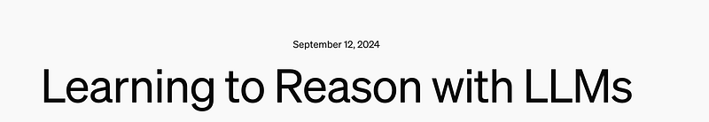 | OpenAI o1 Overview: A large language model trained with reinforcement learning for complex reasoning. |
|  | o1 performance smoothly improves with both train-time and test-time compute. |
| 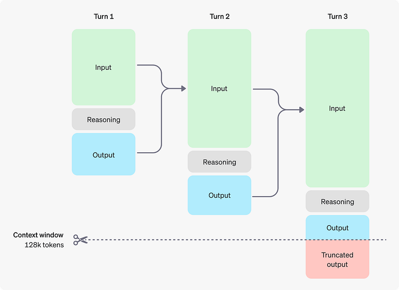 | o1 greatly improves over GPT-4o on challenging reasoning benchmarks (AIME, GPQA, Codeforces). |
| 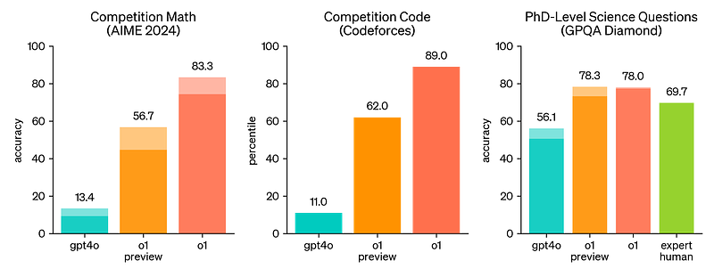 | o1 improves over GPT-4o on a wide range of benchmarks, including 54/57 MMLU subcategories. |
| 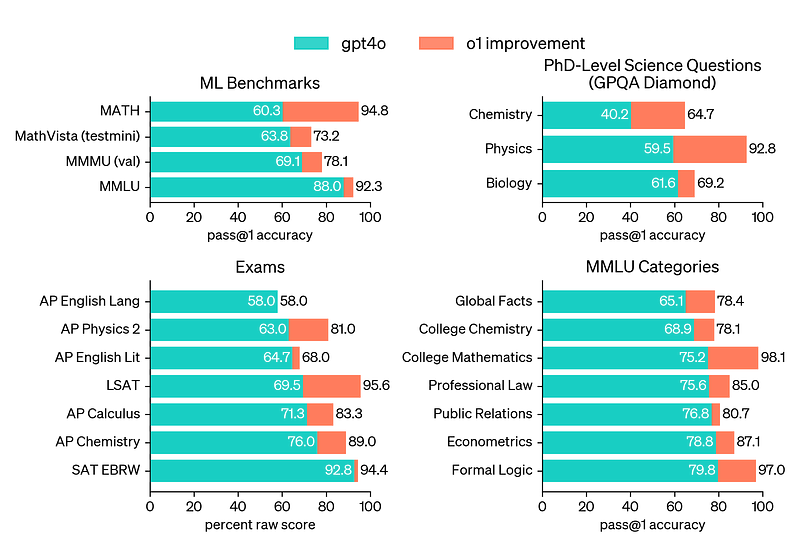 | o1-mini evaluation on AIME: Competitive with o1 while being significantly cheaper. |
|  | o1-mini evaluation on Codeforces: Achieving 1650 Elo, competitive with o1. |
| 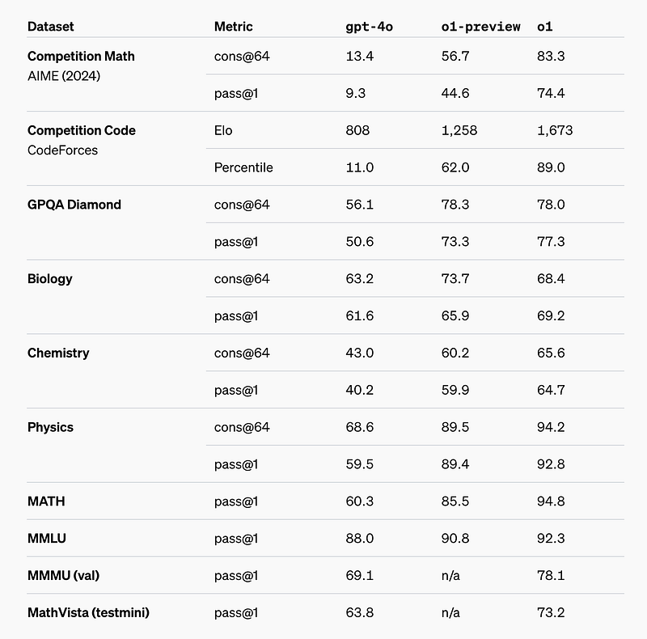 | o1-mini performance on STEM benchmarks (GPQA, MATH-500) compared to GPT-4o. |
| 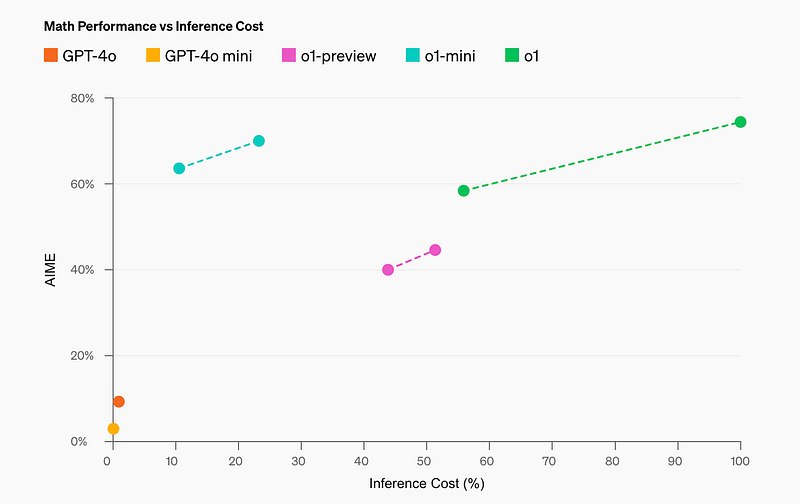 | o1 pro mode performance: 4/4 reliability on challenging ML benchmarks. |
| 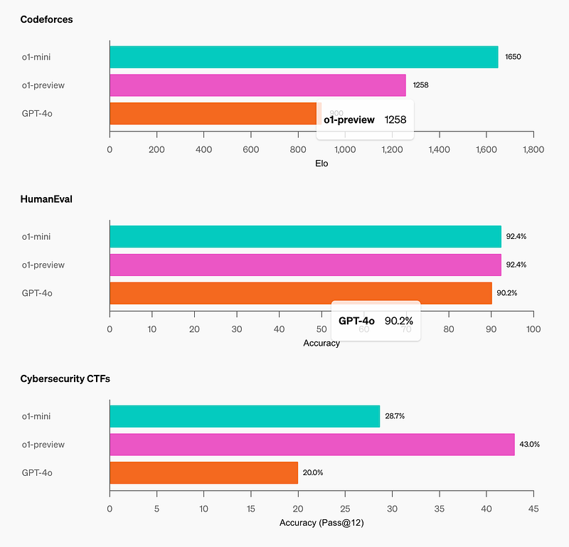 | o3-mini performance on Competition Math (AIME 2024). |
| 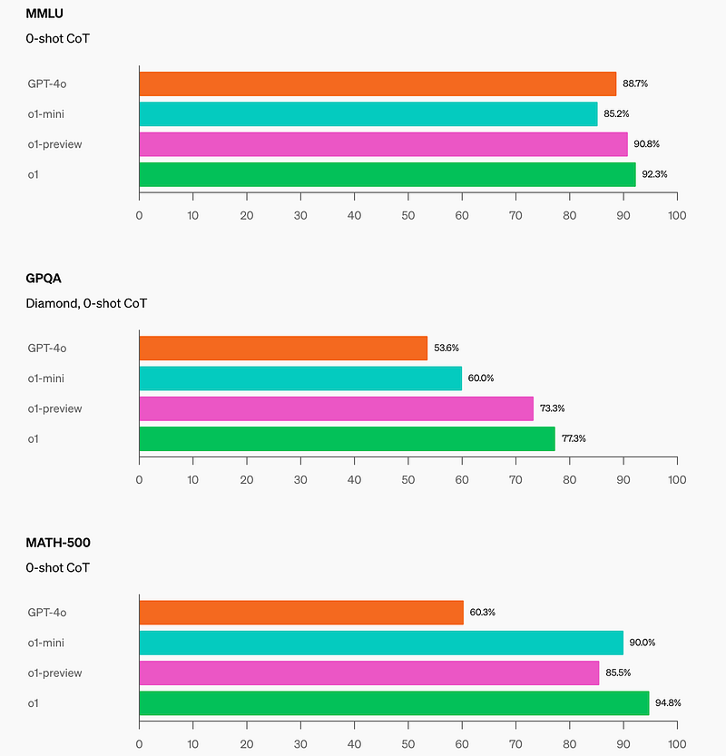 | o3-mini performance on PhD-level Science Questions (GPQA Diamond). |
| 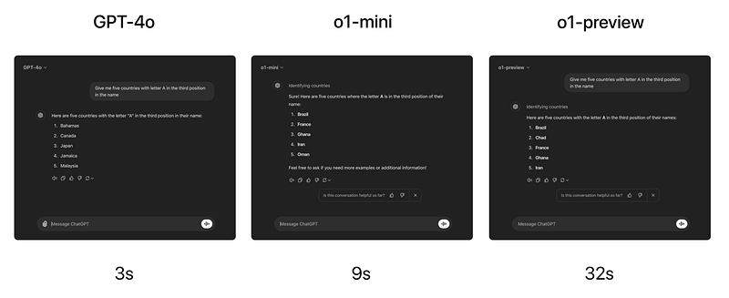 | o3-mini performance on FrontierMath with high reasoning effort. |
| 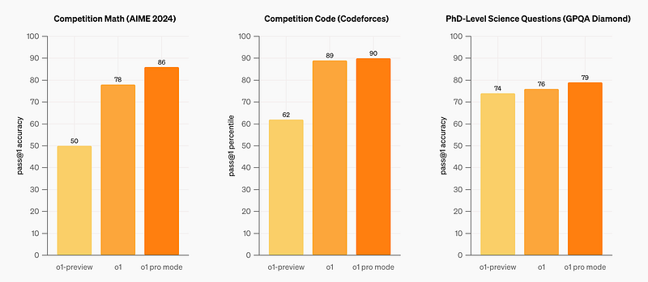 | o3-mini performance on Competition Code (Codeforces). |
| 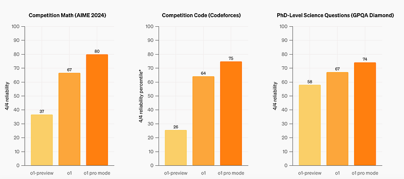 | o3-mini performance on Software Engineering (SWE-bench Verified). |
| 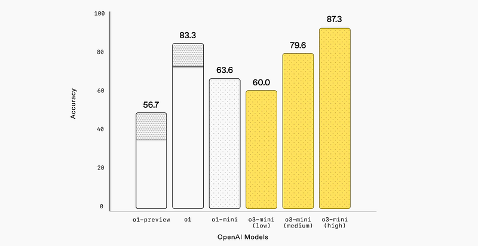 | o3-mini performance on LiveBench Coding. |
| 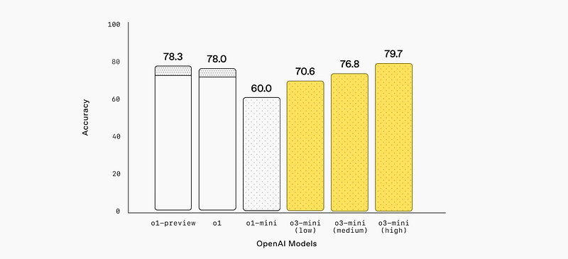 | o3-mini general knowledge evaluation compared to o1-mini. |
| 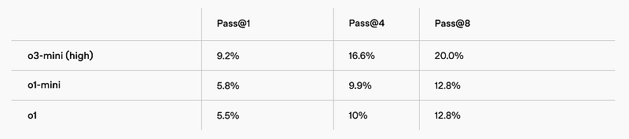 | o3 and o4-mini overview: Next generation of reasoning models. |
| 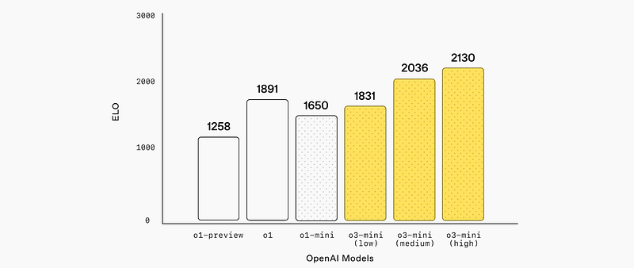 | Scaling and Reinforcement Learning: More "thinking time" improves performance. |
| 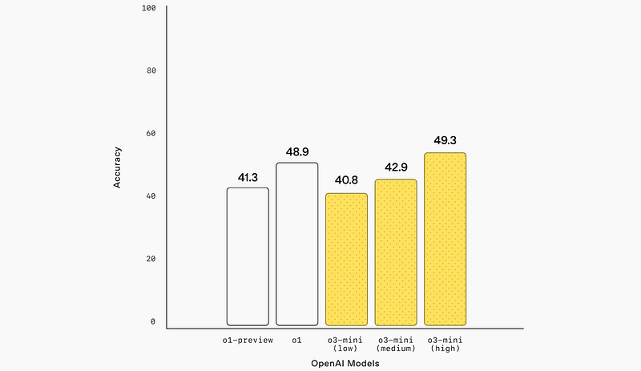 | Coding Benchmarks for o3 and o4-mini. |
| 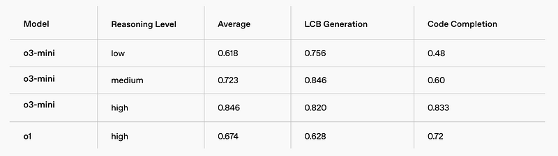 | Agentic Tool Use: Reasoning about when to use tools like Python and Web Search. |
| 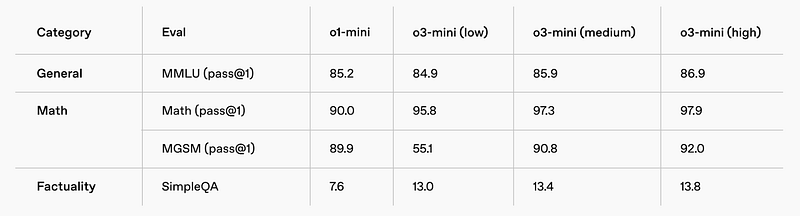 | Integrated Visual Reasoning: Interpreting whiteboards, diagrams, and sketches. |
| 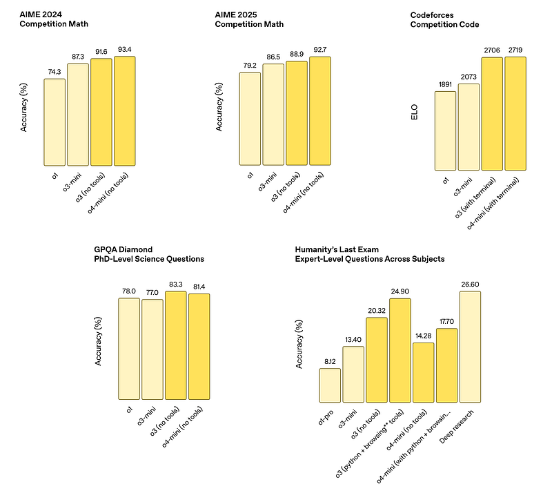 | Efficiency and Cost-Effectiveness: o3 and o4-mini comparison on AIME 2025. |
| 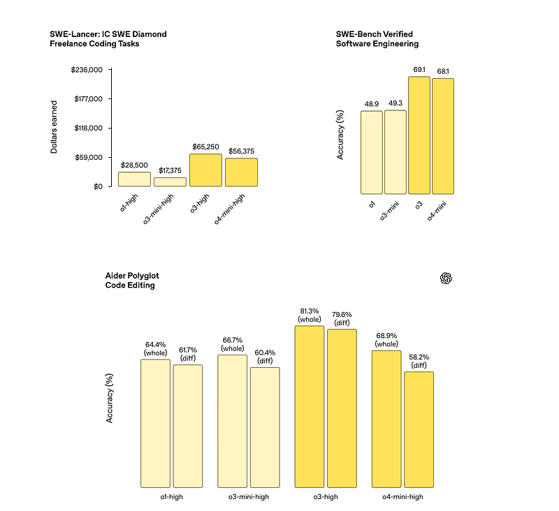 | Visual reasoning example: Analyzing charts and graphics. |
| 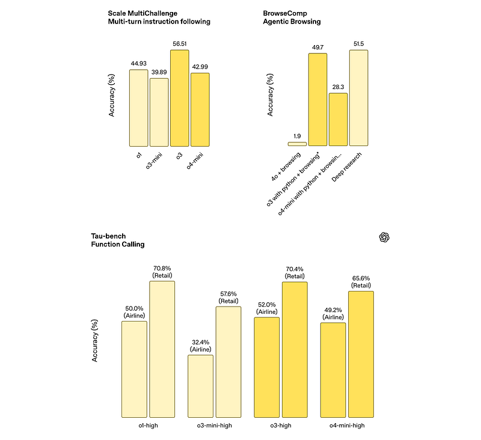 | Visual reasoning example: Multi-faceted analysis of complex visual queries. |
| 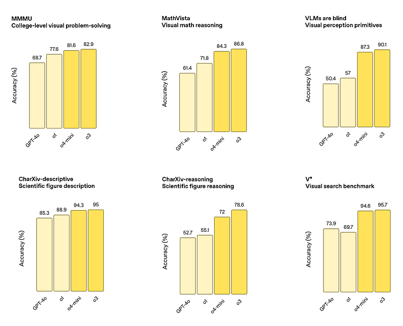 | Reasoning with images: Best-in-class accuracy on visual perception tasks. |
| 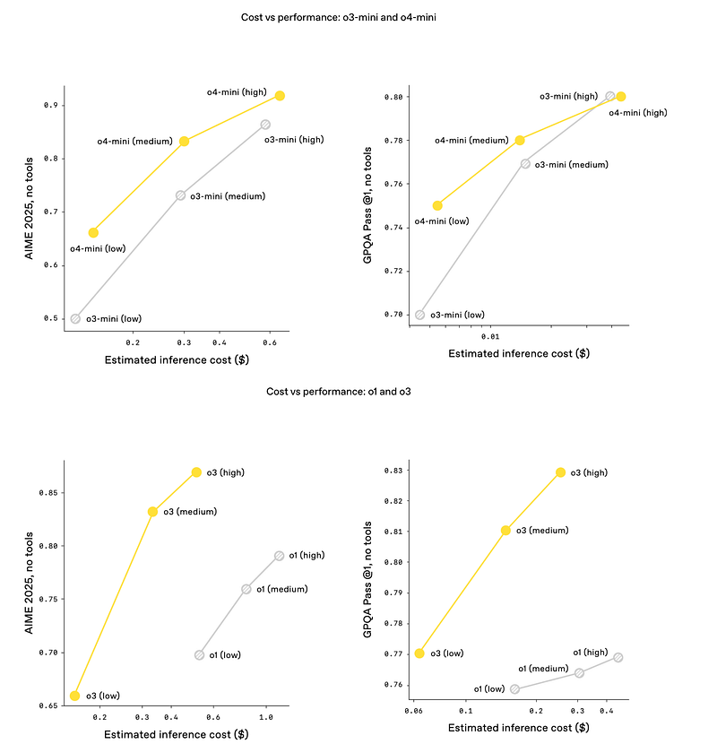 | Performance gains from increased training compute and inference-time reasoning. |
## Related

- [[Papers Explained Corpus]]
- [[Large Language Models]]
- [[Reasoning Models]]
- [[Reinforcement Learning Topic]]
- [[Safety and Alignment]]
- [[Model Compression and Efficiency]]
- [[Reinforcement Learning]]
- [[Papers Explained 210 - MaxViT]]
- [[Papers Explained 212 - DataGemma]]

#summary #topic
