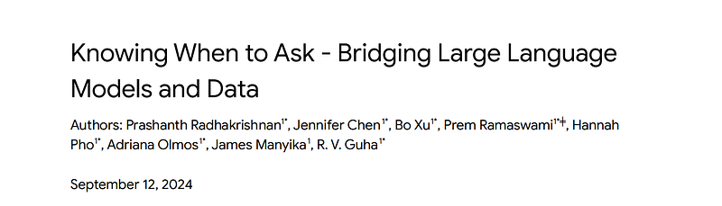
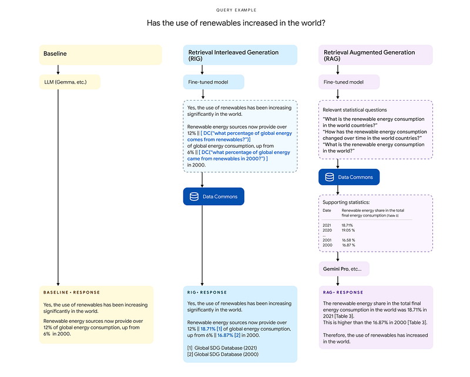
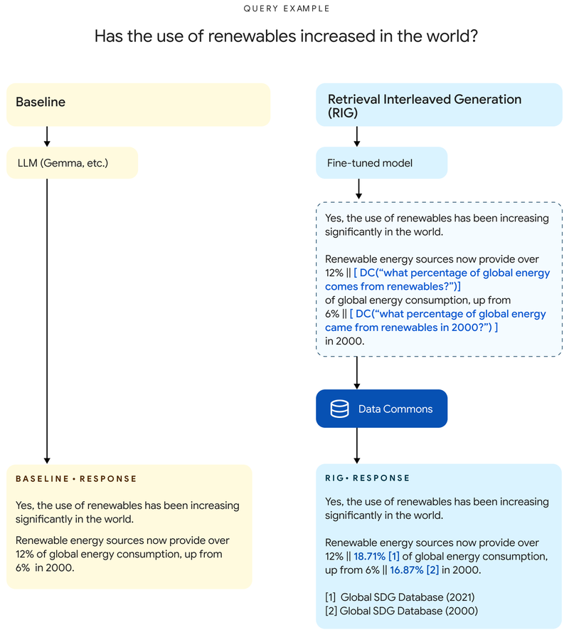
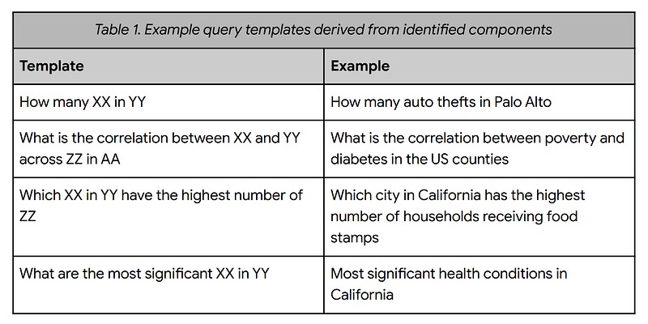
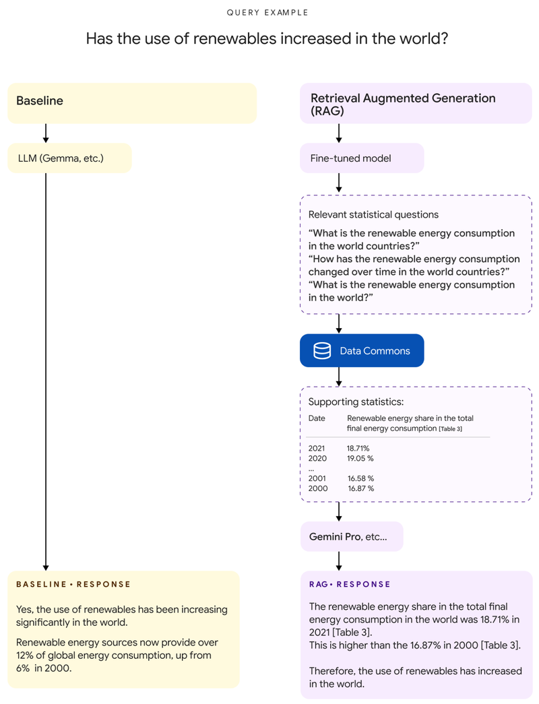
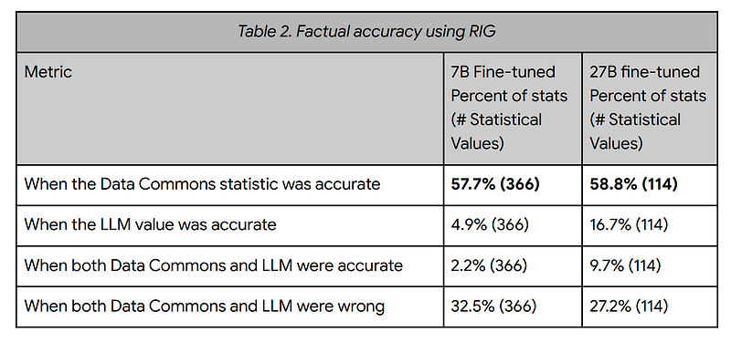
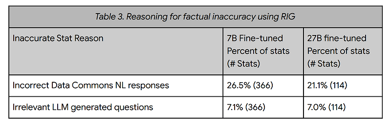
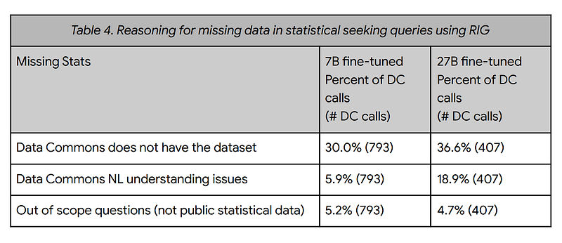
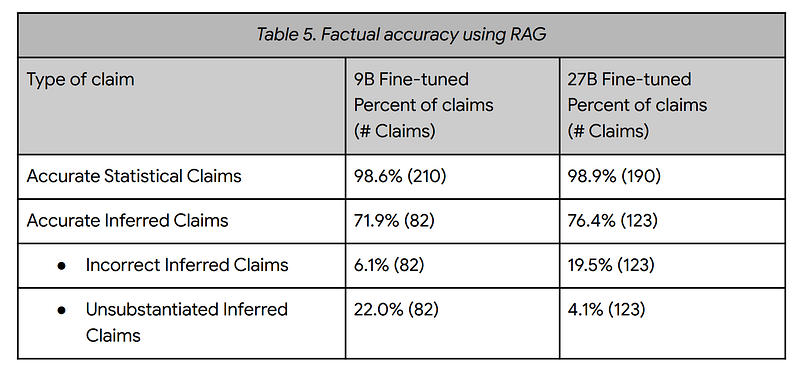
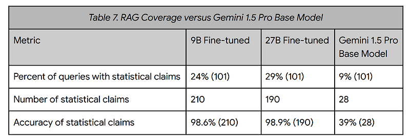

# Papers Explained 212 - DataGemma

The models are available at [HuggingFace](https://huggingface.co/collections/google/datagemma-release-66df7636084d2b150a4e6643/).

This page ingests the source article into the wiki and connects it to [[Papers Explained Corpus]], [[Large Language Models]].

## Source Metadata

- Source file: `raw/2024-09-17_Papers-Explained-212--DataGemma-cf0d2f40d867.html`
- Source title: Papers Explained 212: DataGemma
- Published: 2024-09-17
- Canonical: [https://medium.com/@ritvik19/papers-explained-212-datagemma-cf0d2f40d867](https://medium.com/@ritvik19/papers-explained-212-datagemma-cf0d2f40d867)

## Key Ideas

- This work presents a general architecture for bridging LLMs to data and outline three problems that need to be solved.:
- First, the LLM has to be taught when it should ask an external source (versus relying on the knowledge stored in its parameters) for information. Knowledge of when (and what) to ask an external source needs to be encoded in the LLM’s parameters.
- Second, deciding which external source should be queried for the requested information.
- Finally, the LLM needs to generate one or more queries to fetch that data. Different sources produce different kinds of data, and it would be beneficial if the LLM did not need to have specific knowledge about the APIs of various sources, and could instead...
- Data Commons is an open source initiative by Google, aiming to organize the world’s public datasets and make them universally accessible and useful, encompassing a large range of statistical data from public sources such as the United Nations, national census...

## Notes

This work presents an approach for enhancing the accuracy of LLMs by integrating them with Data Commons, a vast, open-source repository of public statistics from trusted organizations like the United Nations (UN), Center for Disease Control and Prevention (CDC) and global census bureaus. We explore two primary methods: Retrieval Interleaved Generation (RIG), where the LLM is trained to produce natural language queries to retrieve data from Data Commons, and Retrieval Augmented Generation (RAG), where relevant data tables are fetched from Data Commons and used to augment the LLM’s prompt.

The models are available at [HuggingFace](https://huggingface.co/collections/google/datagemma-release-66df7636084d2b150a4e6643/).

This work presents a general architecture for bridging LLMs to data and outline three problems that need to be solved.:

- First, the LLM has to be taught when it should ask an external source (versus relying on the knowledge stored in its parameters) for information. Knowledge of when (and what) to ask an external source needs to be encoded in the LLM’s parameters.

- Second, deciding which external source should be queried for the requested information.

- Finally, the LLM needs to generate one or more queries to fetch that data. Different sources produce different kinds of data, and it would be beneficial if the LLM did not need to have specific knowledge about the APIs of various sources, and could instead rely on a single API.

## Data Commons Overview

Data Commons is an open source initiative by Google, aiming to organize the world’s public datasets and make them universally accessible and useful, encompassing a large range of statistical data from public sources such as the United Nations, national census bureaus, health ministries, environmental agencies, economic departments, NGOs, academic institutions, and more. Currently, this corpus includes more than 250 billion data points and over 2.5 trillion triples from hundreds of global sources.

Data Commons involves two innovations. First, numerous publicly available datasets have been accessed, tracked down for their assumptions, and normalized using Schema.org 10, an open vocabulary to encode structured data. This creates a common Knowledge Graph incorporating all of the data.

Second, LLMs are used to create a Natural Language (NL) interface that allows users to ask questions in common language, and access a set of charts and graphs to explore the vast database. To be clear, the LLM is simply translating the query to the vocabulary in Data Commons; it does not modify or interact with the underlying data, nor does it generate outputs, so there are no fears of hallucinations or similar issues.

The current approach is to utilize this NL interface and teach LLMs when and how to communicate with the Data Commons NL interface.

## Interfacing LLMs with Data Commons

*Figure: Comparison of Baseline, RIG, and RAG approaches.*

Retrieval Interleaved Generation (RIG), is a tool-inspired approach in which the LLM is fine-tuned to produce natural language Data Commons queries alongside statistics. A multi-model pipeline then converts this natural language query into a structured data query that is used to retrieve an answer from the Data Commons database.

Retrieval Augmented Generation (RAG), is a more traditional retrieval approach. Firstly, the variables mentioned in a query are extracted using a fine-tuned LLM (fine-tuned Gemma 2 9B IT and Gemma 2 27B IT), retrieve relevant values from Data Commons, augment the original user query with this additional context, and produce an answer using an LLM (Gemini 1.5 Pro).

## Retrieval Interleaved Generation (RIG)

*Figure: Comparison of Baseline and RIG approaches.*

The first component is a model fine-tuned to produce Data Commons natural language queries. The second component is a post-processor which converts natural language queries into structured data queries. The final component is the querying mechanism, which retrieves the statistical answer from Data Commons and provides it with the LLM generation.

### Model Fine-tuning

When an LLM answers a statistical query, it produces a numerical answer. This is the LLM-SV. The goal is to find the most relevant statistical value from the Data Commons database that corresponds to the LLM-SV. This is the DC-SV.

Instead of using structured queries (like SQL), the LLM is finetuned to generate a natural language query describing the LLM-SV. This has several advantages:

- Natural language queries are often shorter than structured queries, especially when the LLM generates multiple LLM-SVs.

- Fine-tuning an LLM to know all variable IDs in the Data Commons database would be costly and potentially hinder performance in other areas.

- Generating a natural language query involves rephrasing and copying entities and relationships from the surrounding context, which is easier for LLMs.

The LLM is fine-tuned on an instruction-response dataset to produce this behavior. This is similar to how LLMs are trained to use tools, rather than generating answers solely through next-token prediction.

### Query Conversion

The second component of our pipeline converts the natural language Data Commons query produced by the LLM into a structured query that can be applied to the Data Commons database. Our key intuition is that, although the number of possible queries is extremely large, most fall into a small set of categories.

Given a query, we first break it down into the following components: one or more statistical variables or topics (like “unemployment rate,” “demographics,” etc); one or more places (like “california”); and a finite set of attributes (like “ranking,” “comparison,” “change rate,” etc). The variables and places are further mapped to corresponding IDs in Data Commons. For each of the components, we apply different Natural Language Processing (NLP) approaches that we have been independently iterating on. For statistical variables or topics, we use an embeddings-based semantic search index; for places, we use a string-based named entity recognition implementation; for aribute detection, we use a set of regex-based heuristics. Ongoing work includes exploring ne-tuned custom models for named entity recognition and attribute detection.

Next, based on the identified components, we categorize the queries into a set of fixed query templates.

The core idea is that despite the vast number of possible queries, they can be categorized into a smaller set of types.

Each query is dissected into three main parts:

- Statistical Variables/Topics: Concepts like “unemployment rate” or “demographics.”

- Places: Geographical locations like “California.”

- Attributes: Descriptors like “ranking,” “comparison,” or “change rate.”

Each component is then linked to its corresponding ID in the Data Commons database.

Different NLP methods are used for each component:

- Statistical Variables/Topics: Embedding-based semantic search is employed.

- Places: String-based named entity recognition is used.

- Attributes: Regex-based heuristics are applied.

Based on the identified components, the query is classified into a predefined set of query templates.

### Fulfillment

Given the query template and the IDs of variables and places, the fulfillment translates those calls to Data Commons structured data API. The final response from Data Commons typically involves a single numeric value with an optional unit.This answer is presented alongside the original LLM generated statistic, providing a way for a user to fact check the LLM. The Data Commons query string generated by the LLM is removed, and in its place both the LLM generated number and the Data Commons-returned value with source provenance are included.

## Retrieval Augmented Generation (RAG)

*Figure: Comparison of Baseline and RAG approaches.*

First, the user query is passed to a small, fine-tuned LLM, which produces Data Commons natural language queries relevant to the user query. Second, these queries are issued against the Data Commons natural language interface which fetches relevant tables. Finally, a long-context LLM (Gemini 1.5 Pro) is prompted with the original user query and the retrieved tables.

### Extracting Data Commons Natural Language Queries

An LLM is finetuned to translate user queries into Data Commons natural language queries.

The training data is generated by prompting a larger LLM (Gemini 1.5 Pro) with user queries and instructing it to produce Data Commons queries adhering to specific formats. This method generates relevant queries but doesn’t guarantee successful responses from Data Commons.

An alternative approach, which included a list of Data Commons variables and metrics in the prompt, proved less effective. The LLM struggled to select the most relevant variables, either because few Data Commons variables matched the query or because the query was too broad, leading to an overwhelming number of potential matches.

Essentially, prompting the LLM with user queries and guiding it towards relevant Data Commons formats was more successful than directly providing a list of Data Commons variables.

### Retrieving tables

The Data Commons natural queries produced are converted using the same approach applied in the RIG framework. In this case, the structured data APIs return tables.

### Prompting

Aer retrieving the relevant tables from Data Commons for each query, a new prompt containing the user’s original natural language query and serialized versions of the retrieved tables is written.

## Evaluation Approaches

101 queries were manually created, with a subset used for accuracy evaluation due to Data Commons result availability.

In-scope Queries (96): Focus on public or social statistics, categorized as:

- Specific Variable Queries

- Broad Topic Queries

- Place Comparisons

- Variable Comparisons

- List Queries

- Complex List Queries

- Interesting Queries

- Peer Group Queries

- Drill-down Queries

Out-of-scope Queries (5): Unrelated to statistics, used to ensure no regressions in the base LLM.

Evaluation Criteria:

Factual Accuracy (RIG):

- Fraction of queries with correct statistical values from Data Commons.

- Fraction of queries with correct original generated values.

- Fraction of queries with both correct original generated and Data Commons values.

- Fraction of queries with both incorrect original generated and Data Commons values.

Accuracy (RAG):

- Fraction of LLM-generated statistical claims that are accurate (not hallucinated).

Data Commons Natural Language Accuracy:

- Fraction of Data Commons calls correctly interpreting the original query.

Question Accuracy:

- Fraction of generated Data Commons calls relevant to the context (RIG) or original query (RAG).

Data Commons Data Coverage:

- Fraction of Data Commons calls failing due to missing data.

## Results

### RIG Results

Fine-tuned 7B and 27B LLM models were used for evaluations.\

Accuracy

- The RIG approach significantly improved factual accuracy, from 5–17% to about 58%.

Inaccurate statistics (33–27%) were attributed to:

- Precision issues with the Data Commons NL interface.

- Irrelevant LLM-generated questions that did not fully capture the desired statistics.

Data Coverage

- Only 23–24% of LLM-generated questions elicited responses from Data Commons.

- The main reason for missing statistics (~75% of cases) was the lack of relevant datasets in Data Commons. This highlights the need for continued expansion and improvement of Data Commons coverage.

### RAG Results

Two-stage evaluation:

- Human evaluators assessed the quality of the fine-grained questions generated by Gemma-2 9B IT and their corresponding responses from Data Commons.

- Evaluators assessed the final response generated by Gemini 1.5 Pro, focusing on:

- The accuracy of cited numeric values (statistical claims) and their sources in Data Commons.

- The accuracy of inferences or reasoning (“inferred claims”) made by Gemini 1.5 Pro based on the cited data.

Accuracy:

- The LLM generally achieved high accuracy (99%) when citing numeric values from Data Commons.

- Accuracy dropped when drawing inferences from these values, with incorrect inferences ranging from 6% to 20%.

Coverage:

- The RAG approach only provided statistical responses from Data Commons for 24–29% of the queries in the evaluation set.

- Low coverage was attributed to factors similar to those observed in a related RIG evaluation, as well as the effectiveness of the question-generating model.

Comparison with Base Model:

- The RAG approach outperformed Gemini 1.5 Pro’s base model, demonstrating that providing relevant data enhances the LLM’s ability to make specific statistical claims and incorporate data into its responses.

## Paper

[Knowing When to Ask — Bridging Large Language Models and Data](https://docs.datacommons.org/papers/DataGemma-FullPaper.pdf)

Recommended Reading [Gemini / Gemma Models](https://ritvik19.medium.com/list/gemini-gemma-models-4cb7dfc50d42)

## Figures

Figures from the Medium HTML export (`raw/2024-09-17_Papers-Explained-212--DataGemma-cf0d2f40d867.html`); local copies under `wiki/assets/papers-explained-212-datagemma/` when download succeeded.

| Figure | Caption |
|--------|---------|
|  | DataGemma Overview: Bridging LLMs and Data Commons. |
|  | Comparison of Baseline, RIG, and RAG approaches for interfacing with Data Commons. |
|  | Retrieval Interleaved Generation (RIG) pipeline overview. |
|  | Comparison of Baseline and RIG approaches for statistical queries. |
|  | Retrieval Augmented Generation (RAG) pipeline overview. |
|  | Comparison of Baseline and RAG approaches for statistical queries. |
|  | RIG Results: Factual accuracy improvement and error analysis. |
|  | RIG Results: Data coverage and missing data reasons in Data Commons. |
|  | RAG Results: Accuracy of numeric values and inferred claims. |
|  | RAG Results: Coverage comparison with base Gemini 1.5 Pro model. |
## Related

- [[Papers Explained Corpus]]
- [[Large Language Models]]
- [[Papers Explained 211 - o1]]
- [[Papers Explained 213 - Florence]]

#summary #topic
