# Papers Explained 213 - Florence

While existing vision foundation models such as CLIP focus mainly on mapping images and textual representations to a cross-modal shared representation, Florence, expands the representations from coarse (scene) to fine (object), from static (images) to dynamic (videos), and from RGB to multiple modalities (caption, depth), by...

This page ingests the source article into the wiki and connects it to [[Papers Explained Corpus]], [[Vision Language Models]], [[Synthetic Data]].

## Source Metadata

- Source file: `raw/2024-09-18_Papers-Explained-213--Florence-f93a3a7d9ef0.md`
- Source title: Papers Explained 213: Florence
- Published: 2024-09-18
- Canonical: [https://medium.com/@ritvik19/papers-explained-213-florence-f93a3a7d9ef0](https://medium.com/@ritvik19/papers-explained-213-florence-f93a3a7d9ef0)

## Key Ideas

- While existing vision foundation models such as CLIP focus mainly on mapping images and textual representations to a cross-modal shared representation, Florence, expands the representations from coarse (scene) to fine (object), from static (images) to dynamic...
- A 900M image-text-pair dataset, consisting of 9.7M unique queries, and 7.5B tokens in total, called FLD-900M (FLorenceDataset) is curated, using a programmatic data curation pipeline that processes around 3 billion Internet images and their raw descriptions...
- To improve data quality, rigorous data filtering is performed including a simple hash-based near-duplicate image removal, small-size image removal, image-text relevance, etc.
- CLIP implicitly assumes that each image-text pair has its own unique caption, which is used to compare it to other captions. However, in web-scale data many images can have the identical caption.
- Given an image-text pair is given, a triplet is created that includes:

## Notes

While existing vision foundation models such as CLIP focus mainly on mapping images and textual representations to a cross-modal shared representation, Florence, expands the representations from coarse (scene) to fine (object), from static (images) to dynamic (videos), and from RGB to multiple modalities (caption, depth), by incorporating universal visual-language representations from Web-scale image-text data.

## Approach

*Figure: Overview of building Florence.*

### Dataset Curation

A 900M image-text-pair dataset, consisting of 9.7M unique queries, and 7.5B tokens in total, called FLD-900M (FLorenceDataset) is curated, using a programmatic data curation pipeline that processes around 3 billion Internet images and their raw descriptions in parallel.

To improve data quality, rigorous data filtering is performed including a simple hash-based near-duplicate image removal, small-size image removal, image-text relevance, etc. In addition a sampling strategy with the goal of achieving improved balance, informativeness, and learnability of the sampled dataset is applied.

### Unified Image-Text Contrastive Learning

CLIP implicitly assumes that each image-text pair has its own unique caption, which is used to compare it to other captions. However, in web-scale data many images can have the identical caption. To address this, a new approach called UniCL (Unified Image-Text Contrastive Learning) is utilized where Florence is pre-trained in an image-label-description space.

Given an image-text pair is given, a triplet is created that includes:

- The image (x)

- A hash value of the text description (t)

- A label that indicates which unique text description it belongs to (y)

All images with the same text description will have the same label. This means that all these images are considered “positive” examples, while images with different descriptions are considered “negative” examples.

The unified learning objective in the common image-label-description space unifies two popular learning paradigms — mapping images to the label for learning discriminative representations (i.e. , supervised learning) and assigning each description with a unique label for language-image pre-training (i.e. , contrastive learning).

The model consists of an image encoder (fθ) and a text encoder (fφ), which produce normalized visual feature vectors (u) and language feature vectors (v). The model is trained with a bi-directional supervised contrastive learning objective, consisting of two terms: Li2t (image-to-language contrastive loss) and Lt2i (language-to-image contrastive loss).

The image-to-language contrastive loss (Li2t) calculates the log probability of a given image being associated with a language description, while the language-to-image contrastive loss (Lt2i) calculates the log probability of a given language description being associated with an image.

To mitigate the negative effect of augmented language prompts on retrieval and vision-language tasks, the training process is separated into two stages. In the first stage, all data including augmented texts are used for training, while in the second stage, only original text descriptions are used. The model is trained using the Adam optimizer with decoupled weight decay regularization.

The training parameters include:

- Image size: 224 × 224

- Maximum language description length: truncated at 76

- Number of iterations in first stage: 1M

- Number of iterations in second stage: 180K

- Additional training at higher resolution (384 × 384): 80K iterations

### Transformer-based Florence Pretrained Models

The Florence model uses a two-tower architecture, consisting of:

- A 12-layer Transformer as the language encoder, similar to CLIP.

- A hierarchical Vision Transformer, specifically a modified Swin Transformer with convolutional embedding, called CoSwin Transformer.

The CoSwin Transformer replaces the patch embedding and patch merging modules in the original Swin Transformer with convolutional embedding layers as described in CvT. To extract image features, the CoSwin Transformer uses global average pooling. Two linear projection layers are added on top of:

- The image encoder to match the dimensions of image features.

- The language encoder to match the dimensions of language features.

The Florence model has a total of 893M parameters, broken down into:

- 256M parameters for the language transformer.

- 637M parameters for the CoSwin-H transformer.

### Object-level Visual Representation Learning

*Figure: Dynamic Head adapter.*

To enable dense prediction tasks such as object detection, which requires learning fine-grained (object-level) representations, the image encoder of Florence is extended by adding an adaptor called Dynamic Head or Dynamic DETR, which is a unified attention mechanism for the detection head.

The hierarchical structure of the CoSwin-H image encoder produces output feature pyramids at different scale levels, which can be concatenated and scaled-down or up into a 3D tensor with dimensions level × space × channel. The Dynamic Head (DH), involves deploying three attention mechanisms on the orthogonal dimensions of this tensor: level-wise, spatial-wise, and channel-wise, making computation more efficient and enabling better learning compared to building a single self-attention mechanism over the entire tensor. The three attention mechanisms are applied sequentially, allowing for stacking multiple blocks consisting of these layers together.

A large-scale object detection dataset called FLOD-9M (FLorence Object detection Dataset), consisting of 25K object categories, and 33M bounding boxes with annotations and pseudo labels, is created for pre-training object detection models, by merging several existing datasets: COCO (2015), LVIS (2019), OpenImages (2016), and Object365 (2019). Additionally, pseudo bounding boxes are generated on the ImageNet-22K dataset.

The Dynamic Head model is trained for 12 epochs using this dataset.

### Fine-Grained V+L Representation Learning

*Figure: METER as Florence V+L adaptation model.*

METER adapter is used to extend the vision-language representation to a fine-grained level, for tasks like visual question answering (VQA) and image captioning. The Florence V+L adaptation model replaces the image encoder of METER with a CoSwin pretrained model and uses a Roberta language encoder. The two modalities are then fused together using a transformer network based on co-attention, which allows for separate processing of text and visual features through two M_co-layer transformers, each consisting of self-attention, cross-attention, and feed-forward network blocks.

The model is first trained with image-text matching loss and masked-language modeling loss. Then, fine-tuned on a downstream task like VQA.

### Adaption to Video Recognition

The Transformer’s self-attention design allows for unifying image and video recognition systems. The Video CoSwin adapter can borrow the image encoder from CoSwin with minimal changes. To adapt CoSwin to the video domain, three modifications are made:

- Replace the 2D tokenization layer with a 3D convolutional layer that converts each 3D tube into one token. Initialize the 3D convolutional weights by duplicating and dividing the pre-trained 2D convolutional weights along the temporal dimension.

- Use a 3D convolution-based patch merging operator instead of the 2D patch merging operator, which enhances spatial and temporal interactions among tokens.

- Replace the 2D shifted window design with 3D shifted local windows in self-attention layers. Duplicate the 2D relative positional embedding matrix along the temporal dimension to initialize the 3D positional embedding matrix, ensuring that the 2D relative positional embedding is the same for each temporal shift.

All other layers and weights (including self-attention and feed-forward networks) can be inherited directly from the pre-trained CoSwin. To mitigate memory issues during video training, a dynamic window size strategy is adopted: using relatively small window sizes in early stages of CoSwin and larger window sizes in its later stages.

## Evaluation

### Zero-shot Transfer in Classification

*Figure: Zero-shot transfer of image classification comparisons on 12 datasets.*

- Florence outperforms state-of-the-art methods on 9 out of 12 tasks.

- Remarkable improvement in zero-shot transfer on ImageNet-1K: top-1 accuracy of 83.74% (+5.6% over SOTA result), and top-5 accuracy of ninety-seven point eighteen percent (97.18%).

### Linear Probe in Classification

*Figure: Comparisons of image classification linear probing on 11 datasets*

- The model consistently outperforms existing state-of-the-art methods on most of the 11 classification benchmarks.

- The model’s performance is lower than state-of-the-art on CIFAR10 and CIFAR100 datasets, likely due to the lower input image resolution (32x32).

### ImageNet-1K Fine-tune Evaluation

*Figure: Classification fine tuning on ImageNet-1K.*

- Continual fine-tuning on the ImageNet ILSVRC-2012 benchmark achieves competitive performance.

- Outperforms BiT (a larger model size) and ALIGN (trained on more data) in terms of Top-1 and Top-5 accuracy.

- Slightly lower performance compared to CoAtNet-7, which benefits from a 3× larger model and dataset.

### Few-shot Cross-domain Classification

*Figure: Comparison with CW (CD-FSL Challenge 2020 Winner) on CD-FSL benchmark.*

- The model achieves competitive results on the CD-FSL benchmark, outperforming the challenge winner in some cases.

### Image-Text Retrieval

*Figure: Image-text retrieval comparisons on Flickr30K and MSCOCO datasets.*

- Florence achieves superior zero-shot performance compared to all previous methods on both Flickr30k and MSCOCO datasets.

- Fine-tuning Florence results in performance that outperforms all previous fine-tuning results on both datasets.

- Florence’s fine-tuning process is more efficient, requiring roughly 6% and 8% fewer epochs compared to ALIGN on Flickr30k and MSCOCO, respectively.

### Object Detection and Zero-shot Transfer

*Figure: Object detection fine tuning comparisons with state-ofthe-art methods.*

- Florence achieves new state-of-the-art results on COCO, Object365, and Visual Genome benchmarks.

*Figure: Zero-shot transfer in object detection.*

- Florence effectively transfers to 11 diverse object detection tasks across various scenarios.

- Florence outperforms the baseline ZSD approach and even surpasses 5-shot fine-tuning results in 7 out of 11 tasks.

### V+L Representation Learning

*Figure: Comparison on VQA.*

- Outperformed SimVLM, which used 1.8B image-text pairs, with only 900M for image encoder pre-training and 20M for VLP. This highlights the data efficiency of the proposed approach.

### Zero-Shot Text-to-Video Retrieval

*Figure: Zero-shot text-to-video retrieval results on MSR-VTT 1K-A test set.*

- Both Florence and CLIP significantly outperform existing state-of-the-art methods in terms of the R@1 metric.

- This suggests that the image-text data used for pre-training Florence and CLIP is richer and more diverse than the video data used in other state-of-the-art methods.

### Video Action Recognition

*Figure: Comparison to state-of-the-art methods on Kinetics-400 and Kinetics-600.*

- Florence outperforms existing state-of-the-art methods on both Kinectics-400 and Kinectics-600 datasets.

- Achieves a 1.1% improvement over the state-of-the-art on Kinectics-400 and a 1.5% improvement on Kinectics-600.

## Paper

Florence: A New Foundation Model for Computer Vision [2111.11432](https://arxiv.org/abs/2111.11432)

Recommended Reading [Multi Modal Transformers](https://ritvik19.medium.com/list/multi-modal-transformers-67453f215ecf)

## Figures

Figures from the Medium HTML export (`raw/2024-09-18_Papers-Explained-213--Florence-f93a3a7d9ef0.md`); local copies under `wiki/assets/papers-explained-213-florence/` when download succeeded.

| Figure | Caption |
|--------|---------|
| 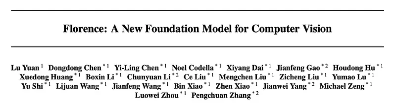 | Florence: A New Foundation Model for Computer Vision Overview. |
| 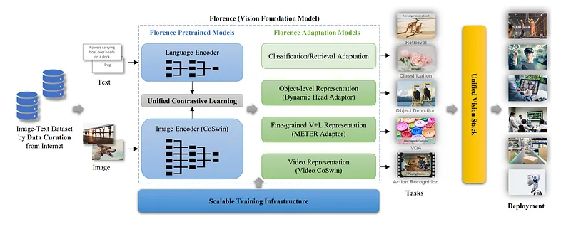 | Overview of building Florence: Data curation, pre-training, and task adaptation. |
| 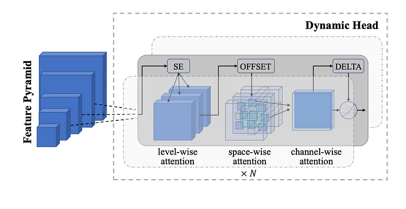 | Dynamic Head adapter for dense prediction tasks (object detection). |
| 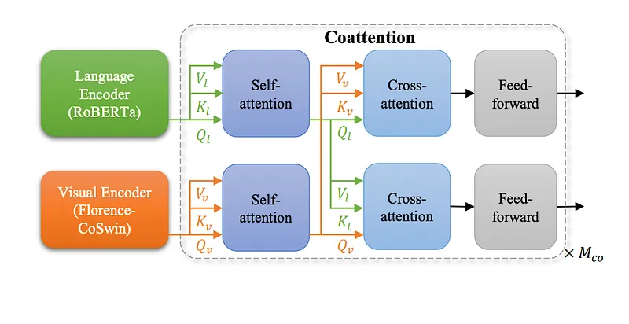 | METER as Florence V+L adaptation model for fine-grained V+L tasks. |
| 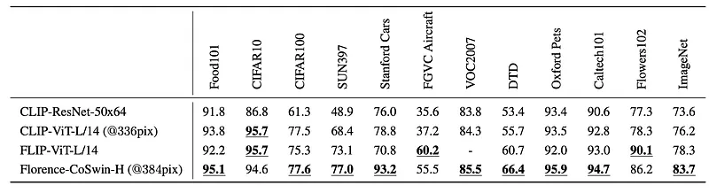 | Zero-shot transfer of image classification comparisons on 12 datasets. |
| 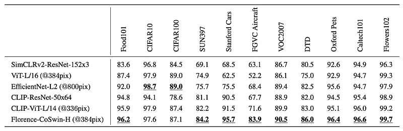 | Comparisons of image classification linear probing on 11 datasets. |
| 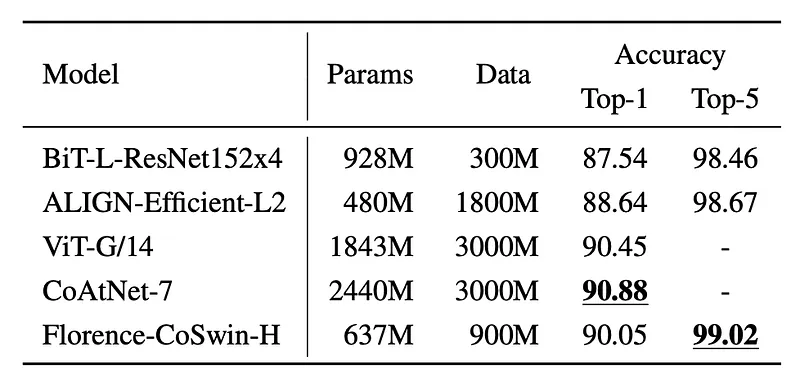 | Classification fine-tuning results on ImageNet-1K. |
| 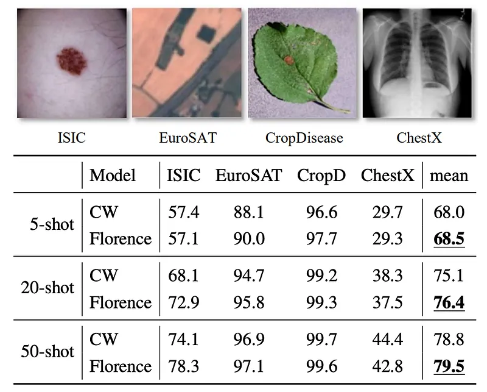 | Comparison with CW (CD-FSL Challenge 2020 Winner) on CD-FSL benchmark. |
| 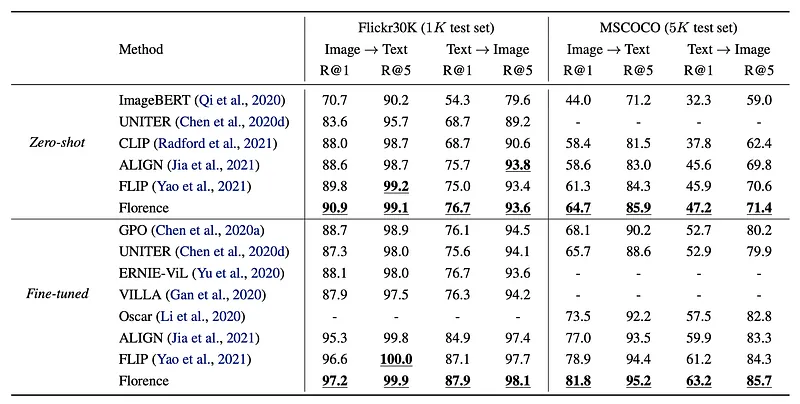 | Image-text retrieval comparisons on Flickr30K and MSCOCO datasets. |
| 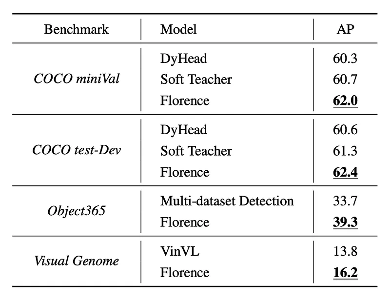 | Object detection fine-tuning comparisons with state-of-the-art methods. |
| 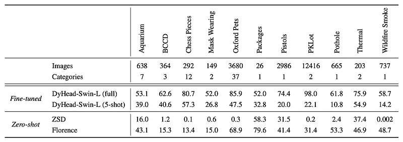 | Zero-shot transfer results in object detection across 11 diverse tasks. |
| 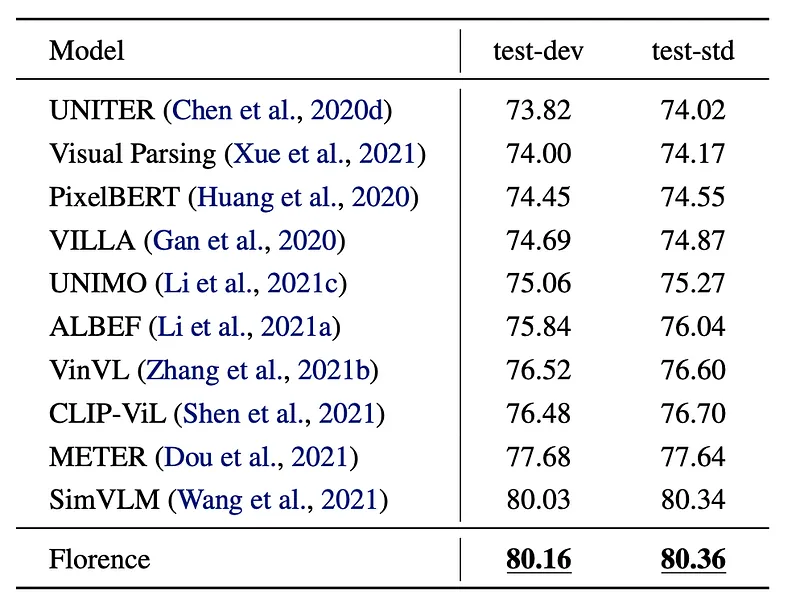 | Comparison on Visual Question Answering (VQA) task. |
| 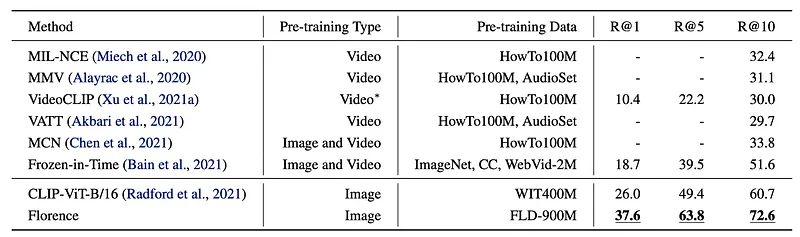 | Zero-shot text-to-video retrieval results on MSR-VTT 1K-A test set. |
| 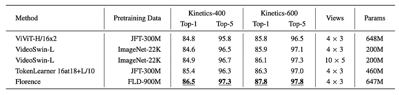 | Comparison to state-of-the-art methods on Kinetics-400 and Kinetics-600. |
## Related

- [[Papers Explained Corpus]]
- [[Vision Language Models]]
- [[Synthetic Data]]
- [[Papers Explained 212 - DataGemma]]
- [[Papers Explained 214 - Florence-2]]

#summary #topic
